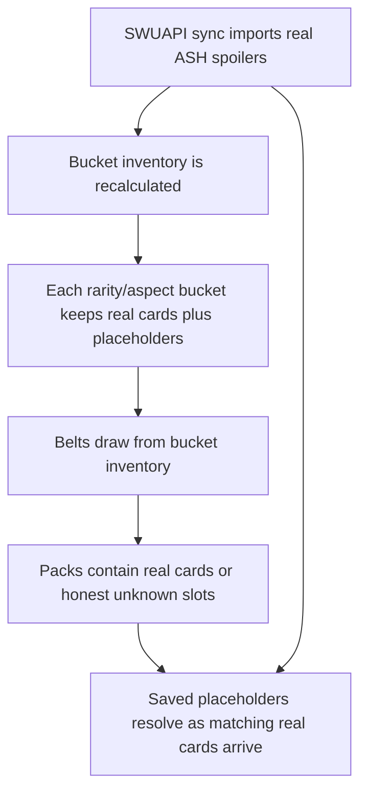

# ASH Bucket Placeholder Catalog

## Problem Frame

Patreon and beta users should be able to open ASH packs as soon as spoilers begin,
but unknown cards must not pretend to have collector numbers or types that cannot
be known. The pack experience is the priority: each pack slot must draw from an
inventory with the correct rarity and enough aspect structure to preserve belt
collation.

## Conceptual Flow

## Requirements

**Placeholder Identity**
- R1. ASH placeholders must represent rarity/aspect inventory slots, not guessed
  collector-number cards.
- R2. A placeholder must not display or store a collector number unless it has
  resolved to a real spoiled card.
- R3. A placeholder must not invent card type, cost, stats, text, traits, arena,
  or name beyond a clear unknown label, except that leader and base slot
  placeholders may use the type proven by their pack slot.
- R4. Placeholder labels must communicate the known bucket, such as
  "Unknown ASH Rare Vigilance" or "Unknown ASH Uncommon Vigilance+Heroism."

**Bucket Inventory**
- R5. ASH bucket counts must be modeled per rarity and aspect bucket.
- R6. Initial ASH counts should use a SEC-like aspect distribution as the
  baseline, adjusted to include a smaller LAW-style multicolor section.
- R7. The multicolor section should preserve LAW-like symmetry while being
  substantially smaller than LAW unless spoilers prove otherwise.
- R8. Real spoiled ASH cards must occupy their matching rarity/aspect buckets and
  reduce the remaining placeholder count in those buckets.
- R9. The bucket model must surface contradictions when spoiled cards make a
  bucket overfull or otherwise impossible under the current assumptions.

**Pack Experience**
- R10. ASH packs must follow the LAW-style pack layout: four commons, a
  hyperspace slot, four commons, a hyperspace-foil slot, three uncommons, and a
  rare/legendary slot, alongside leader and base/token behavior as appropriate.
- R11. Each belt slot must only draw real cards or placeholders that match the
  slot's required rarity class.
- R12. Aspect bucket inventory must be rich enough for the belt system to
  preserve aspect collation and avoid degrading the pack-opening experience.
- R17. Hyperspace and hyperspace-foil unknowns must also be bucket placeholders;
  their treatment is known from the pack slot, but they still must not imply a
  collector number or exact card identity before resolution.

## Initial V0 Bucket Table

Before ASH spoilers constrain the model, use this as the working bucket table.
It is intentionally not a collector-number table. Counts describe placeholder
inventory by rarity/aspect bucket.

**Pack-facing slot shape**

| Pack section | Count | Placeholder truth |
|---|---:|---|
| Leader slot | 1 | Leader identity unknown; common/rare leader bucket known |
| Base/token slot | 1 | Base/token identity unknown; base/token slot known |
| Commons before hyperspace | 4 | Common bucket known |
| Dedicated hyperspace slot | 1 | Hyperspace treatment and bucket known |
| Commons before hyperfoil | 4 | Common bucket known |
| Hyperspace-foil slot | 1 | Hyperspace-foil treatment and bucket known |
| Uncommon slots | 3 | Uncommon bucket known, with LAW-style third-slot behavior |
| Rare/legendary slot | 1 | Rare/legendary bucket known |

**Set-level normal-slot skeleton**

| Group | Common | Uncommon | Rare | Legendary | Special | Total |
|---|---:|---:|---:|---:|---:|---:|
| Leaders | 8 | 0 | 8 | 0 | 2 | 18 |
| Bases/tokens | 8 | 0 | 0 | 0 | 0 | 8 |
| Main-deck inventory | 100 | 60 | 50 | 20 | 8 | 238 |
| **Total** | **116** | **60** | **58** | **20** | **10** | **264** |

Leader placeholders follow the closest LAW-like pattern: eight common leaders,
eight rare leaders, and two special leaders, with exactly two primary-primary
leader buckets in the initial model.

**Main-deck inventory by aspect bucket**

| Bucket | Common | Uncommon | Rare | Legendary | Special | Total |
|---|---:|---:|---:|---:|---:|---:|
| Vigilance | 14 | 6 | 4 | 1 | 0 | 25 |
| Command | 14 | 6 | 3 | 2 | 0 | 25 |
| Aggression | 14 | 6 | 5 | 0 | 0 | 25 |
| Cunning | 14 | 6 | 4 | 1 | 0 | 25 |
| Vigilance+Villainy | 3 | 3 | 2 | 1 | 2 | 11 |
| Vigilance+Heroism | 3 | 3 | 3 | 1 | 0 | 10 |
| Command+Villainy | 3 | 3 | 3 | 0 | 2 | 11 |
| Command+Heroism | 3 | 3 | 2 | 1 | 2 | 11 |
| Aggression+Villainy | 3 | 3 | 3 | 2 | 0 | 11 |
| Aggression+Heroism | 3 | 3 | 2 | 2 | 0 | 10 |
| Cunning+Villainy | 3 | 2 | 3 | 2 | 0 | 10 |
| Cunning+Heroism | 3 | 2 | 3 | 2 | 2 | 12 |
| Vigilance+Command | 0 | 1 | 1 | 0 | 0 | 2 |
| Vigilance+Aggression | 0 | 1 | 1 | 0 | 0 | 2 |
| Vigilance+Cunning | 0 | 1 | 1 | 0 | 0 | 2 |
| Command+Aggression | 0 | 1 | 1 | 0 | 0 | 2 |
| Command+Cunning | 0 | 1 | 1 | 0 | 0 | 2 |
| Aggression+Cunning | 0 | 1 | 1 | 0 | 0 | 2 |
| Three-aspect combos | 0 | 4 | 4 | 4 | 0 | 12 |
| Villainy | 7 | 2 | 1 | 1 | 0 | 11 |
| Heroism | 7 | 2 | 2 | 0 | 0 | 11 |
| Neutral | 6 | 0 | 0 | 0 | 0 | 6 |
| **Main-deck total** | **100** | **60** | **50** | **20** | **8** | **238** |

The three-aspect row means one slot for each primary-primary plus
Heroism/Villainy combination, with an initial rarity aggregate of 4 uncommon,
4 rare, and 4 legendary. The exact rarity pairing for each three-aspect
combination is a planning detail and should be revised as spoilers arrive.

**Resolution Behavior**
- R13. Saved placeholder slots should resolve deterministically to real spoiled
  ASH cards from the same rarity/aspect bucket when card data is refreshed.
- R14. Resolution must preserve user-instance data such as pack position, draft
  pick metadata, foil or hyperspace treatment, and deck-builder state.
- R15. If no matching real card is available, a saved placeholder remains an
  honest unknown bucket slot.

**External Outputs**
- R16. Deck, pool, and play exports must continue to block while unresolved ASH
  placeholders are present, because placeholders do not have valid external card
  identities.

## Success Criteria

- ASH pack opening works before the full set is spoiled without inventing false
  collector numbers.
- Every placeholder in a pack matches the rarity required by its pack slot.
- Aspect distribution in generated ASH packs remains close enough to real pack
  behavior to support drafting and sealed play.
- Daily spoiler syncs reduce placeholder inventory and resolve saved placeholder
  slots without user-visible migration work.
- Contradictions in the assumed ASH bucket model are visible during the spoiler
  process instead of silently producing bad packs.

## Scope Boundaries

- Do not create a canonical card database for this work.
- Do not infer collector numbers for unresolved placeholders.
- Do not infer exact type for unresolved common, uncommon, rare, legendary, or
  special placeholders unless the pack slot itself proves the type.
- Do not export unresolved placeholders to SWUDB or play integrations.
- Do not aim for perfect ASH reconstruction before spoilers provide enough
  evidence; prioritize honest pack inventory and iterative correction.

## Key Decisions

- Bucket placeholders replace collector-number placeholders: this avoids false
  precision and aligns placeholder truth with how packs are generated.
- Saved placeholders resolve as spoilers arrive: this keeps old pools and drafts
  improving over time while preserving their original pack context.
- Use SEC-like distribution as the baseline: SEC is closer to the expected ASH
  aspect volume than LAW.
- Preserve LAW-style pack and multicolor symmetry assumptions: ASH is expected
  to use the LAW-style pack experience and symmetric multicolor shape, just with
  fewer multicolor cards.

## Dependencies / Assumptions

- ASH has the same total normal-card count and rarity totals as recent main sets
  unless official data contradicts this.
- ASH multicolor exists but is materially smaller than LAW's multicolor volume.
- The local card catalog remains the generated JSON source of card truth, while
  the database stores user artifacts.

## Outstanding Questions

### Resolve Before Planning

- None.

### Deferred to Planning

- [Affects R6-R9][Technical] Define the exact initial bucket counts using SEC as
  the baseline plus a smaller LAW-style multicolor adjustment.
- [Affects R10-R12][Technical] Confirm the current LAW pack implementation maps
  cleanly to ASH before wiring ASH to the same slot model.
- [Affects R13-R15][Technical] Define the deterministic tie-breaker for resolving
  saved placeholder slots when multiple newly spoiled cards fit the same bucket.

## Next Steps

-> /ce:plan for structured implementation planning.
