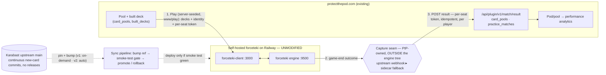

# On-Site Native Gameplay for Pool → Performance Capture

## Problem Frame

Protect the Pod wants to study how draft and sealed **decisions** correlate with **performance** — i.e., connect each pod/pool (and the picks/build choices behind it) to the games it actually wins and loses. The wiring to attach results to pools already exists (`/api/plugin/v1/match/result` → `card_pools`, fed today by the Wayfinder plugin), but capture is incomplete: an opt-in, off-site path (browser plugin, "go play elsewhere and come back") leaks players at every step and **can never reach 100% capture by construction**. Per the user: *"users are not using the plugin reliably and even if they were we could never get 100% usage."*

The proposed fix is to make games playable **natively on protectthepod.com**, collapsing "I have a pool" → "I'm in a tracked game" to a single in-site click so the result is auto-attributed by default. The engine to power this is **forceteki** — the engine behind **Karabast** (the fan-made, MIT-licensed SWU simulator project and community); throughout this doc, "Karabast" refers to the project/community/team and "forceteki" to its engine/repo. It is reused — not rebuilt. The central tension: forceteki implements every card as continuously hand-written TypeScript with no release cadence or stable API, so naively forking-and-modifying it would create exactly the "perpetual Karabast work" the user wants to avoid. This document scopes the architecture that delivers native on-site PvP capture **without** signing up for that maintenance treadmill, including how the engine is hosted and kept automatically current with upstream.

---

## Actors

- A1. **Pod/league player** — builds a pool deck on PtP, plays on-site against a pod opponent, generates the result data. The actor whose friction determines capture rate.
- A2. **PtP host app** — owns pools, identity/auth, the existing result pipeline, and the analytics that consume the data.
- A3. **Self-hosted forceteki stack** — the forceteki engine (`:9500`) + web client (`:3000`), run **unmodified** by PtP on Railway, that executes the actual game.
- A4. **Capture seam (PtP-owned)** — the thin component, living *outside* the engine's source tree, that observes/receives game-end and posts the outcome to PtP keyed by pool. Realized as an upstream-contributed webhook (preferred) or a PtP-owned sidecar observer (fallback).
- A5. **Karabast upstream project** — source of the engine and the continuous stream of new-card implementations; the PR target for the result webhook.
- A6. **Sync pipeline (PtP-owned CI)** — the automated job that advances the pinned upstream ref, rebuilds, smoke-tests, and promotes or rolls back the self-hosted stack.
- A7. **Data consumer (you / product)** — uses the resulting pod/pool → performance dataset to study draft and sealed decisions.

---

## Architecture at a glance

The load-bearing idea: **the capture seam never lives inside forceteki, and PtP carries zero local engine commits.** That combination is what lets new cards arrive as an automated, gated `git`-bump while results still flow into PtP — no fork, no rebase, no merge conflicts. (PtP does own a thin deploy/proxy overlay — see R9.)

---

## Key Flows

- F1. **Launch a tracked game from a pool**
  - **Trigger:** Player clicks "Play" on their competitive practice pod in PtP.
  - **Actors:** A1, A2, A3
  - **Steps:** PtP pairs the player with their assigned pod opponent (existing round/match structure) → **server-side**, PtP looks up both players' built decks and seeds them into a forceteki game, issuing each player a single-use per-seat join token → drops both players into the same-origin (`www.protectthepod.com/play`) forceteki client.
  - **Outcome:** Two pod players are in a live SWU game on-site, each playing their actual pool deck, without installing anything or leaving PtP.
  - **Covered by:** R1, R2, R3, R4, R16

- F2. **Capture and attribute the result**
  - **Trigger:** An on-site game (or Bo3 match) reaches a terminal state.
  - **Actors:** A3, A4, A2
  - **Steps:** The capture seam observes/receives the game-end outcome → POSTs **one perspective-keyed result per player** (`poolShareId`, result-from-that-player, game/match number, replay link if any, and the per-seat token) to `/api/plugin/v1/match/result` → PtP validates the token, applies the result idempotently, and updates `practice_matches` and both pools' `card_pools.wins/losses/draws`.
  - **Outcome:** Every completed on-site game is recorded against both players' pools with no player action.
  - **Failure path:** If the game is abandoned/disconnected, the explicit abandonment rule (see Outstanding Questions) is applied. Note this requires **net-new** disconnect/timeout detection — no such mechanism exists in matchmaking today — and depends on the same engine-external signal as game-end capture (R10).
  - **Covered by:** R5, R6, R7, R8

- F3. **Stay current with new cards (v1 on-demand, v2 automated)**
  - **Trigger:** Scheduled cadence (v2) or on-demand (v1); upstream forceteki has merged new card implementations to `main`.
  - **Actors:** A6, A3, A5
  - **Steps:** The sync pipeline advances the pinned upstream ref → runs forceteki's own card-data step (`_cardMap.json`) → rebuilds → runs the smoke test (boot engine, play a scripted game with a known outcome, assert game-end, capture-seam firing, **and correct posted payload**) → promotes to production only if green, else holds on the last-green ref and alerts. No edits to engine or card files; the external capture seam is untouched.
  - **Outcome:** New cards are playable on-site with zero manual card work, and no unverified upstream commit reaches a live game.
  - **Covered by:** R9, R12, R17, R18, R19, R20

---

## Requirements

**Native on-site play**
- R1. A player can start a tracked game directly from their pool/pod in PtP in one click, without installing anything or leaving the site.
- R2. v1 offers native play for **competitive practice pods** (players paired via the existing `practice_rounds`/`practice_matches` structure). Other formats are out of v1 scope (see Scope Boundaries). *(See Deferred / Open Questions: whether draft-only v1 serves the "draft and sealed" goal.)*
- R3. The game runs on a **self-hosted, unmodified** forceteki engine + client. **Game launch is server-driven:** PtP looks up both players' built decks from the active `practice_match` (keyed to the authenticated pairing) and seeds them server-to-server, issuing each player only a single-use per-seat join token. The browser never supplies a deck or identity parameter — so a player cannot seed a substitute or the opponent's deck, nor occupy the opponent's seat.
- R4. The game surface is presented **within PtP** (same-origin) so on-site play is the default, lowest-friction path — this is the capture-completeness lever and the entire justification for hosting an engine.

**Result capture & attribution**
- R5. Every completed on-site game yields a result attributed to **both** players' pools, with no player action required. The existing `/api/plugin/v1/match/result` endpoint records **one** pool's result from **one** player's perspective and derives the opponent via pod membership — so the seam emits **one perspective-keyed POST per player** (or a both-pools endpoint variant is scoped as net-new work); it does **not** accept a single "both pools" payload. Each POST carries the per-seat token (R3) and is server-validated, so a result cannot be forged, replayed, or attributed to a game a player was not in.
- R6. Per-game and match-level (Bo3) outcomes are persisted using the existing `practice_matches` fields (`game1/2/3_result`, `match_winner`), and `card_pools.wins/losses/draws` counters update accordingly. **Capture must be idempotent** keyed on the forceteki game id (a unique constraint or pre-check): an at-least-once seam re-posting the same game is a no-op, not a second increment. The multi-statement write (game slot + match confirm + both pool counters + round advance) runs in a **transaction**.
- R7. Abandoned, disconnected, or incomplete games are recorded by an **explicit rule** (see Deferred / Open Questions) rather than left orphaned or silently dropped — research-set integrity must be defined, not emergent. This abandonment/timeout detection is **net-new** (no such mechanism exists in matchmaking today) and shares the engine-external game-state signal that game-end capture needs.
- R8. A replay/game link is stored when forceteki exposes one (reusing the existing `wayfinder_replay_url`-style storage on `practice_matches`); absence of a replay link must not block result capture. Per-game replay links require **per-game** storage — the current schema stores one `wayfinder_match_id`/`wayfinder_replay_url` per match, so storing a link per game in a Bo3 is a schema decision, not a reuse.

**No perpetual engine work / staying current**
- R9. PtP **never modifies** forceteki's engine or card-implementation files, and carries **zero local engine commits**; staying current is a ref bump + redeploy, never a rebase or merge. PtP **does** own a thin deploy/proxy overlay (Dockerfile, env, the `/play` reverse proxy) as **new files** — this avoids git merge conflicts but is **coupled** to upstream's build commands, ports, env names, and socket paths, so an upstream change to that contract is bounded config work (caught by the smoke test, R18), not zero.
- R10. The result-capture seam lives **entirely outside** forceteki's source tree. Preferred realization: a generic game-result webhook contributed upstream (also helps upstream's own buggy stats tracking, [issue #2560](https://github.com/SWU-Karabast/forceteki/issues/2560)). Fallback: a PtP-owned sidecar observer. Either way, engine updates stay conflict-free.
- R11. The capture seam must tolerate upstream's lack of an API-stability contract: if forceteki refactors its protocol, capture may break but must **fail loudly** (observable/alerting), and the fix must be a small, bounded adapter change — never an engine fork-merge.
- R12. New-card currency: a newly-implemented upstream card is playable on-site within one sync cycle of upstream merging it (target cadence set in planning). **Before offering Play**, every card in a pool deck must be verified as **actually implemented** upstream (not merely present in `_cardMap.json`); a deck containing an unimplemented card blocks Play with a clear "play off-site for now" message rather than a broken game-start. This implementation-gap check is **distinct** from the ID-reconciliation in R20 and matters most right after a set release, when draft/sealed volume peaks.

**Make the captured data usable (the goal)**
- R13. Captured results are stored such that each outcome is **joinable** to its pool, the pool's built deck (leader/base/list), and the originating draft/sealed pool. Concretely, the schema must let an analyst join `result → card_pools.id → built_decks (leader/base/deck) → originating draft/sealed pool` so "which decisions correlate with winning" is answerable; name the join keys explicitly in planning (the current `practice_matches` row keys on `pod_id`, not the source pool).
- R14. A **minimum v1 analytic** is delivered, not just storage: at least **win rate per pool, per leader/base**, surfaced per pool/pod. Confirm the in-flight personal-stats data model has an extension point for this (or list creating it as an explicit deliverable); richer analytics **build on** that work (see Dependencies), not a parallel system.

**Hosting & deployment**
- R15. The self-hosted forceteki stack runs on **Railway** as its own service(s), separate from PtP's main app, communicating server-to-server via HTTP. The capture seam authenticates with a **dedicated, narrowly-scoped** result key (e.g. `FORCETEKI_RESULT_KEY`) — **not** the platform-wide `PTP_SERVICE_KEY` — and the forceteki service is **credential-isolated** from PtP's primary database, so a compromise of the auto-synced third-party service cannot forge results platform-wide or reach PtP data.
- R16. Players reach on-site play **same-origin** at `www.protectthepod.com/play` (the apex 301-redirects to `www`, so the canonical first-party origin is `www`). This needs **net-new reverse-proxy infrastructure** — HTTP path rewrite **plus WebSocket-upgrade forwarding** to the separately-hosted forceteki client/engine — which does not exist today (`next.config.js` has no rewrites; `server.ts` proxies nothing). The subdomain fallback `play.protectthepod.com` is simpler to host but **cross-origin**: the `sameSite=Lax` session cookie set on the apex would not be sent, so it would require `Domain=.protectthepod.com` + `sameSite=None` (a CSRF-protection downgrade for the whole session) plus CORS/socket-origin handling — a named security tradeoff, not an implementation detail.

**Automated upstream sync**
- R17. **v1** keeps current via a **single pinned upstream ref advanced on-demand** (a one-command rebuild + redeploy), with the smoke test (R18) run as a correctness check before promotion. The fully **automated, scheduled, gated, auto-rollback pipeline (R18–R19)** is the **v2** target — it is production-grade infrastructure that should follow, not precede, the make-or-break feasibility spikes. (Rationale: a manual pinned sha yields the same v1 dataset while the deck-seeding and capture-seam unknowns are still being proven.)
- R18. A bump is gated by a smoke test before promotion: boot the engine, run a scripted game **with a known outcome** to completion, and assert (a) game-end fires, (b) the capture seam posts, **and (c) the posted payload matches the known result — correct winner mapped to the correct pool**, not merely that the seam fired. The smoke test also asserts the deploy/proxy overlay's assumptions (expected ports, env names, start command, socket path, R9) so an upstream contract change fails the gate. **Out of the gate's scope** (needs canary/post-deploy monitoring): performance-under-concurrency and per-card-rules regressions on cards the scripted game doesn't exercise.
- R19. The pipeline supports **fast rollback** to the last-known-green upstream ref when a bump breaks production, and a redeploy must not abruptly kill in-progress games (drain or window). *(v2 automation; v1 rolls back by re-pinning the prior sha.)*
- R20. The sync job refreshes forceteki's own card metadata (`_cardMap.json`) and **reconciles the two card-data sources** — PtP's swuapi `cards.json` and forceteki's `_cardMap.json` — so a deck built in PtP maps cleanly into a forceteki game and the two do not silently drift. (ID reconciliation is necessary but **not sufficient** for playability — see the implementation-gap check in R12.)

---

## Acceptance Examples

- AE1. **Covers R1, R3, R4.** Given a player in a competitive practice pod with a built deck, when they click "Play" against their assigned opponent, both players are dropped into a forceteki game pre-loaded **server-side** with their built decks, inside PtP (same-origin), with nothing to install.
- AE2. **Covers R5, R6.** Given an on-site Bo3 match completes, when the final game ends, each game's result and the match winner are written to `practice_matches` and both pools' win/loss counters update — keyed by pool, idempotently, with no player action.
- AE3. **Covers R7.** Given an on-site game where a player disconnects and never returns past the timeout, when the abandonment threshold passes, the game is recorded per the explicit abandonment rule (not left un-attributed and not silently dropped).
- AE4. **Covers R9, R17, R20.** Given upstream forceteki merges 30 new card implementations, when the sync pipeline runs, the new cards are playable on-site and the capture seam keeps posting results with **zero** changes to card or engine files and **zero** local commits to rebase.
- AE5. **Covers R18, R19.** Given upstream merges a commit that breaks game start, when the sync pipeline runs, the smoke test fails, production stays on the last-green ref (no broken engine reaches players), and the failure is surfaced for a human to look at.
- AE6. **Covers R13, R14.** Given a completed competitive-pod match, when a player opens their pool, they see the win/loss tally for that pod; the underlying rows join `result → pool → built deck (leader/base/list) → originating draft pool`, so "win rate per pool per leader/base" is queryable for the research goal.

---

## Success Criteria

- **The dataset answers the question (outcome):** within a defined window (e.g. N competitive seasons), the captured dataset is large and clean enough to produce **at least one validated draft-decision → win-rate finding**. The *leading indicator* is **absolute on-site games captured per active competitive pod per season** trending up — framed as an absolute, because the off-site total is unknowable (so "share of all games" is not a measurable target). A minimum-dataset target is set in planning so v1 is a time-boxed hypothesis test (see Deferred / Open Questions).
- **Maintenance stays near-zero (human outcome):** absorbing a new set or a week of upstream commits is a smoke-test-gated pipeline run, with no PtP-authored card code, no local engine commits, and no merge conflicts. When upstream breaks the protocol or the proxy/deploy contract, the gate catches it and production stays green; recovery is a small adapter fix. (The gate catches functional + contract + payload-correctness breaks; performance and per-card-rules regressions are caught by canary/monitoring, not the gate.)
- **Clean handoff (downstream-agent):** `ce-plan` can proceed without inventing product behavior — the black-box constraint, the external-seam decision, the result-capture contract (per-player, idempotent, token-validated), the hosting surface, the automated-sync mechanism, and the v1 scope are all explicit, and the feasibility unknowns are named as research tasks rather than silently assumed.

---

## Scope Boundaries

- **Solo vs-bot play** — out of scope. forceteki is a PvP engine with (almost certainly) no game-playing AI; a bot opponent would be major new engine work, contradicting the no-new-Karabast-work constraint.
- **Modifying forceteki's engine or card files / carrying local engine commits** — explicit non-goal; this is the anti-pattern the architecture exists to avoid.
- **Reimplementing SWU rules in PtP** — non-goal; the entire point is to reuse forceteki's engine.
- **Contributing card implementations upstream** — non-goal; PtP consumes cards, it does not author them. (The one thing PtP may contribute upstream is the generic result webhook, R10.)
- **Replacing the Wayfinder path** — non-goal. Native play and Wayfinder coexist; Wayfinder still serves off-site/constructed play. Native play targets on-site pod/league capture completeness. (Both now write the same pool counters via the same endpoint — see R5/R6 for the idempotency + perspective rules that keep them from colliding or double-counting.)
- **Native play for casual sealed/draft pools, pack-wars/blitz, rotisserie** — deferred beyond v1; v1 is competitive practice pods only.
- **Ranked ladder / ELO / matchmaking beyond pod pairing** — deferred.
- **Building replay hosting/viewing** — out of scope; we store a link if the engine exposes one, nothing more.
- **A new analytics product** — deferred; consume/extend the existing personal-stats work rather than building parallel dashboards.

---

## Key Decisions

- **Self-host forceteki as a black box; never modify the engine or card files, carry zero local engine commits.** Only way native play coexists with "no perpetual Karabast work." (R9) — with the caveat that a thin, non-conflicting **deploy/proxy overlay** is owned by PtP and coupled to upstream's build/port/socket contract (bounded config, not zero; R9/R18).
- **Track upstream `main` as a pinned ref with smoke-test-gated bumps — NOT "rebase onto stable releases."** forceteki publishes no releases or tags (verified). **v1 advances the pin on-demand and runs the smoke test manually**; the scheduled/auto-rollback automation is **v2** (R17), so the heavy pipeline follows the feasibility spikes rather than preceding them.
- **Game launch is server-driven, issuing single-use per-seat join tokens** that bind identity + deck + pools; the result POST is validated against the token. This is the integrity control against result forgery/replay, seat impersonation, and deck substitution. (R3, R5)
- **Reuse the existing result endpoint, but not "as-is" for the both-pools shape.** It records one pool from one perspective, so the seam emits one perspective-keyed POST per player, idempotent on the forceteki game id, in a transaction. (R5, R6)
- **Capture seam lives outside the engine tree — upstream webhook preferred, PtP-owned sidecar observer as fallback.** Keeps updates clean and de-risks the upstream dependency. (R10, R11)
- **Credential-scope the capture path:** a dedicated `FORCETEKI_RESULT_KEY` (not the platform-wide `PTP_SERVICE_KEY`), with the forceteki service isolated from PtP's DB and a dependency-audit step in the sync pipeline. (R15)
- **Deployment surface: serve same-origin at `www.protectthepod.com/play`** (apex redirects to `www`), via a **net-new** reverse proxy (HTTP rewrite + WebSocket-upgrade forwarding). The `play.` subdomain fallback is cross-origin and forces a `sameSite=None` session-cookie downgrade — a named security tradeoff, not a default. (R15, R16)
- **Native play coexists with Wayfinder; it does not replace it.** Different jobs: Wayfinder for off-site/constructed, native for on-site pod capture.
- **v1 = competitive practice pods, PvP only.** Lowest-friction fit with the existing `practice_rounds`/`practice_matches`/Bo3 data model. *(Whether draft-only v1 serves the stated draft+sealed goal is an open decision — see Deferred / Open Questions.)*
- **Reject fork-and-modify** (the original framing). In-engine result instrumentation is exactly what makes every upstream update conflict.

---

## Risks — automated upstream sync

- **Release-less `main` can deliver a broken or mid-refactor commit.** `main` takes ~5 commits/day including active engine refactors; any single commit may be regressed. Mitigation: the smoke-test gate (R18) + rollback (R19) are mandatory, not optional — this is the price of there being no release train.
- **Silent capture breakage on protocol drift.** A bump can keep the engine booting while breaking the external capture seam. Mitigation: the smoke test asserts the capture seam *fired* **and posted the correct payload** (R18), not merely that the engine started (ties R11 ↔ R18).
- **Credential exposure / supply chain.** The auto-synced forceteki service holds a result-posting credential and runs ~5 upstream commits/day behind only a functional gate; a malicious upstream commit or a compromised dependency could exfiltrate the key or ship hostile code to production. Mitigation: scoped `FORCETEKI_RESULT_KEY` + service isolation (R15), plus a **dependency-audit + lockfile-diff alert** step in the pipeline before promotion.
- **forceteki-side persistence changes between bumps.** forceteki uses its own database + S3 and a card-data step; an auto-bump could require a forceteki-managed migration or data refresh PtP doesn't control. Mitigation: the pipeline runs forceteki's own setup/migration steps and detects schema changes; flagged for research (does the engine/infra repo own migrations?).
- **Card-data drift between two sources.** PtP's swuapi `cards.json` and forceteki's `_cardMap.json` are independent; mismatched IDs/variant naming would break deck seeding (F1). Mitigation: reconciliation step (R20) + a deck-mapping check in the smoke test. **Separately**, a correctly-mapped card whose *rules* are unimplemented upstream still can't be played — handled by the implementation-gap check (R12), which peaks in importance right at set release.
- **Cadence trade-off.** Too frequent = churn/instability; too infrequent = missing new cards exactly when a set drops and demand peaks. Mitigation: scheduled daily + on-demand trigger around set releases (v2).
- **Auto-deploy interrupting live games.** Redeploying a stateful multiplayer service mid-game drops players. Mitigation: drain active games / deploy window / graceful handoff (R19).

---

## Dependencies / Assumptions

- **Existing PtP result endpoint is reused** *(verified in repo):* `app/api/plugin/v1/match/result/route.ts`, auth via `lib/auth.ts`, `card_pools.wins/losses/draws` + `wayfinder_match_ids[]` (migration `046_add_match_results_to_pools.sql`), and `practice_matches` (`player1/2_id`, `game1/2/3_result`, `match_winner`, `wayfinder_match_id`, `wayfinder_replay_url`). **Caveat:** it records one pool from one player's perspective and derives the opponent — so native capture is one perspective-keyed POST per player (R5), not a literal "both-pools, as-is" reuse, and it must be made idempotent + transactional (R6).
- **forceteki is MIT-licensed** *(verified):* self-host, modify, and redistribute are permitted with attribution. (Card *data* access is treated as a product matter per project convention; the only license note here is forceteki's own code license.)
- **forceteki has no releases or tags** *(verified):* continuous deployment to `main`; this is why sync tracks a pinned `main` ref rather than a release.
- **PtP deck data is already consumable by forceteki via a manual paste-import** *(verified):* `plans/KARABAST_PR.md` lets a *user paste* a PtP pool URL into the forceteki client's import box (which fetches `/api/pools/{shareId}/deck.json`). This proves **deck-data format compatibility only** — it does **not** establish programmatic two-player game creation or identity injection. That programmatic auto-seed is the make-or-break spike; the existing paste-import does not de-risk it.
- **Self-hosting topology** *(infra deps verified):* forceteki needs a database, S3-compatible object storage, and realtime sockets, alongside the engine (`:9500`) and client (`:3000`) — deployed as a separate Railway service (R15). This is where the build effort concentrates (identity bridge between PtP login and the game lobby, reconnects, abandonment, abuse, deploy-without-interrupting-live-games). Enumerated so each item can be sized rather than assumed; with prior Karabast/Wayfinder hosting experience, much of this may be routine.
- **Assumption (unverified):** forceteki-client can launch a game **pre-seeded with an externally-supplied deck + identity**, same-origin, without modifying the engine. Make-or-break feasibility item — spike first.
- **Assumption (unverified):** a game-end outcome is **observable to an external seam** (socket event / `Game.getState()` terminal / gamenode lifecycle) without engine edits. As of June 2026 there is **no documented `gameOver`/`winner`/replay event upstream** (verified via repo inspection; `GameStatisticsTracker` is a temporary console logger). If false, the sidecar fallback (R10) may be non-viable and capture would hinge on the upstream-webhook path.
- **Assumption (unverified):** the Karabast team would accept a generic result-webhook PR. Mitigated by the sidecar fallback (R10), if observable per above.
- **In-flight analytics work to build on:** `docs/brainstorms/2026-06-09-personal-stats-requirements.md` and `docs/plans/2026-06-09-001-feat-personal-stats-plan.md` (personal stats currently track activity, not win rates — this native-play data should feed that surface).

---

## Outstanding Questions

### Resolve Before Planning

- *(none — the load-bearing product decisions are made: capture-completeness goal, PvP mode, self-host-black-box architecture, automated `main`-tracking sync, same-origin `/play` surface, v1 = competitive practice pods. Two judgment calls were deferred from the 2026-06-11 review — see Deferred / Open Questions.)*

### Deferred to Planning

- [Affects R1, R3][Needs research] Can forceteki-client launch a game pre-seeded with an external deck + PtP identity, same-origin, **without** modifying the engine? This is the make-or-break feasibility question; spike it first.
- [Affects R5, R6][Needs research] What is the cleanest **external** observation point for game-end outcome (socket event, `Game.getState()` terminal state, gamenode lifecycle), given no documented `gameOver` event upstream?
- [Affects R17, R20][Needs research] Does forceteki manage its own DB schema/migrations and an S3 layout that can change between upstream bumps? If so, the sync pipeline must run its setup/migrations and detect breaking schema changes.
- [Affects R20][Needs research] How do PtP's swuapi card IDs map to forceteki's `_cardMap.json` IDs, and where can they drift (new cards, variant naming)?
- [Affects R18][Technical] What depth of smoke test is sufficient to trust a promotion — a single scripted game, or a small matrix across leaders/sets/keywords?
- [Affects R15, R19][Technical] On Railway, how to redeploy the stateful engine without interrupting in-progress games (drain, blue-green, or maintenance window)?
- [Affects R7][User decision] How are abandoned/disconnected games recorded for research-set integrity — a loss for the disconnecting player (mirrors competitive norms) or **voided** from the dataset (cleaner signal)? Recommended default: void from the analytical dataset while still showing a UI result; confirm early in planning.
- [Affects R3, R15][Needs research] What PtP identifying data (user id, username, Discord id) is seeded into forceteki sessions/replays and stored in its DB/S3, and what retention/privacy applies vs. PtP's primary store?
- [Affects R3][Needs research] Does forceteki validate a seeded deck against SWU construction legality at game-create? If so, what is PtP's pre-flight so an invalid/partial pool deck fails gracefully in-site rather than erroring inside the engine?
- [Affects R10, R11][Needs research] Engage the Karabast maintainers (Discord/PR): will a generic result webhook be accepted upstream, or should the sidecar observer ship first and the webhook follow?

---

## Deferred / Open Questions

### From 2026-06-11 review

- **[#11 · product, scope] Goal vs v1 scope — "draft AND sealed" but v1 is draft-only.** The motivating goal is studying draft *and* sealed decisions, but v1 = competitive practice pods is draft-only and FOP-gated, so the dataset structurally can't answer the sealed half and the narrow population may starve even the draft half. **Decision needed:** narrow the stated goal to "competitive-draft decisions," OR explicitly frame v1 as a capture-mechanism proof with sealed/casual breadth deferred — and pair it with a minimum-dataset success target (games per active pod per season) so v1 is a time-boxed hypothesis test, not an open-ended build.
- **[#16 · design] On-site play-flow interaction states undefined end-to-end.** The PtP-owned seams of the play flow have no defined behavior: first-player waiting/pairing, opponent-not-ready, Play-button ineligible/error states (no built deck, no assigned opponent, round not started), in-game → return-to-PtP after a game/match, post-game result presentation, and what each player *sees* on a mid-game disconnect/abandonment (R7 defines the data rule, not the UX). Needs a dedicated interaction-state map early in planning before F1/F2 can be implemented.

---

## Next Steps

-> `/ce-plan` for structured implementation planning. Spike the forceteki-client deck-seeding feasibility question first, and resolve the two Deferred / Open Questions (goal-scope framing; play-flow interaction states) early in planning.
