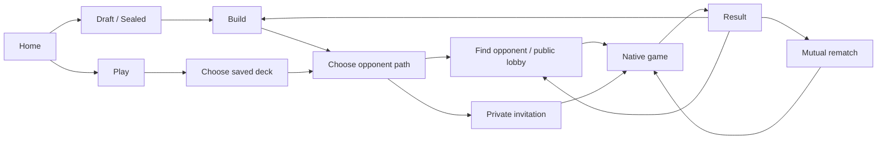

# Native limited play on Protect the Pod

> **October 1 decision:** Launch is beta-only solo draft/sealed against AI, entered after deckbuilding. Draft uses actual draft opponents and AI-only bracket matches; sealed generates and builds a bot pool. [Solo AI beta launch](../../plans/2026-10-01-solo-ai-beta-launch.md) supersedes the multiplayer-first requirements below, including R1–R3 and R6–R12 wherever they conflict. Historical UX/engine principles still apply.

## Problem frame

PTP should offer a complete limited session: draft or open packs, build a deck, and play another person on the site. Today the Karabast handoff and optional Companion create a confusing secondary journey. Native play becomes the expected next step after building; returning players can also choose a saved limited deck and play immediately.

This direction supersedes the Karabast-first, Companion-promotion, no-native-client, and no-queue constraints in the June native-play and July lobby brainstorms. It does not authorize deleting those integrations or changing Wayfinder's separate product. Existing external exports remain a quiet utility.

## Requirements

The product choices reflect the conversation. Operational and accessibility requirements below make the implied native-play behavior explicit; proposed workflow defaults remain separately identified in D1–D9.

**Entry and continuity**
- R1. Focus the first release on limited: draft and sealed. General constructed play and AI opponents are outside this release.
- R2. The homepage has three clear primary entries: Draft, Sealed, Play. Stats is an optional fourth entry to assess in mockups, not a confirmed launch requirement.
- R3. Support both journeys: draft/open → build → play; and Play → select saved limited deck → play. Preserve the selected deck across opponent discovery and invitations.
- R4. Once a deck is legal, prominently encourage play. Karabast export, Companion detection, installation instructions, and manual handoff steps must not compete with or gate native play.
- R5. Keep Karabast export in a secondary deck export utility. Do not promote external lobbies in the native opponent-discovery flow.

**Opponent discovery and games**
- R6. Offer a public lobby, match queue, and private invitation links that users share themselves through Discord or another channel. PTP does not need to send those messages.
- R7. Public matching requires the same set, draft/sealed format, and sealed pack count. Filter deck choices to compatible legal decks and explain ineligibility.
- R8. Private games use those rules by default, with an explicit option to allow differing limited sets or formats. Both players see the relaxed rule before joining. Relaxation does not permit illegal decks or unsupported cards.
- R9. Each casual public/private encounter is one game, followed by an optional mutual rematch. No ranked ladder or best-of-three queue in this release.
- R10. Private games are unlisted; opening an invitation preserves its context through sign-in and deck selection. Full, cancelled, expired, or unavailable invitations receive an explanatory recovery path.
- R11. Native play uses Baize to enforce rules and compute outcomes. Each player sees only information permitted to their seat; the server determines turn ownership and valid actions.
- R12. Record completed native results against the participating players and exact deck versions used. Keep AI results, if added later, distinguishable from human results.
- R13. Temporary loss of connectivity, refresh, or mobile backgrounding must offer reconnection to the same game rather than silently starting a replacement. Show connection and recovery status to affected players.

**Game surface and devices**
- R14. Deliver a browser experience for desktop, iPad/tablets, and iPhone/phones. Every essential action works with touch; hover, precision dragging, and mandatory device rotation cannot be prerequisites.
- R15. Pursue a professional 2.5D tabletop: shallow perspective, restrained material texture, contact shadows, tactile card motion, and clear hierarchy. The visual target must remain plausible for an interactive web implementation.
- R16. Make both ground and space arenas, each player's units, bases, leader state, resources, initiative, active player, and current decision understandable. Preserve stable spatial orientation across turns.
- R17. Provide readable card inspection and explicit legal actions/targets, including multi-step decisions. Compact board cards may simplify detail, but complete card information must be accessible without hover.
- R18. Adapt composition to screen size; do not simply scale the desktop board down. Phone layouts preserve awareness of both arenas and make hand, inspection, and history expandable.
- R19. Motion explains actions without blocking decisions unnecessarily. Provide reduced motion and redundant text/shape cues for states otherwise communicated by color.
- R20. If native play is unavailable or a saved deck is unsupported, retain the deck and explain the blocker with retry/change-deck paths. Do not silently send players to Karabast. Empty saved-deck views lead into draft/sealed creation; interrupted saves do not start games with stale decks.
- R21. Bind each game seat to its authenticated player and accept a game result only from the authoritative session. Never expose full engine state, random seeds that disclose hidden information, or AI-inspection output to PvP clients. Validate deck ownership and eligibility again when starting the game; a browser-supplied deck or result is not authoritative.

## Proposed defaults for planning and design

These make the mockups concrete; they are recommendations, not additional user-confirmed decisions.

- D1. Surface an active draft, unfinished deck, or reconnectable game above the homepage entries. Auto-save building progress; Play proceeds only after the chosen version is saved and legal.
- D2. The lobby and queue share public availability: Find Opponent joins the oldest compatible available game or creates one public waiting entry. At most one waiting entry/active match per person; joins are atomic. Cancel removes availability. No fabricated opponent or wait estimate when the lobby is empty.
- D3. Listings show player, set, format, pack count where applicable, and availability; hide the opponent's deck identity before play. The user always sees their own selected deck.
- D4. For private invitations without an eligible saved deck, offer draft/sealed creation while retaining the invitation. Explain that it may no longer be available on return.
- D5. Post-game actions: Rematch, Find another opponent, Adjust deck. A rematch initially uses the same deck versions and requires both players; changing a deck returns to preparation before a fresh game.
- D6. Reuse existing login identity for public and private play, preserving intent through authentication. A share URL identifies an invitation, never grants control of the host's seat.
- D7. Support concession. Treat disconnects as interrupted games until a defined grace period expires; do not infer a competitive win from a browser closing. Exact grace/timeout/outcome policy must be settled before implementing match lifecycle.
- D8. Existing pod pairings should launch native games with the paired players/decks. Preserve existing pod series and standings rules; casual one-game selection does not silently redefine organized pod behavior.
- D9. Keep other existing pool-generation formats accessible through a quieter Other formats link; do not imply all are immediately supported by native play. Verify engine support before offering Play for each format/set.

## Main flows

## Acceptance examples

- AE1 (R3–R5). A player finishes a valid sealed deck and enters native matchmaking without export, copying deck data, installing an extension, or losing the deck selection.
- AE2 (R6–R8). A six-pack SOR sealed listing cannot match an eight-pack SOR sealed or SHD draft deck publicly. A private host can permit the mismatch and the invitee sees that choice before joining.
- AE3 (R9–R10). A friend opens a private link, signs in, selects a legal compatible deck, and joins the host. A third person cannot occupy an already claimed seat.
- AE4 (R11, R13). A player refreshes mid-game and restores their seat and current decision. They cannot see the other player's hand or submit actions for that player.
- AE5 (R12). Editing a saved deck after a game does not change the historical deck attached to its result.
- AE6 (R14–R19). On phone portrait, a player can inspect cards, select an attacker and target, resolve a choice, take initiative, and concede without hover or dragging; both arenas remain discoverable.
- AE7 (R9). One game ends and results appear. A rematch starts only after both players accept; leaving or declining never starts it automatically.

## Success criteria

- End-to-end manual verification completes both entry journeys on desktop, tablet, and phone without Karabast or Companion.
- Measure valid-deck completion → native game start, time from Play to game start, queue abandonment, native completion, reconnect success, and rematch acceptance. Establish baselines before setting numeric conversion targets.
- Visual review approves desktop and phone battlefield compositions using real cards, including a crowded board and a multi-step choice; an attractive empty board is insufficient.
- Initial performance target for validation: responsive input while animating on a representative iPhone and iPad, with graceful reduced effects. Device-specific frame and memory budgets are planning work, not proven by these mockups.

## Scope boundaries

- No AI launch dependency, ranked ladder, general constructed play, spectators, public replay browser, in-app friend graph, or Discord messaging integration.
- No feature-complete implementation in this design task. Mockups use fictional names/data and simulated transitions; the board study is not connected to an engine.
- No forced Karabast promotion, no extension requirement, and no engine rules reimplementation in frontend code.
- No commitment to full 3D/WebGL or elaborate environmental animation; rendering technology follows the approved visual/interaction target.

## Evidence and dependencies

- PTP: `src/components/PlayInstructions.tsx`, `src/components/Lobby/LobbyHome.tsx`, and existing lobby requirements document the current handoff and matching concepts.
- Sibling repository `caldred/baize`: the core Game contract exposes player turns, legal actions, apply, observations, and event visibility. Inspected server sessions in the base checkout and `codex/wayfinder-ui-contract` still assume one human and bots in remaining seats. Multiplayer session orchestration needs work around the rules engine.
- Sibling repository `ledwards/wayfinder`: `apps/replay-client` contains the Karabast-derived board and Baize adapter. `apps/replay-client/server/baize-gateway.mjs` admits one human seat and a bot. Existing reconnect behavior is useful evidence, not proof of PvP readiness or durable recovery.
- The final upstream-bound Baize branch is not yet identified. The packaged engine revision and adapter compatibility manifest currently differ; align a tested revision during planning rather than assuming either represents latest parity.

## Outstanding questions carried into planning

- Confirm the upstream PR branch and native support for chosen launch sets, arbitrary PTP deck lists, and game decisions.
- Resolve D7's disconnect grace, abandonment outcome, inactivity behavior, and recovery across server restarts before implementing lifecycle. Treat these as explicit product-policy signoffs within planning.
- Review the proposed unified public matching behavior (D2) and pod integration scope (D8) against current code.
- Approve Stats as fourth entry or keep it secondary; mockups expose a toggle for comparison.
- Validate exact card geometry, dense boards, accessibility, portrait/landscape hand presentation, and animation budgets with playable prototypes.
- Specify release transition and recovery for already-open external listings and active pod pairings. Depromoting Karabast must not strand in-progress games; do not mix external and native availability in one join action.

## Design deliverables

See `docs/design/native-play-2026-09-30/README.md` for the clickable flow wireframes, generated visual target, and HTML/CSS board study. The generated image establishes material/lighting ambition; browser screenshots demonstrate only the implemented study and do not establish production performance or rules correctness.

## Next step

Continue with the [native limited play implementation plan](../../plans/2026-09-30-native-limited-play-plan.md). It stages a complete private game before public discovery and product-wide rollout, with engine verification, interaction parity, and lifecycle policy gates made explicit.

## Accepted table customization and continuity (September 30 follow-up)

- **R22 — Table environments:** Offer selectable Dejarik holotable, Imperial holotable, dirty cantina, Cloud City sabacc, Rebel hideout, and snowy Hoth environments. Retain the command-table study as an additional option. These are presentation preferences, independent of rules and matchmaking.
- **R23 — Card presentation:** Full printed cards and cinematic cropped-art units are selectable. Use actual card assets and canonical data; inspection always exposes the complete original face and rules. Hidden cards retain authentic card backs. Preserve actionable state, costs, damage, upgrades, and accessibility across styles during production implementation.
- **R24 — Personal areas:** Place each discard pile adjacent to its draw deck in that player's area. Permit discard inspection without exposing hidden deck contents.
- **R25 — Leader/base placement:** Offer central leader/base placement and the player-area arrangement as independent layout options. Both must support inspection and legal actions, including deployment.
- **R26 — Draft/build continuity:** Carry the chosen environment and card presentation through drafting, deckbuilding, and play. Apply the skeuomorphic table treatment without removing existing complex builder controls. See the control-preservation matrix in the design directory; mockup coverage does not establish production parity.

Acceptance examples: Switching from Hoth/full/center to cantina/cinematic/player-area changes presentation only. Navigating from draft to build to play retains environment and presentation. A user can inspect a cinematic unit's complete printed card, review discard contents next to the draw deck, and access the same deckbuilding controls at supported phone/tablet/desktop widths.

## Accepted interaction direction and further design work

- **R27 — Familiar default UX:** Use Karabast as the default interaction reference. Evaluate Arena and Hearthstone patterns as optional improvements, particularly click versus drag. Preserve SWU decision semantics and a complete tap path. The user has accepted the direction, not every detailed recommendation in the UX decision pack.

The [UX decision pack](../design/native-play-2026-09-30/ux/README.md) separates local-source evidence, historical publisher documentation, proposals, interactive fixtures, and remaining validation. Its proposed defaults include center leaders/bases, space left and ground right, and click/tap-first operation. Exact live Karabast parity remains to be checked.

## Accepted interaction efficiency constraint

- **R28 — No additional interaction cost:** For each equivalent action in the same game state, PTP must require no more clicks/taps and no more confirmations than Karabast. Apply this per action and per offered mode, not as an average. Optional dragging is an alternative or shortcut. Do not add generic confirmation steps, a cautious-confirmation mode, or persistent Inspect buttons below every card. Preserve necessary rules choices and existing completion semantics. Improve clarity through inline feedback, hover/hold inspection, and non-blocking cues. Record paired reference/client traces before claiming parity; unknown reference behavior is not permission to add a step.

## Accepted repository and deployment boundaries

- **R29 — Standalone game client:** The gameplay frontend lives in its own repository and deploys initially to `play.protectthepod.com`. The same application can be configured for a future deployment at `play.wayfinder.news`; it must not depend on a PTP source checkout, hardcoded domain, or shared parent-domain cookies. PTP continues to own draft/build/deck selection and opponent discovery, with a seamless authenticated launch into the game client.
- **R30 — Independently deployable backend:** Both the game client and the Baize Rust backend have their own reproducible build, configuration, deployment, health checks, and versioned integration contracts. Baize owns authoritative live-session execution and recovery; host applications integrate through authenticated launch and durable result contracts rather than direct database coupling. Independent deployment must preserve active games and reject incompatible versions clearly.

The [implementation plan](../../plans/2026-09-30-native-limited-play-plan.md) supersedes its original embedded-PTP game-client/coordinator approach with these boundaries. The new repository name and hosting provider remain implementation setup choices; this decision does not itself create repositories or deploy services. Future Wayfinder hosting is an architectural capability, not an added release requirement.
