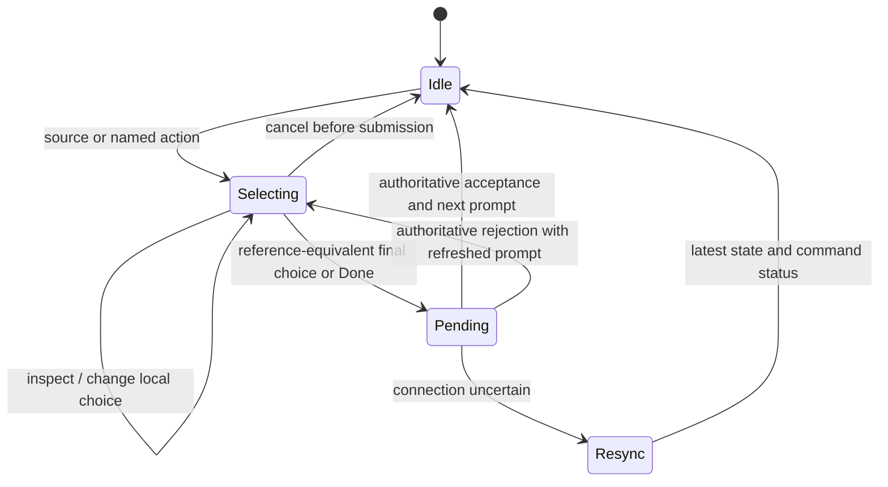

# Interaction decisions and commit boundaries

All defaults here are recommendations unless already accepted in the requirements. The lab contains fixed decision fixtures; it does not implement these rules generally.

## Click, drag, and cancellation

| Decision | Recommended behavior | Alternatives and tradeoff |
|---|---|---|
| Card in hand | Click directly initiates the unambiguous legal play; show choices only when the reference flow needs them | Drag initiates the same play; do not add a generic Play approval after selection |
| Ordinary attack | Click ready unit, choose Attack if ambiguous, click legal target | Direct drag to target is an optional shortcut when Attack is unambiguous |
| Drag release | Valid release completes the equivalent selection; invalid release cancels the gesture | Nearest-target snapping is forgiving but can choose the wrong card; use expanded non-overlapping hit regions instead |
| Empty-board click | Cancel local targeting only where no other board action exists | Keep Cancel visible; do not make empty-board clicking the sole escape |
| Inspect | Never spends resources, chooses a target, or acknowledges a prompt | Context menus can be shortcuts, never the only route |
| Multiple available actions | Explicit, stable list: Attack / ability / Deploy, with costs | Default-action guessing saves a click but may trigger the wrong ability |
| Single legal target | Still select it by default | Future opt-in only if engine marks the entire choice as forced, including optionality |
| Cancel after server boundary | Only a server-advertised cancel/back action | A UI Back button must not rewind a paid cost or revealed card |

Commit on pointer release/click completion, not pointer-down. A drag can be abandoned; Escape and pointer cancellation clean up its ghost/arrow. Touch scrolling must never resolve the card underneath. Both single-pointer non-drag controls and keyboard controls are required; keyboard alone is not a substitute for the non-drag alternative. [W1,W2]

## Decision catalog

| SWU decision family | Proposed presentation | Completion and recovery |
|---|---|---|
| Keep/mulligan | Full opening hand, two named choices; describe full-hand replacement | Use Karabast’s exact completion path; no added mulligan approval or per-card replacement metaphor |
| Initial resources | Select exact required count; mark each card as Resource; inspect remains separate | Done enables only at the engine-required count; all choices editable before submission |
| Regroup resource | Hand selection with resource destination; explicit Skip when engine allows zero | Retain the reference Done step where present; no second approval; never resource automatically because one card is left |
| Play unit/event/upgrade | Show actual cost, aspect penalty, arena/target, and mode if needed | Follow engine prompts; do not remove the hand card authoritatively until accepted |
| Payment and alternate costs | Offer explicit engine-provided payment/mode choices; expand resources when identity matters | Auto-payment is acceptable only under a tested equivalence policy; hidden resource identity can matter |
| Attack | Source remains highlighted; valid targets labelled; explain blocked selection | Final target selection commits; no extra review step |
| Leader ability/deployment | Separate named actions, readiness/once-per-game state, inspect both faces | Do not make flipping the inspection image deploy the leader |
| Base ability | Named action with once-per-game/usage status supplied by engine | Match reference action selection; no added approval; tapping a base target must not open its ability menu |
| Optional effect | Separate Resolve / Decline, with source and consequence | No preselected decline; engine determines whether it can be declined |
| Choose mode or order | Named choices with source references; reorder controls for effect ordering | Done submits the selected mode/order, not an assumed first choice |
| Multi-target choice | Selected count, legal min/max, persistent checkmarks | Editable set until Done; duplicate card copies use unique instance IDs |
| Split damage/healing | Per-target +/- controls, remaining amount, constraints | Submit exact valid allocation; do not infer a legal split from card text client-side |
| Upgrade, token, captured card | Expand child-object list; every child has its own target identity | A badge click must not also select the parent unit |
| Search/reveal/discard/reorder | Dedicated browser of the cards the seat may see; source and destination explicit | No hidden deck contents in DOM; preserve chosen order where required |
| Pass | Distinct from initiative; label that opponent acts next | One explicit action; indicate phase-ending consequences inline without an added confirmation |
| Take initiative | Persistent separate control with inline consequence text | Claim directly; no additional confirmation beyond the reference flow |
| Concede | Match the reference menu/confirmation path | Do not add an extra confirmation beyond that path; keep it separate from routine actions |

## Confirmation policy

**Hard requirement: for each equivalent action in the same game state, PTP must require no more clicks/taps or confirmations than Karabast.** This applies per action, not on average, and to every offered control mode. Do not justify extra approvals as safety, onboarding, or cautious mode. Show cost, destination, consequences, and legality inline or on hover without requiring acknowledgement.

Distinguish a necessary rules choice (mode, targets, resource set, allocation) from a redundant approval of a choice already made. Preserve Karabast's genuine Done/completion steps where present; do not append another. Where exact current behavior is unverified, inspect/record it before claiming parity. Extra confirmations are not the fallback for missing evidence.

Do not use “Undo” as a universal promise. Local selection can be cancelled before submission. A server-accepted action may reveal information or invoke randomness; any takeback requires an explicit supported server policy, possibly opponent agreement. Launch without general takebacks if the protocol cannot guarantee them. Existing Karabast undo labels do not establish Baize capability.

## One interaction state machine

This is a UX state sketch, not a proposed Baize API. Some engines commit intermediate choices; those become Pending transitions too. Do not assume the whole action remains reversible until its final target.

Every submitted decision needs an authoritative prompt/state version and a unique command identity. Do not impose an artificial animation or confirmation delay on top of server processing. While pending, disable duplicate commits; inspection and public history can remain usable. Resynchronization determines whether an uncertain action was accepted. Never submit it again merely because the animation or acknowledgement was interrupted. Re-evaluate any local selection after state replacement, even if the same card is still visible.

## Keyboard and focus

Tab/Shift-Tab visit named actions and cards; I on a focused card opens inspection; Enter/Space activate the focused control. Escape dismisses inspection first, then cancels a local selection, then opens the menu only at idle. Preserve verified Karabast shortcuts with focus guards: a global binding must not double-fire the focused button or act while typing. Do not replace a fast reference shortcut with a longer menu path. Typing in chat/search must never trigger game shortcuts. Restore focus to the invoking card after inspection; do not jump focus on every opponent action. Announce prompt and accepted outcomes, not every hover or animation frame.

## Prototype timing values to test

Start from the fork's 200 ms desktop preview and 400 ms touch hold; test these rather than treating them as standards. Use an 8–12 CSS-pixel movement threshold as a prototype range, not a device-independent law. Card art can move visually without shifting the target hitbox during selection. Drag release must be validated against the latest prompt, not the pointer-down snapshot.

## Sources

- **W1:** W3C, [Dragging Movements](https://www.w3.org/WAI/WCAG22/Understanding/dragging-movements).
- **W2:** W3C, [Pointer Cancellation](https://www.w3.org/WAI/WCAG22/Understanding/pointer-cancellation.html).
- Local reference evidence and SWU source: [comparison register](01-reference-comparison.md).
