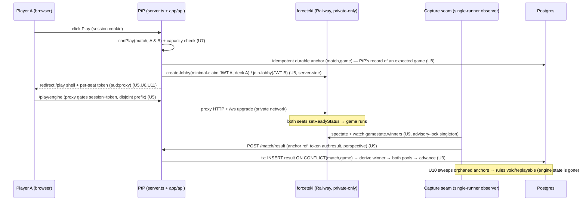

# feat: Native on-site PvP gameplay + pod/pool performance capture

## Overview

Let competitive-practice-pod players click **Play** on protectthepod.com and play a tracked PvP Star Wars: Unlimited game in-site, so the result is auto-attributed to both players' pools — raising capture completeness above the ceiling of the opt-in Wayfinder plugin. The game runs on a **self-hosted, unmodified** forceteki engine (the Karabast engine); PtP orchestrates it server-side (minted per-user JWTs + per-seat tokens), serves it same-origin under `www.protectthepod.com` via a reverse proxy, and captures game-end from **outside** the engine via a spectator-socket observer that POSTs to PtP's existing result pipeline — made transactional and idempotent first. Engine currency is a pinned-ref bump + smoke-test gate (v1 on-demand).

This is a **spike-first, phased** plan. Phase 0 (U1) is a hard feasibility gate **for Phases 2+ only** — Phase 1 (U2/U3) is forceteki-independent (it fixes a live Wayfinder result-capture race) and proceeds regardless of the spike outcome.

---

## Problem Frame

PtP wants data connecting pods/pools to performance to study draft/sealed decisions (see origin). The result→pool wiring exists (`app/api/plugin/v1/match/result/route.ts` → `card_pools`, fed by Wayfinder) but capture is incomplete — an opt-in, off-site plugin can never reach 100%. Native in-site play collapses "I have a pool" → "I'm in a tracked game" to one click, where the result is captured by default. The hard parts are not card-sync (the black-box engine makes that a `git` bump) but: a realtime trust boundary (forgery/impersonation/substitution), a result endpoint that is currently non-idempotent and non-transactional, capture **durability** against an in-memory engine that loses state on every redeploy, and a large set of undefined play-flow + abandonment states. v1 is a **capture-mechanism proof for competitive-draft pods** (origin Deferred/Open Question #11 — see Open Questions).

---

## Requirements Trace

- R1. One-click tracked game from a pool/pod, nothing to install, never leaving the site (origin R1, R4).
- R2. v1 scope = competitive practice pods, paired via existing `practice_rounds`/`practice_matches` (origin R2).
- R3. Server-driven launch on an unmodified forceteki, seeded from `built_decks`, identity via single-use per-seat token; browser supplies no deck/identity (origin R3).
- R5/R6. Every completed game attributed to both pools via the existing endpoint, **idempotent (keyed on PtP's durable game anchor) and transactional**; per-player perspective POST (origin R5, R6).
- R7. Abandoned/disconnected/engine-lost games recorded by an explicit rule (void/replayable); net-new detection (origin R7).
- R8. Per-game replay link storage (origin R8).
- R9/R12. Zero local engine commits; pinned-ref bump; pre-launch check that every deck card is actually implemented upstream (origin R9, R12).
- R10/R11. Capture seam outside the engine tree; fail-loud on protocol drift; durable PtP-side record so engine-state loss is recoverable as a ruling (origin R10, R11).
- R13/R14. Captured data joinable result→pool→deck→source-pool; minimum analytic = win rate per pool per leader/base, with an insufficient-data state, surfaced (origin R13, R14).
- R15/R16. Forceteki on Railway as its own service with a scoped result key, isolated secret, and **public networking disabled**; same-origin proxy under `www.protectthepod.com` (origin R15, R16).
- R17/R18/R19/R20. v1 = pinned-ref on-demand bump + smoke-test gate (payload-correctness + overlay + public-unreachable assertions) + re-pin rollback; implemented-card check distinct from ID reconciliation (origin R17–R20).

**Origin actors:** A1 pod/league player, A2 PtP host app, A3 self-hosted forceteki stack, A4 capture seam, A5 Karabast upstream, A6 sync pipeline, A7 data consumer.
**Origin flows:** F1 launch, F2 capture+attribute, F3 stay-current.
**Origin acceptance examples:** AE1 (R1,R3,R4), AE2 (R5,R6), AE3 (R7), AE4 (R9,R17,R20), AE5 (R18,R19), AE6 (R13,R14).

---

## Scope Boundaries

- Solo vs-bot play — out (forceteki is PvP; no game AI).
- Modifying forceteki engine/card files; carrying local engine commits — out (the anti-pattern).
- Replacing the Wayfinder path — out (coexist; the shared endpoint is hardened for both).
- Casual sealed/draft pools, pack-wars/blitz, rotisserie native play — out of v1.
- Ranked ladder / ELO / spectator features / replay hosting — out (store a link only).
- Client-driven deck re-join / deck-substitution defense (`deckHash` token binding) — out of v1; server-driven seeding has no substitution window (see Key Decisions).
- A new analytics product — out; the v1 analytic extends the in-flight personal-stats surface.

### Deferred to Follow-Up Work

- **v2 sync automation** (scheduled bumps, auto-rollback, drain-on-deploy automation): separate iteration; v1 is on-demand + manual re-pin (origin R17/R19).
- **Upstream game-result webhook PR** to forceteki (`Lobby.handleGameEnd` hook): optional later contribution; v1 uses the sidecar observer (origin R10).
- **Richer pod/pool→performance analytics**: builds on `docs/plans/2026-06-09-001-feat-personal-stats-plan.md`; v1 ships only the minimum record.

---

## Context & Research

### Relevant Code and Patterns

- **Result endpoint (reuse + harden):** `app/api/plugin/v1/match/result/route.ts` — competitive branch runs ~10 sequential queries, **no transaction, no idempotency**, "next empty slot" fallback (a race). Derives opponent and writes both pools on confirm.
- **Transaction + serialize-per-pod pattern to mirror:** `src/utils/draftAdvance.ts` (`withTransaction` + `pg_advisory_xact_lock(hashtext(podId))` + side-effects-after-commit). `withTransaction` is freshly landed in `lib/db.ts` (foundations plan `docs/plans/2026-06-11-001-fix-foundations-hardening-plan.md`); **nesting throws**, so `checkAndAdvanceRound` (`src/services/matchmaking/advancement.ts`) must take a `tx` param. `withAdvisoryLock` (try-lock, auto-releases) in `lib/db.ts` is the singleton-runner primitive for the observer/reconciliation.
- **Matchmaking:** `src/services/matchmaking/{pairing,advancement,results}.ts`; `practice_matches`/`practice_rounds` migrations `054`/`055`/`060`; `deriveMatchWinner`/`needsGame3` in `results.ts`.
- **Deck seeding contract (already forceteki-compatible):** `app/api/pools/[shareId]/deck.json/route.ts` emits `ISwuDbFormatDecklist` 1:1 with what forceteki `create-lobby` accepts inline; `app/api/plugin/v1/play/[format]/[shareId]/route.ts` is the existing play-hint endpoint (note: new play routes must avoid the `[format]` slug — see U7/U8). Placeholder-card guard already exists.
- **Auth/session:** `lib/auth.ts` — `swupod_session` JWT (HS256, `sameSite=lax`, **no `domain`** → must be genuinely same-origin), `getSessionFromCookieHeader` (socket identity), `requireServiceKey` (single `PTP_SERVICE_KEY`), `verifyToken` (currently **no `algorithms` option**). No short-lived/scoped token primitive exists yet.
- **Sockets/proxy:** `server.ts` (custom Node server; special-cases `/health`, `/socket.io`; **no upstream proxy, no `rewrites()`**), `src/lib/socketServer.ts` (`buildAllowedOrigins`/`makeAllowRequest`), `src/lib/socketBroadcast.ts` (`broadcastDraftState` over `draft:${shareId}`). `next.config.js` 301-redirects apex→www (canonical host is **www**).
- **Stats surface (R14 extension point):** `app/api/stats/me/summary/route.ts` (`buildSummaryResponse`), `src/components/YourStats/ActivityDashboard.tsx`; `MatchResults` helper in `app/pool/[shareId]/deck/play/page.tsx` is the reusable per-pod record render.

### Institutional Learnings

- **Foundations hardening shipped today** (`docs/plans/2026-06-11-001-fix-foundations-hardening-plan.md`): `withTransaction` now exists; Socket.io CORS locked to an allowlist + `credentials:true` (the play origin must be allow-listed); migrations **fail-fast in prod** (a bad migration crash-loops the deploy).
- **Karabast integration precedent** (`docs/superpowers/{plans,specs}/2026-03-27-karabast-*.md`): the result endpoint writes to `card_pools` keyed on `share_id`; write-back is best-effort/non-blocking; set codes can be comma-separated ranges.
- **CPM design spec** (`docs/superpowers/specs/2026-04-09-competitive-practice-mode-design.md`): "Wayfinder results override manual submissions" — define native-vs-Wayfinder precedence; reuse `draft:${shareId}` + `broadcastDraftState`.
- **Memory constraints:** test migrations locally before prod (`feedback_test_migrations_locally`); E2E must drive the real UI, one `BrowserContext` per player, with the server-to-server result POST as the one sanctioned exception (`feedback_e2e_ui_only`); **never** "tournament"/"CPM" in UI/code (`feedback_no_tournament_language`); frame card access as product, not legal (`feedback_no_legal_framing`); services are pure — no I/O in `src/services/` (`.claude/rules/architecture.md`).

### External References

- forceteki `@4865fc0` / forceteki-client `@647bbcf`: HTTP lobby API (`/api/create-lobby`, `/api/join-lobby`, `/api/spectate-game`), socket path `/ws` port 9500, NextAuth JWT (HS256), `gamesToWinMode: BestOfOne|BestOfThree`, game-end via `gamestate.winners`/`game.isGameOver`, runs anonymous with no DynamoDB/S3, **single in-memory instance** (no horizontal scale, no persistence). [forceteki](https://github.com/SWU-Karabast/forceteki), [Frontend Integration Guide](https://github.com/SWU-Karabast/forceteki/wiki/Frontend-Integration-Guide), [#2560](https://github.com/SWU-Karabast/forceteki/issues/2560).
- Socket.IO reverse proxy: custom-server `http-proxy { ws:true }` (a declared dependency — see U5), forward `/ws`, `proxy_read_timeout > pingInterval+pingTimeout`; Next.js `rewrites()` can't proxy WS in standalone. [socket.io/docs/v4/reverse-proxy](https://socket.io/docs/v4/reverse-proxy/).
- Railway: private networking `${{service.RAILWAY_PRIVATE_DOMAIN}}`, manual `PORT`, bind `::`, **public networking disablable per service**; no native commit-SHA pin (track a fork branch held at a ref). [Private Networking](https://docs.railway.com/private-networking).
- Idempotency / single-use tokens / outbox + reconciliation: atomic `INSERT` vs `UNIQUE` (treat `23505` as already-handled) in the same transaction as the side effect; HMAC JWT with `sub/match/seat/aud/jti/exp`; a **durable producer-side pending record** so a missed terminal event is recoverable. [Hookdeck idempotency](https://hookdeck.com/webhooks/guides/implement-webhook-idempotency), [Convoy outbox](https://www.getconvoy.io/blog/webhooks-with-transactional-outbox).

---

## Key Technical Decisions

- **Run forceteki UNMODIFIED and anonymous (no DynamoDB/S3).** PtP owns identity (minted per-user JWTs) and the result store; forceteki is a stateless game runner.
- **Durability: the `practice_games` anchor (U8) is PtP's durable record of an expected game.** Because forceteki is in-memory and loses all state on a redeploy/crash, capture **cannot** depend on the engine retaining anything. So: (a) idempotency keys on the **PtP anchor `(match_id, game_number)`**, not the volatile forceteki game id (which could be reused after a restart and is stored only as a non-authoritative attribute); (b) reconciliation (U10) **detects orphaned anchors** (started, no result) and — since the result is unknowable once the engine wiped it — **rules them void/replayable** (it does not fabricate a result); (c) bumps drain in-flight games where possible (U13/U19). This replaces the original "backfill the missed result" framing, which was impossible against a stateless engine.
- **Capture via a sidecar spectator-observer (single-runner) + orphan-detect reconciliation; no upstream webhook in v1.** Game-end is observable (`gamestate.winners`); the observer is gated behind `withAdvisoryLock` so only one replica runs it.
- **Harden the SHARED result endpoint (transactional + idempotent + anchor-keyed) rather than forking a native variant** — fixes the latent Wayfinder double-write/race too. Forceteki-independent, so it proceeds regardless of the U1 spike.
- **One Postgres primitive:** atomic `INSERT … ON CONFLICT DO NOTHING` against a `UNIQUE` key, in the same transaction as the side effect — serves idempotent result ingestion **and** single-use seat-token (`jti`) consumption.
- **Self-host as a pinned, unmodified fork on Railway with public networking DISABLED.** The service is reachable only over the private network via the PtP proxy; bumps fast-forward the fork branch behind the smoke gate; rollback = re-pin the prior SHA.
- **Identity-secret isolation (critical):** forceteki is given its **own** signing secret `FORCETEKI_JWT_SECRET`, **distinct from PtP's session-signing key** (`JWT_SECRET`/`NEXTAUTH_SECRET`). PtP mints **minimal-claim** lobby tokens (`{sub, username, aud:'forceteki', exp}` — no `email`/`is_admin`/`auth_version`) with that secret. A compromise of the auto-synced forceteki process therefore cannot forge PtP sessions. `verifyToken` pins `algorithms:['HS256']`.
- **Same-origin proxy under a DISJOINT prefix.** Forceteki is proxied under a dedicated prefix (e.g. `www.protectthepod.com/play/engine/*` + `/ws`), and the PtP shell lives at a separate route (e.g. `/play/[gameToken]`), with the `server.ts` match order stated explicitly so neither shadows the other. `http-proxy` is a declared dependency.
- **Per-seat HMAC token** (`sub/podId/matchId/gameNumber/seat/jti/exp` + **distinct `aud` per use**: `aud:'proxy'` for the proxy gate, `aud:'result'` for the result POST) minted with `JWT_SECRET`; validated by deriving identity/seat from signed claims, never the body. `deckHash` is **dropped from v1** (no client substitution window in the server-driven flow). A separate scoped `FORCETEKI_RESULT_KEY` gates the capture seam.
- **Single-instance admission control:** since forceteki is one node, U7/U8 enforce a capacity ceiling (`ENGINE_AT_CAPACITY`) rather than letting overflow fail opaquely.
- **No "tournament"/"CPM" in any user-facing copy, table, route, or component.** Capture/proxy logic lives in `app/api/`, `lib/`, `server.ts` — never in pure `src/services/`.

---

## Open Questions

### Resolved During Planning

- **Origin #11 (goal vs v1 scope):** v1 is a **capture-mechanism proof for competitive-draft pods**; breadth deferred. Success = a research outcome + an absolute leading indicator (origin Success Criteria).
- **Origin #16 (interaction states):** U11 produces an interaction-state **spec** (content/copy/timeouts/both-player views), not just components.
- **Abandonment / engine-loss rule (origin R7):** default = **void from analytics but show a UI result**; game-abandon = **match forfeit**; engine-loss (redeploy/crash mid-game) and both-disconnect = **void no-contest (replayable)**. Requires a `void`/`abandoned` status (U2/U12).
- **Native vs Wayfinder precedence:** one result row per `(match_id, game_number)`; once recorded, immutable; a conflicting later result is alerted, not applied.
- **Deck-substitution defense (`deckHash`):** dropped from v1 — server-driven seeding leaves no window for a client to swap the deck. Revisit only if a client-driven re-join flow is added.

### Deferred to Implementation

- **[Spike, U1] Confirm at the pinned ref:** (a) whether `gamesToWinMode: BestOfThree` runs a native Bo3 emitting per-game winners (→ one lobby) or only a final winner (→ orchestrate three BestOfOne lobbies); (b) **forceteki game-id uniqueness across process restarts** (UUID vs sequential — drives whether it's safe even as a non-key attribute); (c) whether any **ongoing-games listing / late terminal-state re-read** exists (drives whether U10 can ever backfill an actual result vs. only void); (d) exact socket command/event names (`setReadyStatus`, `gamestate`, spectator handshake); (e) **what JWT alg/claims forceteki validates** (drives the minimal lobby-token contract); (f) **Railway public-networking isolation** (confirm the service can be made private-only).
- **[Technical, U2/U8] PtP game-anchor id** as the authoritative idempotency unit and how the seam/observer references it on the result POST.
- **[Technical, U4/U5] Railway IPv6 bind** smoke test.
- **[Needs research, U7] Source of the "implemented-upstream card" list** from the running pinned ref (build-time manifest vs. capability probe).

---

## High-Level Technical Design

> *This illustrates the intended approach and is directional guidance for review, not implementation specification. The implementing agent should treat it as context, not code to reproduce.*

---

## Implementation Units

### Phase 0 — Feasibility spike (gates Phases 2+ only)

- [ ] U1. **forceteki orchestration + observation spike**

**Goal:** Prove, against a locally-run **unmodified** forceteki at the intended pinned ref, that PtP can mint a minimal-claim JWT and create+join a 2-player lobby with inline decks, start the game, and observe game-end — and answer the open feasibility questions that branch later units.
**Requirements:** R3, R5, R10 (feasibility for all).
**Dependencies:** None.
**Files:** Create: `scripts/spikes/forceteki-orchestration-spike.ts` (throwaway), `docs/plans/notes/2026-06-11-forceteki-spike-findings.md`.
**Approach:** Run forceteki + client locally (anonymous). Replay: mint JWT (HS256) → `create-lobby` (seat A + `deck.json`-shaped deck) → `join-lobby` (seat B) → two `/ws` sockets → `setReadyStatus` ×2 → `spectate-game` → read `gamestate.winners`. **Also answer:** BestOfThree per-game signals? forceteki game-id uniqueness across restarts? any ongoing-games listing / late terminal re-read? exact event names? JWT alg/claims forceteki validates? Railway public-networking isolation.
**Execution note:** Spike — validation harness, not production code; deliverable is the findings doc + go/no-go.
**Test scenarios:** Test expectation: none — spike. Success = a documented, reproducible sequence ending in an observed winner, plus answers to (a)–(f) above.
**Verification:** Findings doc states GO/NO-GO and resolves the U1 open questions; NO-GO revisits Phases 2+ (Phase 1 proceeds regardless).

---

### Phase 1 — Capture-correctness foundation (forceteki-independent; proceeds regardless of U1)

- [ ] U2. **Durable per-game result anchor + idempotency schema**

**Goal:** A durable, PtP-owned per-game record that is the authoritative idempotency unit and can hold void/abandoned states.
**Requirements:** R5, R6, R8, R7 (status).
**Dependencies:** None (parallel to U1).
**Files:** Create: `migrations/06X_create_practice_game_results.sql`; Modify: `lib/db.ts` types if a typed helper is added.
**Approach:** New `practice_game_results(id, match_id FK→practice_matches, game_number INT, source TEXT, source_event_id TEXT NULL, result TEXT, replay_url TEXT, status TEXT, created_at)` with **`UNIQUE(match_id, game_number)`** as the **authoritative** idempotency key (one result per game of a match, regardless of source). `source`/`source_event_id` (forceteki game id or Wayfinder match id) are stored as **non-authoritative attributes** — never the dedup key, so a forceteki id reused after a restart can't suppress a real new game. `status ∈ {recorded, void, abandoned}`. `practice_matches.gameN_result`/`match_winner` remain the derived view. Idempotent migration, tested locally.
**Patterns to follow:** `migrations/055_create_practice_matches.sql`; the `deck_play_visits` `ON CONFLICT` upsert.
**Test scenarios:**
- Happy path: insert `(match_id, game_number)` succeeds; re-insert is a no-op.
- Edge: same `(match_id, game_number)` with a *different* `source_event_id` (e.g. a forceteki id collision after restart) → still one row, no double count.
- Edge: concurrent inserts of the same key → exactly one wins.
- Edge: `game_number` ∉ {1,2,3} rejected; `status` constrained to the enum.
**Verification:** One row per game of a match; idempotency holds even under forceteki id reuse.

- [ ] U3. **Transactional, idempotent, serialized result capture**

**Goal:** Record a result exactly once, atomically, safely under concurrent/retried delivery — fixing the latent Wayfinder double-write.
**Requirements:** R5, R6. Covers AE2.
**Dependencies:** U2.
**Files:** Modify: `app/api/plugin/v1/match/result/route.ts`, `src/services/matchmaking/advancement.ts` (add `tx` param to `checkAndAdvanceRound`); Test: `app/api/plugin/v1/match/result/route.test.ts`, `src/services/matchmaking/advancement.test.ts`.
**Approach:** Wrap the competitive branch in `withTransaction` + `pg_advisory_xact_lock(hashtext(podId))` (mirror `src/utils/draftAdvance.ts`). First `INSERT … ON CONFLICT (match_id, game_number) DO NOTHING`; **only if a row landed** update the derived `gameN_result`, derive winner, and increment both pools' counters. Thread `tx` into `checkAndAdvanceRound`. `broadcastDraftState` **after commit**. Require an explicit game number for native play; retire the "next empty slot" fallback for it. A conflicting result for an already-recorded `(match, game)` → log + alert (R11), do not apply. (Pool-counter `array_append` is gated by the row-landed check, not an array constraint.)
**Execution note:** Characterization-first — pin current Wayfinder behavior before refactoring, then idempotency test-first.
**Patterns to follow:** `src/utils/draftAdvance.ts`.
**Test scenarios:**
- Happy path: single perspective POST records game 1; pools increment once.
- Idempotency: re-POST same `(match, game)` → unchanged.
- Edge: both perspectives POST the same game → recorded once; second is a no-op confirm.
- Edge: out-of-order Bo3 with explicit game numbers → slots correct.
- Error: POST to an already `final_confirmed` match with a new game → alert, not applied.
- Concurrency: two simultaneous deciding POSTs → advisory lock serializes; round advances once.
**Verification:** Replays/concurrent posts never double-count; Wayfinder path still green.

---

### Phase 2 — Self-host forceteki + same-origin proxy (gated on U1 GO)

- [ ] U4. **Host forceteki as a pinned unmodified fork on Railway (private-only)**

**Goal:** A running forceteki on Railway — unmodified, anonymous, **public networking disabled**, reachable only over the private network.
**Requirements:** R9, R15. Covers AE4 (partial).
**Dependencies:** U1 (GO).
**Files:** Create (overlay, new files only): `deploy/forceteki/Dockerfile`, `deploy/forceteki/railway.json`, `deploy/forceteki/.env.example`, `docs/plans/notes/forceteki-hosting.md`.
**Approach:** Fork forceteki + forceteki-client; Railway service builds the fork branch held at a pinned SHA (`npm install && npm run get-cards && npm run build`). Anonymous mode. Env: `FORCETEKI_JWT_SECRET` (forceteki's token secret — **distinct** from PtP's `JWT_SECRET`), `ADDITIONAL_CORS_ORIGINS=https://www.protectthepod.com`, `GAME_NODE_*`, manual `PORT`. **Deployment invariant (documented in the runbook): public networking is disabled — no public domain on the forceteki service.** Bind `::`.
**Execution note:** Deploy to a Railway staging service first (reachability + private-only check) before production wiring.
**Test scenarios:** Test expectation: none — infra/config. Smoke (see U13): engine `/api/health` reachable over `${{forceteki.RAILWAY_PRIVATE_DOMAIN}}` and **NOT** reachable from the public internet; a manual lobby completes.
**Verification:** Private-network health passes; public access is refused; the U1 sequence works against the hosted instance.

- [ ] U5. **Same-origin proxy (disjoint prefix) with seat-auth gate**

**Goal:** Serve forceteki under a dedicated same-origin prefix with WebSocket support, gated by PtP session + per-seat token, without shadowing the PtP shell.
**Requirements:** R16, R3 (seat enforcement).
**Dependencies:** U4. **Production deploy is gated on U6** (until per-seat tokens exist, the proxy must not be production-exposed with session-only gating — ship behind a flag or with a stub token check that rejects).
**Files:** Modify: `server.ts` (request + `upgrade` handlers), `src/lib/socketServer.ts` (allow-list the play origin), `package.json` (add `http-proxy` + `@types/http-proxy`, or choose `http-proxy-3`); Create: `lib/forcetekiProxy.ts`, `lib/forcetekiProxy.test.ts`.
**Approach:** Add `http-proxy { target: FORCETEKI_URL, ws: true }` for a **dedicated prefix** (e.g. `/play/engine/*` and the `/ws` upgrade) in `server.ts` before the Next handler; the PtP shell route (`/play/[gameToken]`, U11) is a **disjoint** path so neither shadows the other — state the match order explicitly. `proxy_read_timeout` > ping window. **Gate before forwarding:** verify `swupod_session` and a valid per-seat token (`aud:'proxy'`, U6) bound to this game; reject non-seat connections (forceteki's lobby is private-only and never directly reachable). Strip the engine prefix, preserve `/ws`.
**Patterns to follow:** `server.ts` `/health` + `/socket.io` branching; `lib/auth.ts` `getSessionFromCookieHeader`.
**Test scenarios:**
- Happy path: authed seat A reaches the proxied client + socket upgrades; the PtP shell route still renders (no shadowing).
- Error: no session → 401; valid session but not a seat → 403; forged/expired/`aud:result` token at the proxy → rejected.
- Integration: WS upgrade forwarded; socket survives past the ping window.
**Verification:** Only the two seats reach a game; the shell and engine prefixes don't collide; no session-only window ships to production.

---

### Phase 3 — Launch flow (server-driven, token-bound)

- [ ] U6. **Per-seat join tokens (audience-scoped) + minimal lobby tokens + scoped result key**

**Goal:** Server-issued, short-lived, single-use, audience-scoped tokens; minimal-claim lobby tokens signed with forceteki's distinct secret; a scoped capture key; alg-pinned verification.
**Requirements:** R3, R5 (integrity).
**Dependencies:** U2.
**Files:** Modify: `lib/auth.ts` (pin `algorithms:['HS256']` in `verifyToken`); Create: `migrations/06X_create_consumed_join_tokens.sql`, `lib/seatToken.ts`, `lib/seatToken.test.ts`.
**Approach:** Mint HMAC seat tokens (`JWT_SECRET`, pinned alg) `{sub, podId, matchId, gameNumber, seat, jti, exp, aud}` with **distinct `aud` per use** (`'proxy'` for U5, `'result'` for U9/U3) so a token intercepted at the proxy can't forge a result POST. Single-use `jti` via `INSERT … ON CONFLICT DO NOTHING` into `consumed_join_tokens`. The **lobby** JWT forceteki consumes is minted separately (U8) with `FORCETEKI_JWT_SECRET` and minimal claims. Add `requireForcetekiResultKey` (sibling to `requireServiceKey`) reading `FORCETEKI_RESULT_KEY`. **No `deckHash`** (out of v1 scope).
**Execution note:** Validation test-first (security-sensitive).
**Patterns to follow:** `lib/auth.ts` `jwt.sign`/`verifyToken`, `requireServiceKey`.
**Test scenarios:**
- Happy path: mint→verify round-trips per audience; claims drive identity.
- Error: tampered, wrong `aud` (proxy token at result endpoint), expired, `alg:none`/non-HS256 → rejected.
- Edge: second consume of a `jti` → rejected; concurrent consume → one wins.
- Edge: lobby token carries no `email`/`is_admin`/`auth_version`.
**Verification:** A token authorizes only its bound seat+match+game+audience; cross-audience replay and privileged-claim leakage are impossible.

- [ ] U7. **`canPlay(match, user)` eligibility (incl. capacity) + Play-time hint**

**Goal:** One server-side predicate returning typed ineligibility reasons (including engine capacity), evaluated for both seats at Play time.
**Requirements:** R1, R12.
**Dependencies:** U4 (implemented-card list; capacity ceiling).
**Files:** Create: `src/services/play/canPlay.ts` (pure), `src/services/play/canPlay.test.ts`, `app/api/play/[shareId]/eligibility/route.ts` (I/O wrapper — **note: under `app/api/play/`, NOT `app/api/plugin/v1/play/[format]/` which would collide with the existing `[format]` slug**).
**Approach:** Reasons: `NO_BUILT_DECK | DECK_HAS_PLACEHOLDERS | DECK_HAS_UNIMPLEMENTED_CARD | NO_OPPONENT_ASSIGNED | OPPONENT_DECK_INVALID | ROUND_NOT_ACTIVE | MATCH_ALREADY_CONFIRMED | OPPONENT_DROPPED | ENGINE_UNAVAILABLE | ENGINE_AT_CAPACITY`. Evaluate **both** seats; the unimplemented-card check runs against the running pinned ref's manifest, re-evaluated per Play. `ENGINE_AT_CAPACITY` from a server-side count of active non-terminal anchors vs. a configured ceiling. Each reason maps to button state + copy in the U11 spec.
**Patterns to follow:** `app/api/plugin/v1/play/[format]/[shareId]/route.ts` (existing hint), placeholder guard in `deck.json`.
**Test scenarios:**
- Happy path: both seats legal → `{playable:true}`.
- Edge: one test per reason returns its typed code, including `ENGINE_AT_CAPACITY` at the ceiling.
- Edge: opponent invalid deck → `OPPONENT_DECK_INVALID`.
- Integration: a deck with an unimplemented card → `DECK_HAS_UNIMPLEMENTED_CARD` + offending card id.
**Verification:** Every ineligibility (incl. capacity) maps to a typed reason consumed by U11; no opaque seed-time failures.

- [ ] U8. **Server-driven game-create orchestration (idempotent durable anchor; admission control)**

**Goal:** On Play, server-side, create-or-join the forceteki game for both seats, persist the **durable anchor** + tokens, enforce capacity — idempotent against double-clicks/two tabs.
**Requirements:** R1, R3. Covers AE1.
**Dependencies:** U5, U6, U7, U1 (Bo3 decision).
**Files:** Create: `app/api/play/[shareId]/start/route.ts`, `lib/forcetekiClient.ts` (mint **minimal-claim** lobby JWT with `FORCETEKI_JWT_SECRET`, create/join lobby, set ready), `migrations/06X_create_practice_games.sql` (anchor: `match_id, game_number, forceteki_game_id, seat tokens, status, UNIQUE(match_id, game_number)`); Test: `lib/forcetekiClient.test.ts`, `app/api/play/[shareId]/start/route.test.ts`.
**Approach:** `canPlay` (incl. capacity) → mint minimal-claim per-user lobby JWTs (distinct secret) + per-seat tokens → `create-lobby`(A)/`join-lobby`(B) (or native `BestOfThree` per U1) → **persist the `practice_games` anchor idempotently** (`ON CONFLICT (match_id, game_number) DO NOTHING` → second caller rejoins). The anchor is PtP's durable "expected game" record (drives U10). Return same-origin `/play` shell URL + the caller's seat token. Browser supplies only its session.
**Execution note:** Idempotency test-first (double-seed is the highest-risk bug).
**Patterns to follow:** `deck.json` for the deck payload.
**Test scenarios:**
- Happy path: first Play seeds a game; both seats enter.
- Edge: second click / tab / opponent click → same `forceteki_game_id`, no second lobby.
- Error: `canPlay` false (incl. capacity) → typed reason, no lobby, no orphan anchor.
- Error: forceteki unreachable → `ENGINE_UNAVAILABLE`, no token, no orphan.
- Integration: anchor + tokens persisted; tokens validate at proxy (U5) and result POST (U3/U6).
**Verification:** One pairing → one durable anchor; concurrent entries converge; capacity enforced.

---

### Phase 4 — Capture seam

- [ ] U9. **Single-runner spectator-observer → idempotent POST**

**Goal:** Detect game-end from outside the engine and post the per-player perspective result — exactly one observer instance running.
**Requirements:** R5, R10, R11. Covers AE2.
**Dependencies:** U3, U6, U8.
**Files:** Create: `lib/capture/forcetekiObserver.ts`, `lib/capture/forcetekiObserver.test.ts`; Modify: `server.ts` (start the observer **behind `withAdvisoryLock('forceteki-observer', …)`** so only one replica runs it) — or deploy as a separate Railway worker.
**Approach:** For each active `practice_games` anchor, spectate forceteki, watch `gamestate.winners`/`isGameOver`; on terminal, POST one perspective-keyed result per player (anchor ref as the idempotency unit, `gameNumber`, replay link, seat token `aud:'result'`, `FORCETEKI_RESULT_KEY`) to `/match/result`. Best-effort + retry/backoff; on protocol-shape mismatch, **alert loudly** (R11). Map concession→loss, engine-draw→draw; abandonment/engine-loss → U12.
**Execution note:** Contract-test against recorded `gamestate` fixtures from the U1 spike.
**Test scenarios:**
- Happy path: terminal `winners` → correct perspective results, recorded once.
- Edge: two replicas attempt to start → only one holds the advisory lock and observes.
- Edge: observer reconnect re-reads terminal state → idempotent no-op.
- Error: malformed `winners` (protocol drift) → alert, no write.
**Verification:** A completed game is captured once by a single observer; drift fails loud.

- [ ] U10. **Orphan-anchor reconciliation → void/replayable**

**Goal:** Recover from the case the observer missed a game-end — correctly, given the engine retains nothing after a restart.
**Requirements:** R5, R7, R10.
**Dependencies:** U9, U12 (void status).
**Files:** Create: `scripts/reconcile-forceteki-anchors.ts`, `lib/capture/reconcile.ts`, `lib/capture/reconcile.test.ts`.
**Approach:** Periodically (single-runner via `withAdvisoryLock`) sweep `practice_games` anchors that are **started but have no `practice_game_results` row** and whose forceteki game is **no longer live**. If forceteki still holds a re-readable terminal state for it (per U1 finding — possibly never), backfill the real result idempotently. **Otherwise the result is unrecoverable** (the engine wiped it on redeploy/crash) → **rule the anchor `void`/replayable** via U12's path (do **not** fabricate a result). This is the corrected reconciliation: the durable anchor (not the volatile engine) is the source of truth for "a game was expected," and an unobservable outcome becomes a void, never a guess.
**Test scenarios:**
- Happy path (engine-loss): an orphaned anchor with no live game → ruled `void`/replayable once; players can re-launch.
- Edge (rare backfill): forceteki still has the terminal state → real result backfilled idempotently.
- Edge: re-running the sweep is inert; a live (not-yet-terminal) anchor is untouched.
**Verification:** No anchor is stranded; lost games become explicit voids, not silent data loss or fabricated results.

---

### Phase 5 — Abandonment, Bo3, interaction states (origin #16, #14-flow)

- [ ] U11. **PtP-owned play surface + interaction-state SPEC**

**Goal:** Specify *and* build the states PtP owns — producing the interaction-state spec the origin (#16) calls for, not just components.
**Requirements:** R1, R4.
**Dependencies:** U5, U7, U8.
**Files:** Create: `docs/plans/notes/play-interaction-states.md` (the spec: per-state content, copy, timeouts, both-player views), `app/play/[gameToken]/page.tsx`, `src/components/Play/*` (`WaitingForOpponent`, `BetweenGames`, `MatchResult`, `ReconnectBanner`, `AbandonedNotice`, `EngineBusy`), `src/components/Play/*.test.tsx`; Modify: the competitive pod page (Play entry + post-return state).
**Approach:** The spec defines, for **each** state, what **both** players see, the copy, and any timeout: entry/eligibility (U7 reason→copy table, incl. `ENGINE_AT_CAPACITY`/`ENGINE_UNAVAILABLE` retry guidance) → waiting-for-opponent (seat-fill, with a **defined timeout** and cancel→teardown) → in-game (proxied client) → between-games (Bo3; ready-check or auto-advance, driven by `needsGame3`/`deriveMatchWinner`) → post-game/post-match result → **reconnect window (defined duration; what the staying player sees)** → abandonment screens (forfeit vs void, per-player asymmetry) → **return-to-pod (named destination + arrival state, incl. whether the round already advanced)**. No "tournament"/"CPM" copy.
**Execution note:** Real-UI E2E, one `BrowserContext` per player.
**Test scenarios:**
- Happy path (E2E): A and B both Play → in-game → result → back to the named pod state.
- Edge: A waiting past the timeout → defined copy + cancel→teardown.
- Edge: 2-0 Bo3 → no "Start Game 3"; match result shown.
- Edge: each `canPlay` reason renders the right button state/copy from the table.
- Edge: forfeit vs void abandonment → each player sees the correct, distinct screen.
**Verification:** Every PtP-owned seam has a specified, tested screen for both players; no undefined transition.

- [ ] U12. **Abandonment / disconnect / engine-loss handling + void semantics**

**Goal:** Detect and record abandoned/interrupted/engine-lost games without corrupting the dataset or stalling Swiss. **The minimal engine-loss→void path is part of the vertical slice** (it's what makes slice capture non-lossy).
**Requirements:** R7. Covers AE3.
**Dependencies:** U2 (status), U3 (idempotent path), U9 (signal).
**Files:** Modify: `src/services/matchmaking/results.ts` (treat void in derivation/advancement); Create: `lib/capture/abandonment.ts`, `lib/capture/abandonment.test.ts`.
**Approach:** Detect via forceteki socket-disconnect + a timeout on "anchor seeded but never terminal." Reconnect window: PtP session re-auths into the existing `forceteki_game_id` **if it still exists**; if the engine was restarted (game gone), the reconnect path collapses into the **void** path. Rulings write through the **same idempotent anchor-keyed path** (dedups against a late real game-end). Rules: game-abandon = **match forfeit**; engine-loss (redeploy/crash) or both-disconnect = **void no-contest (replayable)**; `void` is **excluded from analytics** but still **advances Swiss**. Each player sees the U11 screen.
**Test scenarios:**
- Happy path: opponent never returns past timeout → forfeit recorded once; round advances.
- Edge: abandon ruling + a late real game-end for the same anchor → recorded once.
- Edge: reconnect within window with the game still live → resumes, no ruling.
- Edge: engine restarted mid-game → reconnect collapses to `void`/replayable; both players told "match interrupted — replay it."
- Integration: void excluded from the U14 query but counted for Swiss progression.
**Verification:** No anchor orphaned; void excluded from analytics; Swiss always resolves.

---

### Phase 6 — Sync pipeline (v1) + minimum analytic

> The **smoke-test gate (U13's script)** is a **prerequisite for Phase 2 going to production** (it validates the ref + proxy + public-unreachable before any real game runs). The bump workflow/runbook lands in this phase, but the gate itself is wired into U4's verification.

- [ ] U13. **v1 sync: pinned-ref bump + smoke-test gate**

**Goal:** Advance the engine safely on demand without manual card work; gate every ref (including the first) on a behavioral + perimeter smoke test.
**Requirements:** R9, R12, R17, R18, R19, R20. Covers AE4, AE5.
**Dependencies:** U1, U4, U9.
**Files:** Create: `scripts/forceteki-bump.ts`, `scripts/forceteki-smoke-test.ts`, `docs/plans/notes/forceteki-sync-runbook.md`.
**Approach:** Fast-forward the fork branch to a chosen SHA, rebuild, run the smoke test: the U1 sequence asserting game-end **and** correct posted payload, **the proxy/overlay assumptions** (ports, env, `/ws` path), **and that the forceteki lobby API is NOT reachable from the public internet**. Promote only if green; else hold; rollback = re-pin the prior SHA. Refresh the implemented-card manifest (U7). Drain in-flight games before a bump where possible (origin R19); games that can't drain become engine-loss voids (U12). v2 automation deferred.
**Test scenarios:**
- Happy path: a green SHA promotes; a new card is playable.
- Error: a SHA that breaks game-start, posts the wrong winner, or exposes the lobby publicly → gate fails, prior SHA stays live.
- Edge: overlay-contract drift (renamed env/port/path) → smoke assertion fails.
**Verification:** No unverified or publicly-exposed ref reaches production; rollback is one re-pin.

- [ ] U14. **Minimum v1 analytic (win rate per pool per leader/base, with insufficient-data state)**

**Goal:** Make the captured data answer the motivating question, honestly — including when there isn't enough of it yet.
**Requirements:** R13, R14. Covers AE6.
**Dependencies:** U3.
**Files:** Modify: `app/api/stats/me/summary/route.ts` (or Create: `app/api/stats/me/record/route.ts`), `src/components/YourStats/` (new record panel); Test: the route test + panel test.
**Approach:** Join `practice_game_results → practice_matches → card_pools (share_id) → built_decks (leader/base)`; compute win rate per pool per leader/base (excluding `void`). **Add an explicit "insufficient data" state**: below a minimum sample (e.g. N < 5 per leader/base) show a count-only row, not a win rate, so 3 games can't silently "satisfy" the proof. Surface a per-pod/pool record under the "You" tab, reusing `MatchResults`. Rate-limited, `private` cache, `Vary: Cookie`.
**Test scenarios:**
- Happy path: a pool with ≥ the minimum recorded games shows correct W/L + win rate.
- Edge: a pool below the minimum shows the count-only "insufficient data" state, not a misleading rate.
- Edge: void games excluded from the rate.
- Integration: the join resolves leader/base from `built_decks`.
**Verification:** The "which leader/base wins" question is answerable for a pod with enough games, and clearly *not over-claimed* when data is thin.

---

## System-Wide Impact

- **Interaction graph:** `app/api/plugin/v1/match/result/route.ts` is shared with Wayfinder — U3 changes both producers' behavior; `checkAndAdvanceRound` gains a `tx` param (all callers updated). The reverse proxy is a **new entry point** that bypasses Next route auth and must self-gate (U5). New routes live under `app/api/play/` to avoid the `[format]` slug collision.
- **Error propagation:** capture is best-effort + retried; unobservable outcomes become explicit voids (U10/U12), never silent loss or fabricated results; protocol drift fails loud.
- **State lifecycle risks:** double-seed, partial write (now transactional), late result after confirm, void-vs-loss, observer-missed-on-restart, **engine-state loss on redeploy** — each addressed (U3/U8/U10/U12). The `practice_games` anchor is the durable record that makes engine-state loss recoverable.
- **API surface parity:** the result endpoint stays backward-compatible for Wayfinder (characterization tests, U3).
- **Integration coverage:** Socket.io CORS allow-list must include the play origin; migrations pass locally; same-origin cookie requires the **www** host; the observer/reconciliation run single-instance via `withAdvisoryLock`.
- **Unchanged invariants:** existing Wayfinder flow, pairing, and `card_pools` semantics preserved; PtP's session-signing secret is never shared with forceteki.

---

## Risks & Dependencies

| Risk | Likelihood | Impact | Mitigation |
|------|-----------|--------|------------|
| Engine state lost on redeploy/crash → results unrecoverable | High | High | Durable `practice_games` anchor (U8); orphan→void reconciliation (U10); drain-on-bump (U13); void path in the slice (U12) |
| Shared signing secret → forged PtP sessions | Low | Critical | Separate `FORCETEKI_JWT_SECRET`; minimal-claim lobby tokens; alg-pinned verify (U4/U6) |
| Spike fails — forceteki can't be driven unmodified | Low | High | U1 first; gates Phases 2+ only (U2/U3 proceed) |
| Protocol drift breaks the observer | Med | High | Smoke-gate shape assertion (U13) + fail-loud (U9) + orphan→void (U10) |
| Shared-endpoint refactor regresses Wayfinder | Med | High | Characterization tests before refactor (U3) |
| Bad migration crash-loops the deploy | Med | High | Test locally/staging first; idempotent migrations |
| forceteki publicly reachable (misconfig) | Low | High | Public networking disabled invariant (U4) + smoke assertion it's unreachable (U13) |
| Single-instance overflow → opaque failed Plays | Med | Med | `ENGINE_AT_CAPACITY` reason + server-side admission check (U7/U8); `EngineBusy` surface (U11) |
| Double-seed from two clicks/tabs | High | High | Idempotent durable anchor on `(match, game)` (U8) |
| Token theft in-flight | Low | Med | Short TTL + single-use `jti` + audience scoping; sender-constrained tokens noted as escalation only |

---

## Phased Delivery

- **Phase 0 (U1) — feasibility gate for Phases 2+ only.** NO-GO revisits hosting/proxy/launch/capture; it does **not** block Phase 1.
- **Phase 1 (U2–U3) — proceeds regardless of U1.** Forceteki-independent; fixes a live Wayfinder result-capture race.
- **Phase 2 (U4–U5) — gated on U1 GO.** Host (private-only) + same-origin proxy; the U13 smoke-test gate is a prerequisite for production.
- **Phase 3 (U6–U8):** tokens (audience-scoped), eligibility (+capacity), server-driven launch (durable anchor).
- **Phase 4 (U9–U10):** single-runner observer + orphan→void reconciliation.
- **Phase 5 (U11–U12):** interaction-state spec + abandonment/engine-loss.
- **Phase 6 (U13–U14):** sync gate + minimum analytic.

A thin **vertical slice** (BestOfOne, two-seat happy path, capture, **minimal engine-loss→void handling**, minimal analytic) is reachable after U1→U2→U3→U4→U5→U6→U7→U8→U9→(minimal U10/U12 void)→U14; full abandonment/Bo3/sync-automation harden it afterward. The minimal void path is in the slice because, without it, slice capture is lossy on the first redeploy.

---

## Documentation / Operational Notes

- Runbooks: `forceteki-hosting.md` (incl. the public-networking-disabled invariant), `forceteki-sync-runbook.md` (bump/rollback/drain), `play-interaction-states.md` (the U11 spec), observer alerting.
- New env: `FORCETEKI_JWT_SECRET` (forceteki's token secret, **distinct** from PtP's session key), `FORCETEKI_URL` (private), `FORCETEKI_RESULT_KEY` (scoped), play origin in `ADDITIONAL_CORS_ORIGINS`. PtP's `JWT_SECRET`/`NEXTAUTH_SECRET` is **never** shared with the forceteki service.
- Release notes: native play is a new surface; keep copy free of "tournament"/"CPM".
- Capture the reverse-proxy + WS-upgrade pattern and the durable-anchor/void-reconciliation pattern with `/ce-compound` once proven (no prior repo precedent).

---

## Sources & References

- **Origin document:** [docs/brainstorms/2026-06-11-onsite-gameplay-performance-capture-requirements.md](docs/brainstorms/2026-06-11-onsite-gameplay-performance-capture-requirements.md)
- Foundations dependency: [docs/plans/2026-06-11-001-fix-foundations-hardening-plan.md](docs/plans/2026-06-11-001-fix-foundations-hardening-plan.md)
- Karabast precedent: `docs/superpowers/plans/2026-03-27-karabast-integration.md`, `docs/superpowers/specs/2026-04-09-competitive-practice-mode-design.md`
- Key code: `app/api/plugin/v1/match/result/route.ts`, `src/utils/draftAdvance.ts`, `src/services/matchmaking/*`, `app/api/pools/[shareId]/deck.json/route.ts`, `lib/auth.ts`, `server.ts`, `next.config.js`
- External: [forceteki](https://github.com/SWU-Karabast/forceteki) · [Frontend Integration Guide](https://github.com/SWU-Karabast/forceteki/wiki/Frontend-Integration-Guide) · [Socket.IO reverse proxy](https://socket.io/docs/v4/reverse-proxy/) · [Railway private networking](https://docs.railway.com/private-networking) · [Hookdeck idempotency](https://hookdeck.com/webhooks/guides/implement-webhook-idempotency)
