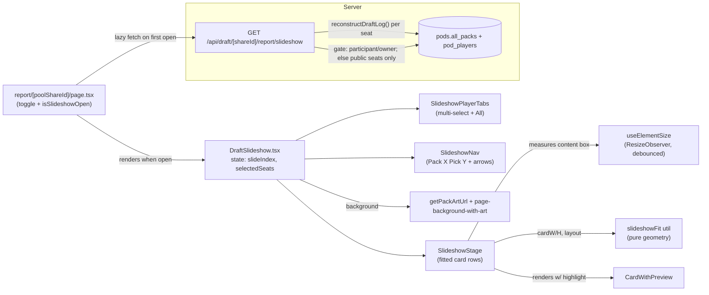

# feat: Draft Report Slideshow Mode

## Overview

Add a **Slideshow Mode** to the Draft Report: a focused, full-viewport, screenshare-friendly view for a team reviewing a completed draft together. A "Slideshow Mode" toggle on the report header launches an immersive takeover with: up to 8 player tabs across the top (avatar + name + leader + base each) plus an "All" button (multi-select); a main stage that shows the **entire pack on offer** for the selected player(s) at the current pick, sized to fill the viewport **with no scrolling**; the existing set-art + pattern background; and bottom navigation ("Pack X, Pick Y") driven by on-screen edge arrows and keyboard Left/Right.

The single hard requirement that shapes every decision: **everything fits on screen without scrolling, and cards are as large as the space allows.** The whole point is to make group review easy.

The good news from research: the data already exists. The existing report endpoint reconstructs, per pick, `visibleCards` (the full pack a player saw) plus `pickedInstanceId` (what they took) via `src/utils/draftLogReconstruction.ts`. Slideshow Mode is largely a **new presentation** of that same data, one pick at a time, fitted to the viewport — plus one genuinely new data path (all seats at once) and one genuinely new piece of UI infrastructure (fit-to-viewport sizing).

---

## Problem Frame

Today the Draft Report (`app/draft/[shareId]/report/[poolShareId]/page.tsx`) has a "Draft Log" tab that lists every pick of **one** seat as scrolling rows of `.cards-grid` (fixed 120px cards). It's fine for solo review but unusable for a team huddled around a screenshare:

- It scrolls — you lose your place and can't show "the whole pack at this pick" at a glance.
- Cards are a fixed small size — not legible across a room / over a video call.
- It only shows one seat — you can't compare what each player was passed at the same pick.
- There's no presentation affordance (no big nav, no keyboard control, no focus mode).

Slideshow Mode reframes the same reconstructed data as a **deck-of-slides** presentation: one (pack, pick) per slide, the full pack on offer fitted to fill the screen, multi-select players, and prev/next navigation by arrow key or on-screen arrow. It is a review/coaching tool, so it must surface **all seats** to people entitled to see them.

---

## Requirements Trace

- **R1.** A "Slideshow Mode" toggle on the Draft Report header opens a focused full-viewport takeover; toggling off (or Escape) returns to the report.
- **R2.** Across the top: one tab per player (up to 8), each showing the player's **avatar + name + drafted leader + drafted base**, plus an **"All"** button.
- **R3.** Player tabs are **multi-select**; "All" selects every (visible) seat. Selection persists as the user navigates picks.
- **R4.** The main stage shows the **entire pack on offer** (`visibleCards`) for the selected player(s) at the current pick, with that player's actual pick **highlighted** (the existing `.selected` rainbow border).
- **R5.** Cards are laid out in wrapping rows **sized to fill the available space with NO scrolling** at any supported viewport.
- **R6.** When exactly **one** player is selected, their cards are shown **large but capped at the card's native resolution** (so the last pick — a single card — does not fill the whole screen) and centered.
- **R7.** When **more than one** player is selected, each player gets a **labeled row** (avatar to the **left** of the name) with their pack on offer in a row; **all rows fit on screen without scrolling**.
- **R8.** The background keeps the current **set art + pattern**.
- **R9.** Bottom navigation shows **"Pack X, Pick Y"** (leader slides labeled "Leaders, Pick N") with prev/next controls.
- **R10.** **On-screen left/right edge arrows** and **keyboard Left/Right** advance to the previous/next pick. Navigation **hard-stops** at the first/last slide (arrows disabled, no wrap).
- **R11.** **Leader rounds are included** as the first slides (landscape leader cards), then Pack 1→3. *(Decided in planning — see Open Questions.)*
- **R12.** The all-seats view is **gated to draft participants and the host/owner**; non-participant (and unauthenticated) viewers see only seats marked public (`is_log_public`) plus bot seats, with other seats rendered as **locked tabs** (identity shown, cards withheld). Enforced **server-side**. *(Decided in planning; gating field, participant-sees-all divergence, bot/unauth handling detailed in Key Technical Decisions.)*
- **R13.** The feature is validated **visually with Playwright** across multiple viewports, proving no-scroll, correct sizing/cap, multi-row labels, highlight correctness, and navigation/keyboard parity.

**Success criterion:** On a 1920×1080 and a 1366×768 display, with any selection of players at any pick, the stage renders with **zero scroll/overflow** and cards as large as the constraints permit; single-player last-pick shows one centered card not exceeding native resolution.

---

## Scope Boundaries

- **Not** a redesign of the existing report tabs (Seating / Log / Pool / Deck / Notes / Gameplay) — Slideshow Mode is additive, launched from the header.
- **Not** a live-draft feature — operates only on **completed** drafts' reconstructed data (no Socket.io).
- **No** new visibility/sharing surface beyond the gating in R12 — reuse the existing participant/owner + `report_public` model.
- **No** pixel-level visual-regression snapshots — assert layout invariants (no-overflow, sizes, counts, labels) per the project's current E2E style. Snapshot testing is explicitly out.
- **No** animated card-size transitions between slides (jank risk with ~112 images) — slides swap instantly; only cheap opacity/translate transitions if any.
- **No** card-detail panel / stats overlay — detail-on-demand reuses the existing `CardWithPreview` hover/long-press preview.

### Deferred to Follow-Up Work

- **Touch-first slideshow** (swipe navigation, tap-to-enlarge optimized layout): a mobile-optimized variant is a later iteration. **In v1 the toggle is hidden below a desktop viewport threshold** — that gating *is* built in U4 and asserted in U8; only the touch-optimized experience is deferred, not the gating itself.
- **Auto-advance / "play" timer** for hands-free presentation: out of v1.
- **Shareable deep links to a specific slide** (e.g. `#slideshow/pack2/pick5`): out of v1; selection/index live in component state only.

---

## Context & Research

### Relevant Code and Patterns

| Concern | File / symbol | How it's used |
|---|---|---|
| Report page (integration point) | `app/draft/[shareId]/report/[poolShareId]/page.tsx` | Add the toggle to `.draft-report-header-actions` (lines 266–299); render the overlay; lazy-fetch all-seats data. |
| Per-pick full pack data | `src/utils/draftLogReconstruction.ts` → `reconstructDraftLog()` | Returns `DraftLogPick[]`: `{ type, packNumber (0=leader), pickInPack, overallPickNumber, visibleCards[], pickedInstanceId }`. **Reused unchanged.** |
| All-seats reconstruction precedent | `app/api/draft/[shareId]/log/route.ts` | **Primary model for U1.** Already loads `all_packs` + every player's picks, parses with `jsonParse`, calls `reconstructDraftLog` with `totalSeats: players.length` (not `max_players`), and computes per-seat `viewableSeats` gating from `pod.host_id` / participant membership / `is_log_public` / `is_bot` (lines 76–96). The new endpoint extends this exact shape to return all viewable seats at once. |
| Per-seat tab payload | `app/api/draft/[shareId]/report/[poolShareId]/route.ts` | Source of `activeLeaderName` + `chosenBase` for the player tabs (the `/log` route omits these). Single-seat only — not the all-seats model. |
| Card render + highlight | `src/components/Card.tsx`, `src/components/CardWithPreview.tsx` | Render each `visibleCard`; pass `selected={card.instanceId === pick.pickedInstanceId}`. Hover/long-press preview = detail-on-demand. |
| Card native dimensions | `src/components/Card.css` | Portrait `aspect-ratio: 2.5/3.5` (grid 120px); leaders/bases landscape `3.5/2.5` (168px). `.canvas-card:focus-visible` ring already exists (line 59). `.cards-grid` is **fixed-width** — do **not** reuse for the fitted stage. |
| Full-screen overlay precedents | `src/components/Modal.tsx` (Escape + focus-trap + scroll-lock), `src/components/DraftReviewModal.tsx` (closest analog: full-screen card review, Escape at lines 60–68), `src/components/PackDraftPhase.tsx` (shipped `isFullscreen`, `inset:0; z-index:9998`, Escape at 137–143 — but uses `overflow-y:auto`, which we intentionally drop). | Model the takeover on these; **no** `overflow` (no-scroll). |
| Set-art background | `src/utils/packArt.ts` → `getPackArtUrl(setCode)`; `report.css` `.set-art-header`; `src/styles/backgrounds.css` `.page-background-with-art` | Reuse for the immersive background, extended full-viewport behind a darkening scrim. `getPackArtUrl` can return `null` — handle. |
| Player identity payload | `app/api/draft/[shareId]/report/[poolShareId]/route.ts` `players[]` | `{ seatNumber, username, avatarUrl, isBot, activeLeaderName, chosenBase{name,imageUrl,...}, draftedLeaders }` — exactly the tab content. Avatar render pattern: ``. |
| Multi-select reference | `src/components/PackSelector.tsx` | Multi-select grid with grayscale-on-unselected — model for player tabs. |
| Toggle button convention | `src/components/Button.tsx` `variant="toggle"` `glowColor="blue"` `active={…}` | Use for "All" and (if children fit) player tabs; otherwise hand-roll a toggle matching the blue-glow active treatment (rich avatar/name/leader/base content). |

### Institutional Learnings

- `docs/superpowers/plans/2026-04-06-draft-report-phase1.md` + `…-draft-ui-fixes.md` — the report tab + per-pick "available cards with picked highlighted" pattern Slideshow reframes; a **shipped fullscreen toggle** to copy; and a **layout-shift defect** (a component returning `null` collapsed its space). Lesson: **reserve fixed heights** for the tab bar and bottom nav so the fitted stage never jumps.
- `docs/LONG_PRESS_PREVIEW.md` — existing "scale a card to fit the viewport without scrolling" math (single card). There is **no** existing "fit a wrapping grid of cards to the viewport" — that is the novel, highest-risk piece.
- `.claude/rules/ui-components.md` — `.cards-grid` flex-wrap primitive; "if clipping: check parent `overflow:hidden`, flex-shrink, fixed widths" (the exact failure modes a no-scroll fitted grid hits). Always use `Button`/`Card`/`Modal`; read `docs/STYLE_GUIDE.md` before UI work.
- `.claude/rules/architecture.md` — pure logic → `src/utils`/`src/services` with tests; components <300 lines; "Components Don't Calculate" (fit math is a pure util the component calls via a hook).
- `.claude/rules/testing.md` — **spec-first** tests (hardcode expected values from the spec, not the implementation); Node built-in runner; `tests/e2e/*.spec.ts` with `--workers=1`; **skip the 8-player E2E during iteration** (10+ min).
- `.claude/rules/mobile.md` — wrap all `:hover` CSS in `@media (hover:hover) and (pointer:fine)`; guard API arrays with `|| []`.
- `tests/e2e/helpers.ts` — `checkLayoutIssues` flags **horizontal** overflow only (`scrollWidth`/`rect.right` vs viewport width — there is no vertical check); use it for horizontal containment, and prove the **vertical** no-scroll invariant (the headline requirement) with an explicit `scrollHeight ≤ clientHeight` assertion (U8). Also `waitForCardsToLoad`, `takeScreenshot`, `mockAuth`. `tests/e2e/test-utils.ts` creates **users only** (no draft/pack seeding); `tests/e2e/competitive-bo3.spec.ts` is the SQL-seeding precedent for `pods`/pools but seeds **no** `all_packs`/`drafted_cards`; `tests/e2e/draft-with-bots.spec.ts` completes an 8-player draft **through the UI** (slow — not a SQL template). Memory `feedback_e2e_ui_only`: drive **interactions** through the UI; seeding **fixture state** via SQL is acceptable.

### Decisions Carried From This Planning Session

- **R11 — leaders included** (user choice): slides = leader rounds (`min(3, seats)`) + 3×`cardsPerPack`. Fit math must handle landscape leader cards.
- **R12 — participants/owner gating** (user choice): new all-seats endpoint enforces entitlement server-side.

---

## Key Technical Decisions

- **Add an all-seats endpoint modeled on the `/log` route; reuse `reconstructDraftLog` unchanged.** New `GET /api/draft/[shareId]/report/slideshow` is built on `app/api/draft/[shareId]/log/route.ts` (the existing all-seats reconstruction precedent), **not** the single-seat per-pool route. It loads the pod (`host_id`, `is_log_public`, `all_packs`) and all `pod_players` (with `is_log_public`, `is_bot`, and a `card_pools` join for `activeLeaderName`/`chosenBase`), parses with `jsonParse`, and **loops the actual seated players** calling `reconstructDraftLog({ targetSeat, totalSeats: players.length, allPacks, players })` per unlocked seat. `totalSeats` is the seated count (`players.length`), **never `pod.max_players`** — passing `max_players` on an under-filled draft makes `sourceIdx` index `allPacks` out of bounds and emit empty `visibleCards` for real picks. Response: `{ draft, viewerSeat, slideCount, cardsPerPack, seats: [{ seatNumber, username, avatarUrl, isBot, activeLeaderName, chosenBase, locked, picks }] }`. Rationale: no client-side fan-out, no client-side privacy filtering, no new reconstruction math.
- **Entitlement & gating — extend the `/log` route's `viewableSeats` model (R12).** Compute `isHost = session?.id === pod.host_id` and `myPlayer = players.find(p => p.user_id === session?.id)` (participant detection — the per-pool route's `isOwner = session.id === pool.user_id` is the *wrong* analogue; it checks pool ownership, not draft participation). **Unlocked seats:** if `pod.is_log_public` OR `isHost` OR `myPlayer` → **all seats** (the user's "participants & owner see all" choice). Otherwise — non-participant, or **unauthenticated** (`session === null`) — only seats where `is_log_public` is true, **plus bot seats** (bots carry no privacy interest; matches `/log`'s `viewableSeats`, which always includes `p.is_bot`). Do **not** 401 an unauthenticated viewer of a public draft. **Locked seats** return identity + `locked:true` and **omit `picks` server-side** (never sent to the client). **⚠ Intentional divergence to confirm:** `/log` restricts a non-host *participant* to own + bots + public seats; this feature deliberately lets **any participant see all seats** (team-review intent), which overrides a teammate's `is_log_public=false` for other participants. Flip the participant branch to the `/log` rule if per-seat privacy among participants must be preserved — it is a one-line change in the gate.
- **Slide indices are aligned across seats; the count is mostly structural.** Every seat's reconstructed `picks` array has identical length and identical `(packNumber, pickInPack)` at each index (the reconstructor hardcodes 3 card packs and derives `cardsPerPack` from `allPacks[0][0].cards.length`). So a single `slideIndex` selects the same logical pick for all seats, and the "Pack X, Pick Y" label can be read from any selected seat's `picks[slideIndex]`. `slideCount = min(3, players.length)` leader rounds `+ 3 × cardsPerPack`; the 3-pack term is fixed by the reconstructor, only `cardsPerPack` is data-derived. Compute `slideCount` from a reconstructed seat's `picks.length`, and **compute `cardsPerPack` in the route** from `allPacks[0]?.[0]?.cards?.length || 14` — `reconstructDraftLog` returns only `DraftLogPick[]` and does not expose `cardsPerPack`. (Holds for the standard 3-pack draft — all current sets.)
- **Two distinct layout modes, one pure fit util.** `src/utils/slideshowFit.ts` exposes a pure function (Components Don't Calculate). **Single-player:** flow-pack the one pack's cards into the R×C grid that **maximizes** card size within the box, then **cap at native resolution** and **center** when capped. **Multi-player:** one row per selected seat; size is the **smaller of** height-share (`boxH / rowCount`) and width-fit. Height-share usually binds, but width binds on short/4:3 displays once the label gutter and gaps are subtracted — the fit util must take the `min`, not assume height. Uniform card height across all rows for clean alignment; rows left-aligned with a fixed label gutter.
- **Never scroll; below the readability floor, lean on the existing preview.** No-scroll is absolute (it's the feature's purpose), so there is **no scroll fallback**. When the multi-player worst case (8 rows × 14 cards) drops below a readability floor on small/4:3 displays, cards still shrink to fit and the util returns an `overflow:true` flag (for telemetry/E2E awareness); detail-on-demand is the existing `CardWithPreview` hover/long-press. We do **not** cap simultaneous players (the user asked for up to all 8) and we do **not** introduce in-stage scrolling.
- **Native-resolution cap = the card asset's intrinsic pixels.** Cap a single card so it is never upscaled beyond the source image's natural resolution (read `img.naturalWidth/naturalHeight`, or a constant ceiling ≈ portrait 734×1024 / landscape 1024×734). This matches the user's "native resolution" wording and keeps the last-pick single card well under full-screen. (A softer ceiling — the app's 360×504 preview size — is a tunable alternative; default to the asset's native pixels.)
- **Size via a single CSS variable, not per-card inline styles.** The fit util yields one `cardW/cardH`; set `--slide-card-w` on the stage container (one style write) rather than styling 112 nodes. Measure synchronously off container dimensions (aspect is known) — do **not** wait for image `onload`, which avoids layout shift as images stream in.
- **Reserve fixed heights** for the player-tab bar and bottom nav (per the layout-shift learning); the fit util receives the **measured content box** (viewport minus those reserved chrome heights).
- **Build the overlay as a fixed full-viewport layer** (`position:fixed; inset:0`), body scroll-locked, Escape-to-exit, focus moved to the container on open and restored to the toggle on close — mirroring `Modal.tsx`/`DraftReviewModal.tsx`, minus their `overflow`. **Do not inherit Modal's full focus trap over the stage:** with up to ~112 cards, Tab-cycling every card is a keyboard trap. Make stage cards non-Tabbable (`tabIndex=-1` in the slideshow context — hover/long-press preview is the detail mechanism) and constrain the focus loop to the player tabs + nav controls; Left/Right arrows are the primary navigation. Give the overlay `role="dialog" aria-modal="true" aria-label="Slideshow Mode"` (there is no visible heading to reference) and make the "Pack X, Pick Y" label an `aria-live="polite"` region so slide changes are announced to screen readers.
- **Plain-click on a tab toggles that seat** in/out of the selection (no modifier keys — friendliest for a single presenter driving the screen); "All" is the bulk shortcut; the last selected seat **cannot** be deselected to empty (keeps the stage non-blank). Initial state on open: **All** seats, slide 0.
- **Hide the toggle below a desktop viewport threshold** (screenshare/desktop feature); wrap hover CSS in `@media (hover:hover)`.

---

## Open Questions

### Resolved During Planning

- **Who sees all seats? →** Participants, host, and public-draft (`is_log_public`) viewers, server-gated via the `/log` route's `viewableSeats` model; non-participants/unauthenticated see only `is_log_public` + bot seats; others are locked tabs with no `picks` (R12). **One flagged sub-decision:** letting *participants* see all seats is more permissive than the Draft Log's per-seat privacy — confirm, or flip the participant branch to the `/log` rule (own + bots + public). See Key Technical Decisions.
- **Include leader rounds? →** Yes — leaders then Pack 1→3 (R11).
- **Scroll fallback on dense small displays? →** None. No-scroll is absolute; cards shrink and detail comes from the existing hover/long-press preview. `overflow` flag surfaced for E2E/telemetry only.
- **Single-card max size? →** Cap at the card asset's native intrinsic resolution; center with whitespace.
- **Tab gesture / initial selection? →** Plain-click toggles; can't empty the selection; opens on **All**, slide 0.
- **Navigation at ends? →** Hard-stop; arrows disabled; no wrap.

### Deferred to Implementation

- **Exact reserved chrome heights** (tab bar / bottom nav) and the **readability-floor constant** — tune against real renders during U6; the fit util takes them as parameters so tuning doesn't change logic.
- **Whether rich player tabs fit inside `Button variant="toggle"`** or need a hand-rolled toggle styled to the blue-glow active token — decide when building U5 against the style guide.
- **Native-cap source** — `img.naturalWidth` (per-asset, exact) vs a constant ceiling (deterministic for tests). Pick during U6; the util accepts the cap as a parameter either way.
- **Neighbor-image preload depth** (pick ±1 vs ±2) — measure during U6/U8.
- **Caching / cost of N-seat reconstruction** — the endpoint runs `reconstructDraftLog` up to N times per request. Completed drafts are immutable, so a short-TTL cache keyed on `shareId` (or matching the report endpoints' rate-limit posture) is a cheap mitigation — decide during U1 if load warrants it.
- **`instanceId` uniqueness across seats** — the highlight check (`card.instanceId === pickedInstanceId`) and React keys assume `instanceId` is unique within a seat's slide; confirm no cross-seat collision in the all-seats payload affects keying (namespace keys by seat if needed).

---

## Output Structure

    src/
      utils/
        slideshowFit.ts            # NEW — pure fit-to-viewport geometry (single + multi mode)
        slideshowFit.test.js       # NEW — spec-first unit tests (worst-case bounds)
      hooks/
        useElementSize.ts          # NEW — ResizeObserver hook (debounced) feeding the fit util
      components/
        DraftSlideshow.tsx         # NEW — full-viewport overlay: state, data, keyboard, background
        DraftSlideshow.css         # NEW — overlay + stage + tabs + nav styles
        SlideshowPlayerTabs.tsx    # NEW — multi-select player tabs + "All"
        SlideshowStage.tsx         # NEW — the fitted card area (single + multi layouts)
        SlideshowNav.tsx           # NEW — bottom "Pack X, Pick Y" + prev/next + edge arrows
    app/
      api/draft/[shareId]/report/slideshow/
        route.ts                   # NEW — all-seats reconstructed picks, gated
        route.test.js              # NEW — shape + gating tests
      draft/[shareId]/report/[poolShareId]/
        page.tsx                   # MODIFY — toggle + open state + lazy fetch + render overlay
    tests/e2e/
      draft-slideshow.spec.ts      # NEW — visual validation (the R13 gate)

*(Scope declaration, not a constraint — the implementer may split/merge components if a unit exceeds the <300-line rule.)*

---

## High-Level Technical Design

> *This illustrates the intended approach and is directional guidance for review, not implementation specification. The implementing agent should treat it as context, not code to reproduce.*

### Component & data flow



### Slide model

A flat, seat-aligned index over the reconstructed picks:

```
slides:        [ Leader 1, Leader 2, Leader 3, P1·1 … P1·14, P2·1 … P2·14, P3·1 … P3·14 ]
slideIndex i → every seat's picks[i] has the same (packNumber, pickInPack)
label(i):      packNumber===0 ? "Leaders · Pick {pickInPack}" : "Pack {packNumber} · Pick {pickInPack}"
slideCount:    derived from picks.length (leaders cap at min(3,seats); cardsPerPack from data)
```

### Layout decision matrix

| Selection | Cards at this slide | Layout | Binding constraint | Cap / centering |
|---|---|---|---|---|
| 1 player | many (e.g. 14, early pick) | wrap into the R×C grid that maximizes card size | larger of width-fit / height-fit | grows until native cap; usually width-bound, no cap hit |
| 1 player | few (e.g. 1, last pick) | single centered block | **native resolution cap** | centered both axes, whitespace around — does **not** fill screen (R6) |
| N players | any | one labeled row per player, pack-in-a-row | `min(width-fit, height-share, cap)` — usually height-share (`boxH / N`), but width binds when gutter+gaps squeeze the densest row | uniform card height; shrinks to fit; below floor → `overflow:true`, detail via hover preview (R7) |
| 0 players | — | impossible (last seat can't be deselected) | — | — |

### Fit algorithm (directional pseudo-code)

```
# Single-player: maximize card size packing n cards into the box, then cap.
computeSinglePlayerFit(boxW, boxH, n, aspect, nativeCap, gap):
  best = null
  for cols in 1..n:
    rows  = ceil(n / cols)
    cardW = (boxW - (cols+1)*gap) / cols
    cardH = cardW / aspect
    if cardH*rows + (rows+1)*gap > boxH:          # too tall → bound by height
      cardH = (boxH - (rows+1)*gap) / rows
      cardW = cardH * aspect
    best = max(best, by cardW) → {cols, rows, cardW, cardH}
  if best.cardW > nativeCap.w:                     # R6 cap
    best.cardW = nativeCap.w; best.cardH = nativeCap.w / aspect
    best.centered = true
  return best                                      # stage centers the block in the box

# Multi-player: one row per seat; size is the smaller of height-share and width-fit.
computeMultiPlayerFit(boxW, boxH, perRowCounts[], aspect, nativeCap, labelGutterW, gap, minCardH):
  R        = perRowCounts.length
  maxCount = max(perRowCounts)                      # densest row drives uniform size
  availW   = boxW - labelGutterW
  hByWidth  = (availW / maxCount - gap) / aspect    # so the densest row fits horizontally
  hByHeight = (boxH - (R+1)*gap) / R                  # so all R rows + their gaps fit vertically
  cardH = min(hByWidth, hByHeight, nativeCap.h)       # take the min — either can bind
  return { cardW: cardH*aspect, cardH, overflow: cardH < minCardH }
```

Worst-case sanity (8 rows × 14 portrait, gap = 8px, label gutter ≈ 150px): on a 1920×1080 content box (~1732×842) → cardH ≈ **99px** (height-share binds; readable). On a 1024×768 4:3 box (~836×530) → cardH ≈ **57–58px** (width binds; `overflow:true`; detail via hover). Because these depend on the gap/gutter constants, U2's **hard** assertion is the no-overflow invariant — `cardH·R + (R+1)·gap ≤ boxH` and the densest row fits `availW` — with the px values as illustrative checks against the stated constants, not magic numbers.

---

## Implementation Units

> Dependency graph (U-IDs):
> ```mermaid
> graph TD
>   U1[U1 all-seats endpoint + gating] --> U4
>   U1 --> U5
>   U1 --> U6
>   U1 --> U7
>   U2[U2 fit util + spec tests] --> U3
>   U2 --> U6
>   U3[U3 useElementSize hook] --> U6
>   U4[U4 overlay shell + toggle + bg + escape] --> U5
>   U4 --> U6
>   U4 --> U7
>   U5[U5 player tabs multi-select + All] --> U8
>   U6[U6 fitted stage single/multi + cap] --> U8
>   U7[U7 bottom nav + edge arrows + keyboard] --> U8
>   U8[U8 Playwright visual validation]
> ```
> **Parallelizable:** U1 and U2 have no dependencies — start both first (ideal for two subagents). U3 follows U2; U4 follows U1's data contract. Once U4 lands, U5/U6/U7 are independent subcomponents (parallelizable), with U6 also needing U2+U3. U8 is the final gate.

---

- [ ] **U1. All-seats slideshow data endpoint (gated)**

**Goal:** Serve every seat's reconstructed picks for one draft, in one gated request, so the client never fans out fetches or filters privacy.

**Requirements:** R4, R12 (and underpins R2, R7).

**Dependencies:** None (reuses `reconstructDraftLog`).

**Files:**
- Create: `app/api/draft/[shareId]/report/slideshow/route.ts`
- Create: `app/api/draft/[shareId]/report/slideshow/route.test.js`
- Reference: `app/api/draft/[shareId]/log/route.ts` (all-seats reconstruction + `viewableSeats` gating — **the model**), `app/api/draft/[shareId]/report/[poolShareId]/route.ts` (`activeLeaderName`/`chosenBase`), `src/utils/draftLogReconstruction.ts`.

**Approach:**
- **Model on `app/api/draft/[shareId]/log/route.ts`**, not the single-seat per-pool route. Load the pod (`id, host_id, is_log_public, all_packs, set_code, status`) and all `pod_players` (`seat_number, user_id, drafted_cards, drafted_leaders, is_bot, is_log_public, username`, + `card_pools` join for `activeLeaderName`/`chosenBase`). Parse JSON with `jsonParse(..., [])`.
- **Entitlement (mirror `/log`'s `viewableSeats`):** `isHost = session?.id === pod.host_id`; `myPlayer = players.find(p => p.user_id === session?.id)`. Unlocked = `pod.is_log_public || isHost || myPlayer` → **all seats**; else → seats where `is_log_public || is_bot`. Unauthenticated (`session == null`) is just the non-participant branch — do **not** 401 a public draft. (Participant-sees-all is the chosen, more-permissive policy vs `/log`; flip the participant branch to own+bots+public if confirmed otherwise — see Key Decisions.)
- For each **unlocked** seat, call `reconstructDraftLog({ targetSeat: seat, totalSeats: players.length, allPacks, players: playerData })` and attach `picks`. `totalSeats` = `players.length` (seated count), **never `pod.max_players`**.
- **Locked** seats return identity (`seatNumber, username, avatarUrl, isBot, activeLeaderName, chosenBase`) + `locked:true` and **omit `picks`** from the payload (server-side, not client-filtered).
- Compute `cardsPerPack = allPacks[0]?.[0]?.cards?.length || 14` in the route (the reconstructor returns only `DraftLogPick[]`, not this value). `slideCount` = a reconstructed seat's `picks.length`. Return `{ draft, viewerSeat, slideCount, cardsPerPack, seats: [...] }`.
- Guard all array access (`players || []`; `all_packs` via `jsonParse` → `[]`; if empty, return seats with empty `visibleCards` rather than 500).

**Execution note:** Start with a failing API test asserting the gated shape (participant/host vs non-participant vs unauthenticated), then implement.

**Patterns to follow:** `app/api/draft/[shareId]/log/route.ts` — its `pod`/`pod_players` queries, `jsonParse` usage, `viewableSeats` gating (lines 76–96), and `reconstructDraftLog({ totalSeats: players.length })` call (lines 167–172). Pull `activeLeaderName`/`chosenBase` per the per-pool report route.

**Test scenarios:**
- Happy path: a participant requesting a fully-seated completed draft gets `seats.length === players.length`, each unlocked seat has `picks.length === slideCount`, and `picks[i]` carries `visibleCards` + `pickedInstanceId`. Covers R4.
- Slide alignment: for two different unlocked seats, `picks[i].packNumber` and `picks[i].pickInPack` are equal at every `i`.
- Gating — non-participant & unauthenticated: with a seat `is_log_public=false`, a non-participant **and** a `session==null` viewer get that seat `locked:true`, identity present, and **no `picks` key** in the payload (server-omitted, not just hidden). Covers R12.
- Gating — participant/host: the same request as a participant or the host returns that seat unlocked with `picks`.
- Gating — bot seat: a bot seat is unlocked even for a non-participant (bots are always viewable). Covers R12.
- Under-filled draft: a draft with `max_players=8` but `players.length=4` returns `seats.length===4` with **non-empty** `visibleCards` (proves `totalSeats=players.length`, not `max_players`, so `allPacks` is not indexed out of bounds).
- `cardsPerPack`/`slideCount`: returned `cardsPerPack === allPacks[0][0].cards.length`; `slideCount === min(3, players.length) + 3*cardsPerPack`.
- Leaders present: the first `min(3, players.length)` picks have `type:'leader'`, `packNumber:0`. Covers R11.
- Edge: missing/short `all_packs` → seats return `picks` with empty `visibleCards` rather than 500.
- Error path: unknown `shareId` → 404; fully-private draft viewed by a stranger → all seats locked (no picks), consistent with the `/log` route.

**Verification:** The endpoint returns all viewable seats with aligned, leader-first picks; a non-participant sees private seats locked and pickless (no `picks` key); an under-filled draft yields non-empty packs; tests pass.

---

- [ ] **U2. Fit-to-viewport sizing util (pure) + spec tests**

**Goal:** Given the content box, the per-row card counts, and card aspect, compute the card pixel size (and per-mode layout) that fills the space **without scrolling**, capping at native resolution and flagging sub-floor density.

**Requirements:** R5, R6, R7 (the load-bearing math).

**Dependencies:** None.

**Files:**
- Create: `src/utils/slideshowFit.ts`
- Create: `src/utils/slideshowFit.test.js`

**Approach:**
- Export pure functions for the two modes (single-player packing; multi-player row fitting) per the pseudo-code above. No React, no DOM, no I/O (architecture rule: services/utils are pure).
- Parameters: `boxW`, `boxH`, card `aspect` (portrait `2.5/3.5`, landscape `3.5/2.5`), `nativeCap`, `gap`, `labelGutterW`, `minCardH`. Returns `{ cardW, cardH, cols/rows (single), overflow (multi), centered }`.
- Single-player: iterate column counts, choose the max card size, then cap + mark centered. Multi-player: `min(hByWidth, hByHeight, nativeCap.h)`; set `overflow` when below `minCardH`.
- Keep under 200 lines.

**Execution note:** **Spec-first** — write the failing tests with hardcoded geometric expectations (the math is the spec, not the implementation) before writing the function.

**Technical design:** see the fit pseudo-code in High-Level Technical Design.

**Patterns to follow:** existing pure utils with co-located `.test.js` (e.g. `src/utils/cardSort.test.js`); `.claude/rules/testing.md` spec-first style.

**Test scenarios:**
- Multi worst case (readable): box `1732×842`, 8 rows × 14 portrait → `cardH` within ~2px of **99**, `overflow:false`, and `cardH*8 + gaps ≤ 842` (no vertical overflow). Covers R5/R7.
- Multi worst case (cramped): box `836×530`, 8 rows × 14 → `cardH` ≈ **58**, `overflow:true`, still no overflow. Covers R5/R7.
- Multi ragged rows: counts `[14, 1, 7]` → uniform `cardH` across rows; widest row (14) fits `availW`; 3 rows fit `boxH`.
- Single many: box `1732×842`, 14 portrait cards → packs into a grid (e.g. 7×2), `cardW` larger than the multi case, **no** native cap hit. Covers R5.
- Single one (last pick): box `1732×842`, 1 portrait card → `cardW === nativeCap.w`, `centered:true`, card area ≪ box (does not fill screen). Covers R6.
- Single landscape (leader slide): aspect `3.5/2.5`, n cards → correct landscape sizing, cap respected. Covers R11.
- Edge: `n === 0` → returns zero-size without throwing; `boxH`/`boxW` very small → never returns negative sizes (clamp at 0).
- Ultrawide: box `3440×842`, 1 card → still capped at native, centered (doesn't balloon). Covers R6.

**Verification:** All spec assertions pass; no input produces overflow or negative dimensions; the documented worst-case bounds hold.

---

- [ ] **U3. `useElementSize` hook (ResizeObserver, debounced)**

**Goal:** Measure the stage's content box and re-emit on resize so the stage can re-fit, without per-frame thrash.

**Requirements:** R5 (re-fit on viewport/resolution change).

**Dependencies:** U2 (the hook feeds the util; pairs with it).

**Files:**
- Create: `src/hooks/useElementSize.ts`
- (Optional) Create: `src/hooks/useElementSize.test.js` — light contract test; resize behavior is primarily proven in U8.

**Approach:**
- Return a `ref` + `{ width, height }`; observe via `ResizeObserver`; debounce updates ~100–150ms; clean up on unmount. Measure container dimensions only (not images).
- No shared hotkey/size hook exists today — this is net-new infrastructure (keep it generic and reusable).

**Patterns to follow:** inline `getBoundingClientRect`/`window` measurement in `src/components/DeckBuilder/CardPreview.tsx`, `src/components/CardWithPreview.tsx` (generalize into the hook); `src/hooks/common/useIsMobile.ts` for hook shape.

**Test scenarios:**
- Edge: returns `{0,0}` before first measure; never throws if `ResizeObserver` is undefined (SSR/jsdom guard).
- Integration (covered in U8): resizing the viewport re-emits new dimensions and the stage re-fits with no overflow.

**Verification:** Resizing the window while slideshow is open re-fits the stage (proven by U8's resize assertion); listeners are removed on unmount.

---

- [ ] **U4. Slideshow overlay shell — toggle, takeover, background, exit**

**Goal:** A full-viewport takeover launched from the report header, with the set-art + pattern background, body scroll-lock, Escape/toggle-to-exit, focus management, and the slideshow's own state (`slideIndex`, `selectedSeats`). Lazy-fetches U1 data on first open.

**Requirements:** R1, R3, R8, + the desktop-threshold toggle gating (and hosts R2/R4–R10).

**Dependencies:** U1 (data contract).

**Files:**
- Create: `src/components/DraftSlideshow.tsx`
- Create: `src/components/DraftSlideshow.css`
- Modify: `app/draft/[shareId]/report/[poolShareId]/page.tsx` (add a "Slideshow Mode" `Button` to `.draft-report-header-actions`; `isSlideshowOpen` state; lazy fetch; render `<DraftSlideshow>` when open; hide toggle below the desktop viewport threshold).

**Approach:**
- `position:fixed; inset:0; z-index` above the report; **no** `overflow` (no-scroll). Background = `getPackArtUrl(setCode)` full-viewport behind a darkening scrim + `page-background-with-art` pattern; handle `null` art.
- Body scroll-lock + focus-to-container on open, restore focus to the toggle on close — mirror `Modal.tsx`. **Constrain the focus loop to the player tabs + nav controls; stage cards are `tabIndex=-1`** (no 112-card Tab trap — hover/long-press preview is the detail path). Give the overlay `role="dialog" aria-modal="true" aria-label="Slideshow Mode"`. Escape exits (mirror `DraftReviewModal.tsx` lines 60–68); toggling the header button also exits.
- Hold state: `slideIndex` (clamped to `[0, slideCount-1]`), `selectedSeats` (Set; default = all unlocked seats), derived `layoutMode = selectedSeats.size===1 ? 'single' : 'multi'`. Reserve fixed heights for the tab bar and bottom nav (children U5/U7) so the stage area is stable.
- Lazy-fetch U1 on first open. **Loading:** centered spinner / "Loading draft data…" in the stage (tabs + nav hidden/disabled), set-art background kept. **Error:** inline message in the stage with a **Close** button that exits the overlay (never crashes the report). Guard arrays (`seats || []`).

**Execution note:** Build against U1's response contract; the data fetch can be stubbed until U1 lands.

**Patterns to follow:** `Modal.tsx` (scroll-lock + focus trap/restore), `PackDraftPhase.tsx` fullscreen (`inset:0; z-index`) **minus** `overflow-y:auto`; header actions row in `page.tsx` (266–299) for the toggle; `getPackArtUrl` + `.set-art-header` recipe.

**Test scenarios:**
- Happy path (E2E in U8): clicking the toggle opens the takeover with background visible; Escape and re-clicking the toggle both close it and restore the report.
- Edge: viewport below the desktop threshold → toggle is not rendered (R-deferred mobile).
- Edge: `getPackArtUrl` returns `null` → overlay still renders with the pattern background, no broken image.
- State: `slideIndex` clamps if data is shorter than a persisted index; `selectedSeats` defaults to all unlocked seats.
- Focus: on open, focus lands on the overlay container and Tab cycles only tabs + nav (stage cards not Tab-focusable); on close, focus returns to the toggle.
- Loading/error: while U1 is in flight the stage shows the loading state; an injected fetch failure shows the error state with a working Close button (report intact).
- Integration: body regains scroll and focus returns to the toggle on close.

**Verification:** The overlay opens/closes cleanly from the toggle and Escape, locks/restores scroll and focus, shows the set-art background, and holds slideshow state.

---

- [ ] **U5. Player tabs — multi-select + "All"**

**Goal:** The top row of up-to-8 player tabs (avatar + name + leader + base) plus an "All" button, multi-select, with locked seats shown but unselectable-to-empty.

**Requirements:** R2, R3, R12 (locked tabs).

**Dependencies:** U4 (hosted in the overlay), U1 (seat identity + `locked`).

**Files:**
- Create: `src/components/SlideshowPlayerTabs.tsx`
- Modify: `src/components/DraftSlideshow.css` (tab styles).

**Approach:**
- Render one tab per seat: avatar (left) + name + leader name + base name/aspect; "All" button selects every unlocked seat. Use `Button variant="toggle" glowColor="blue" active` if the rich content fits its `children`; otherwise hand-roll a toggle matching the blue-glow active token (document which, per style guide).
- Plain-click toggles a seat in/out of `selectedSeats`; prevent deselecting the **last** selected seat. **"All" is `active` only when every unlocked seat is selected** (not active on a partial selection). **Locked seats** (R12) render with `Button variant="warning"` + a lock icon + reduced-opacity leader/base thumbnails, `aria-label="Private seat — {username}"` and `aria-disabled` — identity visible, not selectable, excluded from "All". Avatar fallback `/icons/discord-logo.png`; bots use their synthesized name/avatar.
- Reserve a fixed bar height (layout-shift discipline).

**Patterns to follow:** `PackSelector.tsx` (multi-select + grayscale-unselected), report index avatar pattern (``), `PlayerCircle.tsx` for leader/base display, `Button` toggle convention. Memory `feedback_use_button_component_for_toggles` and `feedback_button_icon_spacing` (gap between avatar and text). Wrap hover CSS in `@media (hover:hover)`.

**Test scenarios:**
- Happy path: 8 tabs render with avatar + name + leader + base; "All" selects all; clicking a single tab narrows to that seat (→ single-player layout). Covers R2/R3.
- Multi-select: clicking two tabs selects both; clicking a selected tab deselects it.
- Guard: attempting to deselect the last selected seat is a no-op (stage never blanks).
- Privacy: a locked seat renders identity but is not selectable and is excluded from "All"'s active set. Covers R12.
- "All" state: with a partial selection (e.g. 3 of 8), the "All" toggle is **not** active; selecting every seat makes it active.
- Locked visual: a locked seat carries the warning/lock treatment and `aria-disabled` (also asserted in U8).
- Edge: bot seat shows its synthesized name/avatar; missing `avatarUrl` falls back to the Discord logo.

**Verification:** Tabs reflect selection state, "All" works, locked seats can't leak into selection, and the bar height is fixed.

---

- [ ] **U6. Slideshow stage — fitted card rows (single + multi), highlight, cap**

**Goal:** The main stage that fills the content box with the selected players' packs-on-offer at the current slide — single-player wrapped/centered (native cap), multi-player one labeled row per player — all without scrolling, with the picked card highlighted.

**Requirements:** R4, R5, R6, R7.

**Dependencies:** U4 (host + state), U2 (fit util), U3 (measure), U1 (card data).

**Files:**
- Create: `src/components/SlideshowStage.tsx`
- Modify: `src/components/DraftSlideshow.css` (stage + row-label styles).

**Approach:**
- Measure the content box with `useElementSize` (U3); call `slideshowFit` (U2) with the selected seats' `visibleCards` counts at `slideIndex` and the slide's card aspect (landscape for leader slides). Apply the result via a single `--slide-card-w` CSS variable on the stage container (one write, not 112). **The stage must NOT be a descendant of `.cards-grid` and must override `Card.css`'s base `.canvas-card { width:120px; max-width:120px }`** (drive width from `--slide-card-w` via a scoped selector / `!important`) — otherwise the fixed 120px silently clamps the fitted size.
- **Single-player:** flow `visibleCards` into the computed R×C grid; when capped/few, center the block both axes. **Multi-player:** one row per seat — avatar (left) + name label in a fixed gutter, then the seat's pack in a row at the uniform card height; left-align rows. For an empty `visibleCards`, render a **centered card-back (or neutral "No cards" tile) sized to the row's `cardH`** so the row keeps its height — never drop a selected seat's row (dropping shifts the others).
- Render each card via `CardWithPreview` with `selected={card.instanceId === pick.pickedInstanceId}` (reuse `.selected` rainbow border); no highlight when `pickedInstanceId` is null. Key by `instanceId` (namespace by `seatNumber` in multi-player mode in case an `instanceId` recurs across seats); memoize rows.
- Preload neighbor slides' images (pick ±1) for instant nav. Do **not** apply `overflow`; the fit guarantees containment.

**Execution note:** Prototype the 8×14 case at 1024×768 **early** — if the floor can't hold, that's a known accepted outcome (cards shrink + hover preview), but verify the no-overflow invariant holds regardless.

**Technical design:** layout decision matrix + fit pseudo-code above.

**Patterns to follow:** `DraftReviewModal.tsx` (`object-fit: contain`, full-screen card review) for stage structure; `page.tsx` Draft Log (`selected={card.instanceId === pick.pickedInstanceId}`) for highlight; `Card.css` aspect ratios. **Do not** reuse `.cards-grid` fixed widths.

**Test scenarios:**
- Single many (happy): one player, early pick → cards wrap to fill, larger than multi mode, no overflow. Covers R5.
- Single one (R6): one player, last pick → a single centered card not exceeding native cap; measured card box ≪ viewport; centered.
- Multi labeled rows (R7): ≥2 players → each row has avatar+name to the left and that seat's pack in a row; `rowCount === selected count`; no scroll.
- Highlight (R4): exactly one card per row has `.selected` matching that seat's `pickedInstanceId`; zero highlighted when `pickedInstanceId` is null (seeded case).
- Empty pick: a seat with empty `visibleCards` shows a card-back/neutral tile sized to the row's `cardH`; the row keeps its height and is not dropped (other rows don't shift).
- Sizing not clamped: a rendered stage `.canvas-card` measures the `--slide-card-w` width, **not** the stock 120px (proves the `.cards-grid`/base-width override works).
- Leader slide: landscape leader cards sized correctly, no overflow. Covers R11.
- Integration: switching selection (single↔multi) re-fits instantly; navigating re-fits as counts change.

**Verification:** At every selection/slide/viewport tested, the stage fills the box with no scroll, single-player respects the native cap and centers, multi-player labels rows correctly, and the highlight matches the data.

---

- [ ] **U7. Bottom navigation — "Pack X, Pick Y", prev/next, edge arrows, keyboard**

**Goal:** The bottom slide label and the prev/next controls — on-screen edge arrows and keyboard Left/Right in parity — with hard-stop disabled states at the ends.

**Requirements:** R9, R10.

**Dependencies:** U4 (host + `slideIndex` setter + `slideCount`).

**Files:**
- Create: `src/components/SlideshowNav.tsx`
- Modify: `src/components/DraftSlideshow.css` (bottom bar + large edge-arrow styles).

**Approach:**
- Bottom-center label from the current slide's pick: `packNumber===0 ? "Leaders · Pick {pickInPack}" : "Pack {packNumber} · Pick {pickInPack}"` (read from any selected seat — they're aligned).
- Large clickable arrows pinned to the left/right screen edges + a `window` `keydown` listener for `ArrowLeft`/`ArrowRight` → the **same** `slideIndex` setter (single source of truth for parity). `preventDefault` on arrows; bail if focus is in an input (defensive). Escape is handled by U4.
- Hard-stop: at index 0 prev is disabled (`aria-disabled`); at `slideCount-1` next is disabled. Reserve a fixed bar height.

**Patterns to follow:** `DraftReviewModal.tsx`/`PackDraftPhase.tsx` `window.addEventListener('keydown', …)` + cleanup; `Button` for the nav controls; icon+text gap rule. (No existing Arrow-key nav in the codebase — this is the first; own focus management deliberately.)

**Test scenarios:**
- Happy path (R9/R10): clicking the right edge arrow advances the label "Pack 1 · Pick 1" → "Pack 1 · Pick 2"; left arrow goes back.
- Keyboard parity (R10): `ArrowRight`/`ArrowLeft` from a fresh open produce the same label changes as the on-screen arrows.
- Boundaries (R10): at slide 0, prev arrow and `ArrowLeft` are no-ops and prev is `aria-disabled`; at the last slide, next is disabled. No wrap.
- Leaders label: on leader slides the label reads "Leaders · Pick N", not "Pack 0". Covers R11.
- Edge: keydown ignored when a text input is focused (defensive; none exist in the overlay but the guard holds).
- Cleanup: the keydown listener is removed when the overlay closes.

**Verification:** On-screen and keyboard navigation advance/retreat the same single slide index, the label is correct (including leaders), and ends hard-stop with disabled arrows.

---

- [ ] **U8. Playwright visual validation + mobile gating**

**Goal:** Prove — through the UI, across viewports — that the feature meets the visual requirements, especially no-scroll and sizing.

**Requirements:** R13 (validates R1–R12).

**Dependencies:** U1–U7.

**Files:**
- Create: `tests/e2e/draft-slideshow.spec.ts`
- Reference: `tests/e2e/helpers.ts` (`checkLayoutIssues` — horizontal only, `waitForCardsToLoad`, `takeScreenshot`), `tests/e2e/test-utils.ts` (user seeding), `tests/e2e/competitive-bo3.spec.ts` (SQL `pods`/pool seeding precedent — **no** pack/pick data), `tests/e2e/draft-with-bots.spec.ts` (UI-driven completed draft — **not** a SQL template).

**Approach:**
- **Seed** a completed multi-seat draft directly in Postgres. This needs a **new fixture generator** — no existing helper seeds pack/pick data (`test-utils.ts` makes users only; `competitive-bo3.spec.ts` seeds `pods`/pools but no `all_packs`/`drafted_cards`). Build internally-consistent `all_packs` + per-seat `drafted_cards`/`drafted_leaders` so `reconstructDraftLog` yields deterministic `visibleCards` and a **known `pickedInstanceId`** for the highlight assertion. Include ≥2 seats with `is_log_public=true` and ≥1 with `false` (privacy assertion), and a seeded null-pick case. **Drive every interaction through the UI** (open report → Slideshow toggle → tabs → arrows) per `feedback_e2e_ui_only`; never call the API. Run `--workers=1`; do not use the 10-min full 8-player UI path.
- Assert at **1920×1080**, **1366×768**, and **1024×768** (the cramped 4:3 case). Use generous headless timeouts; assert a stable root container before counting cards.

**Test scenarios (each maps to a requirement):**
- **No-scroll (R5, headline):** with "All" at pick 1, assert the overlay root and `document.scrollingElement` satisfy `scrollHeight ≤ clientHeight` **and** `scrollWidth ≤ clientWidth` — the explicit `scrollHeight` check is the **vertical** gate (`checkLayoutIssues` only covers horizontal) — at all three viewports.
- **Open/close (R1):** toggle opens the overlay; Escape and re-clicking the toggle close it and restore the report; body scroll restored.
- **Tabs (R2/R3):** 8 tabs render with avatar+name+leader+base; selecting one → single-player layout; selecting two → two rows; "All" → all rows.
- **Single cap + centering (R6):** one player, last pick (1 card) → the card's width ≤ native cap and its box center ≈ content-box center (does not fill the screen).
- **Multi labels (R7):** ≥2 players → each row has an avatar img + name to the left; `rowCount === selected count`; no overflow.
- **Highlight (R4):** exactly one `.selected` card per row whose `instanceId` matches that seat's `pickedInstanceId`; a seeded null-pick case shows zero highlighted.
- **Navigation + parity (R9/R10):** on-screen arrow advances the "Pack X · Pick Y" label; keyboard `ArrowRight` does the same; at index 0 prev is disabled, at the end next is disabled.
- **Leaders (R11):** the first slides read "Leaders · Pick N" with landscape cards.
- **Privacy (R12):** as a non-participant with a private seat, that seat's tab is locked (warning/lock treatment + `aria-disabled`) and its cards are **absent from the DOM** (proves the server omitted `picks` — no client-side leak).
- **Resize stability (R5):** after `setViewportSize` to a smaller box, re-assert the no-overflow invariant (proves the ResizeObserver re-fit fired).
- **Mobile gating:** below the desktop threshold the Slideshow toggle is not present.

**Verification:** `npm run test:e2e:chromium -- --grep "slideshow"` passes all assertions across the three viewports; no overflow anywhere; screenshots captured for the record.

---

## System-Wide Impact

- **Interaction graph:** New endpoint reuses `reconstructDraftLog` (no change to draft/pick logic). New `window` keydown listener exists **only while the overlay is mounted** (added/removed on open/close) — it must not leak or fire under the report. Body scroll-lock must always restore.
- **Error propagation:** All-seats fetch failures surface as an in-overlay error state (don't crash the report). Missing/short `all_packs` degrade to empty `visibleCards` (reconstructor already handles this) rather than 500.
- **State lifecycle risks:** `slideIndex` must clamp to `[0, slideCount-1]`; `selectedSeats` must never empty (last seat undeselectable) and must exclude locked seats; focus must return to the toggle on close.
- **API surface parity:** The new endpoint is **read-only** and additive; it does not alter the per-pool report or `/log` routes. It reuses the `/log` route's `is_log_public`/host/participant entitlement shape (with the participant-sees-all divergence noted in Key Decisions) — keep them consistent. **Cost:** it runs `reconstructDraftLog` up to N times per request; completed drafts are immutable, so cache per `shareId` (short TTL) or match the report endpoints' rate-limit posture if load warrants (deferred — see Open Questions).
- **Integration coverage:** Cross-layer behaviors mocks won't prove (overlay open → fetch → fit → render → navigate → resize → privacy filtering) are covered by U8 E2E.
- **Unchanged invariants:** The Draft Report's existing tabs, data shape, and per-pool route are untouched; `reconstructDraftLog`, `Card`, `CardWithPreview`, `Modal` are reused as-is. `.cards-grid` is deliberately **not** reused for the stage (its fixed widths are incompatible with fit-to-viewport) — existing usages elsewhere are unaffected.

---

## Risks & Dependencies

| Risk | Mitigation |
|---|---|
| **No-scroll fails on small/4:3 displays** (8×14 worst case) | Fit util is height-aware and unit-tested at `1024×768`; `overflow` flag surfaced; detail via existing hover/long-press preview; U8 asserts no-overflow at three viewports. No-scroll is never traded for scroll. |
| **Layout shift / re-fit jank** on nav, resize, or image streaming | Reserve fixed chrome heights; size from container metrics synchronously (not image `onload`); drive size via one CSS var; debounced ResizeObserver; preload neighbor images; no size-tween animation. |
| **Privacy leak** via "All" exposing private seats | Gate **server-side** in U1 (locked seats carry no `picks`); U8 asserts private-seat cards are absent from the DOM for non-participants. Never filter privacy in the browser. |
| **Image volume** (up to ~112 images, full swap per slide) | Stable `instanceId` keys + memoized rows; preload only pick ±1; rely on browser/CDN cache; instant (non-animated) swaps. |
| **Card sizing silently clamped** by `Card.css`'s fixed 120px | U6 scopes the stage outside `.cards-grid` and overrides the base `.canvas-card` width with `--slide-card-w`; U8 asserts a rendered stage card's width ≠ 120px. |
| **Participant-sees-all over-exposes private seats** | Server-side gate models `/log`'s `viewableSeats`; the participant→all-seats branch is flagged as an intentional, one-line-reversible divergence to confirm with the team (see Key Decisions / Open Questions). |
| **Rich tabs don't fit `Button variant="toggle"`** | Decide in U5 against the style guide; hand-roll a toggle matching the blue-glow active token if needed (allowed for complex content). |
| **"native resolution" ambiguity** for the single-card cap | Cap parameterized in U2; default to the asset's intrinsic pixels (`naturalWidth`), with a constant ceiling fallback for deterministic tests. |
| **Slow 8-player E2E** | Seed completed-draft fixtures via SQL; drive interactions via UI; `--workers=1`; don't depend on the 10-min full-draft path. |

---

## Phased Delivery

Designed for **worktree + subagent** execution (per the request). Run on an isolated git worktree; parallelize independent units across subagents; Playwright is the final gate.

- **Phase 1 — Foundations (parallel):** **U1** (endpoint) and **U2** (fit util) have no dependencies — assign to two subagents simultaneously. **U3** (hook) follows U2.
- **Phase 2 — Overlay + subcomponents:** **U4** (shell) against U1's contract, then **U5 / U6 / U7** as parallel subcomponents (U6 also needs U2+U3). Reserve chrome heights from the start.
- **Phase 3 — Validation:** **U8** Playwright across three viewports; iterate on the readability floor / reserved heights / cap constant (all parameters, no logic change).

Each unit lands as an atomic commit; **do not push** without explicit direction (production deploys on push).

---

## Documentation / Operational Notes

- Read `docs/STYLE_GUIDE.md` + `.claude/rules/ui-components.md` before writing any UI (project mandate).
- Add a **Slideshow Mode** line to `RELEASE_NOTES.md` (root only; the `public/` copy is generated) when the feature ships.
- No migrations, no env vars, no new dependencies. The new endpoint is read-only.
- After it lands, capture a `/ce-compound`-style learning for the **fit-to-viewport** approach — there's no prior art for multi-card fit-to-fill in this repo, so this becomes the reference.

---

## Sources & References

- Integration page: `app/draft/[shareId]/report/[poolShareId]/page.tsx`
- Data reconstruction: `src/utils/draftLogReconstruction.ts`; existing endpoint `app/api/draft/[shareId]/report/[poolShareId]/route.ts`
- Card render + dims: `src/components/Card.tsx`, `src/components/CardWithPreview.tsx`, `src/components/Card.css`
- Overlay precedents: `src/components/Modal.tsx`, `src/components/DraftReviewModal.tsx`, `src/components/PackDraftPhase.tsx`
- Background: `src/utils/packArt.ts`, `app/draft/[shareId]/report/report.css`, `src/styles/backgrounds.css`
- Multi-select / toggle: `src/components/PackSelector.tsx`, `src/components/Button.tsx`, `src/components/PlayerCircle.tsx`
- E2E: `tests/e2e/helpers.ts`, `tests/e2e/test-utils.ts`, `tests/e2e/draft-with-bots.spec.ts`
- Rules: `.claude/rules/architecture.md`, `.claude/rules/ui-components.md`, `.claude/rules/testing.md`, `.claude/rules/mobile.md`
- Prior learnings: `docs/superpowers/plans/2026-04-06-draft-report-phase1.md`, `docs/superpowers/plans/2026-04-06-draft-ui-fixes.md`, `docs/LONG_PRESS_PREVIEW.md`
