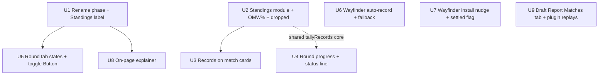

# feat: Swiss Practice play-page legibility

## Overview

The post-draft matchmaking for competitive pods already runs a full Swiss experience (3 rounds, BO3, mutual/Wayfinder result confirmation, pod-owner controls, record-based standings) via `src/components/MatchmakingPanel.tsx` on the deck play page. It **works** but it doesn't **read** as Swiss: the section is labeled "COMPETITIVE PRACTICE," match cards never show player records, standings sit on a "Results" tab that implies finality, there's no round-progress indicator, and the "how it works" explainer lives back on the draft page.

This is a **presentation/UX pass** that renames the phase to **"Swiss Practice"** (canonical label; "Practice" is acceptable informal shorthand in body copy where context is clear) and makes its structure legible on the play page. It is not a new format, not a new audience, and not new pairing logic. Nearly all required data is already on the socket payload; the work is client-side derivation and rendering, plus the minimal infrastructure touches noted in Scope Boundaries.

A related Draft Report slice now completes the existing gameplay placeholder as a **Matches** tab, using the same plugin-captured result/replay data already stored by the app.

> **Plan deepened 2026-06-18** after a multi-persona document review whose findings were verified against source. The review corrected a fabricated `pluginLoggedIn`/`wflogin` hook API (the Wayfinder model is now two-state), caught a UI-driven E2E that pins the tab `data-testid`, and tightened the OMW%/standings derivation. See the Key Technical Decisions and per-unit notes.

> **Implementation note 2026-06-19:** U1-U9 are implemented in the `worktree-swiss-practice-play-page` worktree. Verification: focused `tsx --test` suite for standings/status/Wayfinder/report normalization, `tsc --noEmit`, targeted ESLint invocation (no matching TS/TSX config signal), and mocked browser visual checks for the Draft Report Matches tab on desktop/mobile.

---

## Problem Frame

Competitive-pod players can't tell that the post-draft phase is a Swiss event, can't see who they're paired against or why (records), can't watch their live standing, and aren't told that the Wayfinder Companion can record their results automatically. The fix is to surface structure that already exists in the data — without touching the draft enforcement or the pairing engine. (See origin: `docs/brainstorms/2026-06-17-practice-swiss-play-page-requirements.md`.)

---

## Requirements Trace

Carried from the origin requirements doc (R1–R11), with R12 added during plan editing:

- **R1.** Rename the matchmaking section to **"Swiss Practice"** everywhere the post-draft phase surfaces (panel header, the "Matches" copy in `CompetitivePracticeRules.tsx`). The enforced-draft mode keeps **"Competitive Practice"**.
- **R2.** Provide an on-page **"How it works"** explainer reachable from the panel (3 rounds, BO3, paired by record, no rematches, byes, ranking/tiebreak).
- **R3.** Each player on a match card shows their **W-L(-D) record going into the round**.
- **R4.** Panel shows **round progress**: "Round N of 3" + a per-round "X of Y matches confirmed" count.
- **R5.** Round tabs visually distinguish **current / completed / not-yet-started**.
- **R6.** A persistent **status line** tells the player what's happening and what to do across phases.
- **R7.** Standings are visible **live throughout** the rounds (not only after round 3). Rename the "Results" tab label to **"Standings."**
- **R8.** Standings show rank, player, W-L(-D), and the **OMW% tiebreaker**, with the current user's row emphasized. Continue to **not** declare a winner (no trophy).
- **R9.** When the Companion is **detected**, signal that matches **auto-record & auto-confirm**; the manual report affordance demotes so players don't think they must report by hand.
- **R10.** When the Companion is **not detected**, surface a **contextual install nudge** using `WayfinderStoreButtons`, distinct from the generic PlayInstructions pitch.
- **R11.** Manual mutual confirmation (and pod-owner override) **remains the fallback**; Wayfinder is the happy path, not a gate.
- **R12.** Draft Reports add a **"Matches"** tab that lists the report player's plugin-captured matches with replay links, so draft review includes the games played after the draft.

**Origin actors:** A1 Player, A2 Pod owner (host), A3 Wayfinder Companion.
**Origin flows:** F1 play+record with Wayfinder, F2 play+record without Wayfinder, F3 track standing/progress.
**Origin acceptance examples:** AE1 (R9, R11), AE2 (R10, R11), AE3 (R3), AE4 (R7, R8), AE5 (R4).

---

## Scope Boundaries

- No elimination bracket / top cut — structure stays Swiss.
- No change to **who** runs Swiss Practice — competitive pods only; not opening it to casual/regular draft pods.
- No change to draft-phase enforcement (Appendix C timers, deck-build timer, 8 players, 3 rounds) — post-draft presentation only.
- No "winner" declaration or trophy iconography — standings rank without crowning. (The previously-considered "subtle gold accent on rank #1" is **dropped** — see Key Technical Decisions.)
- No new pairing algorithm, round count, or BO format changes.
- No new DB tables and no new API routes.
- **Three minimal infrastructure exceptions, consciously permitted by this review** (not "new features," just exposing/returning values that already exist):
  1. Expose the existing `pod_players.dropped` column on the broadcast `players` payload so dropped players can be labeled in standings (decided this review; see U2).
  2. Return a `settled: boolean` from `useWayfinderDetection` so the install nudge doesn't flash before detection resolves (see U7). This is our own hook, not an external contract.
  3. Return a `matches` array from the existing Draft Report detail endpoint so the report can show plugin-captured matches/replays (see U9). This reads existing storage; it is not a new plugin contract.
- No "tournament" language in UI, copy, or new code. The internal "CPM" acronym must not appear in **UI strings**; it may remain in internal docs/specs.
- The enforced-draft mode's name ("Competitive Practice"), the `CompetitivePracticeRules` component name, and the draft-page rules modal title are **unchanged**.
- Do **not** change the `matchWinner` (`'player1'|'player2'|'draw'`) data contract that the ingestion endpoint and the bo3 E2E depend on.
- Draft Report Matches tab work is included as a separate report-surface slice: it reads **existing plugin-captured rows** (`practice_matches` for competitive pods, `casual_matches` for non-competitive pool play) through the current report detail endpoint. It does **not** require a Wayfinder repo change, a new plugin payload, a new route, or a new table in this plan.

---

## Context & Research

### Relevant Code and Patterns

- `src/components/MatchmakingPanel.tsx` — receives all data via props; local `computeStandings()` sorts wins→losses→draws with **no OMW%**; header literally renders `COMPETITIVE PRACTICE`; tabs are **hand-rolled** `<button className="matchmaking-tab">` plus a literal `Results` tab (`key: 'results'`); `totalRounds = Math.max(rounds.length, 3)`; `data-testid` per tab is derived from `tab.key` (`matchmaking-tab-${key}`); standings rows already carry `data-rank/-wins/-losses/-draws/-player-id` + `data-testid="standing-row-N"`; `const [activeTab, setActiveTab] = useState(defaultTab)` is initialized **once** (does not re-sync on round advance — see U5).
- `src/components/MatchCard.tsx` — renders names, `GameDot` pips, status text, Wayfinder match link, Report/Edit/Boot actions. **No record display**; needs a new prop. `getMatchStatus` already distinguishes submitted/awaiting states at card level.
- `src/components/CompetitivePracticeRules.tsx` — already uses "Swiss-style"/"Swiss pairings" vocabulary; has a **"Matches"** section; rendered in a Modal on `app/draft/[shareId]/page.tsx` and inline in `src/components/DraftLobby.tsx` — **not** on the play page.
- `app/pool/[shareId]/deck/play/page.tsx` — renders `MatchmakingPanel` under `isCompetitive && user`; maps the socket payload into `competitiveRounds`/`competitiveCurrentRound`/`matchmakingStatus`; already calls `useWayfinderDetection()` (`wayfinderDetected` in scope); wires `ResultReportModal`. The panel is currently passed **no** Wayfinder or record props — those are net-new prop plumbing (panel + card prop interfaces + the page passing them).
- `src/hooks/useWayfinderDetection.ts` — **returns exactly `{ detected: boolean; iconUrl: string | null }`** (verified). There is **no** `pluginLoggedIn` and **no** `wflogin` override anywhere in the repo (grep: 0 matches). A 1500ms `setTimeout` self-heal runs internally on injectable pages (the play page is injectable) and can flip `detected` true→false, but **no `settled`/timestamp is currently returned** — U7 adds one. `detected` starts `false`, so for ~1.5s an installed-but-not-yet-detected user is indistinguishable from a never-installed one. QA override that **does** exist: `?wayfinder=1/0`.
- `src/components/WayfinderStoreButtons.tsx` — props `{ orientation, onChromeClick }`; also exports `WayfinderCompanionLockup`. The store-button composition lives in `renderCompanionInstallPanel()` in `src/components/PlayInstructions.tsx` (reference only — see U7; we reuse the buttons, not the full promo block).
- Beta gating — the canonical helper is `hasBetaAccess(user)` (`src/types/user.ts:115` → `isBetaTester || isAdmin`), used across the app (`SetSelection.tsx`, `SubscribePodBanner.tsx`, `setAvailability.ts`). **Do not** gate this feature on `isCompanionBeta()` (`src/utils/companionBeta.ts`) — that is intentionally admin-only and specific to a sensitive surface. (User decision this review.)
- `src/services/matchmaking/results.ts` — exports `rankPlayers(players: PlayerForRank[], matches: MatchForCalc[], allPlayerIds?)` → `RankedPlayer[]` sorted wins→OMW%; `calculateOMW(...)` floors opponent rate at `0.33` (`MIN_RATE`) and excludes byes. **Important shapes (verified):** `RankedPlayer` is `{ id, rank, matchWins, matchLosses, omwPercent }` — it has **no `draws` and no `username`**. `MatchForCalc.matchWinner` is a **player id** (`m.matchWinner === opponentId`), not `'player1'|'player2'`. These functions are currently **only referenced by tests** (first UI caller).
- `src/lib/socketBroadcast.ts` — broadcasts `rounds`/`matches`/`currentRound`/`matchmakingStatus`/`deckBuildDeadline`; matches carry `matchWinner: 'player1'|'player2'|'draw'|null`, `isBye`, `finalConfirmed`, `wayfinderMatchId`; player ids are `users.id` (same space as `currentUserId`). It sends **no per-player records and no OMW** (so client-side derivation is necessary) and the `players` query selects **no `dropped`** column (so U2 adds it).
- Booted/dropped players — `boot/[userId]/route.ts` sets `pod_players.dropped = true` but **keeps the row**; the broadcast `players` query has no `dropped` filter, so dropped players remain in the payload with frozen records. Their pre-drop confirmed results still feed opponents' OMW (correct Swiss behavior).
- `app/draft/[shareId]/report/[poolShareId]/page.tsx` — Draft Report already has tabs (`seating/log/pool/deck/gameplay/notes`) and a placeholder **"Gameplay — Coming Soon"** panel. U9 replaces this placeholder with a real **"Matches"** tab. The report detail endpoint already enforces owner/public visibility before returning report data, so match rows should be added behind that same gate.
- `app/api/draft/[shareId]/report/[poolShareId]/route.ts` — currently returns draft/player/pick/pool data but no matches. U9 extends this existing response with a normalized `matches` array instead of adding a new API route.
- `app/api/plugin/v1/match/result/route.ts` — existing Wayfinder Companion ingestion. Competitive draft pods update `practice_matches` with `game1/2/3_result`, `match_winner`, `wayfinder_match_id`, `wayfinder_replay_url`, and player/opponent deck identities; non-competitive pools update `card_pools` and upsert `casual_matches`.
- `migrations/055_create_practice_matches.sql`, `060_add_wayfinder_replay_url.sql`, `070_add_match_deck_identity.sql`, `071_create_casual_matches.sql` — current plugin-backed storage for matches, replays, and deck identities. Important limitation: `practice_matches` stores **one replay URL per match**, not one replay URL per Bo3 game.
- `app/api/stats/me/gameplay/route.ts` — existing read-side precedent for joining `practice_matches` and `casual_matches` into user-perspective replay rows. U9 should borrow the source-specific mapping ideas but scope queries to the draft report's target pool/user, not the authenticated user's whole history.
- Tests — `tests/e2e/competitive-bo3.spec.ts` is **API/DB-level** (safe re: UI testids). `tests/e2e/competitive-cpm-full.spec.ts` is **UI-driven** and hard-codes `[data-testid="matchmaking-tab-results"]`, `[data-testid="matchmaking-tab-round-N"]`, and `[data-testid^="standing-row-"]` — these must be preserved (see U1/U5). No component-test framework exists; pure logic is tested with `node:test` via `tsx --test` (red-green per `.claude/rules/testing.md`).

### Institutional Learnings

> `docs/solutions/` does not exist in this repo. Learnings come from `.claude/rules/`, `docs/superpowers/specs/`, and project memory. After this ships, consider capturing the OMW-on-live-standings decision and the Wayfinder two-state/settle handling via the `ce-compound` skill (or a note in `.claude/rules/`).

- **Toggle convention:** segmented/tab groups use the `Button variant="toggle"` component, never hand-rolled `<button>` (project memory rebuke). Default `glowColor` is `blue`; this panel is gold-themed — see the U5 color decision.
- **Naming/legal:** never "tournament" in UI/code; the enforced-draft mode stays "Competitive Practice"; only the post-draft phase becomes "Swiss Practice." The codebase is already clean (only `TermsOfService` legal copy uses the word).
- **"No winner" is pre-existing and hard** (CPM design spec §2/§7): rank without crowning, no trophy.
- **Mobile (`.claude/rules/mobile.md`):** wrap every new `:hover` in `@media (hover: hover) and (pointer: fine)`; guard socket arrays (`round?.matches || []`); never make an affordance hover-only (the R2 trigger must be tappable). Icon+text needs explicit `gap: 8px`.
- **Real-time reuses existing infra** (CPM design spec §8): result-submitted/confirmed/override/round-advance/booted all already broadcast, so standings/progress update on those events. **Round advancement is automatic and silent** — the active round can change under the UI with no user action (drives the U5 tab-sync rule).
- **Style guide gate:** read `docs/STYLE_GUIDE.md` + `.claude/rules/ui-components.md` before any UI edit. Co-located sibling `.css`, plain prefixed global classnames; section headers Title Case.

### External References

- None. Internal UX over well-patterned existing code; no external research warranted.

---

## Key Technical Decisions

- **Naming:** the post-draft phase is "Swiss Practice" (the origin brainstorm wrote "Practice Swiss"; reversed to modifier-then-noun so "Swiss" reads as the format and "Practice" as the context). Panel header text → "Swiss Practice" (keep the existing uppercase CSS treatment → renders "SWISS PRACTICE"). The `CompetitivePracticeRules` component, the draft-page modal title, and the enforced-draft mode name are unchanged.
- **OMW% is computed client-side** by transforming each broadcast match into `results.ts`'s `MatchForCalc` shape and calling `rankPlayers`. No route/table change. The transform is **explicit** (not "passthrough"): `matchWinner: 'player1' → match.player1.id`, `'player2' → match.player2.id`, `'draw' → 'draw'`, `null → null`. (A literal `'player1'` would never equal a player-id and would silently collapse every OMW to the 0.33 floor.)
- **A single shared tally is the source of truth.** A new pure module `src/services/matchmaking/standings.ts` exposes one accumulation core, `tallyRecords(rounds, { throughRound })`, used by **both** the standings list and the card records, so the two can never diverge. `RankedPlayer` lacks `draws`/`username`, so `computeRankedStandings` tallies W/L/D + username locally, calls `rankPlayers` only for `rank` + `omwPercent`, and merges by id.
- **OMW% display:** integer percent (`Math.round(omwPercent * 100)` + `%`), label `OMW`. To avoid the degenerate "everyone at 33%" wall before any result, **render `—` for OMW (and show the existing empty-state message for the whole list) until at least one match in the event is `finalConfirmed`.**
- **Dropped players appear in standings and on cards with a visible "dropped" label**, and their pre-drop results still contribute to opponents' OMW (true Swiss). This requires exposing `pod_players.dropped` on the broadcast `players` payload (U2). (User decision this review.)
- **Wayfinder is a two-state model** keyed only on `detected` (the brainstorm's R9 says "when detected," never "signed in"; no login signal exists): `detected` → auto-record/auto-confirm affordance on the viewer's current match, Report demoted to secondary but never removed; `!detected` (after settle) → install nudge. A match carrying `wayfinderMatchId` reads as "recorded."
- **Add `settled: boolean` to `useWayfinderDetection`** (true once the 1500ms timer fires or a live signal arrives) so the nudge renders only after detection resolves — preventing the install nudge from flashing for already-installed users on every page load.
- **The install nudge gates on `hasBetaAccess(user)`** (`is_beta_tester || is_admin`), the standard app-wide beta gate — **not** `isCompanionBeta` (admin-only, sensitive). (User decision this review.)
- **The nudge reuses only `WayfinderStoreButtons`** (gold-toned to match the panel's `.matchmaking-my-match` callout pattern), not the full `WayfinderCompanionLockup`/`renderCompanionInstallPanel` promo block, so it doesn't read as a generic SaaS CTA dropped into the gold panel.
- **Keep the internal tab key `'results'`** and change only the visible label to "Standings." Renaming the key would change `data-testid="matchmaking-tab-results"` and break `competitive-cpm-full.spec.ts`. All `matchmaking-tab-*` and `standing-row-*` testids are preserved through the toggle-Button conversion.
- **Round/standings tabs convert to `Button variant="toggle"`** (satisfies the no-hand-rolled-toggle rule). Because the panel is gold-themed, the toggle uses a **gold glow** matching the panel rather than the default `blue` (per the design-review finding that blue clashes with the gold border); if the standard yellow token (`#FFC107`) doesn't match the panel gold (`rgba(255,215,0)`), use the Button's custom-glow vars.
- **"Round N of 3" uses the fixed Swiss total (3 for 8-player pods)**, not a denominator that grows with `rounds.length`.
- **No winner / no trophy**, and **no rank-#1 flourish** (dropped — it collided with the current-user row highlight and exceeded the requirement).
- **Draft Report "Gameplay" becomes "Matches."** Replace the placeholder tab with a real Matches tab, using tab key/hash `matches` and mapping legacy `#gameplay` to `#matches` on load so old copied placeholder links do not land on a blank state. The tab content is report-scoped: it shows only plugin-captured matches for the target pool/user that the existing report visibility gate already permits.
- **Draft Report match rows read storage, not the plugin directly.** Competitive pods read `practice_matches` for `pod_id` + target user, joined to `practice_rounds` and opponent `users`; non-competitive draft pool play reads `casual_matches` by `card_pool_id` + target user. Do **not** rely on `card_pools.wayfinder_match_ids[]` for the tab because it lacks opponent, per-game, replay URL, and deck-identity detail.
- **Replay link display:** use `wayfinder_replay_url` as the primary action ("Watch replay"). If a row has a Wayfinder match id but no replay URL, show a secondary "View match" link to the Wayfinder match page only if the current UI already has that URL pattern available; otherwise render the match metadata without a broken replay affordance. For competitive Bo3 rows, show the match-level replay URL until/unless a future schema stores per-game replay URLs.

---

## Open Questions

### Resolved During Planning / Review

- **OMW% location?** → Client-side via `results.ts`; no broadcast/route change.
- **Wayfinder login state / `pluginLoggedIn`?** → Does not exist; collapsed to a two-state (`detected`) model matching R9.
- **Settle-window flash?** → Resolved by adding `settled` to the hook and gating the nudge on it.
- **Nudge gate?** → `hasBetaAccess(user)`, not `isCompanionBeta`.
- **Dropped players?** → Shown with a "dropped" label; OMW contribution preserved.
- **Rename the `'results'` tab key?** → No — keep the key, change the label only (grep confirmed `competitive-cpm-full.spec.ts` pins the testid).
- **Tab glow color?** → Gold to match the panel (deviates from the default blue, justified by the gold theme).
- **Rank-#1 flourish?** → Dropped.
- **Draft Report gameplay placeholder?** → Replace it with a real **Matches** tab backed by plugin-captured replay data; keep report visibility as the access boundary.

### Deferred to Implementation

- Exact gold-glow realization for the toggle tabs (standard yellow token vs custom-glow vars) — confirm against the live panel.
- Precise vertical order of status line vs round-progress vs nudge within the panel — visual tuning.
- Whether the Draft Report Matches UI should show a match-level row only, or expand each Bo3 row into game pips/details when per-game replay URLs are unavailable. Current storage gives one `wayfinder_replay_url` per `practice_matches` row.

---

## High-Level Technical Design

> *This illustrates the intended approach and is directional guidance for review, not implementation specification. The implementing agent should treat it as context, not code to reproduce.*



Derivation seam (pure, tested), consumed by the panel/card render:

```
socket payload (rounds, matches, currentRound, matchmakingStatus, players[+dropped])
        │
        ├─ standings.ts:
        │     tallyRecords(rounds, { throughRound })            ◄── single source of truth
        │     computeRankedStandings(rounds, players)  ─► Standings list (R7/R8, dropped-aware)
        │     recordsThroughRound(rounds, beforeRound) ─► MatchCard records (R3)
        │
        └─ MatchmakingPanel.helpers.ts (sectioned by concern):
              confirmedCount(round) / roundProgressLabel(currentRound, total)  ─► progress (R4)
              statusLine(phase, myMatch)                                       ─► status line (R6)
              roundTabState(roundNumber, currentRound, matchmakingStatus)      ─► tab states (R5)
              wayfinderMatchState(detected, wayfinderMatchId, isMyUnfinished)  ─► auto-record (R9/R11)
              shouldShowInstallNudge(detected, hasBetaAccess, settled)         ─► nudge (R10)
```

---

## Implementation Units

- [x] **U1. Rename the post-draft phase to "Swiss Practice" + relabel the Standings tab**

**Goal:** Establish the "Swiss Practice" name on the play-page matchmaking surfaces and relabel the "Results" tab to "Standings," without touching the enforced-draft mode's name or any `data-testid`.

**Requirements:** R1, R7 (rename portion)

**Dependencies:** None

**Files:**
- Modify: `src/components/MatchmakingPanel.tsx` — header label text `COMPETITIVE PRACTICE` → `Swiss Practice`; the `Results` tab's **display label** → `Standings` (keep `key: 'results'`, `activeTab === 'results'`, and `data-testid="matchmaking-tab-results"` unchanged).
- Modify: `src/components/CompetitivePracticeRules.tsx` — the **"Matches" section copy** → "Swiss Practice" phrasing only. Do not rename the component, its title, or other sections.

**Approach:**
- Pure relabel. The internal tab key stays `'results'` (closing the prior deferred question — `competitive-cpm-full.spec.ts` clicks `[data-testid="matchmaking-tab-results"]`).
- Keep the existing uppercase CSS treatment on `.matchmaking-panel-label`.

**Test scenarios:** Test expectation: none — pure relabel, no behavioral change.

**Verification:** The panel header reads "Swiss Practice"; the tab reads "Standings"; `data-testid="matchmaking-tab-results"` still exists; the draft-page rules modal title and enforced-draft mode name still read "Competitive Practice"; no "tournament"/"CPM" strings appear in the play-page matchmaking surfaces.

---

- [x] **U2. Standings derivation module (OMW% tiebreaker, shared tally, dropped-aware)**

**Goal:** Replace the panel's local `computeStandings` with a tested pure module that ranks by wins → OMW%, renders OMW% live, emphasizes the viewer's row, labels dropped players, and declares no winner.

**Requirements:** R7, R8

**Dependencies:** None (sequence after U1)

**Files:**
- Create: `src/services/matchmaking/standings.ts` — `tallyRecords(rounds, { throughRound })` (shared W/L/D + username accumulator), `computeRankedStandings(rounds, players)`.
- Create: `src/services/matchmaking/standings.test.ts`
- Modify: `src/lib/socketBroadcast.ts` — add `dpp.dropped` to the broadcast `players` query and map it onto the player payload (the one permitted broadcast-field addition).
- Modify: `src/components/MatchmakingPanel.tsx` — call `computeRankedStandings`; render OMW% + dropped label; emphasize the current user's row; remove the local `computeStandings`.
- Modify: `src/components/MatchmakingPanel.css` — OMW column, emphasized-row, and dropped-row styles.

**Approach:**
- `tallyRecords` walks `rounds`, counting only `finalConfirmed` matches: bye → +1 win; `matchWinner` (`'player1'/'player2'`) → W/L for the right player id; `'draw'` → +1 draw each. `throughRound` (optional) limits to `roundNumber < throughRound`. This is the single source of truth shared with U3.
- `computeRankedStandings` builds `PlayerForRank[]` from the full tally, transforms matches into `MatchForCalc` (explicit winner→id mapping; `'draw'`/`null` preserved), calls `rankPlayers` for `rank` + `omwPercent`, and merges back W/L/**D** + username (which `RankedPlayer` lacks).
- OMW% renders as integer percent; render `—` and the existing empty-state message until ≥1 match is `finalConfirmed`.
- Dropped players (from the new `dropped` field) render ranked but visibly labeled "dropped"; their prior results still feed OMW via the matches they appear in.
- Preserve every existing `data-*` attribute (`data-rank/-wins/-losses/-draws/-player-id`, `data-testid="standing-row-N"`); add `data-omw`. No winner/trophy; no rank-#1 accent.

**Execution note:** Test-first — encode expected ranked order and concrete OMW values from the spec before implementing.

**Patterns to follow:** `src/services/matchmaking/results.ts` + `results.test.ts` (the player-id `matchWinner` convention, OMW tie-break case at L161-183, bye-exclusion at L111-142).

**Test scenarios:**
- Happy path: 8 players, 3 confirmed rounds → ranked wins-desc, equal-win players ordered by OMW% desc. **Covers AE4.**
- Edge: tie broken by OMW% (assert the secondary key is **OMW, not losses** — pins the contract so it can't silently regress).
- Edge: transform correctness — `matchWinner:'player1'` → `MatchForCalc.matchWinner === player1.id`; `'draw'` → `'draw'` (not null, not an id); bye row → `{ isBye:true, player2Id:null }`.
- Edge: before any `finalConfirmed` match → OMW renders the 0.33 floor internally but the UI shows `—`/empty state.
- Edge: a bye gives +1 win and is excluded from the bye-taker's opponents' OMW.
- Edge: `'draw'` → +1 draw each, no win attributed; `data-draws` survives into the row.
- Edge (dropped): an opponent booted mid-event still contributes to OMW from their pre-boot confirmed matches; the dropped player appears ranked with the dropped flag set.

**Verification:** Standings show rank, player, W-L(-D), OMW% (or `—` early); the viewer's row is emphasized; dropped players are labeled; standings are correct before round 3; no winner/trophy; `competitive-cpm-full.spec.ts` standings assertions still pass.

---

- [x] **U3. W-L(-D) records on match cards**

**Goal:** Show each player's record going into the displayed round on every pairing card, using the same tally as standings.

**Requirements:** R3

**Dependencies:** U2 (consumes `recordsThroughRound`/`tallyRecords`; merge U2 first)

**Files:**
- Modify: `src/services/matchmaking/standings.ts` — add `recordsThroughRound(rounds, beforeRound)` built on `tallyRecords`.
- Modify: `src/services/matchmaking/standings.test.ts`
- Modify: `src/components/MatchCard.tsx` — accept per-player records; render "W-L(-D)" beside each name.
- Modify: `src/components/MatchCard.css` — record badge; `gap: 8px` for name+record.
- Modify: `src/components/MatchmakingPanel.tsx` — for each card, pass `recordsThroughRound(rounds, thatCardsRoundNumber)`.

**Approach:**
- Records on a round-N card reflect rounds 1…N-1 only (the predicate is by round number, not by confirmation), so an already-`finalConfirmed` round-N match is still excluded from that card's record.
- Omit `-D` when draws are zero. Records derive from the same `tallyRecords` core as standings, so they can't diverge.

**Patterns to follow:** existing `MatchCard` name layout; icon/text `gap: 8px`; mobile `:hover` guard if hover styling is added.

**Test scenarios:**
- Happy path: a round-2 card shows each player's round-1-only record (e.g., "1-0"). **Covers AE3.**
- Edge: round-1 cards show "0-0" for both players.
- Edge: a round-1 bye → "1-0" going into round 2.
- Edge: a round-2 card excludes an already-`finalConfirmed` round-2 match from the displayed record (proves by-round, not by-confirmation).
- Edge (reconciliation): `recordsThroughRound(rounds, LAST+1)` equals the standings W/L/D for every player.
- Edge (compound): bye in R1 + draw in R2 → R3 card shows "1-0-1".

**Verification:** On any round's cards, each player's record reflects prior rounds only and matches the standings as of that point.

---

- [x] **U4. Round-progress indicator + persistent status line**

**Goal:** Show "Round N of 3 · X of Y matches confirmed" and a complete, unambiguous status line across phases.

**Requirements:** R4, R6

**Dependencies:** None (sequence after U1)

**Files:**
- Create: `src/components/MatchmakingPanel.helpers.ts` (sectioned by concern; this unit adds the progress/status section) — `confirmedCount(round)`, `roundProgressLabel(currentRound, totalRounds)`, `statusLine(args)`.
- Create: `src/components/MatchmakingPanel.helpers.test.ts`
- Modify: `src/components/MatchmakingPanel.tsx` (render progress + status line)
- Modify: `src/components/MatchmakingPanel.css`

**Approach:**
- `confirmedCount` counts `finalConfirmed` **non-bye** matches in the active round; denominator excludes byes (`round?.matches || []` guarded). `roundProgressLabel` uses the fixed total (3).
- `statusLine` covers **seven** states: (1) deck building, (2) you have a bye this round, (3) your match is ready (vs opponent), (4) you reported — waiting for opponent to confirm, (5) opponent reported — confirm now, (6) round complete, (7) event complete. States 4 vs 5 are derived from who submitted (already known per match) and produce different CTAs.

**Execution note:** Test the pure helpers first.

**Patterns to follow:** the existing "current match callout" block; `MatchCard.getMatchStatus` for the submitted/awaiting distinction.

**Test scenarios:**
- Happy path: round 2, 2 of 4 non-bye matches confirmed → "Round 2 of 3 · 2 of 4 matches confirmed." **Covers AE5.**
- Edge: 7 players, 1 bye, 3 real matches, 1 confirmed → "Round N of 3 · 1 of 3 matches confirmed" (byes excluded from denominator).
- Edge: `statusLine` returns the correct message for each of the 7 states, including the distinct (4) "waiting for opponent" vs (5) "confirm now".
- Note (not a failure): a host boot force-confirms a match, so the confirmed count can legitimately increment without anyone reporting.

**Verification:** The panel always shows the current round, the bye-correct confirmed count, and a status line matching the player's exact situation.

---

- [x] **U5. Round tab states (current / completed / upcoming) via toggle Button, with auto-advance sync**

**Goal:** Distinguish completed/current/upcoming round tabs, convert the hand-rolled tab strip to the toggle-Button component, and keep the active tab correctly synced when the round advances silently.

**Requirements:** R5

**Dependencies:** U1 (label), U4 (shares `MatchmakingPanel.helpers.ts`)

**Files:**
- Modify: `src/components/MatchmakingPanel.tsx` — replace hand-rolled tabs with `Button variant="toggle"`; preserve `data-testid="matchmaking-tab-${key}"` (incl. `matchmaking-tab-round-N` and `matchmaking-tab-results`); add the auto-advance sync.
- Modify: `src/components/MatchmakingPanel.helpers.ts` — `roundTabState(roundNumber, currentRound, matchmakingStatus)` → `'completed' | 'current' | 'upcoming'`.
- Modify: `src/components/MatchmakingPanel.helpers.test.ts`
- Modify: `src/components/MatchmakingPanel.css` — completed/current/upcoming affordances (check / dot / dimmed), gold glow.

**Approach:**
- `roundTabState` derives purely from `roundNumber` vs `currentRound` (and `matchmakingStatus === 'complete'`). It must **not** depend on a per-round `status` field — upcoming rounds have no `practice_rounds` row, so no status exists to read.
- **Auto-advance sync rule:** track whether the user manually selected a tab. When a socket push advances `currentRound`, move the active tab to the new current round **only if** the user was on the previously-current round (i.e., "following along"); never override an explicit Standings selection or a historical round the user is browsing. This replaces the once-only `useState(defaultTab)` that currently goes stale.
- Toggle uses a gold glow to match the panel (see Key Technical Decisions).

**Execution note:** Test the pure `roundTabState` first; the auto-advance rule is feature-bearing — cover it (not "Test expectation: none").

**Patterns to follow:** `src/components/DeckBuilder/SortControls.tsx` toggle group; project memory `feedback_use_button_component_for_toggles`.

**Test scenarios:**
- Happy path: rounds < `currentRound` → `'completed'`; the active round → `'current'`; rounds > `currentRound` → `'upcoming'`.
- Edge: `roundTabState(3, 1, 'active')` → `'upcoming'` even though no round-3 object/status exists.
- Edge: `matchmakingStatus === 'complete'` → all played rounds `'completed'`; Standings is the default tab.
- Edge (auto-advance): `currentRound` advances 1→2 while the active tab is `round-1` (old current) → active tab follows to `round-2`; but if the active tab is `results` or a historical round, it stays put.

**Verification:** Tabs use the `Button` toggle; states are visually distinct; tapping works on mobile (no hover-only); the active tab follows a silent advance only when the user was on the current round; all `matchmaking-tab-*` testids still resolve.

---

- [x] **U6. Wayfinder auto-record signaling + manual fallback (two-state)**

**Goal:** When the Companion is detected, signal that the viewer's current match auto-records & auto-confirms and demote the manual Report affordance; otherwise keep manual reporting primary.

**Requirements:** R9, R11

**Dependencies:** None (sequence anytime; pairs with U7)

**Files:**
- Modify: `src/components/MatchmakingPanel.helpers.ts` — `wayfinderMatchState(detected, wayfinderMatchId, isMyUnfinishedMatch)` → `'recorded' | 'auto-recording' | 'manual'`.
- Modify: `src/components/MatchmakingPanel.helpers.test.ts`
- Modify: `src/components/MatchCard.tsx` — render the auto-record/recorded state; demote Report to secondary when auto-recording (keep it available).
- Modify: `src/components/MatchmakingPanel.tsx` and `app/pool/[shareId]/deck/play/page.tsx` — add `wayfinderDetected: boolean` to `MatchmakingPanelProps` and the relevant `MatchCard` props, and pass `wayfinderDetected` (already in page scope) through. (Net-new prop plumbing across page → panel → card.)

**Approach:**
- Two states only (no login dimension): a match with `wayfinderMatchId` → `'recorded'`; else the viewer's unfinished match while `detected` → `'auto-recording'` (Report becomes secondary); else `'manual'` (Report primary).
- Manual mutual confirmation and pod-owner override remain the fallback in every state.

**Execution note:** Test the pure mapping first.

**Patterns to follow:** the existing Wayfinder match-link render in `MatchCard.tsx`; the auto-record affordance is display-only over backend behavior that already exists.

**Test scenarios:**
- Happy path: `detected` true on the viewer's unfinished match → `'auto-recording'`; Report is secondary. **Covers AE1.**
- Edge: a match carrying `wayfinderMatchId` → `'recorded'` regardless of `detected`.
- Edge: `detected` false → `'manual'`, Report primary.
- Edge: not the viewer's match → no auto-record affordance.

**Verification:** With `?wayfinder=1`, the viewer's current match shows auto-recording and Report is not the primary CTA; with `?wayfinder=0` the manual flow is primary; override/manual confirmation still function.

---

- [x] **U7. Wayfinder contextual install nudge (+ `settled` flag)**

**Goal:** When no Companion is detected (after detection settles), show a beta-gated contextual install nudge in the panel, reusing the store buttons, without flashing for already-installed users.

**Requirements:** R10, R11

**Dependencies:** U6 (reuses the threaded `wayfinderDetected`)

**Files:**
- Modify: `src/hooks/useWayfinderDetection.ts` — return a new `settled: boolean` (true once the 1500ms timer fires or a live signal arrives); update its co-located test.
- Modify: `src/components/MatchmakingPanel.helpers.ts` — `shouldShowInstallNudge(detected, hasBetaAccess, settled)`.
- Modify: `src/components/MatchmakingPanel.helpers.test.ts`
- Modify: `src/components/MatchmakingPanel.tsx` — render the nudge using `WayfinderStoreButtons` only (gold-toned).
- Modify: `src/components/MatchmakingPanel.css` — nudge styling (mirror `.matchmaking-my-match`); mobile `:hover` guard.
- Modify: `app/pool/[shareId]/deck/play/page.tsx` — pass `settled` and the user's beta status (`hasBetaAccess(user)`) into the panel.

**Approach:**
- Show the nudge only when `detected === false && settled === true && hasBetaAccess(user)`. Copy: "Install Wayfinder to auto-record & auto-confirm your Practice games."
- Reuse only `WayfinderStoreButtons` (with an `onChromeClick` tracking hook), styled to the panel's gold callout — not the full lockup/promo block.
- During the unsettled window, render nothing detection-dependent (no layout flash). Manual reporting remains available.

**Execution note:** Test `shouldShowInstallNudge` first; verify the hook's new `settled` in its existing test.

**Patterns to follow:** `WayfinderStoreButtons` usage in `PlayInstructions.tsx` (buttons only); `hasBetaAccess` usage in `SetSelection.tsx`.

**Test scenarios:**
- Happy path: `detected` false, `settled` true, beta user → nudge shown; manual Report still works. **Covers AE2.**
- Edge: non-beta (and non-admin) user → no nudge.
- Edge: `settled` false → no nudge (no flash during the ~1.5s window).
- Edge: `detected` true → no nudge.
- Hook: `settled` is false on first render and becomes true after the timer/live signal.

**Verification:** With `?wayfinder=0` as a beta user, the nudge appears (gold-toned, store buttons only) and Report still works; with `?wayfinder=1` no nudge; no nudge flash on initial load for an installed user.

---

- [x] **U8. On-page "How it works" explainer**

**Goal:** Make the format explainable from the play page without navigating away.

**Requirements:** R2

**Dependencies:** U1

**Files:**
- Modify: `src/components/MatchmakingPanel.tsx` — a tappable "How it works" trigger + inline expander.
- Modify: `src/components/MatchmakingPanel.css` — expander + trigger styling.
- Modify: `src/components/CompetitivePracticeRules.tsx` — optional prop to render the Swiss-only subset for reuse (no draft-timer tables).

**Approach:**
- Trigger is a `Button variant="secondary" textOnly size="sm"` in the panel header row, right-aligned opposite the title; label "How it works ▸"; the glyph rotates to ▾ when expanded (CSS transform, not a label swap). Tappable, not hover-only.
- Expanded copy (Swiss-only): 3 rounds, best-of-three, paired by record, no rematches, byes, ranking/tiebreak (OMW%). Reuse the `CompetitivePracticeRules` "Matches"/Swiss copy; do not pull the draft-timer tables onto the play page.

**Patterns to follow:** `CompetitivePracticeRules.tsx` Swiss copy; mobile tappability rule.

**Test scenarios:** Mostly presentational. Cover the one behavioral/mobile-sensitive bit: a tap on the trigger reveals the explainer on a mobile viewport (a single Playwright assertion, or explicit manual-verification note in the PR if E2E is deferred).

**Verification:** A "How it works" affordance on the panel reveals a Swiss-only explainer in place, on desktop and mobile, without navigating away.

---

- [x] **U9. Draft Report Matches tab with plugin-captured replays**

**Goal:** Replace the Draft Report's placeholder Gameplay tab with a **Matches** tab listing the report player's plugin-captured matches and replay links for that draft/pool.

**Requirements:** R12

**Dependencies:** None (independent report-surface slice; can land after or alongside the play-page units)

**Files:**
- Modify: `app/draft/[shareId]/report/[poolShareId]/route.ts` — add a normalized `matches` payload after the existing owner/public visibility gate.
- Modify: `app/draft/[shareId]/report/[poolShareId]/page.tsx` — tab key/hash handling (`matches`, with `gameplay` legacy remap), tab label, empty state, and match list render.
- Modify: `app/draft/[shareId]/report/report.css` — match-list row/card styles, replay link affordance, mobile layout; wrap new hover styles.
- Create: `src/utils/draftReportMatches.ts` — pure normalization helpers for competitive `practice_matches` rows and casual `casual_matches` rows into one report-facing match shape.
- Create: `src/utils/draftReportMatches.test.ts`
- Optional route characterization if practical: `app/api/draft/[shareId]/report/[poolShareId]/route.test.ts`

**Approach:**
- Extend the existing report detail endpoint; do not add a separate route. The current route already resolves `pod`, `targetPool`, `targetUserId`, `isOwner`, and report-public access, which is the correct privacy boundary for these matches.
- Competitive draft reports: query `practice_matches` for `pm.pod_id = pod.id` and `(pm.player1_id = targetUserId OR pm.player2_id = targetUserId)`, join `practice_rounds` for `round_number` and opponent `users`, and include rows with plugin evidence (`wayfinder_match_id` or `wayfinder_replay_url`). Map `match_winner` and `game1/2/3_result` from the target player's perspective.
- Non-competitive draft reports: query `casual_matches` by `card_pool_id = targetPool.id` and `user_id = targetUserId`, including replay URL, opponent/deck identity, result, optional game pips, and played timestamp.
- Normalize both sources into one shape: source (`competitive`/`casual`), round/match label, opponent name, result, game results, replay URL, Wayfinder match id, played timestamp, and available leader/base/archetype display fields.
- UI shows a scan-friendly list of all available matches, newest last or round-order for competitive pods (round order wins when `round_number` exists), with a clear "Watch replay" action when `wayfinder_replay_url` exists. If no plugin-captured rows exist, show an empty state that points the player to using Wayfinder Companion for future matches, without implying manual report data is missing.
- Do not show a winner trophy or reuse Swiss standings language here; this tab is an archive of the report player's played matches/replays.

**Execution note:** Test the normalization helpers first; use route characterization if the endpoint query branching becomes hard to reason about.

**Patterns to follow:** `app/api/stats/me/gameplay/route.ts` for practice/casual replay query mapping; `src/components/YourStats/GameplayDashboard.tsx` for replay row density; existing Draft Report tab/empty-state styling in `app/draft/[shareId]/report/[poolShareId]/page.tsx` and `report.css`.

**Test scenarios:**
- Happy path (competitive): a report for player1 in a competitive draft returns round-numbered matches from `practice_matches`, maps `player1` wins/losses/draws into target-perspective W/L/D, and includes `wayfinder_replay_url` as the replay action.
- Happy path (non-competitive): a report for a normal draft pool returns `casual_matches` rows for that pool only, including opponent name, replay URL, and overall result.
- Edge: `card_pools.wayfinder_match_ids[]` contains ids but no matching replay row → the tab does not invent replay links; it shows only rows backed by `practice_matches`/`casual_matches`.
- Edge: public report visibility gates match rows exactly like the rest of the report; private reports still return 403 to non-owners before any match data is exposed.
- Edge: `#gameplay` hash opens the new Matches tab via legacy remap; copying a link from the Matches tab uses `#matches`.
- Edge: competitive Bo3 with three game results and one match-level replay URL renders game pips/details without pretending each game has its own replay.

**Verification:** Draft Report shows a **Matches** tab instead of the placeholder Gameplay tab; plugin-captured matches list with replay links; empty reports have a useful Wayfinder-oriented empty state; public/private report access behavior is unchanged.

---

## System-Wide Impact

- **Interaction graph:** `broadcastDraftState()` fires on result-submitted/confirmed/override/round-advance/booted; the panel re-renders from props, so standings, records, and progress update without new wiring. The **active tab** does not update for free — U5 adds the explicit sync.
- **Error propagation:** guard all socket-derived arrays (`round?.matches || []`, `rounds || []`).
- **State lifecycle risks:** round auto-advances silently (U5 sync rule); the Wayfinder detection window is handled by `settled` (U7); dropped players persist in the payload (U2 labels them).
- **API surface parity:** no new routes. Three minimal additive changes only: `dropped` on the broadcast `players` payload (U2), `settled` from `useWayfinderDetection` (U7), and a `matches` field on the existing draft-report detail response (U9). The `matchWinner` (`'player1'|'player2'|'draw'`) contract is **unchanged** — the OMW transform and report-match normalization are read-only and write nothing back.
- **Integration coverage:** Wayfinder states verified via `?wayfinder=1/0` (the only override that exists). Any future UI E2E must be UI-driven (project memory), and `competitive-cpm-full.spec.ts` already exercises the tab/standings testids this plan preserves.
- **Unchanged invariants:** pairing/advancement/timer logic, the `matchWinner` shape, "no winner/no trophy," the enforced-draft "Competitive Practice" name, the `CompetitivePracticeRules` component name, and the draft-page rules modal.
- **Privacy surface:** Draft Report Matches reuses the report's existing owner/public access gate. Making a report public also makes its plugin-captured match/replay rows visible; do not query or return matches before that gate passes.

---

## Risks & Dependencies

| Risk | Mitigation |
|------|------------|
| OMW% silently collapses to the 0.33 floor if the winner→id transform is wrong | Explicit mapping (`'player1'→player1.id`, etc.); `standings.test.ts` hardcodes expected OMW values and pins the OMW (not losses) tiebreak. |
| Card records diverge from standings | Both derive from one shared `tallyRecords` core; a reconciliation test asserts equality. |
| "Record going into the round" off-by-one (bye/draw/already-confirmed-round-N) | `recordsThroughRound` filters by round number; explicit bye, draw, and exclude-confirmed-round-N tests. |
| Renaming the tab key breaks `competitive-cpm-full.spec.ts` (UI-driven, pins `matchmaking-tab-results`) | Keep the `'results'` key; change only the label; preserve all `matchmaking-tab-*`/`standing-row-*` testids through the toggle conversion. |
| Active tab goes stale on silent round advance; naive fix yanks browsing users | U5 follow-only-if-on-current-round rule, with a dedicated test. |
| `roundTabState` reads a status that doesn't exist for upcoming rounds | Derive state from round number vs current; never depend on a per-round status field. |
| Install nudge flashes for installed users during the 1.5s detection window | Add `settled` to the hook; gate the nudge on it. |
| OMW shows an all-"33%" wall before any result (reads as a bug) | Render `—`/empty state until ≥1 `finalConfirmed` match. |
| Dropped players rank silently among active players | Label them; expose `pod_players.dropped` on the broadcast payload. |
| Toggle blue glow clashes with the gold panel | Use a gold glow matching the panel; verify the token or use custom-glow vars. |
| Mobile hover states sticking on tap | Wrap every new `:hover` in `@media (hover: hover) and (pointer: fine)`. |
| Draft Report public links unintentionally expose more match data than the owner expects | Treat report visibility as the explicit sharing boundary; keep match rows behind the same gate and make the Matches tab empty on private reports for non-owners because the route already 403s. |
| Competitive and casual plugin storage drift apart | Normalize through `draftReportMatches.ts` with source-specific tests, instead of mixing SQL row shapes directly in the component. |
| `wayfinder_match_ids[]` looks sufficient but cannot render a real replay list | Use `practice_matches`/`casual_matches` rows; never synthesize replay rows from ids alone. |
| Bo3 users expect per-game replay links, but current `practice_matches` stores one replay URL per match | Render a match-level replay action and game pips/details; defer per-game replay links to a future schema/plugin payload if needed. |

---

## Documentation / Operational Notes

- No DB migrations, env vars, or rollout steps. Minimal additive code touches (broadcast `dropped`, hook `settled`, draft-report `matches` payload); ships with the normal build/deploy.
- U9 adds no plugin contract change; it surfaces match/replay rows that the existing plugin endpoint already stores.
- Read `docs/STYLE_GUIDE.md` + `.claude/rules/ui-components.md` before editing any component.
- After shipping, consider capturing two learnings (client-side OMW% on live standings; Wayfinder two-state + `settled`) via the `ce-compound` skill or a `.claude/rules/` note — there is no `docs/solutions/` store today.

---

## Sources & References

- **Origin document:** [docs/brainstorms/2026-06-17-practice-swiss-play-page-requirements.md](docs/brainstorms/2026-06-17-practice-swiss-play-page-requirements.md)
- Related code: `src/components/MatchmakingPanel.tsx`, `src/components/MatchCard.tsx`, `src/components/CompetitivePracticeRules.tsx`, `app/pool/[shareId]/deck/play/page.tsx`, `app/draft/[shareId]/report/[poolShareId]/page.tsx`, `app/api/draft/[shareId]/report/[poolShareId]/route.ts`, `app/api/plugin/v1/match/result/route.ts`, `app/api/stats/me/gameplay/route.ts`, `src/services/matchmaking/results.ts`, `src/hooks/useWayfinderDetection.ts`, `src/components/WayfinderStoreButtons.tsx`, `src/lib/socketBroadcast.ts`, `src/types/user.ts` (`hasBetaAccess`)
- Design spec: `docs/superpowers/specs/2026-04-09-competitive-practice-mode-design.md`
- Report spec: `docs/superpowers/specs/2026-04-06-competitive-draft-and-report-design.md`
- Plugin docs: `docs/WAYFINDER_PLUGIN.md`, `docs/WAYFINDER_PLUGIN_MATCH_IDENTITY.md`
- Tests: `tests/e2e/competitive-cpm-full.spec.ts` (UI-driven; pins tab/standings testids), `tests/e2e/competitive-bo3.spec.ts` (API/DB-level), `src/services/matchmaking/results.test.ts`
- Conventions: `docs/STYLE_GUIDE.md`, `.claude/rules/ui-components.md`, `.claude/rules/mobile.md`, `.claude/rules/testing.md`
- Review: deepened 2026-06-18 via multi-persona document review (coherence, feasibility, design, scope, adversarial); critical findings verified against source.
