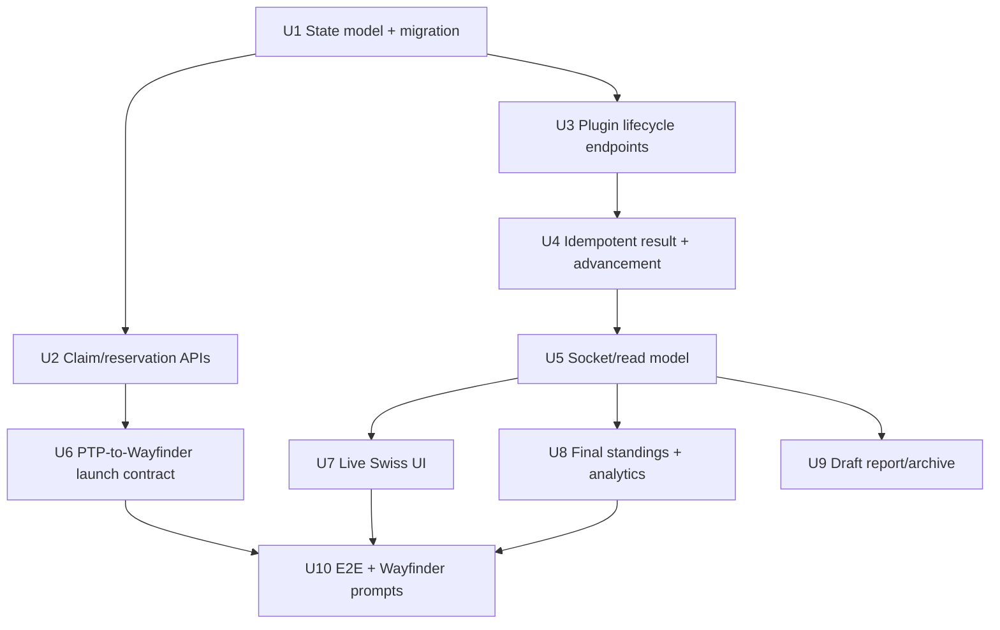
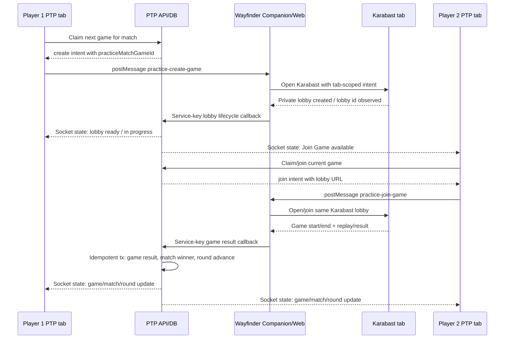
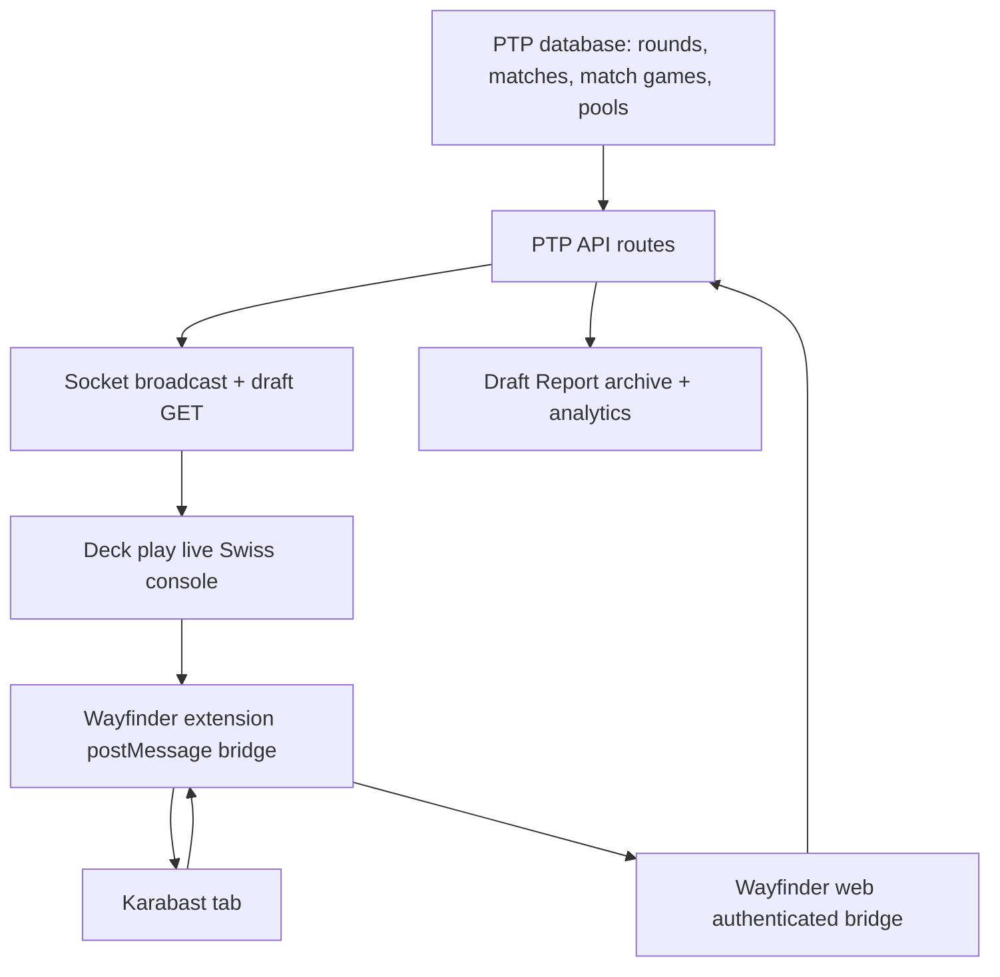

# feat: live Swiss Practice orchestration

## Overview

The completed Swiss Practice play-page work makes the current post-draft phase
more legible, and the Draft Report Matches tab archives plugin-captured games.
That is useful, but it is not the larger product: players should be able to
finish a draft, build decks, hit **Play**, and have Protect the Pod plus
Wayfinder Companion orchestrate the live Swiss round as it happens.

The intended flow:

1. A player builds their deck on `/pool/[shareId]/deck/play`.
2. When Swiss Practice is active, their current pairing has a **Play** button.
3. The first paired player to click Play atomically claims the next game slot in
   PTP, then Wayfinder opens a new Karabast tab and creates a private limited
   lobby for that game.
4. PTP keeps the original tab as the live Swiss console: current pairings,
   pending/creating/in-progress/completed statuses, elapsed time, spectator
   links when available, game pips, records, standings, and previous-round
   history.
5. The second player clicks **Join Game** and Wayfinder opens/joins the existing
   Karabast room.
6. Wayfinder reports lobby lifecycle and per-game results back to PTP. PTP is
   the durable source of truth, broadcasts updates, derives match winners,
   advances Swiss rounds, and keeps prior rounds as history.
7. When all rounds are complete, PTP shows final standings, each player's deck
   and pool links, records, and event analytics. It does **not** declare a
   winner.

This plan deliberately treats the plugin as an automation and capture layer, not
as the tournament state owner. PTP owns the round, pairing, game-room, result,
and analytics state; Wayfinder creates/joins/navigates Karabast and sends
authenticated lifecycle/result events.

> **Plan deepened 2026-06-19** after a local confidence and document-review pass
> covering coherence, feasibility, scope, security, design, product, and
> adversarial failure modes. The pass added milestone boundaries, old-row/backfill
> treatment, private-link security handling, and a fuller live-UI state matrix.

## Problem Frame

Today Swiss Practice has only coarse match state: pending manual/Wayfinder game
results on `practice_matches`, then a confirmed match, then the next round. The
page cannot tell whether a Karabast game is being created, waiting for the other
player, in progress, stale/failed, or spectatable. It also cannot make the
"first click creates, second click joins" flow race-safe because there is no
server-side game-room claim before the plugin opens Karabast.

The current plugin result endpoint is also too fragile for this expanded role:
competitive results are written into three columns with multiple independent
queries, pool W/L increments can repeat on duplicate plugin posts, and round
advancement is outside a single idempotent state transition.

The product requirement is therefore not a UI tweak. It is a live match
orchestration system with a durable state machine, a PTP/Wayfinder contract,
real-time UI updates, event analytics, and a testing story that covers races,
duplicates, stale plugin callbacks, and browser flows.

## Requirements Trace

- **R1.** From the post-draft deck play page, the paired player can click
  **Play** for their active Swiss pairing and be brought into the Karabast match
  in a new tab via Wayfinder.
- **R2.** The original PTP tab remains a live Swiss rounds view, not merely a
  draft report/archive.
- **R3.** Every pairing knows whether no game exists, a game is being created, a
  lobby is ready, the game is in progress, the game is complete, or the game
  failed/staled out.
- **R4.** The first player to hit Play for a pairing creates the private room;
  a simultaneous click from the opponent cannot create a second official room.
- **R5.** The second player sees **Join Game** for their match once the room
  exists and joins the same Karabast lobby through Wayfinder.
- **R6.** Non-playing viewers inside the Swiss Practice view see an
  in-progress badge and a spectator/watch link when Wayfinder/Karabast provides
  one; participants see Join/Play as appropriate.
- **R7.** The live view shows how long an active game has been in progress and
  updates without a hard refresh.
- **R8.** Wayfinder reports game wins and match wins back to PTP; PTP updates
  game pips, match status, standings, and round progress live.
- **R9.** When all non-bye matches in the active round are complete, PTP pairs
  the next round automatically. The new pairings become primary, and previous
  rounds remain available below as history.
- **R10.** At event completion, final standings show each player, record, deck
  link, pool link, and useful identity details. The UI does not declare a
  winner.
- **R11.** Event analytics summarize leader/archetype meta share, leader and
  archetype win rates, and matchup/result context without turning the page into
  a trophy ceremony.
- **R12.** Event analytics include pool/luck context similar to the Luck tab:
  expected pulls vs actual pulls, notable rarity/aspect/card deviations, and
  pool-quality signals scoped to this event.
- **R13.** Manual result reporting and host override remain fallbacks when the
  plugin is unavailable, delayed, or wrong.
- **R14.** The feature is robustly tested: state machine, database constraints,
  idempotency, race behavior, socket payloads, UI states, and mocked
  PTP/Wayfinder browser flows.
- **R15.** If Wayfinder changes are required, this plan provides concrete prompts
  for the Wayfinder agent/team rather than pretending the swupod repo can ship
  extension changes by itself.

## Scope Boundaries

- This plan targets **competitive draft pods / Swiss Practice** only.
- Karabast remains the gameplay engine. PTP is not building a native game UI.
- No elimination bracket, top cut, trophy, or "winner" declaration.
- No new casual/open Swiss event type in this plan.
- No dependence on extension local storage as the source of official state.
  Extension state may help automation; PTP database state is authoritative.
- Spectator/watch links render only when Wayfinder/Karabast provides a valid
  URL. PTP does not invent spectator URLs from a lobby id unless the plugin
  contract confirms the shape.
- Public Karabast lobby/game polling must not be used to infer player handles
  or outcomes. Wayfinder's authenticated capture/result path remains the source
  for results.
- The existing Draft Report Matches tab remains useful archive work, but the
  live Swiss console is on the deck play page.
- Wayfinder repo changes are not made in this swupod worktree. This plan defines
  the contract and prompts needed for that repo.
- Existing manual mutual confirmation and host override must continue working
  throughout rollout.

## Milestone Boundaries

This is one product direction, but it should not ship as one undifferentiated
merge. The implementation should land in independently verifiable milestones:

- **Milestone A: Durable live-game core** — U1-U5. Adds schema, claim/lifecycle
  endpoints, idempotent result recording, and socket/read-model support while
  keeping the current UI/manual reporting usable.
- **Milestone B: Player-facing live orchestration** — U6-U7. Adds Play/Join
  actions and the active-round live console behind a Companion beta/admin or
  pod-level flag until the Wayfinder build supports the contract.
- **Milestone C: Event summary and archive** — U8-U9. Adds final standings,
  analytics, pool/luck context, and report/archive support. This can follow the
  core live flow; it should not block proving room creation and result capture.
- **Milestone D: Cross-repo hardening** — U10. Runs full mocked PTP/Wayfinder
  browser flows and hands the explicit prompts to the Wayfinder repo.

Milestone A is the architectural gate. Do not start broad visual polish or final
analytics until the claim/result/idempotency path is proven with tests.

## Context & Research

### Current PTP Surfaces

- `src/components/MatchmakingPanel.tsx` renders the Swiss Practice panel from
  `rounds`, `currentRound`, and `matchmakingStatus`. It currently shows tabs,
  match cards, standings, and manual result actions, but no durable room/game
  lifecycle.
- `src/components/MatchCard.tsx` renders one pairing with game pips,
  Wayfinder match link, Report/Edit/Boot actions, and the newly added record
  display. It is the natural place for Play/Join/Spectate/In Progress actions,
  but those actions need a real backend state first.
- `app/pool/[shareId]/deck/play/page.tsx` already has `useDraftSocket`,
  `useWayfinderDetection`, `PlayInstructions`, and `MatchmakingPanel` in scope.
  It can dispatch PTP page-to-extension events, but should not decide the
  official game state locally.
- `src/components/PlayInstructions.tsx` already posts
  `wayfinder:create-lobby` and `wayfinder:join-lobby`. That is prior art for
  communicating with the Companion, but it is a local convenience flow today:
  it does not claim a match game in PTP or receive a persisted lobby callback.
- `.claude/rules/ui-components.md` now explicitly requires searching for and
  reusing prior action/button/link patterns before creating new ones. Live match
  actions must reuse existing `Button` patterns and `ReplayWatchLink`/watch
  styling where the action is a watch/replay action.

### Current PTP Data Model

- `migrations/054_create_practice_rounds.sql` and
  `migrations/055_create_practice_matches.sql` provide round and match rows.
  `practice_matches` stores `game1_result`, `game2_result`, `game3_result`,
  `final_confirmed`, `match_winner`, and one `wayfinder_match_id`.
- `migrations/060_add_wayfinder_replay_url.sql` adds one replay URL per
  `practice_matches` row. That is not enough for live Bo3 game lifecycle and
  per-game replay status.
- `migrations/070_add_match_deck_identity.sql` stores player/opponent leader,
  base, and archetype identity on `practice_matches`, populated by Wayfinder.
- `app/api/plugin/v1/match/result/route.ts` is the current Wayfinder-to-PTP
  result write-back. Competitive mode finds the active round and player match,
  writes one game slot, derives a match winner, increments both players'
  `card_pools` records, and calls `checkAndAdvanceRound()`.
- `lib/db.ts` already provides `withTransaction()` and advisory lock helpers.
  `src/utils/draftAdvance.ts` shows the stronger pattern: transaction-scoped
  advisory lock, re-read state under lock, make all state writes atomically,
  and run side effects after commit.
- `src/lib/socketBroadcast.ts` and `src/utils/matchmakingRounds.ts` already
  shape the real-time payload for `useDraftSocket`; both must grow to include
  per-game room state.

### Current Wayfinder Contract

- The Wayfinder repo is a sibling repo at `/Users/lee/Repos/ledwards/wayfinder`.
- `packages/extension-shared/src/content-ptp-play.ts` injects the detection
  marker, sends metadata/lobby count to PTP, and bridges PTP page messages to
  the extension.
- Wayfinder already fixed a prior race by using
  `OPEN_KARABAST_WITH_INTENT`: the background opens the Karabast tab itself and
  stores the intent under that tab id. This is the right primitive to build on.
- `packages/extension-shared/src/capture-shell.ts` currently detects PTP pool
  links from deck URLs or the active pool and sends `LINK_LOBBY_TO_PTP` and
  `PTP_GAME_RESULT` messages.
- `apps/web/app/api/plugin/ptp-lobby-pool/route.ts` stores a Wayfinder-side
  lobby-to-PTP-pool link. It is useful for result attribution, but it does not
  update PTP's live Swiss room state.
- `apps/web/app/api/plugins/ptp-game-result/route.ts` authenticates the plugin
  token, validates a PTP game result, checks that the Karabast lobby was linked
  to the PTP pool, and forwards to PTP using Wayfinder's server-side
  `PTP_SERVICE_KEY`.
- `docs/solutions/architecture-patterns/karabast-spectator-architecture.md` in
  Wayfinder documents an important privacy split: unauthenticated Karabast APIs
  expose game/lobby metadata but not player handles/outcomes; authenticated
  spectator/capture streams provide full details but are gated. PTP should not
  infer official results from public polling.

### Stats and Analytics Prior Art

- `app/api/stats/me/gameplay/route.ts` already derives personal leader
  breakdowns, replay rows, leader/base/archetype display, and practice/casual
  source normalization.
- `app/api/stats/me/luck/route.ts`, `src/services/luckVerdict.ts`, and the
  expected-distribution services already compute observed vs expected rarity,
  aspect, and per-card luck. Event analytics should reuse those pure services
  at pod/event scope.
- `src/services/matchmaking/standings.ts` from the previous plan derives live
  records, rankings, OMW%, dropped labels, and records-through-round. This
  should remain the standings source for the live console.

## Key Technical Decisions

- **PTP owns the live Swiss state.** Wayfinder can automate Karabast and report
  facts, but official room/game/match/round state lives in PTP tables and is
  broadcast from PTP.
- **Add a per-game state model instead of overloading `practice_matches`.** A
  Bo3 match can create up to three Karabast games/lobbies and should store
  per-game status, lobby identity, spectate/replay links, started/completed
  timestamps, and idempotency metadata. Keep `practice_matches` as the match
  aggregate.
- **Claim before opening Karabast.** The PTP page must call a participant
  endpoint that atomically reserves the next needed game for the match. Only
  after the server returns "you are the creator" should the page ask Wayfinder
  to create a lobby. This prevents two official rooms when both players click
  Play at the same time.
- **Use transaction-scoped pod locks for result and advancement writes.** The
  result path should re-read the match/game under lock, apply an idempotent
  game event, derive match completion, update pool W/L/D once, and advance the
  round exactly once.
- **Use Wayfinder web as the authenticated bridge for extension callbacks.**
  The extension has a plugin token for Wayfinder, not PTP's service key. New
  Wayfinder endpoints should authenticate the plugin token, then forward
  lifecycle/result events to new PTP service-key endpoints, following the
  existing `ptp-game-result` pattern.
- **The live UI is active-round first.** Existing round tabs are useful, but the
  core screen should not feel like a report. The current active round's pairings
  and the viewer's match action are primary; previous completed rounds become
  history below; final standings and analytics appear when the event completes.
- **Spectator/watch actions reuse existing prior art.** Replay/watch links use
  `ReplayWatchLink`/watch styling. Play/Join/Edit/Report actions use the shared
  `Button` component and existing match-card action layout.
- **No spectator link without a real link.** If Wayfinder can provide a
  Karabast spectate URL or Wayfinder replay/watch URL, PTP renders it. If not,
  PTP shows the in-progress badge and elapsed time without a dead link.
- **Manual fallback stays first-class.** If Wayfinder is not detected, if
  creation fails, or if a lifecycle event stales out, participants can still
  manually report and hosts can override.
- **Event analytics are event-scoped read models.** They should reuse existing
  gameplay/luck/standings logic with a pod/event filter, not create a separate
  analytics worldview.

## Open Questions

### Resolved During Planning

- **Is this Wayfinder or swupod?** PTP/swupod owns the live Swiss product and
  data model. Wayfinder needs supporting extension/web changes, but those are
  prompted separately.
- **Per-match room or per-game room?** Per-game. Karabast game/replay identity
  is per game, and Bo3 can need game 2/3 creation after game 1 ends.
- **Should a duplicate plugin result increment records again?** No. Game-result
  writes must be idempotent, and match-level pool W/L/D increments happen once.
- **Can public Karabast polling drive outcomes?** No. Public polling can help
  discover lobby/game availability but not official PTP results.
- **Does final standings declare a winner?** No. It ranks standings and records,
  but does not crown anyone.

### Deferred to Implementation / Wayfinder Validation

- Exact Karabast URL shape for a spectator link. Wayfinder must confirm whether
  the private lobby URL, `/spectate?lobbyId=...`, or another URL is the correct
  user-facing action.
- Whether Wayfinder can report a lobby-created callback immediately after
  private lobby creation or only after the first lobbystate frame with a lobby
  id. PTP supports both, but the UI copy differs.
- How to represent a game that was created but never started: timeout duration,
  who can retry, and whether retry creates a new game row or marks the existing
  row failed. The plan assumes an explicit stale/failed state with retry.
- Whether non-participant spectators are limited to draft participants in v1 or
  can include public report viewers. Default v1 should be pod participants and
  host only unless product explicitly opens public live spectating.
- Whether the beta/admin rollout gate should be a user gate only or a pod-level
  setting that the host opts into. Default planning assumption: use the narrowest
  existing gate that lets the team test with real pods before general release.

## High-Level Technical Design

Directional game state model:

| State | Meaning | Primary UI |
|---|---|---|
| `pending` | No official game row/lobby exists for the next needed game | Participant: Play |
| `creating` | A participant claimed creation; Wayfinder/Karabast has not reported a lobby yet | Creator: Creating; opponent: Waiting |
| `lobby_ready` | PTP has a lobby/join URL but no start event yet | Participant: Join Game; viewer: Spectate if available |
| `in_progress` | Wayfinder observed game start or result pipeline has a started timestamp | In progress badge + elapsed + links |
| `complete` | Result/replay received for this game | Game pip + replay/watch if available |
| `failed` | Automation failed or timed out before a usable lobby/game | Participant: Retry / manual fallback |

Live UI state matrix:

| Viewer | Game state | Primary action | Secondary/context |
|---|---|---|---|
| Participant, no plugin | `pending` | Report/copy manual fallback | Install/enable Companion if eligible |
| Participant, creator | `creating` | Disabled Creating state | Retry only after stale/failed |
| Participant, opponent | `creating` | Waiting state | Manual fallback remains |
| Participant | `lobby_ready` | Join Game | Spectate/watch only if separate URL exists |
| Participant | `in_progress` | Join/Rejoin Game if URL exists | In-progress badge + elapsed + manual fallback |
| Non-participant in pod | `lobby_ready`/`in_progress` | Watch/Spectate if URL exists | Otherwise status-only |
| Host | Any non-bye state | Existing Edit/override controls | Never bypass participant claim rules |
| Anyone permitted | `complete` | Watch replay if available | Game pip/result context |

## Implementation Units

- [x] **U1. Add durable per-game Swiss Practice state**

**Goal:** Introduce the persistent state needed to track Karabast rooms/games
independently from the match aggregate.

**Requirements:** R3, R7, R8, R14

**Dependencies:** None

**Files:**
- Create migration: next numbered `migrations/*_create_practice_match_games.sql`
- Create: `src/services/matchmaking/liveGames.ts`
- Create: `src/services/matchmaking/liveGames.test.ts`
- Modify as needed: `src/services/matchmaking/results.ts` only if shared
  result derivation needs a pure helper; keep existing contracts intact.

**Approach:**
- Add one row per official Karabast game attempt within a `practice_matches`
  row. Store match id, pod id, round id, game number, status, creator user id,
  lobby id/url, spectator url, Wayfinder match/game id, replay url, started and
  completed timestamps, result from `player1/player2/draw` perspective, failure
  reason, idempotency keys, and timestamps.
- Enforce uniqueness so only one active official row can exist for a given
  match/game number unless the old row is explicitly failed/voided.
- Keep `practice_matches.game1_result`/`game2_result`/`game3_result` as the
  compatibility aggregate for existing UI/tests until a later cleanup.
- Do not backfill historical `practice_matches` into per-game rows. Old rows
  continue to render through compatibility/fallback readers; new rows exist only
  for games launched or reported after this migration.
- Define pure helpers for next-needed game number, state transitions, elapsed
  labels, and whether a transition is legal.

**Test scenarios:**
- Next-needed game is 1, 2, or 3 based on existing completed game rows/results.
- A completed game row maps to the existing match aggregate game result.
- Illegal transitions are rejected, such as `complete -> in_progress` or
  `failed -> complete` without an explicit retry/new attempt.
- Multiple games for one match can store distinct replay URLs.
- A stale `creating` row is detectable for retry without deleting history.

**Verification:** The schema supports Bo3 room history and the pure state helper
can explain every current and expected UI state.

**Implemented 2026-06-19:** Added `practice_match_games` migration plus
`src/services/matchmaking/liveGames.ts` and focused tests. Helpers cover
next-needed game derivation, completed per-game result mirroring, lifecycle
transition validation, retry/stale detection, elapsed-time formatting, and
current-game summaries for future socket/UI payloads. Verified with the focused
live-game tests, adjacent Swiss/report helper tests, TypeScript, and the
`@ts-nocheck` ratchet.

---

- [x] **U2. Add participant claim/reservation APIs**

**Goal:** Make the "first click creates, second click joins" behavior official
and race-safe before Wayfinder opens Karabast.

**Requirements:** R1, R4, R5, R13, R14

**Dependencies:** U1

**Files:**
- Create route under `app/api/draft/[shareId]/match/[matchId]/game/claim/route.ts`
  or the closest existing route-family equivalent.
- Create service functions in `src/services/matchmaking/liveGames.ts`.
- Create focused route/service tests, using existing DB transaction/advisory-lock
  test patterns where practical.

**Approach:**
- Authenticated participant endpoint. Verify the draft exists, is competitive,
  is in matchmaking, the match is in the active round, the user is one of the
  two players, the match is not a bye, and the match is not final.
- Inside one transaction with a pod/match lock, compute the next needed game and
  either create/reserve a `creating` row for the caller or return the existing
  usable row.
- Return a small action model to the client: create lobby, join lobby, wait for
  lobby, retry allowed, or manual-only fallback.
- Do not send any browser/plugin event from the server. The browser receives
  the action and then posts to Wayfinder.
- Apply the app's existing request/CSRF/auth expectations for user routes. If
  this endpoint becomes click-heavy during retries, add the same rate-limit
  posture used by adjacent authenticated API routes.

**Test scenarios:**
- Player 1 claims an empty match and receives a create action.
- Player 2 claims the same match after a lobby is ready and receives a join
  action with the same official game row.
- Two simultaneous claims for the same pending game produce one creator and one
  wait/join response, never two official create rows.
- Non-participant, completed match, bye match, inactive round, and wrong draft
  all fail with appropriate statuses.
- A stale failed/creating row allows an authorized retry without losing history.

**Verification:** Repeated and concurrent Play clicks cannot create duplicate
official rooms for the same game.

**Implemented 2026-06-19:** Added
`POST /api/draft/[shareId]/match/[matchId]/game/claim` backed by a
transaction-scoped pod advisory lock in `claimPracticeMatchGame()`. The service
validates active competitive Swiss state, active/current round, participant
membership, bye/completed cases, existing lobby rows, stale retries, and returns
a small action model (`create_lobby`, `wait_for_lobby`, `join_lobby`, etc.) for
the future client/Wayfinder launch hook. Added DB-backed tests for first-create,
opponent-wait, lobby-ready join, simultaneous claims, stale retry, and
non-participant rejection; the file skips loudly when `swupod_test` is not
available or has not run the new migration. Verified with fast helper tests,
TypeScript, and the `@ts-nocheck` ratchet.

---

- [x] **U3. Add PTP service-key endpoints for Wayfinder lifecycle callbacks**

**Goal:** Let Wayfinder report "lobby created," "joined," "game started,"
"game failed," and related room metadata back into PTP's live state.

**Requirements:** R3, R5, R6, R7, R15

**Dependencies:** U1, U2

**Files:**
- Create service-key routes under `app/api/plugin/v1/practice/match-game/*`
  or a single versioned event route.
- Create validation helpers in `src/services/matchmaking/liveGames.ts`.
- Update `docs/WAYFINDER_PLUGIN.md` or add
  `docs/WAYFINDER_PLUGIN_LIVE_SWISS.md` with the contract.

**Approach:**
- Authenticate with `requireServiceKey`, matching existing plugin routes.
- Accept lifecycle events keyed by `practiceMatchGameId` plus enough player/pool
  context to verify that the reporting pool belongs to one of the match
  participants.
- Persist lobby id/url, spectator/watch url when available, status, timestamps,
  and failure reason. Every callback is idempotent.
- Broadcast draft state after successful committed state changes.
- Keep these lifecycle callbacks separate from final result ingestion so the UI
  can show useful progress before the game ends.
- Treat private lobby and spectator URLs as sensitive operational data. Do not
  log full URLs; log stable ids and redacted URL presence instead. Return those
  URLs only through the same draft/pod/report visibility rules chosen for the UI.
- Reject callbacks that try to move a game to a later state without the required
  earlier identity. For example, `in_progress` without an official game row and
  verified participant/pool context should fail closed.

**Test scenarios:**
- Lobby-created callback moves `creating -> lobby_ready` and stores join/watch
  URLs.
- Game-started callback moves `lobby_ready -> in_progress` and sets
  `started_at` once.
- Duplicate callbacks preserve original timestamps and do not create new rows.
- Callback with the wrong pool/user/match id is rejected.
- Failure callback moves a non-complete row to `failed` and broadcasts retryable
  UI state.

**Verification:** A mocked Wayfinder callback can drive the live panel from
creating to lobby ready to in progress without a page refresh.

**Implemented 2026-06-19:** Added
`POST /api/plugin/v1/practice/match-game/lifecycle` with `PTP_SERVICE_KEY`
auth and `recordPracticeMatchGameLifecycle()`. The callback requires
`practiceMatchGameId`, `poolShareId`, and status (`lobby_ready`, `joined`,
`in_progress`, or `failed`), verifies the reporting pool belongs to one of the
match participants, stores lobby/watch/Wayfinder metadata without overwriting
first timestamps, treats exact duplicate callbacks as no-ops, ignores stale
terminal-row callbacks, and broadcasts after committed changes. Extended the
DB-backed test file with lifecycle coverage for lobby-ready, duplicate,
joined, in-progress, and wrong-pool rejection; it skips loudly when
`swupod_test` is not available or has not run the new migration. Verified with
fast helper tests, TypeScript, and the `@ts-nocheck` ratchet.

---

- [x] **U4. Refactor plugin result ingestion into a transactional idempotent service**

**Goal:** Make Wayfinder-reported game results safe against retries, duplicate
posts, partial writes, and round-advance races.

**Requirements:** R8, R9, R13, R14

**Dependencies:** U1, U3

**Files:**
- Modify: `app/api/plugin/v1/match/result/route.ts`
- Create/modify: `src/services/matchmaking/liveGames.ts`
- Modify: `src/services/matchmaking/advancement.ts` to support transaction-safe
  advancement or add a new advancement service that avoids nested transactions.
- Add tests for result idempotency and advancement.

**Approach:**
- Keep the existing endpoint backward compatible for current Wayfinder builds:
  `poolShareId`, `matchId`, `gameNumber`, `replayUrl`, and deck identity fields
  still work.
- Prefer a new explicit `practiceMatchGameId` when supplied. Fall back to
  current active-match lookup only for old builds.
- In one transaction with a pod-level lock, update the per-game row, mirror the
  result to `practice_matches.gameN_result`, derive the match winner, mark the
  match final once, update both players' `card_pools` records once, and advance
  the round if all non-bye matches are complete.
- Use an idempotency key based on Wayfinder game/match id plus game number, and
  guard pool W/L/D increments so a retry cannot double count.
- Run socket broadcasts after commit.
- Do not store or trust result values from client-side PTP postMessage events.
  Only Wayfinder server/service-key callbacks and existing manual report routes
  can write official results.

**Test scenarios:**
- One game result updates one game row, one game pip, and broadcasts.
- Duplicate result post with the same Wayfinder game id is a no-op for W/L/D
  increments and does not advance twice.
- Game 1 and game 2 results that decide the match mark the match final and
  update both player records once.
- Split games require game 3 before final confirmation.
- Manual report/host override still works if no plugin rows exist.
- Concurrent final-match callbacks for the last round only create one next round
  or one completed event state.

**Verification:** The expanded result path can be safely retried by Wayfinder
without corrupting records or rounds.

**Implemented 2026-06-19:** Competitive Wayfinder result ingestion now flows
through `recordPracticeMatchGameResult()` instead of the route's previous loose
sequence of writes. The service runs in one transaction under the pod advisory
lock, prefers explicit `practiceMatchGameId`, falls back to active-match lookup
for older payloads, writes/creates the per-game row, mirrors the result to
`practice_matches`, finalizes the match once, updates both players' pool records
once, and advances Swiss rounds through a transaction-safe advancement helper.
The plugin route remains backward compatible for `poolShareId`, `matchId`,
`gameNumber`, replay URL, and deck identity fields; casual/non-competitive
handling is unchanged. Added fast result-perspective tests and DB-backed tests
for claimed game recording, duplicate result no-op, two-game finalization, and
split-game behavior; DB-backed tests skip loudly when `swupod_test` is not
available or has not run the new migration. Verified with fast helper tests,
TypeScript, and the `@ts-nocheck` ratchet.

---

- [x] **U5. Extend the draft socket/read model with live game state**

**Goal:** Make the live room/game state available to both initial page loads and
socket pushes.

**Requirements:** R2, R3, R6, R7, R8, R9

**Dependencies:** U1, U3, U4

**Files:**
- Modify: `src/utils/matchmakingRounds.ts`
- Modify: `src/lib/socketBroadcast.ts`
- Modify: `src/hooks/useDraftSocket.ts` types
- Modify: `app/api/draft/[shareId]/route.ts`
- Add tests around row normalization if practical.

**Approach:**
- Extend each match payload with a normalized `games` array and a current-game
  summary: status, game number, lobby/join/spectate/replay URLs, creator id,
  started/completed timestamps, elapsed inputs, failure reason, and Wayfinder
  ids.
- Keep existing `practice_matches` fields intact for compatibility with current
  MatchCard/game-dot code and existing E2E tests.
- Ensure the hot read path stays one query or a small fixed number of queries.
  Avoid N+1 per round/match/game loops.
- `broadcastDraftState()` should include game state whenever it includes rounds.
- Old rows with no `practice_match_games` must still produce a valid payload:
  empty `games`, current summary derived from existing match columns, and no
  broken URLs. This is the read-side compatibility contract for rollout.

**Test scenarios:**
- Initial `GET /api/draft/[shareId]` after a lobby-created callback includes
  the game state.
- Socket state update carries the same shape as the GET route.
- Matches with no game rows return an empty games array/current pending summary.
- Completed prior rounds still include their game/replay history.
- Dropped players and byes do not break the read model.

**Verification:** Opening the play page after a game is already in progress
shows the correct status without waiting for a fresh callback.

**Implemented 2026-06-19:** `fetchRoundsWithMatches()` now includes
per-game live rows and a normalized `currentGame` summary for every match while
preserving old match fields for compatibility. The draft GET route already used
this helper, and socket broadcasts now reuse it instead of the previous
per-round/per-match query loop. `useDraftSocket()` now applies same-version
public state broadcasts so lifecycle/result updates that do not bump
`pod.state_version` still update the live Swiss view immediately. DB-backed
read-model tests cover the new game-row shape and skip loudly when
`swupod_test` is not available or has not run the new migration. Verified with
fast helper tests, TypeScript, and the `@ts-nocheck` ratchet.

---

- [ ] **U6. Implement the PTP page-to-Wayfinder live launch contract**

**Goal:** Replace local create/join convenience messages with Swiss
Practice-specific intents that include the official PTP game identity.

**Requirements:** R1, R4, R5, R13, R15

**Dependencies:** U2, U5

**Files:**
- Modify: `app/pool/[shareId]/deck/play/page.tsx`
- Modify/create: `src/hooks/useWayfinderPracticeLaunch.ts`
- Modify: `src/components/MatchmakingPanel.tsx` / `MatchCard.tsx` props
- Update docs from U3 with browser-to-extension event names and payload meaning.

**Approach:**
- On Play/Join click, call the claim endpoint first.
- If the server returns create/join, post a Swiss Practice event to Wayfinder
  containing the official game id, match id, draft share id, pool share id,
  game number, deck URL, card pool, join URL when present, and callback context.
- Reuse Wayfinder's tab-scoped `OPEN_KARABAST_WITH_INTENT` model. Do not
  reintroduce shared-storage intents.
- If Wayfinder is not detected, show the manual fallback and copy/join
  instructions; do not make a hidden official room.
- Track analytics events without leaking share ids into client analytics, using
  the existing limited analytics sanitization pattern.
- Never include PTP service keys or plugin tokens in browser postMessages. The
  browser payload carries only opaque PTP ids, deck URL, and user-action context.

**Test scenarios:**
- Play click calls claim, receives create, and posts exactly one Wayfinder
  create event.
- Join click for an existing lobby posts a join event with the server-provided
  URL.
- Wayfinder not detected leaves the match in manual flow and does not call the
  plugin.
- Claim failure surfaces a retryable message and does not open Karabast.
- A second click while the first claim is pending is ignored/disabled.

**Verification:** With a mocked Companion listener, Play produces the expected
window message and the live panel moves into creating/waiting state.

---

- [ ] **U7. Redesign the Swiss Practice panel as a live round console**

**Goal:** Make the active round and live game state the primary UI, while keeping
round history, standings, manual fallback, and host controls discoverable.

**Requirements:** R2, R3, R5, R6, R7, R9, R13

**Dependencies:** U5, U6

**Files:**
- Modify: `src/components/MatchmakingPanel.tsx`
- Modify: `src/components/MatchCard.tsx`
- Modify: `src/components/MatchmakingPanel.css`
- Modify: `src/components/MatchCard.css`
- Modify/create: `src/components/MatchmakingPanel.helpers.ts` tests

**Approach:**
- Active round is first. The viewer's match callout includes the appropriate
  Play, Join Game, Creating, Waiting, In Progress, Watch/Spectate, Retry, or
  Report Manually action.
- Pairing cards show room/game status, elapsed time from `started_at`, game
  pips, existing records, and participant/host controls.
- Previous rounds render below as history once complete. They can be collapsed
  by default on small screens but must remain reachable without changing pages.
- Standings remain live and become final standings at completion, without a
  trophy/winner label.
- Watch/replay actions reuse `ReplayWatchLink`; other actions reuse the shared
  `Button` component. No bespoke Watch/Replay button styling.
- Add a small client-side timer only for elapsed display; the server timestamp
  remains source of truth.
- Include loading/error states for claim and plugin launch separately. "Claim
  failed" means PTP did not reserve a game; "Wayfinder launch failed" means PTP
  reserved or observed a game row but automation did not complete, so the UI
  must offer retry/manual resolution without hiding the reserved state.

**Test scenarios:**
- Pending participant match shows Play; non-participant pending match does not.
- Creating state shows creator as Creating and opponent as Waiting.
- Lobby-ready participant opponent sees Join Game.
- In-progress row shows badge and elapsed time; watch/spectate link appears
  only when URL exists.
- Completed round moves into history when the next round appears.
- Manual Report remains available when auto-recording is active or failed.
- Mobile viewport has no overlapping buttons/status text.

**Verification:** Browser screenshots with mocked round/game states show pending,
creating, in-progress, complete/history, and final states on desktop and mobile.

---

- [ ] **U8. Add final standings, deck/pool links, and event analytics**

**Goal:** Turn the completed Swiss Practice page into a useful event summary
without declaring a winner.

**Requirements:** R10, R11, R12

**Dependencies:** U4, U5

**Files:**
- Create: `src/services/matchmaking/eventAnalytics.ts`
- Create: `src/services/matchmaking/eventAnalytics.test.ts`
- Modify: `src/components/MatchmakingPanel.tsx` or extract a
  `SwissPracticeSummary` component.
- Modify: `app/api/draft/[shareId]/route.ts` or add a scoped summary endpoint
  if the payload would otherwise become too large.
- Reuse services from `app/api/stats/me/gameplay/route.ts` and
  `app/api/stats/me/luck/route.ts` where possible.

**Approach:**
- Final standings list every player with W-L-D, OMW%, deck link, pool link,
  leader/base/archetype, and dropped status if relevant.
- Do not apply celebratory winner language, trophy icons, or "champion" copy.
- Analytics include event meta share by leader/archetype, record/win rate by
  leader/archetype, and small-sample labels when counts are too low to trust.
- Pool/luck analytics are scoped to the draft pod's generated packs/pools and
  reuse existing expected-distribution and luck-verdict services.
- Keep analytics as an event summary; do not expose private per-user luck
  history outside the event context.
- If event-level luck math is too slow or too broad for the hot draft GET route,
  expose it from a lazy-loaded summary endpoint after completion instead of
  adding expensive joins to the live socket payload.

**Test scenarios:**
- Final standings include all players, deck links, pool links, records, and no
  winner/trophy string.
- Leader/archetype meta share sums to 100% of event decks with known identity.
- Win rate calculations ignore byes or label them explicitly according to the
  chosen event-analytics rule.
- Unknown leader/archetype rows fall back gracefully.
- Luck summary compares actual pod pulls to expected values for the set and
  labels insufficient samples.

**Verification:** Completing a mocked event renders final standings and
analytics with useful links and no "winner" declaration.

---

- [ ] **U9. Upgrade Draft Report/archive views to read the live game model**

**Goal:** Make the post-event archive reflect the richer live game state and
per-game replays, while preserving the existing report visibility boundary.

**Requirements:** R8, R10, R11, R12

**Dependencies:** U1, U5, U8

**Files:**
- Modify: `app/api/draft/[shareId]/report/[poolShareId]/route.ts`
- Modify: `src/utils/draftReportMatches.ts`
- Modify: `src/utils/draftReportMatches.test.ts`
- Modify: `app/draft/[shareId]/report/[poolShareId]/page.tsx`
- Modify: `app/draft/[shareId]/report/report.css`

**Approach:**
- Continue using the existing report visibility gate before returning any match
  rows.
- Prefer `practice_match_games` per-game replay/watch data for competitive
  draft reports. Fall back to existing `practice_matches` match-level replay
  data for old rows.
- Keep `casual_matches` support for non-competitive pool play.
- If event analytics from U8 are available and report visibility allows, expose
  an event summary section from the report for completed Swiss Practice pods.
- Preserve the `#matches` hash and legacy `#gameplay` remap from the existing
  Matches tab work.
- Historical reports remain valid when no per-game rows exist. The report must
  not show an error or empty archive solely because the event predates this
  schema.

**Test scenarios:**
- New competitive live-game rows render per-game replays in round order.
- Old competitive rows with only match-level replay URL still render a single
  watch action.
- Private reports still 403 before match/game data is queried.
- Public reports include only the report player's visible rows unless the
  product explicitly makes event summary public.
- No duplicate rows when both `practice_match_games` and old
  `practice_matches.wayfinder_replay_url` exist.

**Verification:** Draft Report remains an archive of the same live event data,
not a second divergent model.

---

- [ ] **U10. Add integration tests and Wayfinder handoff prompts**

**Goal:** Make the feature hard to break across PTP, the Companion bridge, and
browser UI flows.

**Requirements:** R14, R15

**Dependencies:** U2 through U9

**Files:**
- Add/modify focused Node tests near the services/routes above.
- Add Playwright tests under `tests/e2e/` for mocked plugin/lifecycle flows.
- Add: `docs/WAYFINDER_PLUGIN_LIVE_SWISS.md`
- Optionally add a small local mock helper for Companion postMessage/callbacks.

**Approach:**
- Unit tests cover state transitions, next-game derivation, legal/illegal
  transitions, analytics math, and UI helper mappings.
- DB-backed tests cover claim races, idempotent result writes, and one-time
  round advancement.
- Route tests cover authz, participant checks, service-key checks, and stale
  callback rejection.
- Browser tests mock the Companion listener and service callbacks: player 1
  creates, player 2 joins, result reports, round advances, previous round moves
  to history, final analytics render.
- Visual screenshots cover desktop/mobile live states and text overflow.
- These tests must not depend on live Karabast. Use mocked postMessage listeners
  and mocked PTP service callbacks for deterministic browser coverage; Wayfinder
  owns real Karabast automation tests in its repo.

**Wayfinder prompt 1: create/join live Swiss intents**

> In `/Users/lee/Repos/ledwards/wayfinder`, extend the PTP play-page bridge to
> listen for Swiss Practice-specific postMessages from PTP, using the existing
> `OPEN_KARABAST_WITH_INTENT` tab-scoped delivery model. The create intent must
> include PTP's `practiceMatchGameId`, pool share id, draft share id, match id,
> game number, deck URL, card pool, and callback context. The join intent must
> open the PTP-provided Karabast lobby URL and carry the same PTP identity
> fields. Do not use shared-storage single-use intents. Add tests next to
> `content-ptp-play-launch.test.ts` proving create/join Swiss intents are handed
> to the background once and include the official game id.

**Wayfinder prompt 2: report lobby lifecycle**

> Add Wayfinder web/plugin support for reporting PTP Swiss Practice lifecycle
> events. When Karabast automation creates or observes a lobby for a Swiss
> intent, call a new Wayfinder authenticated endpoint with the plugin token;
> that endpoint forwards to PTP's service-key lifecycle endpoint. Report
> `practiceMatchGameId`, lobby id, join URL, spectate URL if known, status
> (`lobby_ready`, `in_progress`, `failed`), timestamps, and failure reason. Make
> callbacks idempotent and add tests for duplicate lobby-created events.

**Wayfinder prompt 3: result write-back with explicit game identity**

> Extend the existing PTP game-result pipeline to include
> `practiceMatchGameId` when the game came from a Swiss Practice intent. Keep
> the current `poolShareId`/`matchId`/`gameNumber` fields for backwards
> compatibility. Forward replay URL and deck identities exactly as today. Add
> tests proving duplicate result posts do not change the outgoing PTP payload
> shape and that missing lobby registration is still rejected.

**Wayfinder prompt 4: spectator/watch URL validation**

> Validate the exact Karabast/Wayfinder spectator URL that should be shown for a
> private limited lobby in progress. Document whether PTP should display the
> private lobby URL, a Karabast `/spectate` URL, a Wayfinder live watch URL, or
> nothing until a replay exists. Return that URL in the lifecycle callback only
> when it is safe and user-actionable.

**Test scenarios:**
- Full two-player happy path: create, join, game 1 result, game 2 result,
  match complete, round advance.
- Race path: both players click Play; one official game row and one official
  lobby callback win.
- Retry path: creating times out; participant retries; old row is marked failed.
- Duplicate callback path: Wayfinder sends lobby/result twice; UI/records do not
  duplicate.
- No-plugin path: manual reporting still confirms a match and advances rounds.
- Mobile visual path: pending/join/in-progress/final summary states have no
  overflow or overlapping controls.

**Verification:** The PTP test suite and mocked browser flow pass before
shipping; Wayfinder prompts are concrete enough for a separate agent/thread.

## System-Wide Impact

- **Database:** New per-game table and constraints. Existing
  `practice_matches` fields remain as compatibility aggregates.
- **API:** New participant claim route and new service-key plugin lifecycle
  route(s). Existing result route remains backward compatible but moves
  competitive behavior into a safer service.
- **Sockets:** `rounds.matches[]` grows with game state. Clients must tolerate
  missing `games` for old broadcasts during deployment.
- **Frontend:** MatchmakingPanel becomes a live console. Existing Draft Report
  Matches work becomes an archive reader of the same data.
- **Wayfinder:** Requires extension and web bridge changes. The existing
  `OPEN_KARABAST_WITH_INTENT`, `PTP_GAME_RESULT`, and lobby-linking patterns are
  reused and extended.
- **Security/privacy:** Participant claim route uses user auth and match
  membership. Plugin callback routes use service key. Public report visibility
  remains the archive boundary; live spectator visibility should default to pod
  participants/host until a product decision opens it wider. Private lobby URLs
  are sensitive and should not be logged verbatim or returned outside the chosen
  visibility boundary.
- **Performance:** Avoid N+1 fetching of game rows. Elapsed time should be
  client-rendered from server timestamps, not pushed every second over sockets.
- **Data integrity:** Use transactions/advisory locks for official state changes
  and idempotency keys for plugin events.

## Risks & Dependencies

| Risk | Mitigation |
|---|---|
| Two players create two official rooms | Claim/reservation route runs before Wayfinder launch, under a lock, with uniqueness constraints. |
| Wayfinder retries duplicate result posts | Idempotency key and one-time match finalization/pool W-L-D increments. |
| Existing result endpoint corrupts state under the expanded load | Refactor competitive result handling into a transaction-scoped service before adding richer callbacks. |
| UI shows stale "creating" forever | Store timestamps and failure/stale state; expose Retry/manual fallback. |
| Spectator link shape is wrong or unsafe | Render only plugin-supplied validated URL; Wayfinder prompt requires validation. |
| Plugin unavailable blocks Swiss Practice | Manual report and host override remain. Play/Join automation is a happy path, not the only path to finish rounds. |
| Public report leaks live/private match details | Keep report data behind existing report visibility; default live spectator links to pod participants/host. |
| Analytics imply significance from tiny samples | Label small samples and reuse existing luck/statistical verdict helpers. |
| Active-round UI becomes cluttered on mobile | Use existing Button/link patterns, stable dimensions, responsive constraints, and Playwright screenshots. |
| Wayfinder and PTP deploy out of order | Keep old result payload supported; hide/disable live Play automation until required Companion support is detected or beta-gated. |
| Historical reports have no per-game rows | Do not backfill by default; keep compatibility readers for `practice_matches` and render old rows without per-game replay affordances. |
| Private lobby URLs leak through logs or public report payloads | Redact logs; gate URL fields to pod participants/host in live view and to explicit report visibility in archives. |

## Documentation / Operational Notes

- Add `docs/WAYFINDER_PLUGIN_LIVE_SWISS.md` as the canonical handoff contract
  for Wayfinder. Include event names, payload fields, callback endpoints,
  idempotency rules, and the prompts above.
- Roll out in phases:
  1. Schema/services hidden behind current UI.
  2. Claim/lifecycle/result endpoints with tests and mocked callbacks.
  3. Live UI behind Companion beta/admin or a pod-level live-Swiss flag while
     Wayfinder support lands.
  4. Remove the beta gate only after Wayfinder stable builds support the new
     lifecycle/result contract.
- Migration rollback is additive: the new table can be ignored by old code, and
  old code continues reading `practice_matches`. Do not remove or repurpose
  existing `game1/2/3_result` columns in this plan.
- Record a follow-up `ce:compound` note after implementation for the race-safe
  "PTP claim before plugin opens Karabast" pattern.
- Do not commit this plan or the existing feature changes unless explicitly
  asked.

## Sources & References

- `docs/plans/2026-06-18-001-feat-swiss-practice-play-page-plan.md`
- `docs/WAYFINDER_PLUGIN.md`
- `docs/WAYFINDER_PLUGIN_MATCH_IDENTITY.md`
- `docs/WAYFINDER_PLUGIN_DETECTION.md`
- `src/components/PlayInstructions.tsx`
- `src/components/MatchmakingPanel.tsx`
- `src/components/MatchCard.tsx`
- `src/services/matchmaking/advancement.ts`
- `src/services/matchmaking/results.ts`
- `src/utils/matchmakingRounds.ts`
- `app/api/plugin/v1/match/result/route.ts`
- `lib/db.ts`
- `app/api/stats/me/gameplay/route.ts`
- `app/api/stats/me/luck/route.ts`
- `/Users/lee/Repos/ledwards/wayfinder/packages/extension-shared/src/content-ptp-play.ts`
- `/Users/lee/Repos/ledwards/wayfinder/packages/extension-shared/src/background.ts`
- `/Users/lee/Repos/ledwards/wayfinder/packages/extension-shared/src/capture-shell.ts`
- `/Users/lee/Repos/ledwards/wayfinder/apps/web/app/api/plugins/ptp-game-result/route.ts`
- `/Users/lee/Repos/ledwards/wayfinder/docs/solutions/architecture-patterns/karabast-spectator-architecture.md`
