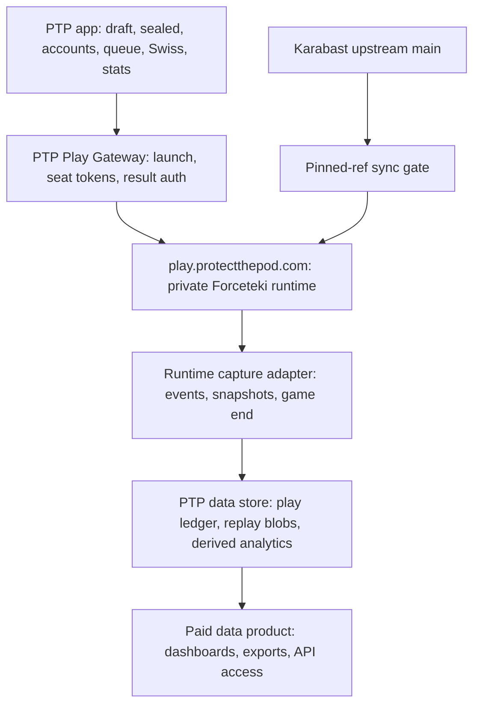
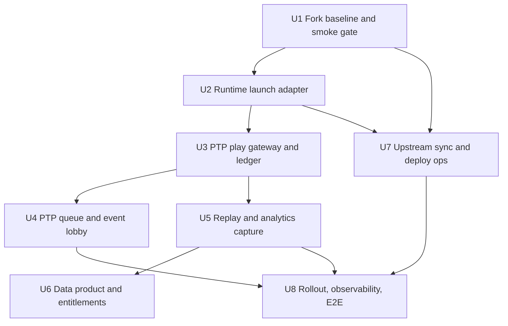
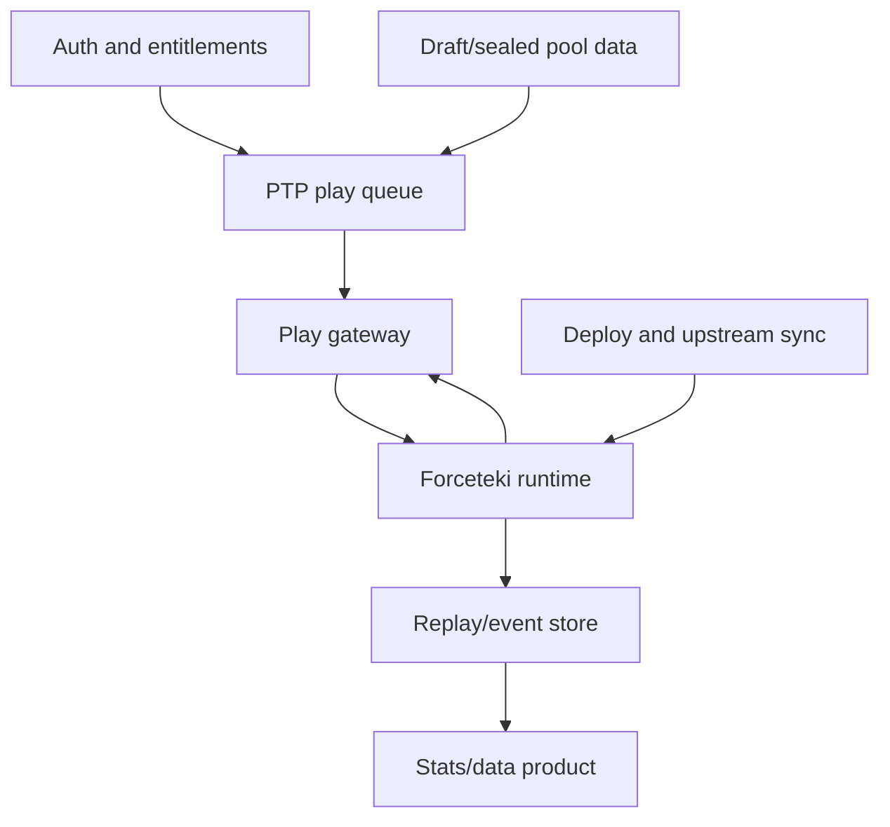

# feat: PTP-owned Forceteki limited play runtime

## Overview

Build PTP Play: a free-to-play, PTP-owned limited play venue that uses a private
Forceteki/Karabast runtime for the rules engine and table, while PTP owns the
lobby, limited queue, draft/sealed events, Swiss orchestration, replay capture,
analytics, and paid data access.

The key maintenance rule is stricter than "fork it and hack away": keep a thin
runtime fork, avoid local changes to card implementations and core rules, and
consume upstream `SWU-Karabast/forceteki` and `forceteki-client` frequently. PTP
changes should live in adapter/config modules, PTP-facing APIs, deployment
overlay, and analytics observers. If a change belongs in the engine, prefer an
upstream PR or keep it behind a tiny, well-tested boundary.

The origin requirements document framed the ideal as an unmodified black-box
Forceteki deploy. This plan preserves that spirit but reflects the newer product
decision: a thin private runtime fork is acceptable because PTP needs a custom
lobby, limited matchmaking queue, replays, analytics collection, and independent
data monetization.

> **Plan deepened 2026-06-23** after a confidence pass covering runtime origin,
> security boundaries, data integrity, deployment failure modes, and user-flow
> gaps. The pass added a v1 subdomain/seat-token decision, kill-switch
> requirement, stronger privacy/data lifecycle treatment, and explicit critical
> user flows.

**Target repos:** `swupod`, `ptp-forceteki`, `ptp-forceteki-client`.
Within each implementation unit, file paths are relative to the named target
repo.

## Problem Frame

Karabast declined or would not support the product surfaces PTP needs: limited
format matchmaking, replays, analytics/data collection, and PTP monetization.
The current Wayfinder integration helps users hand off to public Karabast, but
it cannot become the core limited data product because capture is opt-in,
off-site, plugin-dependent, and structurally incomplete.

PTP wants play to remain free. The paid product is access to limited data:
draft/sealed performance, replay-linked deck and pool outcomes, card and
archetype performance, event views, and eventually 17lands-like aggregate
analysis for Star Wars: Unlimited.

The hard engineering constraint is card currency. Forceteki is active and
valuable because upstream continuously implements cards and fixes rules. PTP
must be able to pull upstream `main` and receive new cards, features, and engine
bug fixes without recurring merge pain.

## Requirements Trace

- R1. Free play: users can play PTP limited games without paying.
- R2. PTP-owned limited queue: PTP can queue and match draft/sealed decks by
  set, pool type, event context, and Bo1/Bo3 policy.
- R3. PTP-owned event lobby: draft/sealed pods and Swiss events start and manage
  games from PTP, not Karabast's public lobby.
- R4. Private runtime: games run on a PTP-controlled Forceteki/Karabast deploy.
- R5. Thin fork discipline: local runtime changes avoid `server/game/cards`,
  core rules, and hot engine paths unless the change is upstreamed.
- R6. Upstream currency: PTP can advance to upstream `main`, run a smoke gate,
  and get new cards, card data, rule fixes, and table improvements.
- R7. Server-owned launch integrity: PTP seeds decks, identity, match metadata,
  and seat tokens server-to-server; the browser cannot substitute decks or seats.
- R8. Replays: every completed PTP game has a durable replay or replay-grade
  event log when capture succeeds; missing replay capture does not block result
  recording.
- R9. Analytics capture: every PTP game writes normalized, joinable data for
  pool, deck, draft/sealed source, match, game, card events, result, and replay.
- R10. Result integrity: result writes are idempotent, transactional, and scoped
  to the official PTP match/game identity.
- R11. Monetized data access: aggregate and advanced analytics are entitlement
  gated while play remains free.
- R12. Privacy and terms: players understand what gameplay data is collected,
  what is public/paid/private, and how PTP differs from Karabast's noncommercial
  terms.
- R13. Operational safety: deploys do not casually kill live games, and upstream
  bumps can roll back to the last known green ref.
- R14. Current PTP foundations are reused: existing Practice Swiss lifecycle,
  `practice_match_games`, Wayfinder result ingestion, PostHog limited events,
  personal stats, and patron gates are treated as prior art, not discarded.
- R15. Runtime safety switch: PTP can disable new runtime launches and queues
  without taking down existing stats, replays, pools, or non-runtime play pages.

## Scope Boundaries

- In scope: PTP-owned limited queue, custom PTP lobby, private Forceteki runtime,
  server-seeded games, replay/event capture, analytics pipeline, paid data
  surfaces, upstream sync, and operational rollout.
- In scope: a small runtime/client fork where needed for configuration, PTP
  launch, branding, replay/data observers, and internal APIs.
- Out of scope: writing SWU rules from scratch.
- Out of scope: local card implementation work as a normal operating model.
- Out of scope: charging users to play.
- Out of scope: ranked constructed/Premier ladder as a v1 goal.
- Out of scope: relying on the Wayfinder browser extension for the core PTP Play
  loop. Wayfinder can coexist as an off-site companion path.
- Out of scope: declaring official tournament winners or prize support.
- Out of scope: legal conclusions. This plan identifies privacy/IP/terms work
  that needs review before launch.

### Deferred to Separate Tasks

- Native bot opponents: separate engine project if ever desired.
- Full engine extraction into an npm/package boundary: long-term follow-up once
  the thin fork proves valuable.
- Multi-region game-node routing: defer until concurrency demands it.
- Same-origin `/play` reverse proxy: defer unless the product requires the game
  surface to remain on `www.protectthepod.com`. V1 uses a dedicated play
  subdomain with signed seat tokens so no shared cookies are required.
- Stripe migration from Patreon: optional future task. v1 can use existing
  Patreon/Discord entitlement patterns unless the data product needs finer SKUs.
- Public data API productization: v1 may include entitled dashboard/export
  endpoints, but a stable third-party API contract should be a separate product
  decision after replay/data quality is proven.

## Context & Research

### Relevant Code and Patterns

**PTP current foundations**

- `docs/brainstorms/2026-06-11-onsite-gameplay-performance-capture-requirements.md`
  already defines the native/on-site capture goal, server-seeded games,
  result idempotency, same-origin play preference, upstream sync, and privacy
  concerns.
- `docs/WAYFINDER_PLUGIN_LIVE_SWISS.md` defines an existing PTP-owned live Swiss
  contract with claim, lifecycle, and result callbacks.
- `migrations/072_create_practice_match_games.sql` already models per-game
  lifecycle, lobby metadata, replay URL, idempotency keys, attempts, and result.
- `src/services/matchmaking/liveGames.ts` already contains a state machine for
  claiming games, lifecycle updates, idempotent result recording, retries, and
  Swiss advancement.
- `app/api/draft/[shareId]/match/[matchId]/game/claim/route.ts` is the existing
  authenticated claim endpoint pattern.
- `app/api/plugin/v1/practice/match-game/lifecycle/route.ts` and
  `app/api/plugin/v1/match/result/route.ts` are the existing service-key callback
  patterns for lifecycle/result ingestion.
- `src/utils/matchmakingRounds.ts` joins `practice_match_games` into broadcast
  read models in one query.
- `src/lib/socketBroadcast.ts` broadcasts public draft state and existing Swiss
  state.
- `src/hooks/useWayfinderPracticeLaunch.ts`, `src/components/MatchmakingPanel.tsx`,
  and `src/components/MatchCard.tsx` are prior art for Play/Join state and
  live game UI, but this plan moves the runtime target from public Karabast
  through Wayfinder to PTP's private runtime.
- `src/analytics/limitedEvents.ts`, `docs/ANALYTICS.md`, and
  `docs/analytics/matchmaking-density.md` provide the limited event vocabulary,
  hashed ID pattern, and existing PostHog decision runbook.
- `app/api/stats/me/gameplay/route.ts`,
  `app/api/stats/deck/[shareId]/gameplay/route.ts`, and
  `src/components/YourStats/GameplayDashboard.tsx` already surface replay-linked
  gameplay stats.
- `app/api/auth/patron-status/route.ts`, `app/api/webhooks/patreon/route.ts`,
  and `src/contexts/AuthContext.jsx` provide current entitlement patterns.

**Forceteki/Karabast runtime**

- `SWU-Karabast/forceteki` is MIT licensed and states it is based on Ringteki
  architecture. It is not de novo for SWU.
- Fork operation must preserve MIT license notices and attribution. Karabast's
  code license does not settle SWU card/art/IP, brand, or data-product terms;
  those need separate launch review and PTP-owned public copy.
- Upstream server activity is high: 496 commits since 2026-01-01 and 240 since
  2026-04-01 at research time.
- Since 2026-04-01, upstream server churn was concentrated in areas PTP should
  consume rather than edit: `server/game/cards` had 511 file touches,
  `test/server/cards` 384, `server/game/core` 126, and
  `server/game/gameSystems` 38. Lower-churn but important files were
  `server/gamenode/Lobby.ts` with 9 touches and `server/gamenode/GameServer.ts`
  with 6 touches.
- `server/gamenode/GameServer.ts` already has `/api/create-lobby`,
  `/api/join-lobby`, `/api/available-lobbies`, `/api/enter-queue`, queue
  matchmaking, and in-memory lobby/game maps.
- `server/gamenode/Lobby.ts` creates lobby/spectate links, starts `Game`,
  sends `gamestate` via Socket.IO, handles game end, and updates existing stats
  handlers.
- `server/game/core/Game.ts` exposes game messages, state serialization, game
  end routing, and stats tracking.
- `server/gameStatistics/GameStatisticsTracker.ts` already tracks card metrics
  such as played, activated, discarded, drawn, and resourced.
- `scripts/fetchdata.js` fetches official card metadata and uses
  `card-data-version.txt` for cache busting. Card metadata is distinct from
  implemented card logic under `server/game/cards`.
- `SWU-Karabast/forceteki-client` is active but less hot: 117 commits since
  2026-01-01 and 68 since 2026-04-01. Its `QueueFormatConfigs` currently
  includes Premier and Eternal, not Limited; `LobbyFormatConfigs` includes
  Limited.

### Institutional Learnings

- No `docs/solutions/` directory exists in this repo, so the mandatory
  learnings search found no solution-library entries to carry forward.
- Repo-specific guidance comes from `CLAUDE.md` and `.claude/rules/`:
  - UI work must read `docs/STYLE_GUIDE.md` and
    `.claude/rules/ui-components.md` before editing components/CSS.
  - Use `src/components/Button.tsx`, `src/components/Modal.tsx`, and existing
    watch/replay/button patterns instead of inventing new UI primitives.
  - Database work uses idempotent migrations in `migrations/` and
    `lib/db.ts` helpers.
  - Tests should be spec-first, with behavior assertions rather than
    implementation-derived expectations.
  - Never push without explicit permission.

### External References

- Socket.IO multiple-node docs: multi-node Socket.IO needs load balancing and
  inter-server message forwarding; sticky sessions matter when polling is
  enabled. https://socket.io/docs/v4/using-multiple-nodes/
- Socket.IO Redis adapter docs: Redis adapter forwards packets through Redis
  Pub/Sub, but Redis must be private/trusted and sticky sessions can still be
  required. https://socket.io/docs/v4/redis-adapter/
- Railway Socket.IO guide: production CORS should be restricted, WebSocket
  upgrades need to work through proxies, and Redis adapter is the scale path.
  https://docs.railway.com/guides/socketio
- OWASP Secrets Management: runtime credentials should be generated strongly
  and scoped to minimum privileges. https://cheatsheetseries.owasp.org/cheatsheets/Secrets_Management_Cheat_Sheet.html
- PostHog privacy docs: the product owner is responsible for deciding what is
  collected and communicating that to users. https://posthog.com/docs/privacy
- Stripe Entitlements docs: if PTP later moves from Patreon to Stripe, feature
  access can map billing products to internal entitlements.
  https://docs.stripe.com/billing/entitlements

## Key Technical Decisions

- **PTP owns product surfaces; Forceteki owns rules/table.** PTP owns queue,
  lobby, Swiss, identity, data, monetization, and replay storage. Forceteki
  owns legal game execution and card behavior.
- **Thin fork, not product fork.** PTP may fork runtime/client repos, but avoids
  local card/core edits. Adapter modules, env-driven branding/URLs, runtime
  launch endpoints, and telemetry hooks are acceptable.
- **PTP queue first; Forceteki queue optional.** Do not rely on Forceteki's
  public quick queue for PTP limited. PTP should match users and ask the runtime
  to create official games.
- **Server-seeded games.** PTP prepares deck, seat, event, queue, and match
  metadata server-side, then gives each browser only a single-use seat token.
- **V1 game origin is `play.protectthepod.com`.** The runtime lives on a
  dedicated subdomain with restricted CORS and short-lived seat tokens. It does
  not need PTP session cookies, which avoids a same-origin WebSocket reverse
  proxy and avoids changing PTP cookies to a broad cross-subdomain policy.
  Same-origin `/play` remains a future branding/UX option once the runtime path
  is proven.
- **Generic play ledger plus Swiss compatibility.** Add a generic PTP play
  ledger for queues, sealed, draft, and future formats while preserving the
  current `practice_match_games` path for Practice Swiss until migration is
  justified.
- **Replay capture as event log first.** Product replay can start from
  action/game-state events plus periodic snapshots. Full deterministic replay
  playback is a later hardening layer.
- **Paid data, free play.** Entitlement gates advanced aggregate data and export
  access, not gameplay.
- **Single-node v1.** At a few hundred games/day, run one stable game node with
  graceful drain. Add Redis/sticky-session scale only when concurrency demands
  it.
- **Pinned upstream ref.** Runtime deploys track a pinned upstream commit. Bumps
  are gated by card-data refresh, build, unit tests, a deterministic game smoke
  test, and capture-payload validation.
- **Direction-specific runtime credentials.** Use a scoped PTP-to-runtime launch
  credential for creating games, and a separate scoped runtime-to-PTP
  result/capture key such as `FORCETEKI_RESULT_KEY` for callbacks. Do not reuse
  broad `PTP_SERVICE_KEY` in either direction.
- **Credential isolation.** The runtime never receives PTP database credentials.
  It can call only narrow launch/result/replay endpoints. Runtime credentials
  are rotated independently from existing Wayfinder/Patreon keys.
- **Kill switch before public alpha.** PTP needs an environment/config switch
  that stops new queue entries and runtime launches while leaving read-only
  stats/replays and existing pools available.
- **Terms cannot be copied from Karabast.** Karabast's public terms emphasize a
  free noncommercial fan project with minimal tracking. PTP needs its own terms,
  privacy copy, and data-access policy.

## Open Questions

### Resolved During Planning

- **Integration vs replacement:** this is a replacement/owned-runtime plan, not
  another browser-extension integration plan.
- **What is monetized:** data access, not play.
- **Fork posture:** thin private fork is acceptable, but upstream mergeability is
  a first-class design requirement.
- **V1 runtime size:** start with one game node; concurrency is likely low enough
  for vertical headroom rather than horizontal scaling.
- **Existing live Swiss work:** reuse current PTP lifecycle/result foundations
  rather than rebuilding them.
- **V1 runtime origin:** use `play.protectthepod.com` plus seat tokens; defer
  same-origin `/play` proxying until after the first private-runtime alpha.

### Deferred to Implementation

- **Exact runtime game-create API shape:** depends on what minimal entry point
  is least invasive in `GameServer.ts` and `Lobby.ts`.
- **Replay fidelity target:** implementation should start with raw event log plus
  snapshots, then decide whether deterministic replay playback is feasible
  without deeper engine hooks.
- **Abandonment rule:** confirm whether disconnects are voided from analytics,
  scored as losses, or represented separately.
- **Identity shown in runtime/replays:** decide exactly which PTP identifiers
  are sent to the runtime and persisted.
- **Public aggregate thresholds:** define minimum sample sizes and suppression
  rules before paid dashboards expose small cohorts.
- **Brand/name:** choose runtime-facing name later. The architecture should not
  depend on whether it is branded PTP Play, Purrgil, Space Whales, or another
  joke that survives contact with taste.
- **Patreon vs Stripe:** use current Patreon patterns unless data SKUs require
  richer entitlements.

## High-Level Technical Design

> *This illustrates the intended approach and is directional guidance for review, not implementation specification. The implementing agent should treat it as context, not code to reproduce.*



Implementation-unit dependencies:



### Output Structure

Expected repository shape is deliberately small and adapter-oriented:

```text
swupod/
  app/play/                         PTP lobby, queue, and handoff UI
  app/api/play/                     PTP play gateway, queue, runtime callbacks
  src/services/play/                Ledger, launch, result, replay, projections
  src/services/entitlements/        Data-product access gates
  docs/play/                        Runtime runbooks and rollout notes
  migrations/073-074...             Play ledger and replay/event storage

ptp-forceteki/
  server/ptp/                       PTP launch, seat-token, CORS, telemetry adapters
  scripts/ptp/                      Upstream sync, card support, smoke checks
  docs/ptp/                         Fork, deployment, and operations notes
  test/server/ptp/                  PTP adapter and smoke characterization tests

ptp-forceteki-client/
  src/app/_ptp/                     Runtime config and branded route helpers
  src/app/ptp/game/                 PTP seat-token game entry surface
  docs/ptp/                         Client fork and branding notes
```

## Critical User Flows

1. **Draft/Swiss event game:** player finishes a draft deck, opens the PTP event
   play page, clicks Play for the assigned pairing, receives a signed runtime
   seat URL, plays on `play.protectthepod.com`, and returns to PTP to see game
   status, replay, record, and next-round state.
2. **Limited queue game:** player chooses a valid draft or sealed deck, enters a
   PTP-owned queue, cancels or waits, gets matched with a compatible deck, and
   joins the private runtime game through PTP.
3. **Result and replay capture:** runtime emits lifecycle, replay events, and
   game end; PTP stores raw events, derives analytics, writes W/L once, and
   shows replay status even when replay capture is incomplete.
4. **Unsupported card path:** player has a legal PTP deck containing a card not
   implemented upstream; PTP blocks runtime Play before launch and offers a
   fallback instead of creating a broken game.
5. **Paid data access:** any user can play and see personal games; entitled
   users can access advanced aggregate views and exports, with cohort
   suppression and privacy limits applied server-side.
6. **Runtime outage:** runtime health fails or kill switch is on; PTP stops new
   launches/queues, keeps existing data surfaces alive, and preserves manual or
   off-site fallback where available.

## Phased Delivery

### Phase A: Make-or-Break Feasibility

Prove a private runtime can launch a PTP-seeded limited game, capture the
result, and survive one upstream bump with a small diff.

**Exit criteria:** one PTP-seeded limited game starts through the private
runtime, result capture reaches PTP idempotently, a replay/event batch is stored
or explicitly marked missing, and an upstream bump can be tested without manual
conflict surgery.

**Pivot criteria:** if the adapter requires persistent local edits in card
implementations/core rules, if `Lobby.ts`/`GameServer.ts` changes cannot stay
small after one upstream bump, or if capture cannot be observed outside card
code, stop and redesign before building the queue/data product.

### Phase B: Free PTP Play MVP

Ship PTP-owned limited play for a narrow audience: competitive draft pods or a
small sealed/draft alpha queue. Use the current Swiss foundations where they
fit.

### Phase C: Replay/Data Product

Store replay-grade events, build normalized analytics read models, and gate
advanced aggregate data behind existing patron/admin access.

### Phase D: Scale And Automation

Automate upstream sync, add deploy drain, broaden queues/events, and prepare
multi-node Socket.IO only when concurrency requires it.

## Implementation Units

- [ ] **Unit 1: Fork Baseline And Smoke Gate**

**Goal:** Establish private `ptp-forceteki` and `ptp-forceteki-client` forks that
can deploy vanilla upstream, run tests, and prove upstream bumps are measurable.

**Requirements:** R4, R5, R6, R13

**Dependencies:** None.

**Files:**

Target repo: `ptp-forceteki`
- Create: `docs/ptp/UPSTREAM_SYNC.md`
- Create: `docs/ptp/DEPLOYMENT.md`
- Create: `server/ptp/README.md`
- Create: `.github/workflows/ptp-runtime-smoke.yml`
- Modify: `Dockerfile`
- Modify: `package.json`
- Test: `test/server/ptp/deployContract.spec.ts`

Target repo: `ptp-forceteki-client`
- Create: `docs/ptp/UPSTREAM_SYNC.md`
- Create: `docs/ptp/BRANDING_AND_ROUTES.md`
- Test: `src/app/_ptp/ptpConfig.test.ts`

Target repo: `swupod`
- Create: `docs/play/forceteki-runtime-runbook.md`
- Test: `docs/play/forceteki-runtime-runbook.test.md` if the repo's doc-test
  pattern exists; otherwise `Test expectation: none -- documentation/runbook`

**Approach:**

- Add `upstream` remotes and document the branch model: upstream-clean branch,
  PTP runtime branch, and last-known-green pinned ref.
- Keep the first deploy vanilla except environment-driven URL/CORS settings.
- Define a smoke test that boots server and client, checks health, checks `/ws`,
  creates a limited lobby through existing APIs, and verifies a simple game can
  start in test setup.
- Record baseline upstream churn and local diff size in the runbook.

**Execution note:** Characterization-first. Capture vanilla behavior before
adding PTP runtime APIs.

**Patterns to follow:**

- Forceteki `npm run get-cards`, `npm test`, and existing Jasmine test layout.
- Forceteki `GameServer.ts` health route and Socket.IO `/ws` path.
- PTP docs under `docs/WAYFINDER_PLUGIN_LIVE_SWISS.md` for cross-repo contracts.

**Test scenarios:**

- Happy path: vanilla runtime boots with current card data and exposes health.
- Happy path: limited lobby can be created with a valid deck and current card
  pool.
- Error path: missing card data fails the build/deploy gate before promotion.
- Integration: bump upstream by one commit, run the smoke gate, and produce a
  pass/fail artifact without manual repo edits.

**Verification:**

- A private vanilla deploy runs.
- The fork diff is documented and small.
- A failed smoke gate prevents promotion.

- [ ] **Unit 2: Runtime Launch Adapter**

**Goal:** Add the smallest possible PTP runtime adapter that lets PTP create an
official game with server-supplied decks, players, match metadata, and seat
tokens.

**Requirements:** R3, R4, R5, R7, R10

**Dependencies:** Unit 1.

**Files:**

Target repo: `ptp-forceteki`
- Create: `server/ptp/PtpRuntimeApi.ts`
- Create: `server/ptp/PtpSeatToken.ts`
- Create: `server/ptp/PtpGameRegistry.ts`
- Create: `server/ptp/PtpResultClient.ts`
- Create: `server/ptp/PtpCors.ts`
- Modify: `server/gamenode/GameServer.ts`
- Modify: `server/gamenode/Lobby.ts`
- Modify: `server/env.ts`
- Test: `test/server/ptp/PtpRuntimeApi.spec.ts`
- Test: `test/server/ptp/PtpSeatToken.spec.ts`
- Test: `test/server/ptp/PtpGameLaunch.spec.ts`

Target repo: `ptp-forceteki-client`
- Create: `src/app/ptp/game/page.tsx`
- Create: `src/app/_ptp/ptpRuntimeConfig.ts`
- Modify: `src/app/_contexts/Game.context.tsx`
- Test: `src/app/_ptp/ptpRuntimeConfig.test.ts`

**Approach:**

- Register PTP routes from one adapter module rather than spreading route code
  through `GameServer.ts`.
- Introduce a signed, short-lived seat token that binds PTP user, game, side,
  deck, and runtime lobby id.
- Restrict allowed browser origins to PTP production/staging origins and local
  development hosts. Do not use wildcard CORS in production.
- Use separate credentials for `PTP -> runtime create game` and
  `runtime -> PTP result/replay callback`; neither key should authorize the
  other direction.
- Create private lobbies/games server-side using existing `Lobby` and `Game`
  flow where possible.
- Make hardcoded `karabast.net` lobby/spectate URLs environment-driven.
- Keep the public Karabast lobby and quick queue available in the fork only if
  needed for admin testing; PTP production flows should bypass them.

**Technical design:** Directional only.

```text
POST /api/ptp/games
  auth: PTP-to-runtime launch key
  body: PTP match id, game id, format, card pool, two seats, decklists
  result: runtime game id, lobby id, seat URLs/tokens, expires_at

Browser joins:
  https://play.protectthepod.com/ptp/game?seatToken=...
  runtime verifies token -> maps socket user to official lobby seat
```

**Patterns to follow:**

- Existing `GameServer.createLobby`, `matchmakeQueuePlayersAsync`, and
  `Lobby.startGameAsync`.
- Existing Forceteki auth middleware and deck validation.
- PTP `requireServiceKey` pattern, but with a dedicated runtime key.

**Test scenarios:**

- Happy path: PTP creates a limited game with two valid decks, both seat tokens
  join the same runtime lobby, and game state is sent to both seats.
- Edge case: the same seat token reused after connection is rejected or treated
  as reconnect according to the chosen policy.
- Edge case: player A cannot use player B's token.
- Error path: invalid deck, missing implemented card, expired token, and wrong
  service key each fail without creating a live game.
- Error path: launch key cannot call result/replay callbacks, and result key
  cannot create runtime games.
- Error path: request from an unapproved origin cannot establish the runtime
  game socket.
- Integration: a game created through the PTP adapter still uses upstream deck
  validation and existing game start code.

**Verification:**

- PTP can create a private runtime game without using public Karabast lobby UI.
- Local changes to `GameServer.ts` and `Lobby.ts` are minimal and documented.

- [ ] **Unit 3: PTP Play Gateway And Ledger**

**Goal:** Add PTP-side APIs and storage that own official play sessions,
matches, games, seats, queue entries, runtime launch requests, result
idempotency, and joins to pools/decks/drafts.

**Requirements:** R2, R7, R9, R10, R14

**Dependencies:** Unit 2 for final runtime contract; can start from contract
stubs.

**Files:**

Target repo: `swupod`
- Create: `migrations/073_create_ptp_play_sessions.sql`
- Create: `src/services/play/playLedger.ts`
- Create: `src/services/play/runtimeLaunch.ts`
- Create: `src/services/play/runtimeAvailability.ts`
- Create: `src/services/play/seatTokens.ts`
- Create: `src/services/play/resultIngestion.ts`
- Create: `app/api/play/runtime/games/route.ts`
- Create: `app/api/play/runtime/games/[gameId]/result/route.ts`
- Create: `app/api/play/runtime/games/[gameId]/events/route.ts`
- Modify: `src/services/matchmaking/liveGames.ts`
- Modify: `app/api/plugin/v1/match/result/route.ts`
- Test: `src/services/play/playLedger.test.ts`
- Test: `src/services/play/runtimeLaunch.test.ts`
- Test: `src/services/play/resultIngestion.test.ts`
- Test: `app/api/play/runtime/games/route.test.ts`

**Approach:**

- Add generic play tables for queue/event games rather than overloading
  `practice_matches` forever.
- Preserve current Practice Swiss paths by bridging `practice_match_games` into
  the generic ledger or linking rows with a nullable foreign key.
- Store one row per official game attempt, one row per seat, and one immutable
  event/result record per idempotency key.
- Include a runtime availability/kill-switch check in every launch and queue
  match path. Existing read-only stats and replay routes must not depend on the
  switch.
- Generate runtime launch payloads server-side from PTP DB state. Do not accept
  browser-supplied deck JSON as official state.
- Use `withTransaction()` and advisory-lock patterns where result writes can
  advance Swiss rounds or update both players' records.
- Treat runtime callback endpoints as private server-to-server APIs: no browser
  session auth, no public CORS, strict body-size limits, scoped key auth, replay
  protection through idempotency keys, and structured rejection logs.

**Patterns to follow:**

- `migrations/072_create_practice_match_games.sql` for lifecycle shape.
- `src/services/matchmaking/liveGames.ts` for state transitions and retries.
- `src/utils/draftAdvance.ts` and `lib/db.ts` for transactional/advisory-lock
  style.
- `src/analytics/limitedEvents.ts` for hashed IDs in product analytics.

**Test scenarios:**

- Happy path: a draft pool match creates a play session, game, two seats, and a
  runtime launch request that maps both seats to the correct pool/deck rows.
- Happy path: a sealed queue match writes the same generic play rows without a
  draft pod.
- Edge case: one user has no built deck; launch is blocked before contacting the
  runtime.
- Edge case: a card unsupported by Forceteki blocks launch with a clear reason.
- Edge case: runtime kill switch is enabled; queue entry and launch attempts are
  rejected or paused without deleting user decks or existing matches.
- Error path: duplicate runtime result idempotency key is a no-op and does not
  double count W/L.
- Integration: a completed game can join `result -> play_game -> seat -> card_pool
  -> deck_builder_state -> pod/draft source`.

**Verification:**

- PTP has a generic, queryable play ledger independent of Wayfinder.
- Existing Practice Swiss tests still pass or have explicit compatibility tests.

- [ ] **Unit 4: PTP Limited Queue And Event Lobby**

**Goal:** Build the PTP-owned queue and lobby surfaces that replace Karabast's
public lobby for limited play.

**Requirements:** R1, R2, R3, R4, R14

**Dependencies:** Unit 3.

**Files:**

Target repo: `swupod`
- Create: `app/play/page.tsx`
- Create: `app/play/PlayLobby.tsx`
- Create: `app/play/PlayQueuePanel.tsx`
- Create: `app/play/play.css`
- Create: `app/api/play/queue/route.ts`
- Create: `app/api/play/queue/[entryId]/route.ts`
- Create: `app/api/play/matches/[matchId]/join/route.ts`
- Modify: `app/pool/[shareId]/deck/play/page.tsx`
- Modify: `app/draft/[shareId]/pod/page.tsx`
- Modify: `app/sealed/[shareId]/pod/page.tsx`
- Modify: `src/components/PlayInstructions.tsx`
- Modify: `src/lib/socketBroadcast.ts`
- Test: `app/api/play/queue/route.test.ts`
- Test: `src/services/play/queue.test.ts`
- Test: `src/components/PlayInstructions.test.ts`
- Test: `tests/e2e/ptp-play-queue.spec.ts`

**Approach:**

- Provide a real app surface, not a marketing page. First screen should be the
  user's available limited decks/events, active queues, and current matches.
- First screen information architecture:
  - **Ready to play:** assigned event matches and decks with no blocking issues.
  - **In queue:** active queue entries with wait state, cancel action, and
    expiry/retry state.
  - **Needs attention:** invalid decks, unsupported cards, runtime unavailable,
    and sign-in requirements.
  - **Recent games:** latest results with replay/status links when available.
- Queue compatibility should include pool type, set, card pool, Bo1/Bo3, and
  optionally event/pod scope.
- Queue entries need explicit cancel, expire, matched, launch-failed, and
  retryable states so users are not trapped by stale runtime state.
- Draft/sealed event lobbies should launch assigned games from the event context
  first, with general queue as a separate action.
- Keep manual/off-site fallback links available during alpha.
- Reuse existing `MatchmakingPanel`/`MatchCard` concepts for live statuses, but
  avoid Karabast branding and public lobby affordances.

**Execution note:** UI implementation must read `docs/STYLE_GUIDE.md` and
`.claude/rules/ui-components.md` before editing components/CSS.

**Patterns to follow:**

- `MatchmakingPanel.tsx` and `MatchCard.tsx` for live game states.
- `PlayInstructions.tsx` for existing play-page affordances.
- `Button`, `Modal`, `PluginCTA`, and replay/watch prior-art CSS.

**Test scenarios:**

- Happy path: user with a valid sealed deck enters a compatible limited queue
  and receives a match when another compatible entry exists.
- Happy path: a competitive draft pod player starts their assigned Swiss game
  from the PTP event lobby.
- Edge case: queue entry expires or user disconnects before a match; entry is
  removed or marked stale without creating an orphaned game.
- Edge case: matched game fails to launch; both entries are either returned to
  queue or marked failed according to the chosen retry policy.
- Edge case: same user cannot queue the same deck into incompatible queues at
  the same time.
- Error path: unauthenticated user is prompted to sign in; invalid/missing deck
  is blocked before runtime launch.
- Integration: match creation broadcasts state to both players and can open the
  private runtime seat URL.
- E2E: two browser contexts create decks, queue, match, and reach the runtime
  handoff page without relying on public Karabast.
- UI state: verify loading, empty, runtime-unavailable, unsupported-card,
  queue-paused, matched, launch-failed, and replay-missing states.

**Verification:**

- A player can go from PTP pool/deck to a matched private runtime game.
- PTP lobby contains no dependency on Karabast public lobby branding or filters.

- [ ] **Unit 5: Replay And Analytics Capture Pipeline**

**Goal:** Capture replay-grade runtime events and normalized analytics so PTP can
build a 17lands-like limited dataset.

**Requirements:** R8, R9, R10, R12

**Dependencies:** Units 2 and 3.

**Files:**

Target repo: `ptp-forceteki`
- Create: `server/ptp/PtpTelemetrySink.ts`
- Create: `server/ptp/PtpReplayRecorder.ts`
- Modify: `server/gamenode/Lobby.ts`
- Modify: `server/game/core/Game.ts` only if no lower-risk event boundary exists
- Test: `test/server/ptp/PtpTelemetrySink.spec.ts`
- Test: `test/server/ptp/PtpReplayRecorder.spec.ts`

Target repo: `swupod`
- Create: `migrations/074_create_ptp_replay_events.sql`
- Create: `src/services/play/replayIngestion.ts`
- Create: `src/services/play/analyticsProjection.ts`
- Create: `src/services/play/cardMetrics.ts`
- Create: `app/api/play/runtime/games/[gameId]/replay-events/route.ts`
- Create: `app/api/stats/limited/play/route.ts`
- Modify: `app/api/stats/me/gameplay/route.ts`
- Modify: `app/api/stats/deck/[shareId]/gameplay/route.ts`
- Test: `src/services/play/replayIngestion.test.ts`
- Test: `src/services/play/analyticsProjection.test.ts`
- Test: `app/api/stats/limited/play/route.test.ts`

**Approach:**

- Capture three layers:
  - Raw runtime event stream for replay/debugging.
  - Periodic state snapshots or state deltas for replay resilience.
  - Derived analytics facts for query performance.
- Start with game start, action, card movement/played/resourced/drawn metrics,
  prompt choices where safely observable, game end, winner, concessions, and
  disconnect/abandonment markers.
- Store raw replay blobs in object storage if payloads are large; keep metadata
  and derived facts in Postgres.
- Version replay schemas. Upstream rule/card changes must not make old replay
  rows unreadable.
- Keep raw replay/event data immutable. Re-run derived projections when schema
  versions change instead of editing historical raw payloads.
- Avoid putting analytics code into individual card implementations.

**Patterns to follow:**

- Forceteki `GameStatisticsTracker.ts` and `SwuStatsHandler.ts` as proof that
  game/card metrics can be emitted outside card code.
- PTP `GameplayDashboard.tsx` and stats routes for replay-linked summaries.
- Existing hashed-ID product analytics in `limitedEvents.ts`.

**Test scenarios:**

- Happy path: a completed game writes replay metadata, raw events, derived card
  metrics, and result facts tied to both seats.
- Happy path: a replay event batch can be replayed into the same derived summary
  idempotently.
- Edge case: event batch arrives before game-end result; analytics projection
  remains pending and completes later.
- Edge case: replay schema version changes after an upstream bump; old raw
  events remain readable or are handled by a documented compatibility path.
- Edge case: game result arrives without replay events; W/L is preserved and
  replay status is marked missing.
- Error path: malformed replay event batch is rejected without corrupting result
  state.
- Integration: personal gameplay and deck gameplay stats include PTP runtime
  games alongside Wayfinder/casual games without duplicate rows.

**Verification:**

- Completed PTP games are queryable by pool, deck, leader/base, opponent,
  source event, card metrics, result, and replay status.
- Replay capture failures are visible in monitoring.

- [ ] **Unit 6: Data Product, Entitlements, Privacy, And Terms**

**Goal:** Package collected gameplay data into free and paid surfaces while
making collection, retention, and access rules explicit.

**Requirements:** R1, R9, R11, R12

**Dependencies:** Unit 5 for real data; can start with fixtures.

**Files:**

Target repo: `swupod`
- Create: `src/services/entitlements/dataAccess.ts`
- Create: `app/api/stats/limited/meta/route.ts`
- Create: `app/api/stats/limited/cards/route.ts`
- Create: `app/api/stats/limited/export/route.ts`
- Create: `app/stats/limited/page.tsx`
- Create: `app/stats/limited/limited-stats.css`
- Modify: `app/me/page.tsx`
- Modify: `src/components/YourStats/GameplayDashboard.tsx`
- Modify: `app/privacy-policy/page.tsx`
- Modify: `app/terms-of-service/page.tsx`
- Modify: `docs/ANALYTICS.md`
- Test: `src/services/entitlements/dataAccess.test.ts`
- Test: `app/api/stats/limited/meta/route.test.ts`
- Test: `app/api/stats/limited/export/route.test.ts`
- Test: `src/components/YourStats/index.test.tsx`

**Approach:**

- Keep free surfaces useful: users can see their own games, records, and replay
  links.
- V1 paid surface should be narrow and legible: aggregate limited meta/cards,
  deeper filters, and entitled CSV/export access. Draft pick-order analytics and
  stable third-party API access are follow-up product surfaces unless this phase
  explicitly scopes their contracts.
- Use current `isPatron`/admin patterns initially. If product SKUs require
  finer gates, add a neutral entitlement abstraction so Patreon or Stripe can
  back it later.
- Define privacy rules before launch:
  - Which data is attached to user identity.
  - Which data is shown to opponents/event participants.
  - Which data is aggregated for paid access.
  - Minimum sample size and suppression for small cohorts.
  - Retention and deletion policy for raw replays/events.
- Separate product analytics from paid gameplay analytics. PostHog-style
  behavioral analytics should continue to avoid raw share IDs; paid gameplay
  analytics can use internal IDs server-side but must expose only permitted
  aggregates or user-owned details.
- Update public terms because PTP's paid data product cannot reuse Karabast's
  noncommercial/no-tracking posture.

**Execution note:** Product copy should avoid legal overclaiming. Terms/privacy
updates should be reviewed before public launch.

**Patterns to follow:**

- Existing patron gating in `app/stats/page.tsx` and import-pool routes.
- `docs/ANALYTICS.md` hashed-ID guidance and no raw share IDs in product
  analytics.
- `YourStats` tabs for personal stats layout and replay rows.

**Test scenarios:**

- Happy path: a non-paying user can view their own games and replay links.
- Happy path: a patron/admin can view aggregate limited meta and export a
  permitted dataset.
- Edge case: aggregate endpoint suppresses cohorts below the minimum sample
  size.
- Edge case: replay/event raw payload includes user-identifying metadata; export
  routes redact or omit it unless the requester owns the game or has explicit
  admin access.
- Edge case: anonymous/ownerless pool data does not expose private user
  identity.
- Error path: unauthenticated export request is rejected; non-entitled export
  request receives a clear paywall response.
- Integration: entitlement state changes are reflected by API responses and UI
  without relying on client-only hiding.

**Verification:**

- Play remains free.
- Paid data access is enforced server-side.
- Privacy/terms describe the actual collection and access model.

- [ ] **Unit 7: Upstream Sync, Card Currency, And Runtime Operations**

**Goal:** Make upstream card/rule updates routine and safe without turning the
fork into a merge treadmill.

**Requirements:** R5, R6, R13

**Dependencies:** Units 1, 2, and 5.

**Files:**

Target repo: `ptp-forceteki`
- Create: `scripts/ptp/upstream-sync-check.js`
- Create: `scripts/ptp/card-implementation-check.js`
- Create: `scripts/ptp/runtime-smoke-game.js`
- Create: `.github/workflows/ptp-upstream-sync.yml`
- Modify: `card-data-version.txt` only through upstream/card-data workflow
- Test: `test/server/ptp/CardImplementationCheck.spec.ts`
- Test: `test/server/ptp/RuntimeSmokeGame.spec.ts`

Target repo: `ptp-forceteki-client`
- Create: `scripts/ptp/client-smoke.js`
- Create: `.github/workflows/ptp-client-upstream-sync.yml`
- Test: `src/app/_ptp/clientSmoke.test.ts`

Target repo: `swupod`
- Create: `.github/workflows/ptp-runtime-sync.yml`
- Create: `scripts/check-forceteki-card-support.ts`
- Create: `src/services/play/cardSupport.ts`
- Create: `src/services/play/runtimeHealth.ts`
- Modify: `src/data/cards.json` only through existing card sync process
- Test: `scripts/check-forceteki-card-support.test.ts`
- Test: `src/services/play/cardSupport.test.ts`

**Approach:**

- Track upstream by pinned commit, not unpinned floating `main`.
- Run the sync gate on demand for v1; schedule once the alpha path is stable.
- Gate promotion on:
  - upstream fetch and merge/rebase conflict check,
  - install/build,
  - Forceteki tests,
  - card-data refresh,
  - PTP card ID reconciliation,
  - implementation-gap check for cards in active PTP limited sets,
  - deterministic game smoke,
  - capture payload correctness,
  - client table smoke.
- Maintain last-known-green ref and rollback instructions.
- Deploy with a drain/maintenance window at v1; add graceful active-game drain
  before larger public launch.
- Store the pinned runtime/client refs in a place PTP can display in admin
  health output, so support can see exactly what version players are using.

**Patterns to follow:**

- Forceteki `scripts/fetchdata.js`, `card-data-version.txt`, and card tests.
- PTP `.github/workflows/sync-swuapi-cards.yml`.
- Socket.IO/Railway guidance: single node first, Redis/sticky sessions only
  when multi-node routing is required.

**Test scenarios:**

- Happy path: upstream bump with new card implementations passes and promotes.
- Happy path: PTP pool containing all implemented cards is marked playable.
- Edge case: PTP pool contains a card in metadata but not implemented in
  Forceteki; Play is blocked before runtime launch.
- Error path: upstream bump changes `Lobby.ts`/`GameServer.ts` contract and
  smoke gate fails with actionable output.
- Error path: replay/capture payload winner does not match the scripted smoke
  result; promotion is blocked.
- Integration: rollback restores last-known-green runtime while PTP continues
  to show clear play availability.
- Integration: runtime health fails and PTP disables new launches while keeping
  stats/replay pages available.

**Verification:**

- New upstream cards are consumable without local card edits.
- A broken upstream commit cannot silently reach production.

- [ ] **Unit 8: Rollout, Observability, E2E, And Load Envelope**

**Goal:** Launch safely through alpha, measure reliability and data quality, and
define the path from a few hundred games/day to higher concurrency.

**Requirements:** R1, R8, R9, R10, R13

**Dependencies:** Units 3 through 7.

**Files:**

Target repo: `swupod`
- Create: `docs/play/ptp-play-rollout.md`
- Create: `docs/play/ptp-play-observability.md`
- Create: `tests/e2e/ptp-play-runtime.spec.ts`
- Create: `tests/e2e/ptp-play-swiss.spec.ts`
- Create: `tests/e2e/ptp-play-replay.spec.ts`
- Modify: `docs/analytics/matchmaking-density.md`
- Modify: `docs/ANALYTICS.md`
- Test: `tests/e2e/ptp-play-runtime.spec.ts`

Target repo: `ptp-forceteki`
- Create: `docs/ptp/OPERATIONS.md`
- Create: `scripts/ptp/load-smoke.js`
- Test: `test/server/ptp/operationsSmoke.spec.ts`

**Approach:**

- Roll out in gates:
  - Internal two-player game.
  - Admin-only alpha with one draft/sealed event.
  - Patron beta for limited queue.
  - Free public limited play once capture and support burden are acceptable.
- Track operational metrics:
  - active games,
  - queue entries,
  - launch failures,
  - socket disconnects,
  - replay capture success rate,
  - result idempotency duplicates,
  - games with missing derived analytics,
  - upstream ref and smoke status.
- Add an admin-only operational view or log summary that shows runtime health,
  kill-switch status, pinned refs, active games, failed launches, and replay
  capture success rate.
- Use a single 2 vCPU / 4 GB game node for v1 unless measurement says
  otherwise. For larger scale, add Redis adapter/private Redis, sticky sessions
  or WebSocket-only transport decision, and node drain.
- Keep public Karabast and Wayfinder fallback available during alpha.

**Patterns to follow:**

- Existing Playwright tests and `docs/WAYFINDER_PLUGIN_LIVE_SWISS_E2E.md`.
- PTP analytics runbook structure in `docs/analytics/matchmaking-density.md`.
- Forceteki built-in game server metrics around event loop, heap, GC, and game
  counts.

**Test scenarios:**

- E2E happy path: two users play a PTP-seeded limited game and both receive a
  recorded result.
- E2E happy path: a Swiss round launches games, records results, and advances.
- E2E replay: completed game produces a replay link or replay status and stats
  rows.
- Edge case: runtime unavailable; PTP leaves queue/match state recoverable and
  shows fallback.
- Edge case: kill switch is enabled during queue wait; users see paused/unavailable
  state and can leave the queue.
- Edge case: deploy drain starts while games are active; new games are blocked
  and active games are allowed to finish or clearly marked interrupted.
- Load smoke: v1 target concurrency, e.g. 20-40 active games, maintains
  acceptable event-loop delay and capture latency.

**Verification:**

- Alpha launch has a rollback plan, observability, and clear support playbook.
- Load envelope is based on measurement rather than guesswork.

## System-Wide Impact



- **Interaction graph:** Auth, draft/sealed pool data, queue, runtime launch,
  Socket.IO game state, replay ingestion, result ingestion, stats APIs, and
  entitlement gates all interact. The queue and gateway become a new central
  product path.
- **Error propagation:** Runtime failures should mark launch/game state as
  failed or retryable in PTP, not leave players waiting in a dead queue. Replay
  failures should not erase results.
- **State lifecycle risks:** duplicate result callbacks, stale queue entries,
  abandoned games, expired seat tokens, runtime deploy interruptions, kill-switch
  transitions, and upstream card support gaps need explicit statuses.
- **API surface parity:** human UI actions and future agents/admin tools should
  operate through the same PTP play APIs.
- **Integration coverage:** unit tests alone cannot prove the browser/runtime
  socket flow; E2E and runtime smoke are required.
- **Unchanged invariants:** PTP's draft/sealed pool creation, current manual
  result fallback, existing Wayfinder stats, and public card data sync should
  keep working during rollout.

## Alternative Approaches Considered

| Approach | Why Not Primary |
|---|---|
| Keep using public Karabast plus Wayfinder | Does not give PTP limited queue, replay ownership, complete capture, or data monetization. |
| Greenfield SWU rules engine | Maximum control but enormous ongoing card/rules burden. |
| Heavy Karabast client/server fork | Fast early customization but high merge pain, especially around cards/core/client table changes. |
| Pure black-box deploy with no runtime fork | Best mergeability, but may not expose enough launch/capture hooks for queue, replay, and data product goals. |
| Thin private fork with adapter boundaries | Chosen balance: enough control while preserving upstream card/rule consumption. |

## Success Metrics

- First internal PTP-seeded limited game completes with automatic result capture.
- Upstream bump merges cleanly or fails the gate with actionable output.
- At least 95% of completed PTP runtime games record a result.
- At least 90% of completed PTP runtime games produce replay metadata or a
  clear replay-missing status.
- No local changes under `server/game/cards` for normal PTP operation.
- Free play can handle a few hundred games/day with single-node headroom.
- Paid data surfaces answer at least one meaningful limited question: e.g. win
  rate by pool/deck leader/base, card drawn/played/resourced correlation, or
  archetype matchup split.

## Risk Analysis & Mitigation

| Risk | Likelihood | Impact | Mitigation |
|---|---:|---:|---|
| Upstream churn creates merge conflicts | Medium | High | Keep PTP changes in adapter modules; avoid cards/core; weekly/on-demand sync. |
| Card metadata exists but card is not implemented | High around set release | High | Add implementation-gap check before showing Play. |
| Runtime result can be forged or replayed | Medium | High | Seat tokens, scoped runtime key, idempotency keys, transaction locks. |
| Replays grow storage quickly | Medium | Medium | Store blobs in object storage, metadata in Postgres, retention policy before launch. |
| Paid data exposes small-cohort private info | Medium | High | Minimum sample thresholds, suppression, privacy review, terms update. |
| Runtime outage leaves users stuck | Medium | High | Kill switch, health check, queue pause/cancel states, manual/off-site fallback. |
| Deploy interrupts active games | Medium | Medium | v1 deploy windows/drain; later active-game drain and node rotation. |
| Multi-node Socket.IO scaling is harder than expected | Low for v1 | Medium | Start single-node; add Redis/sticky sessions only when measured concurrency demands it. |
| Community/IP backlash to monetized data | Medium | High | Keep play free, monetize access to derived data, clear terms, avoid Karabast branding confusion. |
| Analytics code pollutes engine/card code | Medium | High | Observer/sink boundary; never add analytics to card implementations. |

## Documentation / Operational Notes

- Add a public-facing PTP Play data collection summary before alpha.
- Add a private operations runbook for runtime deploy, drain, rollback, and
  upstream bump.
- Add a maintainer note explaining which runtime files are allowed to diverge
  and which are "upstream only".
- Update `docs/ANALYTICS.md` with PTP runtime events and privacy rules.
- Keep `docs/WAYFINDER_PLUGIN.md` accurate: Wayfinder remains supported but is
  not the core PTP Play runtime.

## Sources & References

- Origin document: `docs/brainstorms/2026-06-11-onsite-gameplay-performance-capture-requirements.md`
- Existing live Swiss contract: `docs/WAYFINDER_PLUGIN_LIVE_SWISS.md`
- Existing Wayfinder plugin notes: `docs/WAYFINDER_PLUGIN.md`
- Matchmaking density analytics: `docs/analytics/matchmaking-density.md`
- Existing live-game migration: `migrations/072_create_practice_match_games.sql`
- Existing live-game service: `src/services/matchmaking/liveGames.ts`
- Existing result route: `app/api/plugin/v1/match/result/route.ts`
- Existing lifecycle route: `app/api/plugin/v1/practice/match-game/lifecycle/route.ts`
- Existing PTP play UI prior art: `src/components/PlayInstructions.tsx`
- Existing stats prior art: `src/components/YourStats/GameplayDashboard.tsx`
- Upstream Forceteki: https://github.com/SWU-Karabast/forceteki
- Upstream Forceteki client: https://github.com/SWU-Karabast/forceteki-client
- Socket.IO multiple nodes: https://socket.io/docs/v4/using-multiple-nodes/
- Socket.IO Redis adapter: https://socket.io/docs/v4/redis-adapter/
- Railway Socket.IO guide: https://docs.railway.com/guides/socketio
- OWASP Secrets Management Cheat Sheet: https://cheatsheetseries.owasp.org/cheatsheets/Secrets_Management_Cheat_Sheet.html
- PostHog privacy docs: https://posthog.com/docs/privacy
- Stripe Entitlements: https://docs.stripe.com/billing/entitlements
