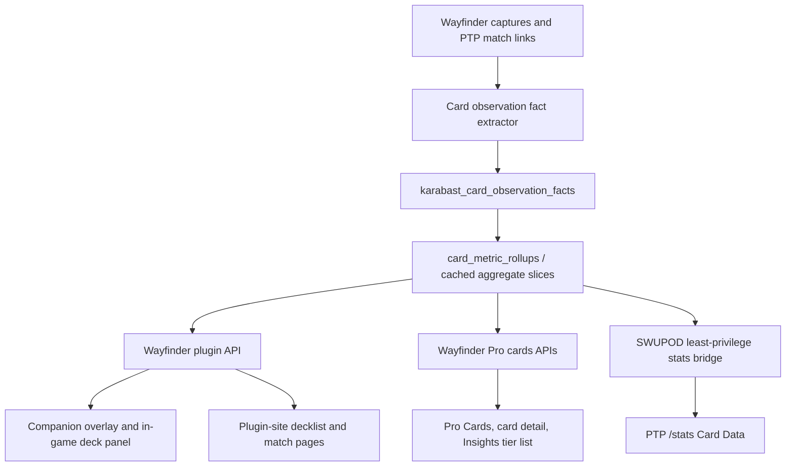

# Plugin-Gated 17Lands-Style Card Stats Plan

## Goal

Make 17Lands-style card performance stats a shared SWUPOD + Wayfinder capability with these product surfaces:

1. **Wayfinder plugin overlay:** players with the Companion can click a Wayfinder badge on cards shown in PTP draft, sealed, deckbuilding, and play flows to see compact stats for the format being played.
2. **Wayfinder plugin site:** plugin users can see card stats for their own deck and match contexts on decklist and matchup/match pages, scoped to format, card pool, and either current era or all time.
3. **SWUPOD `/stats`:** the Cards/Card Data tab becomes the default stats tab, but full card data is gated to users with the Wayfinder plugin and at least 5 recorded games.
4. **Wayfinder Pro cards:** Pro card catalog/detail/tier-list pages expose the same stats sliced by UFB era, format, source, and card pool.

Wayfinder remains the source of truth for replay-derived observation facts. SWUPOD consumes derived stats or facts through a least-privilege bridge, not raw replay blobs at request time.

## Sources Read

Paths are repo-relative within the named repo.

- `swupod`: `docs/brainstorms/2026-06-24-17lands-style-replay-card-data-requirements.md`
- `swupod`: `docs/WAYFINDER_PLUGIN_DETECTION.md`
- `swupod`: `app/stats/page.tsx`
- `swupod`: `app/api/stats/card-data/route.ts`
- `swupod`: `app/api/me/wayfinder-presence/route.ts`
- `swupod`: `src/hooks/useWayfinderDetection.ts`
- `swupod`: `src/utils/wayfinderCapabilities.ts`
- `wayfinder`: `docs/plans/2026-06-24-001-feat-plugin-stats-tabs-plan.md`
- `wayfinder`: `apps/web/app/api/plugins/card-stats/route.ts`
- `wayfinder`: `apps/web/app/api/cards/stats/route.ts`
- `wayfinder`: `apps/web/src/server/card-data-stats.ts`
- `wayfinder`: `apps/web/src/lib/card-data-metrics.ts`
- `wayfinder`: `packages/extension-shared/src/ptp-card-stats-overlay.ts`
- `wayfinder`: `packages/extension-shared/src/info-panel.ts`
- `wayfinder`: `apps/web/app/plugin-site/decklists/[decklistId]/page.tsx`
- `wayfinder`: `apps/web/app/plugin-site/matches/[id]/page.tsx`
- `wayfinder`: `apps/web/app/plugin-site/matchups/page.tsx`
- `wayfinder`: `apps/web/app/plugin-site/stats/page.tsx`

## Product Requirements

### P1. Plugin overlay card stats

- The Wayfinder Companion badges cards shown on PTP draft, sealed, deckbuilding, and play/deck pages.
- Clicking the badge opens a compact modal, not the full analytics table.
- The modal uses the currently active PTP context:
  - format: Limited for PTP draft/sealed/deckbuilding/play
  - set/card pool: from PTP page metadata, pool, or deck context
  - source: online replay-capable data by default
  - era: current era by default, with all-time available where the host UI has room
- Compact modal shows exactly the high-signal stats:
  - Grade
  - GIH WR when validated, otherwise GP WR with a decklist/result label
  - observed sample count for the displayed win-rate metric
  - Played Rate or Resourced When Seen, preferring Played Rate when both exist
- The modal includes a short sample/unavailable label when a metric is suppressed or not replay-validated.

### P2. Wayfinder plugin-site card stats

- Plugin users get a card stats page/section inside the plugin-site experience.
- Decklist detail pages show a "Card Stats" section for the cards in that deck.
- Match/matchup pages show card stats for the relevant decks and matchup context.
- These surfaces require the existing plugin-site session and must respect match/deck visibility gates.
- They are scoped by:
  - format
  - card pool: current, next set, all
  - era window: current era or all time
  - decklist/build/card list
  - optional matchup/opponent context when sample is large enough

### P3. SWUPOD `/stats` Card Data gate

- `/stats` defaults to the Cards/Card Data tab.
- The Cards tab requires:
  - Wayfinder Companion detected client-side, or remembered server-side activity
  - signed-in PTP user eligibility when server-side data is requested
  - at least 5 recorded games for that user
- The client detection hook improves messaging, but the API gate must be server-enforced.
- Ineligible users see a clear gate with:
  - install/sign-in guidance
  - current recorded game count when known
  - "5 games required" progress
- Eligible users see the dense Card Data table/tier list with leaders, bases, and main-deck cards in separate sections.
- Launch blocker: ASH Limited Online must show non-empty replay-derived columns for rows with observed samples. Blanks are allowed only when the denominator is genuinely zero or suppressed, not because the extractor/feed is absent.

### P4. Wayfinder Pro card pages

- Pro `/cards` keeps Catalog and Stats tabs.
- Pro card detail pages include a Stats tab/section.
- Insights gets a Cards Tier List page by set/format/source.
- All Pro surfaces use the same metric definitions, grade code, sample suppression, and UFB filters.
- Leaders and bases are included in stats, rankings, and tier lists as their own sections.

### P5. Shared metric honesty

- Do not label a metric "GIH" until the observation fact represents opener plus later draws, not just starting hand.
- In-person/decklist-only slices can show GP WR and grade from decklist/match results, but OH/GD/GIH/GNS/PR/RWS/PWAR stay blank or explicitly unavailable unless replay facts exist.
- Privacy and sample thresholds are enforced after every filter combination.

## Metric Contract

These are the stats every surface should consume from the shared layer. Count metrics still exist in the data contract, but the canonical UI displays them inside percentage cells such as `GP WR 56.2% (118/210)`, not as standalone table columns.

| Metric | Definition |
| --- | --- |
| `deck_copies` | Copies in starting main deck. Excludes leader, base, and sideboard unless the row section is explicitly leaders or bases. |
| `#GP` | Sum of `deck_copies` over eligible game-sides. Copy-weighted games played. |
| `GP WR` | `sum(deck_copies * win) / sum(deck_copies)`. |
| `#OH` | Sum of copies in kept opening hand after setup/mulligan, before first action. |
| `OH WR` | `sum(opener_copies * win) / sum(opener_copies)`. |
| `#GD` | Sum of copies drawn after opener by draw step/effects. Excludes returns, resource pickup, play/exile movement, and non-draw tutoring. |
| `GD WR` | `sum(drawn_later_copies * win) / sum(drawn_later_copies)`. |
| `#GIH` | `#OH + #GD`. This is the 17Lands-style "games in hand" denominator. |
| `GIH WR` | `sum(gih_copies * win) / sum(gih_copies)`. |
| `#GNS` | Copies in deck that were not seen for GIH/GNS purposes. Uses `max(deck_copies - min(deck_copies, opener + drawn_later + tutored_seen), 0)`. |
| `GNS WR` | `sum(gns_copies * win) / sum(gns_copies)`. |
| `IIH` | `GIH WR - GNS WR` in percentage points, only when both denominators pass thresholds. |
| `PR` / Played Rate | `sum(played_copies_from_seen_hand) / sum(gih_copies)` when copy-safe provenance exists. |
| `RWS%` / Resourced When Seen | `sum(resourced_copies_from_seen_hand) / sum(gih_copies)`, owner/visible perspective only. |
| `PWAR` / Played WAR | `WR(game-sides where played_copies > 0) - WR(game-sides where deck_copies > 0 and played_copies = 0)`. |
| Grade | Derived from selected metric, defaulting to GIH WR when validated, otherwise GP WR for decklist/match-result slices. |

## Canonical 17L Display Contract

Use this as the canonical "17Ls" display set. Counts are not standalone columns; they are part of the rate cell as `(numerator/denominator)`.

Minimal table columns:

```text
Title | Aspects | C | R | G | GP WR | OH WR | GD WR | GIH WR | GNS WR | IIH | PR | RWS% | PWAR
```

| Column | Display example | Constituent formula |
| --- | --- | --- |
| `G` | `A-` | derived grade from selected basis, default `GIH WR`, fallback `GP WR` |
| `GP WR` | `GP WR 56.2% (118/210)` | `gp_wins / gp_count` |
| `OH WR` | `OH WR 61.0% (25/41)` | `oh_wins / oh_count` |
| `GD WR` | `GD WR 54.8% (46/84)` | `gd_wins / gd_count` |
| `GIH WR` | `GIH WR 56.8% (71/125)` | `gih_wins / gih_count` |
| `GNS WR` | `GNS WR 49.4% (42/85)` | `gns_wins / gns_count` |
| `IIH` | `IIH +7.4pp` | `(gih_wins / gih_count) - (gns_wins / gns_count)` |
| `PR` | `PR 72.0% (90/125)` | `played_copies_from_seen_hand / gih_count` |
| `RWS%` | `RWS% 18.4% (23/125)` | `resourced_copies_from_seen_hand / gih_count` |
| `PWAR` | `PWAR +5.1pp` | `(played_wins / played_count) - (unplayed_wins / unplayed_count)` |

For formatted metric requests, return the display value and formula together. Example:

```text
GNS WR 49.4% (42/85)
gns_wins / gns_count
```

For `IIH` and `PWAR`, show the percentage-point delta in the cell and put component rates in a tooltip/detail view:

```text
IIH: GIH WR 56.8% (71/125) - GNS WR 49.4% (42/85)
PWAR: Played WR 58.0% (87/150) - Not Played WR 52.9% (54/102)
```

## Grade Model

17Lands does not publish a complete proprietary grading algorithm that we can copy as-is. We can ship a transparent 17Lands-style grade with the same practical behavior: grade cards within the selected slice based on a normalized win-rate metric.

Algorithm:

1. Select grade basis:
   - Default: GIH WR if replay hand metrics are validated and available.
   - Fallback: GP WR for decklist/match-result-only or in-person-only slices.
2. Require:
   - selected metric denominator >= 50 for a card
   - at least 25 gradeable cards in the selected slice
3. Compute the slice mean from eligible cards.
4. Shrink each card rate toward the slice mean:
   - `shrunk_p = (wins + slice_mean * 50) / (denom + 50)`
5. Convert to within-slice z-score:
   - `z = (shrunk_p - mean(shrunk_p)) / sd(shrunk_p)`
6. Assign grade bands at 0.33 standard-deviation increments centered on C:
   - `C = [-0.165, 0.165)`
   - adjacent bands step by 0.33
   - `A+` and `F` are open-ended tails

Development and production can both calculate grades now for any slice that has the basis metric. Provisional grades may be useful in dev and low-sample prerelease views, but they must be labeled "Provisional" and must not masquerade as strict 17Lands-style grades.

## Architecture



Key decision: replay/deck blobs remain provenance, not the serving model. Dense card tables should read normalized facts or rollups.

## Implementation Units

### Unit 1: Wayfinder canonical card observation facts

**Repo:** `wayfinder`

Add or complete the replay-derived fact layer that powers all replay-hand metrics.

Files to modify or create:

- `apps/web/db/migrations/*card_observation_metrics*.sql`
- `apps/web/src/server/card-observation-facts.ts`
- `apps/web/src/server/card-replay-signals.ts`
- `apps/web/src/server/karabast-resource-stats.ts`
- `apps/web/src/server/card-data-stats.ts`
- `apps/web/src/lib/card-data-metrics.ts`
- `apps/web/tests/unit/card-data-metrics.test.ts`
- `apps/web/tests/unit/card-data-stats-slice.test.ts`
- `apps/web/tests/unit/card-observation-facts.test.ts`

Behavior:

- Parse eligible capture payloads once.
- Upsert one row per `game_id + player_side + card_slug`.
- Store enough counters to compute all metrics without reparsing blobs:
  - deck copies, opener copies, later drawn copies, tutored seen copies
  - played copies, resourced copies
  - win/loss/draw result
  - validated hand metric status
  - format, source, card pool, era/date, visibility, user/team scope
  - leader/base/archetype/decklist/build/PTP link identifiers
- Exclude malformed or inconsistent games from affected metrics, not necessarily from every metric.
- Add checkpointed backfill and incremental extraction after domain processing.
- Add indexes for common slice keys:
  - card slug
  - set/era/date
  - format
  - source/card pool
  - visibility/user/team
  - decklist/build/archetype/leader/base

Definition of done:

- ASH Limited Online facts exist for current captures.
- OH/GD/GIH/GNS/PR/RWS/PWAR can be computed from facts for cards with observed samples.
- Request-time table rendering does not scan raw capture blobs.

### Unit 2: Rollups, API slices, and sample suppression

**Repo:** `wayfinder`

Promote the fact layer into reusable slices for Pro, plugin site, plugin overlay, and SWUPOD.

Files to modify or create:

- `apps/web/src/server/card-data-stats.ts`
- `apps/web/src/lib/page-rows/card-stats.ts`
- `apps/web/app/api/cards/stats/route.ts`
- `apps/web/app/api/plugins/card-stats/route.ts`
- `apps/web/app/api/plugins/deck-card-stats/route.ts`
- `apps/web/tests/unit/plugin-card-stats-route.test.ts`
- `apps/web/tests/unit/card-data-stats-slice.test.ts`

Behavior:

- Keep `/api/cards/stats` as the full table endpoint.
- Keep `/api/plugins/card-stats` for single-card overlay lookup.
- Add deck/card-list lookup for plugin surfaces:
  - input: decklist id, game id, or explicit card slugs
  - output: rows only for those cards, with deck copies and the selected stats slice
- Support slice dimensions:
  - global/pro aggregate
  - plugin user aggregate
  - team aggregate
  - decklist/build aggregate
  - matchup/opponent aggregate
  - PTP-linked aggregate
  - current era vs all time
- Apply thresholds after filtering:
  - hide or null low-denominator rates
  - expose sample warnings
  - grade only when strict criteria pass, unless provisional mode is explicitly enabled

Definition of done:

- Same input filters return the same metric values across Pro, plugin-site, plugin API, and SWUPOD bridge.
- Low-sample and unavailable metrics are represented as null plus status, never as zero.

### Unit 3: Plugin eligibility and privacy gates

**Repos:** `swupod`, `wayfinder`

Make "plugin user with 5 recorded games" enforceable, not just a client-side hint.

Files to modify or create:

- `swupod`: `app/api/me/wayfinder-presence/route.ts`
- `swupod`: `src/hooks/useWayfinderDetection.ts`
- `swupod`: `app/api/stats/card-data/route.ts`
- `swupod`: `app/stats/page.tsx`
- `swupod`: `src/hooks/useWayfinderDetection.test.ts`
- `swupod`: `app/stats/page.test.ts`
- `wayfinder`: `apps/web/src/server/plugins.ts`
- `wayfinder`: `apps/web/app/api/plugins/card-stats/route.ts`
- `wayfinder`: `apps/web/app/plugin-site/SignInRequired.tsx`

Behavior:

- Expand PTP `GET /api/me/wayfinder-presence` to return:
  - `hasActivity`
  - `recordedGames`
  - `eligibleForCardStats`
  - `requiredGames: 5`
- Count decided Wayfinder-recorded games tied to the signed-in PTP user through:
  - `card_pools.wayfinder_match_ids`
  - practice/casual matches that have Wayfinder IDs
  - future Wayfinder identity bridge when available
- Client detection from `useWayfinderDetection()` controls messaging and install CTAs.
- Server eligibility controls API access to full SWUPOD Card Data.
- In local dev, allow an explicit QA override only for UI testing, never as the production default.
- Wayfinder plugin-site pages keep using existing authenticated plugin-site sessions and existing match/deck visibility checks.

Definition of done:

- Anonymous or non-eligible users cannot fetch full PTP Card Data JSON.
- Eligible users can fetch and view the table.
- Plugin-site deck/match pages do not leak private/team deck stats to unauthorized viewers.

### Unit 4: Wayfinder Companion overlay and in-game deck stats

**Repo:** `wayfinder`

Use the existing PTP card stats overlay and in-game info panel as the delivery path.

Files to modify:

- `packages/extension-shared/src/ptp-card-stats-overlay.ts`
- `packages/extension-shared/src/background.ts`
- `packages/extension-shared/src/content-ptp-detect.ts`
- `packages/extension-shared/src/info-panel.ts`
- `packages/extension-shared/src/lobby-info-widget.ts`
- `packages/extension-shared/src/ptp-card-stats-overlay.test.ts`
- `packages/extension-shared/src/info-panel.test.ts`

Behavior:

- Badge card hosts in PTP draft, sealed, deckbuilding, and deck/play contexts.
- Send card identity plus PTP context through background to Wayfinder plugin APIs.
- Keep the per-card modal compact:
  - Grade
  - GIH WR or GP WR
  - sample count
  - Played Rate or RWS%
- In the in-game Deck tab, show deck-card stats for both visible decks:
  - sort by selected metric
  - allow current era/all-time toggle if space allows
  - open row detail for the full stat grid
- For draft/sealed/deckbuilding, scope to Limited and the page's set/card pool.

Definition of done:

- Card badges appear on PTP draft, sealed, deckbuilder, and play/deck pages without layout overlap.
- The modal is fast, compact, and truthfully labels fallback GP WR when GIH is unavailable.

### Unit 5: Wayfinder plugin-site decklist, match, matchup, and stats pages

**Repo:** `wayfinder`

Add plugin-only card stats where plugin users naturally review their games and decks.

Files to modify or create:

- `apps/web/app/plugin-site/decklists/[decklistId]/page.tsx`
- `apps/web/app/plugin-site/matches/[id]/page.tsx`
- `apps/web/app/plugin-site/matchups/page.tsx`
- `apps/web/app/plugin-site/stats/page.tsx`
- `apps/web/app/plugin-site/CardStatsSection.tsx`
- `apps/web/src/server/plugin-site/decklist-detail.ts`
- `apps/web/src/server/plugin-site/card-stats.ts`
- `apps/web/tests/unit/plugin-site-card-stats.test.tsx`

Behavior:

- Decklist detail page:
  - show a Card Stats section below the deck viewer and above match history
  - rows are the cards in the selected deck, with copy counts and selected-slice stats
  - default slice: deck format + card pool + current era
  - toggle: current era / all time
- Match detail page:
  - show card stats near `LiveDecklists`
  - separate owner and opponent sections, respecting per-seat deck visibility
  - support matchup-specific sample where available; otherwise use broader format/pool/era stats
- Matchups page:
  - add drill-in affordance from matchup cells to card stats for the two decks/archetypes when possible
- Plugin stats page:
  - add a Cards panel or tab for the plugin user's own recorded card stats
  - use existing `StatsFilterBar`/plugin filter state

Definition of done:

- A plugin user can open a decklist or match and immediately see how the cards in that deck perform in the selected context.
- Current era/all-time toggle changes the slice without leaving the page.

### Unit 6: SWUPOD `/stats` Cards default and full data bridge

**Repo:** `swupod`

Finish the PTP Card Data page as the default stats experience for eligible plugin users.

Files to modify:

- `app/stats/page.tsx`
- `app/stats/stats.css`
- `app/api/stats/card-data/route.ts`
- `src/services/cardDataMetrics.ts`
- `src/hooks/useWayfinderDetection.ts`
- `app/api/me/wayfinder-presence/route.ts`
- `app/stats/page.test.ts`
- `src/services/cardDataMetrics.test.ts`

Behavior:

- Change the default stats subtab from Sealed to Card Data.
- Render the gate before fetching dense data when eligibility is not settled.
- Fetch full data only when eligible.
- Keep leaders, bases, and cards as separate table/tier-list sections.
- Add term definitions for every metric shown in PTP, matching Wayfinder copy.
- Consume Wayfinder-derived replay stats for online slices:
  - preferred: Wayfinder internal/export API for derived stats
  - fallback only if needed: SWUPOD-owned materialized copy fed by Wayfinder
- Keep SWUPOD local decklist/match-result GP WR as a fallback for in-person or unlinked slices.
- Ensure ASH Limited Online returns populated replay-hand columns once facts are available.

Definition of done:

- `/stats` opens to Card Data.
- Ineligible users see an access gate, not a broken blank table.
- Eligible users see Card Data with all metric columns populated for ASH Limited Online rows with observed samples.

### Unit 7: Wayfinder Pro cards and Insights tier list

**Repo:** `wayfinder`

Complete the Pro-facing analytics surfaces.

Files to modify:

- `apps/web/app/(platform)/cards/page.tsx`
- `apps/web/app/(platform)/cards/CardsStatsClient.tsx`
- `apps/web/app/(platform)/cards/[cardId]/page.tsx`
- `apps/web/app/(platform)/cards/[cardId]/CardDetailClient.tsx`
- `apps/web/src/components/CardDetailView.tsx`
- `apps/web/src/components/CardStatsTabContent.tsx`
- `apps/web/src/components/CardDataMetricDefinitions.tsx`
- `apps/web/app/(platform)/dashboard/cards/tier-list/page.tsx`
- `apps/web/tests/unit/cards-stats-client-filters.test.tsx`
- `apps/web/tests/unit/card-detail-analytics-focus.test.tsx`

Behavior:

- Keep Cards `Catalog` and `Stats` tabs.
- Card detail pages include the same stat grid plus popular archetypes that include the card.
- Insights exposes Cards Tier List by set/era/format/source.
- Leaders and bases render as their own sections.
- All filters use UFB params/helpers, especially era, format, source, and card pool.
- Definitions explain GP/OH/GD/GIH/GNS/IIH/PR/RWS/PWAR/Grade and any unavailability state.

Definition of done:

- Pro users can slice card data by meta era and format.
- Pro card detail and tier list pages agree with the global Cards Stats table for the same filters.

### Unit 8: Production/dev data operations

**Repos:** `wayfinder`, `swupod`

Make the feature verifiable with real data before shipping.

Files to modify or create:

- `wayfinder`: `apps/web/src/server/import-tasks.ts`
- `wayfinder`: `apps/web/scripts/backfill-card-observation-facts.ts`
- `wayfinder`: `apps/web/scripts/export-card-metrics.ts`
- `swupod`: `scripts/import-wayfinder-card-metrics.ts`
- `swupod`: `docs/runbooks/card-stats-backfill.md`

Behavior:

- Add a Wayfinder backfill task for historical captures.
- Add incremental invalidation for:
  - result changes
  - decklist changes
  - card identity fixes
  - visibility/privacy changes
  - PTP link changes
- Add a dev data path:
  - read-only prod metrics export or sanitized rollup snapshot
  - no raw private capture payloads in dev
  - environment guard such as `ALLOW_PROD_CARD_STATS_SYNC=true`
- Add CSV export for validation:
  - set: ASH
  - format: Limited
  - card pool: next set
  - source: online
  - include observed game count and every metric column

Definition of done:

- Production backfill can be run safely and resumed.
- Dev can show real ASH Limited card metrics without pulling raw private replay blobs.
- The team can export a CSV to audit the numbers.

## Test Plan

### Unit tests

- Duplicate copies and copy weighting.
- Opener plus later draw.
- Draw effect vs return-to-hand exclusion.
- Tutored seen but not drawn.
- Never seen cards and GNS.
- Played Rate and RWS copy provenance.
- Played WAR with played and unplayed game-sides.
- Strict and provisional grade boundaries.
- Source/format/era/card-pool filter resolution.
- PTP eligibility gate at 0, 4, and 5 recorded games.

### Integration tests

- Wayfinder `/api/plugins/card-stats` requires plugin token.
- Wayfinder deck-card stats endpoint respects plugin session and deck visibility.
- Wayfinder match page respects per-seat visibility when rendering card stats.
- SWUPOD `/api/stats/card-data` rejects ineligible requests and returns full data for eligible users.
- SWUPOD `/stats` defaults to Card Data and shows the gate/table states correctly.
- Pro Cards Stats, card detail, and tier list agree for the same filters.

### Browser validation

Capture screenshots for:

- PTP `/stats` ineligible gate.
- PTP `/stats` eligible ASH Limited Online table.
- PTP `/stats` ASH tier list with leaders, bases, and cards.
- Wayfinder Companion PTP card modal.
- Wayfinder in-game Deck tab card stats.
- Wayfinder plugin-site decklist Card Stats section.
- Wayfinder plugin-site match Card Stats section.
- Wayfinder Pro `/cards?tab=stats`.
- Wayfinder Pro card detail Stats tab.
- Wayfinder Pro Insights Cards Tier List.

## Rollout Plan

1. Ship facts and rollups behind server-only access.
2. Backfill ASH Limited Online in production.
3. Validate CSV exports and spot-check replay samples.
4. Enable Wayfinder Pro stats surfaces for internal/pro users.
5. Enable plugin overlay compact card modal.
6. Enable plugin-site decklist/match card stats.
7. Enable SWUPOD `/stats` Cards default with eligibility gate.
8. Remove provisional-only copy once strict samples are large enough.

## Risks And Mitigations

| Risk | Mitigation |
| --- | --- |
| Replay hand-zone extraction is wrong | Require fixtures plus manual replay audits before labeling GIH/OH/GD/GNS. |
| Dense tables are slow | Serve from facts/rollups and cache common slices. No raw blob scans at request time. |
| Client-only plugin detection can be spoofed | Use client detection for messaging only. Use server-side game count and auth for API access. |
| Dev has no ASH data | Use sanitized prod metric exports or read-only rollup sync guarded by env. |
| Small samples produce misleading grades | Enforce strict thresholds and label provisional grades. |
| Private/team captures leak | Apply visibility in fact extraction and again at API/query boundaries. |
| SWUPOD and Wayfinder disagree | Share metric code/contracts and test same fixtures in both repos. |

## Open Decisions

- Exact identity bridge for SWUPOD user to Wayfinder plugin user beyond current PTP `wayfinder_match_ids`.
- Whether "5 recorded games" counts Bo3 games individually when Wayfinder has per-game IDs, or counts the recorded match as one until normalized. Proposed default: count individual game IDs when available, otherwise count the match as one.
- Whether PTP public `/stats` should allow an anonymous Companion-token path later. Proposed v1: require signed-in PTP user for full gated data.
- Whether matchup-specific deck-card stats should launch in v1 or appear after decklist/global stats. Proposed v1: show matchup-specific columns only when already computed, otherwise use broader slice with a label.

## Definition Of Done

- The same shared metric contract powers SWUPOD, Wayfinder plugin, Wayfinder plugin-site, and Wayfinder Pro.
- ASH Limited Online rows have real observed replay metrics where denominators exist.
- SWUPOD `/stats` defaults to Card Data but gates access to plugin users with 5 recorded games.
- Wayfinder plugin users can see compact per-card stats during PTP draft, sealed, deckbuilding, and play.
- Wayfinder plugin-site decklist and match pages show deck-scoped card stats with current era/all-time toggle.
- Pro card pages and tier lists show sliceable card stats by era and format.
- Grades are transparent, reproducible, and labeled by basis.

---

## Status as of 2026-07-31 — NOT IMPLEMENTED ON MAIN

This plan is landed as a design reference. The implementation on
`codex/17l-card-analytics` (2026-06-28) was **not merged** and cannot be merged
as-is:

- Main since extracted the card-data tab into `src/components/CardDataTierList.tsx`
  (see `app/stats/page.tsx`). The branch predates that refactor and carries a
  633-line inline `CardDataTab` in `page.tsx` instead.
- Main renamed the stats subtab `card-data` → `cards` and added deep-link
  handling; the branch still targets the old naming.
- `app/api/stats/card-data/route.ts` (1110L) and `src/services/cardDataMetrics.ts`
  (445L) were rewritten by the pick-preference tier-grades work.

Merging produced ~1166 conflicted lines across 12 regions, where taking the
branch's side would delete the `CardDataTierList` architecture the current tier
grades are built on.

**To build this**: re-implement inside `CardDataTierList.tsx` against current
main. The branch still holds two self-contained, tested modules worth reusing
verbatim — `src/services/wayfinderCardStatsBridge.ts` (240L, with tests) and
`src/components/WayfinderCardStatsButton.tsx` (281L). Neither conflicts with
main; only the page wiring is stale.
