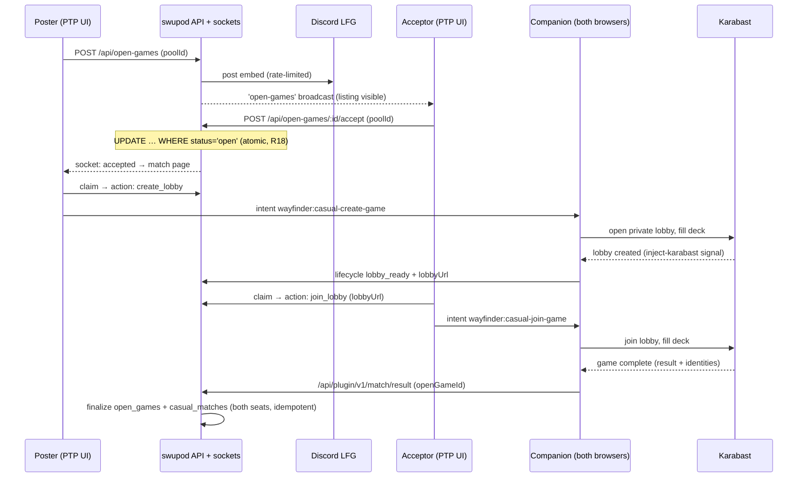

# feat: Lobby V1 — Homepage-as-Lobby + Open Games

**Target repos:** `swupod` (this worktree) and `wayfinder` (worktree `.claude/worktrees/ptp-lobby`, branch `feat/ptp-lobby`; paths prefixed `wayfinder:` below).

**Hard gate: NEVER push, deploy, publish extensions, or flip the Companion GA gate on either repo without Lee's explicit go-ahead. This is a coupled cross-repo release.**

---

## Overview

The homepage becomes a live lobby (Direction A v3): "Play Now" and "New Game" verbs on top (no nav bar), an Open Games seek list — PTP listings plus Karabast's public limited lobbies — beside a Pods Forming column, a single "Casual Formats" rollup and a utility track below. The net-new capability is **open games**: a player posts a built limited deck seeking an opponent; another accepts with their own deck; the Wayfinder Companion routes both into the same Karabast lobby and results auto-report. The shared-lobby handshake, lifecycle, and result ingest generalize the existing Swiss Practice pipeline. Companion goes GA with this launch. V2 (pod play phase) is out of scope.

---

## Problem Frame

PTP builds decks that mostly never play a human. Coordination is manual (Discord, link-pasting). At ~10–40 concurrent players, visible persistent seek listings + Discord pings beat invisible queues — so the lobby takes the homepage for maximum liquidity (see origin: docs/brainstorms/2026-07-08-lobby-homepage-requirements.md).

---

## Requirements Trace

From the origin doc — V1 scope:

- R1–R5: Homepage as lobby (layout, anonymous read-only, collapse-when-empty, mobile, formats still reachable)
- R6–R12: Open games (post/accept, Companion routing, Play Now = auto-seek, Discord pings + expiry, accept notification, Companion-only results, no ELO)
- R13–R14: Companion pushed via PluginCTA + GA; manual fallback note
- R15: Pods Forming column resurfaces existing public pods
- R18–R26: Listing & match lifecycle invariants (atomic accept; per-user limits; ~20-min accepted-match expiry with cancel/repost; grace-window accepts; one-click Play Now + no-deck funnel; deck re-validation; mobile desktop-notice; honest fallback copy; login-only gating with intent preservation)
- R27–R35 (Design Revisions 2026-07-09, Direction A v3): no nav bar + online strip (U4); "Play Now"/"New Game"/"Join" verb language everywhere (U4/U5); opponent decks hidden in listings (U1 API omits deck identity, U4); "Casual Formats" rollup + utility track reusing existing `/formats` naming (U4); strict same-set/same-format matching + filtered Join picker (U1/U5); private-link games (U1/U5); Karabast cross-listing with PTP marker + non-PTP warning (U4/U6); create-on-Karabast checkbox default ON (U5/U6); play-page → lobby CTA with deck preselected (U5); Companion-less Karabast section renders PluginCTA (U4); Karabast-side joins: delist-on-entry, joiner identity binding, non-PTP soft warning (U2/U6)

**Origin actors:** A1 poster, A2 acceptor, A3 pod host/member, A4 Companion, A5 Karabast, A6 Discord LFG, A7 anonymous visitor
**Origin flows:** F1 post, F2 accept→shared lobby→result, F3 Play Now, F4 pod join (existing)
**Origin acceptance examples:** AE1–AE5 (Play Now instant-accept; Play Now auto-post; no-Companion fallback; column collapse; cross-set accept)

---

## Incoming Merge Awareness — fable/arch-2026-07-07 (merging to main now)

Branch `fable/arch-2026-07-07` (worktree `worktrees/fable/swupod`, ~10 commits) is landing in main during this build. Implications — **re-rebase after it merges**, and:

- **`src/styles/tokens.css`** (DESIGN.md palette as code) + **`scripts/check-design-tells.ts` CI checker with per-file baselines**: all new Lobby CSS (U4/U5) must build on the tokens and pass the banned-tells checker — no hardcoded palette values.
- **Swiss Practice contract pinning** (`test(contract)`: pinned version + wayfinder mirror path): U2/U6's casual variant must extend the pinned contract properly (bump/extend the contract test on both sides, not silently diverge).
- **Migration runner changes** (non-transactional statement-by-statement + fresh-DB guard, `check-migrations-fresh.ts`): the U1 migration must satisfy the new guard.
- **Holotable re-skin of `MatchCard`/`MatchmakingPanel`**: the U5 match page should match the holotable aesthetic, not pre-refresh styles.
- Rebased 2026-07-09 onto origin/main `03d687b7` (Discord webhook-reuse fix — U3 must use the shared-webhook path, one webhook per channel).

## Scope Boundaries

- V2 pod play phase (R16–R17) — separate plan after V1.
- No matchmaking queue, no ELO/ranked, no spectating, no manual result entry, no in-PTP game client.
- No paste-lobby-link UI anywhere (hard rule; previously built and reverted in `f757995`).
- No new pod formation formats — Pods Forming only resurfaces what exists.
- No "tournament" language in UI copy, routes, or schema (legal constraint) — use "open games", "matchmaking", "pairings".

### Deferred to Follow-Up Work

- Rematch button on completed matches: V1.1.
- Editing/striking Discord LFG messages on listing resolution: include only if `lib/discordLfg.ts`'s existing embed-update pattern makes it cheap (it likely does — `updatePodEmbed` precedent); otherwise V1.1.
- Extension store publishes and the GA release itself: separate, explicitly-approved release step.

---

## Context & Research

### Relevant Code and Patterns

**swupod:**
- `src/components/LandingPage.tsx` / `.css` — current homepage (hero, format grid, "X players online", pods-open badges, active-pod banner)
- `app/api/pods/public/route.ts` + `src/hooks/usePublicPodsSocket.ts` + `src/lib/socketBroadcast.ts` — public pod listing with realtime updates; the pattern to mirror for open games (`'public-pods'` room → new `'open-games'` room)
- `src/lib/socketServer.ts` + `server.ts` — socket auth from `swupod_session` cookie, presence map, **60s disconnect delist timers** (pattern for listing delist)
- `src/services/matchmaking/liveGames.ts` — `claimPracticeMatchGame` (claim actions: `create_lobby` / `join_lobby` / `wait_for_lobby` / `manual_only`), `recordPracticeMatchGameLifecycle`, `recordPracticeMatchGameResult` — the pipeline to generalize
- `app/api/plugin/v1/practice/match-game/lifecycle/route.ts` and `app/api/plugin/v1/match/result/route.ts` — Companion→PTP ingest (Bearer `PTP_SERVICE_KEY`), idempotency keys, `ing-` prefix normalization
- `migrations/072_create_practice_match_games.sql`, `migrations/071_create_casual_matches.sql`, `migrations/073_casual_matches_pool_scoped.sql` — lifecycle + casual history schema to model on
- `lib/discordLfg.ts` (+ `lib/discordLfg.test.ts`) — Discord posting: `postPodCreated`, `updatePodEmbed`, thread/webhook management
- `src/components/PlayInstructions.tsx`, `src/utils/karabastLobby.ts`, `src/components/PluginCTA.tsx` (`usePluginCTA`), `src/utils/companionBeta.ts` — Companion UX + gating
- `src/hooks/usePresence.ts` — presence count; `src/hooks/useStickyTab.ts` — hash-anchor tab state

**wayfinder:**
- `wayfinder: packages/extension-shared/src/shared/ptp-intent.ts` — `wayfinder:practice-create-game` / `practice-join-game` intent shapes to extend
- `wayfinder: packages/extension-shared/src/inject-karabast.ts` + `capture-shell.ts` — lobby-created signal (Firefox-safe DOM script-tag pattern), reusable unchanged
- `wayfinder: packages/extension-shared/src/ptp-practice-lifecycle.ts` + `background-ptp-practice-lifecycle.test.ts` — lifecycle emission to PTP

### Institutional Learnings (from memory; `docs/solutions/` does not exist yet)

- **Identity-loss failure modes** in result ingest: `ing-` prefix dedup, `casual_matches` pool-scoped unique index, and — the known weak point — `ptp_lobby_pool_links` assumes **one pool per lobby**. Open games have two users' pools in one lobby; attribution must come from the `open_games` row, not the lobby-pool link table.
- **Safari MV3**: tabs must open from a content-script user gesture (`window.open`), never the background SW — errors are swallowed silently.
- **Auth snake_case trap**: gate with `user?.is_beta_tester || user?.is_admin` style direct field reads; camelCase helpers silently return false.
- **Idempotent finalize**: results arrive via two delivery paths; design so an unfinished/conceded match can always be finalized or delisted, never wedged.
- **Migration numbering**: check for parallel-branch collisions before numbering; test locally first.
- **Cross-repo live test recipe** exists (PTP :3000 + hub :3001, `PTP_API_URL`/`PTP_SERVICE_KEY` parity, `ptp-practice-e2e.ts` harness).

### External References

Prior-art research (Lichess pools vs seek list, BGA Play Now vs Tables, Draftmancer/dr4ft, Cockatrice, Karabast) is summarized in the origin doc and drove the layout/queue decisions; no further external research needed.

---

## Key Technical Decisions

- **One `open_games` row carries listing → match; lobby attempts live in a child table.** A listing is a row with `player2_id IS NULL`, `status='open'`. Accept of a *specific listing* is a single conditional `UPDATE … WHERE status='open' AND player1_id != $acceptor RETURNING`. The per-user invariants (one open listing, one pending match — R19) are **cross-row** and are NOT guaranteed by that write alone: the accept/Play Now transaction must take `pg_advisory_xact_lock` on both (sorted) user ids before the pending-match check, killing the mutual-accept interleaving (A accepts B's listing while B accepts A's). Karabast lobby attempts go in a small `open_game_lobby_attempts` child table mirroring `practice_match_games` (`attempt_number`, `status`, `lobby_id`, `lobby_url`, `wayfinder_match_id`, idempotency keys, active-attempt partial unique index) so the practice pipeline's retry/staleness/newest-lobby-wins machinery carries over intact — a single flat row cannot represent "attempt failed, new attempt" without breaking stale-lobby dedup. Single game per match in V1 (no Bo3 sequencing).
- **Result attribution bypasses `ptp_lobby_pool_links`.** The `open_games` row already binds both users' pools; ingest resolves seats from it, sidestepping the one-pool-per-lobby weak point. Results also write per-player rows to `casual_matches` (existing personal-history surface) idempotently.
- **New socket room `'open-games'` mirroring `'public-pods'`** with an initial HTTP fetch + broadcast-on-change hook (`useOpenGamesSocket`), rather than piggybacking on the pods room — different payloads, different consumers.
- **Play Now is server-side try-accept-else-post in one transaction** — excludes own listing, honors per-user invariants (R19, R22). No queue state exists anywhere.
- **New Companion intents `wayfinder:casual-create-game` / `casual-join-game`** mirroring the practice intents with `openGameId` instead of `practiceMatchGameId`/round fields. Reuse the lifecycle observation and signal plumbing untouched; extend the lifecycle + result ingest routes to accept the casual variant rather than forking new endpoints. **The wayfinder hub is a required participant, not a pass-through**: its lifecycle/result routes validate and forward an explicit field allowlist keyed on `practiceMatchGameId`, so the casual correlation needs first-class hub support (see U6).
- **Companion capability handshake, not mere presence.** The match page gates the one-click hero on the Companion acknowledging casual-intent support (the extension already exposes `pluginVersion`; add a capability signal or minimum version). "Meta tag detected" alone must never dispatch a casual intent — a stale extension silently drops unknown intents and the button would spin dead. No ack within a short timeout → surface the fallback note + "update your Companion" hint.
- **Mixed-adoption completion path (approved by Lee 2026-07-08).** When a Companion-created lobby exists and the viewing seat has no (capable) Companion, the match page **displays** the auto-captured lobby URL as a direct "Open lobby" link below the PluginCTA hero. This is display of a Companion-captured URL — the standing ban on manual paste-lobby-link *input* UI is unchanged.
- **Homepage rebuild as composed lobby components**, not surgery inside the ~600-line `LandingPage.tsx`: new `src/components/Lobby/` directory (board, columns, rows, verbs), with `LandingPage` reduced to hero + lobby + solo tiles. Existing badges/active-pod banner logic migrates into the lobby components.
- **Companion GA = deleting the beta branch in `PluginCTA`/`companionBeta`**, kept as the final, separately-committed unit so everything before it remains shippable dark.

---

## Open Questions

### Resolved During Planning

- Shared-lobby handshake: poster's Companion **creates** the private lobby on claim (`create_lobby`); acceptor claims and gets `join_lobby` with `lobby_url` once the `lobby_ready` lifecycle callback lands (same polling/`wait_for_lobby` states as practice). First-to-claim symmetry from practice is kept: whichever player claims first creates.
- Beta gating: lobby actions require Discord login only (R26); Companion GA removes `isCompanionBeta`.
- Discord channel: reuse the existing draft/sealed-now channels vs a dedicated channel — post open games to the existing LFG surface with a distinct embed; a dedicated channel id can be added via env var without code change if noise demands it.

### Deferred to Implementation

- Exact `open_games` column list and index set — finalize against `practice_match_games` while writing the migration (check current max migration number for parallel-branch collisions first).
- Whether `updatePodEmbed`-style edit-on-resolve is cheap enough to include for open-game Discord messages (inspect while building U5).
- Karabast lobby-name string for casual matches (extend `buildLobbyName` — exact format when touching `src/utils/karabastLobby.ts`).
- Precise per-user Discord ping cooldown (default ~10 min, tune in code review).

---

## High-Level Technical Design

> *This illustrates the intended approach and is directional guidance for review, not implementation specification. The implementing agent should treat it as context, not code to reproduce.*

---

## Implementation Units

### Phase 1 — swupod backend

- [ ] U1. **`open_games` schema + listing service and API**

**Goal:** Persist listings/matches with the full lifecycle state machine; expose post, cancel, list, accept, and Play Now endpoints enforcing all invariants.

**Requirements:** R6, R8, R9 (expiry/delist), R18–R23, R26

**Dependencies:** None

**Files:**
- Create: `migrations/0XX_create_open_games.sql` — `open_games` plus the `open_game_lobby_attempts` child table (number checked at implementation time)
- Create: `src/services/openGames.ts` (listing CRUD, atomic accept, Play Now transaction, expiry/staleness sweep, deck-eligibility predicate)
- Create: `app/api/open-games/route.ts` (GET list — includes a small recent-completed feed for the empty state, POST create), `app/api/open-games/[gameId]/route.ts` (DELETE cancel), `app/api/open-games/[gameId]/accept/route.ts`, `app/api/open-games/play-now/route.ts`
- Modify: `src/lib/socketBroadcast.ts`, `src/lib/socketServer.ts` (new `'open-games'` room, broadcast helper, delist-on-disconnect timer alongside the pod delist timers)
- Test: `src/services/openGames.test.js` (or `.ts` matching neighbors), `app/api/open-games/route.test.ts` if API tests have precedent — follow `npm run test:api` conventions

**Approach:**
- One row per listing/match as decided above; statuses: `open | accepted | lobby_ready | in_progress | complete | cancelled | expired | delisted | abandoned`.
- **Authorization:** post and accept verify the submitted `poolId` belongs to the session user (403 otherwise) before any deck-validity check — same ownership-scoping pattern as `app/api/me/pools/route.ts`; cancel requires the caller to be a seat on the row (`session.user.id IN (player1_id, player2_id)`).
- **Cross-row invariants:** the accept/Play Now transaction takes `pg_advisory_xact_lock` on both sorted user ids before checking the one-pending-match invariant (see Key Technical Decisions — the conditional UPDATE alone does not kill the mutual-accept race).
- Deck eligibility is a **newly authored server-side predicate** (none exists today — deck completeness is client-side only): derive from `built_decks`/`deck_builder_state` — leader + base present, main deck ≥ per-set minimum via set configs. Re-validate both decks inside the accept transaction (R23).
- Play Now: single transaction — try accept oldest **compatible** listing not owned by caller (strict same set + same format as the caller's chosen deck, R31); else upsert caller's listing (replacing an existing one, R19).
- `visibility: 'public' | 'private'` on listings (R32): private rows are excluded from GET list, socket broadcasts, and Discord pings; joinable only via their share URL (`/g/{shareId}`), same accept transaction and invariants.
- Listing API responses never include deck identity (R29) — deck/pool ids stay server-side; only set, format, poster, age, presence go over the wire.
- **Sweep with full staleness coverage** (small interval job in `server.ts`, transitioning statuses + broadcasting, not the row-deleting pod cleanup): 2h-old `open` → `expired`; `accepted` with no lobby after ~20 min → `abandoned`; `lobby_ready` with no `in_progress` after ~N min and `in_progress` with no result after ~N hours → `abandoned` (mirror practice's `isStalePracticeGame` windows). Either-player cancel remains available in `lobby_ready`/`in_progress`. Only `accepted | lobby_ready | in_progress` count against the one-pending-match invariant, and the sweep guarantees none of them are permanent — a wedged match can never lock a player out of the lobby.
- Manual-path awareness: the ~20-min `accepted` expiry copy acknowledges "playing manually? no problem — this just frees your lobby slot", and the repost prompt is suppressed when both players were recently present on the match page (manual games never emit `lobby_ready`; expiry must not read as an error, R25).
- Disconnect delist reuses the presence-map grace pattern, but with its own longer knob than the pods' 60s (listing presence dot hollows immediately on disconnect; exact grace tuned at implementation — see FYI from review re: seek persistence).

**Execution note:** Test-first for the invariant matrix (R18/R19) — these are the bugs that can't be retrofitted.

**Patterns to follow:** `app/api/pods/public/route.ts` (listing shape), `src/lib/socketBroadcast.ts` (`broadcastPublicPodsUpdate`), migrations 071–073 (idempotency + pool-scoped indexes).

**Test scenarios:**
- Happy path: post → listed via GET and broadcast; cancel → gone; accept → status `accepted`, both pool ids bound.
- Covers AE1. Happy path: Play Now with an open listing from another user → that listing accepted instantly.
- Covers AE2. Happy path: Play Now with empty board → caller's listing created.
- Edge: two concurrent accepts → exactly one wins; loser gets a conflict response.
- Edge: accept races poster's cancel → one deterministic winner.
- Edge: self-accept rejected; Play Now with only own listing open → idempotent waiting (no self-match, no error).
- Edge: posting with an open listing already → old listing replaced, not stacked.
- Edge: accept when acceptor already has a pending accepted match → rejected.
- Edge: **genuinely concurrent mutual-accept** (two interleaved transactions, A accepts B's listing while B accepts A's) → exactly one match created; the advisory-lock path is exercised, not just the sequential rejection.
- Edge: accept during poster's disconnect grace → succeeds and cancels delist.
- Error: accept with an invalid/deleted deck (either side) → rejected with reason; poster's deck deleted while listed → auto-delist.
- Error: unauthenticated post/accept → 401; post/accept with a `poolId` owned by another user → 403; cancel/claim by a non-seat user → 403/404.
- Integration: sweep transitions 2h-old `open`, 20-min lobby-less `accepted`, stale `lobby_ready`, and result-less `in_progress` rows; broadcasts fire; a swept player can immediately post/accept again.

**Verification:** Invariant tests green; a listing's full lifecycle is walkable through the API with socket events observable.

---

- [ ] U2. **Casual claim/lifecycle/result generalization (Companion handshake, PTP side)**

**Goal:** Both accepted players can claim the game and be routed into one Karabast lobby; lifecycle and result ingest accept the casual variant; results attribute both seats correctly.

**Requirements:** R7, R10, R11, R20, R21; F2

**Dependencies:** U1

**Files:**
- Create: `src/services/openGameLive.ts` (claim → `create_lobby`/`join_lobby`/`wait_for_lobby`/`manual_only`, lifecycle recording, result finalize) — adapted from `src/services/matchmaking/liveGames.ts`
- Create: `app/api/open-games/[gameId]/claim/route.ts`
- Modify: `app/api/plugin/v1/practice/match-game/lifecycle/route.ts` and `app/api/plugin/v1/match/result/route.ts` (accept `openGameId` variant; keep practice behavior untouched)
- Modify: `src/utils/karabastLobby.ts` (casual open-game lobby name)
- Test: `src/services/openGameLive.test.ts`

**Approach:**
- Claim requires seat membership (`session.user.id IN (player1_id, player2_id)`, else 403/404) — claim has real side effects (lobby creation intents, deck identity binding), so it is an authz surface, not just a state read.
- First **capable** claimer creates (a claim only dispatches a create/join intent when that seat's Companion has acknowledged casual capability — see Key Technical Decisions); persist `created_by_user_id`; second claim returns `join_lobby` once `lobby_ready` recorded, else `wait_for_lobby`. A seat without a capable Companion gets a `lobby_link` response once a lobby URL exists (rendered by U5 as the "Open lobby" display link) instead of an intent-dispatching action.
- Lobby attempts use the `open_game_lobby_attempts` child table with practice's attempt semantics: failed/stale creation → attempt marked `failed`, fresh attempt on next claim, newest-lobby-wins dedup so a result for a voided earlier lobby never finalizes the match.
- Create-at-post (R34): a lobby created at New Game time is recorded as attempt #1 on the still-`open` listing (lobby can exist before `accepted` — state machine allows it); a later PTP acceptor's claim returns `join_lobby` immediately.
- Karabast-side join (R37): someone may join the pre-created lobby from Karabast's own list, bypassing PTP accept — first-class, not an edge case. The poster's Companion signals lobby occupancy (`opponent_joined` lifecycle event) → the listing **delists immediately** (status `in_progress`, `player2_id` null pending identity). If the joiner runs the Companion with a PTP pool, their extension recognizes the PTP-marked lobby and reports `lobbyId` + identity/pool (reusing the automatic linkback pattern) → seat 2 binds, full two-sided attribution. Non-PTP joiner: result finalizes one-sided from the poster's report, and the poster's match view shows a soft competitor-pool-quality warning. Either way, cancel/staleness sweeps still apply if no result ever arrives.
- Result finalize: idempotent on `result_idempotency_key` + normalized `wayfinder_match_id` (strip `ing-`); write `open_games.result`, per-seat `casual_matches` rows, and pool win/loss counters — attribution from the `open_games` row, never `ptp_lobby_pool_links`.
- Either-player cancel and the 20-min expiry (U1) must be honored mid-handshake: claims against a cancelled/expired game return `manual_only`-style terminal state, never wedge.

**Execution note:** Characterization tests on the existing practice lifecycle/result routes before modifying them — they are load-bearing production surfaces.

**Patterns to follow:** `claimPracticeMatchGame` action contract; idempotency patterns from `recordPracticeMatchGameResult`; migration 073's pool-scoped uniqueness.

**Test scenarios:**
- Happy path: poster claims → `create_lobby`; lifecycle `lobby_ready` ingested → acceptor claim returns `join_lobby` with URL.
- Happy path: result ingest with both identities → open_game `complete`, two `casual_matches` rows with correct leader/base per seat, pool counters bumped once.
- Edge: duplicate result delivery (real-time + reaffirm) → single finalize (idempotent).
- Edge: self-play prevention is N/A (no self-accept), but two pools sharing one lobby must both attribute — regression test against the one-pool-per-lobby assumption.
- Edge: acceptor claims before any `lobby_ready` → `wait_for_lobby`; poster's lobby creation fails → new attempt row on next claim (child-table semantics), never stuck `creating` forever; result for a superseded/voided attempt's lobby → ignored by newest-lobby-wins dedup.
- Edge: one-sided Companion — capable seat creates the lobby; the Companion-less seat's claim returns `lobby_link` with the URL; a **single** result report from the capable seat finalizes both seats' `casual_matches` rows from its player/opponent identity fields.
- Edge: opposite-perspective second report (both Companions report the same `wayfinder_match_id` from mirrored perspectives) → idempotent no-op, no double-count.
- Error: lifecycle/result for a cancelled game → acknowledged but terminal (no resurrection); claim by a non-seat user → 403/404.
- Error: bad service key → 401; non-Limited format → rejected (existing behavior preserved for practice).
- Integration: practice-match regression — existing Swiss Practice tests still pass after route modifications.

**Verification:** Cross-repo manual walkthrough possible with the existing e2e harness pattern; practice tests unaffected.

---

- [ ] U3. **Discord LFG for open games**

**Goal:** Every new listing pings Discord with a distinct compact embed; reposts/cancel-churn are rate-limited; resolution updates the message if cheap.

**Requirements:** R9, R20 (repost ping suppression)

**Dependencies:** U1

**Files:**
- Modify: `lib/discordLfg.ts` (add `postOpenGameCreated`, optional `markOpenGameResolved`; per-user cooldown)
- Modify: `src/services/openGames.ts` (call sites)
- Test: `lib/discordLfg.test.ts`

**Approach:** Compact embed (poster, set, origin badge, archetype, join link); reuse channel infra with env-var override for a dedicated channel later; cooldown ~10 min per user; repost after cancel/expiry suppressed under cooldown.

**Test scenarios:**
- Happy path: listing created → embed posted with correct fields and link.
- Edge: second post within cooldown → no ping (listing still created).
- Edge: Discord API failure → listing creation unaffected (non-critical path, log only).
- Happy path (if included): accept/cancel → embed edited to resolved state.

**Verification:** Mocked Discord tests green; manual post visible in the dev channel.

---

### Phase 2 — swupod UI

- [ ] U4. **Homepage-as-lobby (Direction A)**

**Goal:** Rebuild the homepage per Direction A v3 (R27–R34): no nav bar (slim header: wordmark, online pill, avatar), "Play Now" + "New Game" verbs, two-column board with a Karabast cross-listing subsection, collapse-when-empty, "Casual Formats" rollup + utility track (My Stats · Global Stats · History · Deckbuilder · Join the Discord), anonymous read-only, mobile stacking.

**Requirements:** R1–R5, R12, R15; AE4

**Dependencies:** U1 (live data); read `docs/STYLE_GUIDE.md` + `.claude/rules/ui-components.md` first (mandatory)

**Files:**
- Create: `app/lobby/page.tsx` — **V1 ships the lobby at `/lobby` as an alternate homepage (R38); `LandingPage.tsx` is NOT modified in this unit.** Promotion to `/` is a separate, explicitly-approved flip after Lee signs off on the live page.
- Create: `src/components/Lobby/LobbyBoard.tsx`, `OpenGamesColumn.tsx`, `PodsFormingColumn.tsx`, `LobbyVerbs.tsx`, `Lobby.css` (structure may be adjusted)
- Create: `src/hooks/useOpenGamesSocket.ts`
- Test: `src/hooks/useOpenGamesSocket.test.ts`; component tests per repo precedent
- Promotion flip (later, gated): mount the lobby at `/` and reduce `LandingPage` — deferred until Lee promotes; R5 solo-funnel checks bind at that moment, not at `/lobby` launch.

**Approach:**
- Listings show avatar, username, set badge, format badge, age, presence (hollow dot + "stepped away" during disconnect grace) — **never deck identity/archetype (R29)**; pods show seat dots + competitive badge (existing `usePublicPodsSocket` data). No ratings anywhere (R12). Row action label is "Join" (R28).
- "On Karabast now" subsection under Open Games (R33): Karabast public limited lobbies relayed by the Companion (U6); rows named by lobby name, PTP badge when the name carries the `protectthepod.com` marker (`buildLobbyName` convention), yellow ⚠ + hover tooltip on non-PTP lobbies ("other simulators generate lower-quality pools — you risk an unrealistic opposing deck"). Absent a Companion, the section renders the Wayfinder Companion pitch via `PluginCTA` (R36) — never hand-rolled, never silently collapsed.
- "Casual Formats" rollup reuses the `/formats` page's exact naming and card labels (R30); utility track is plain tiles; Join-the-Discord tile uses Discord purple per style guide.
- Collapse-when-empty per AE4; fully empty board → "Post the first game — we'll ping Discord" CTA + recent completed matches (served by U1's recent-completed feed; day zero with no completed open games yet → drop that block silently rather than render an empty shell).
- `useOpenGamesSocket` returns `status: 'loading' | 'ready' | 'error'` — a failed initial fetch or dead socket renders a "couldn't load live games — retry" banner, **never** the empty-state CTA (the mirrored `usePublicPodsSocket` silently swallows errors into an empty list; do not copy that behavior).
- All buttons via the `Button` component; Companion pitches only via `PluginCTA`; icon+text gaps per rules.
- Anonymous: board visible; action clicks route to Discord OAuth with `return_to` carrying intent (R26).

**Test scenarios:**
- Happy path: board renders listings + pods from initial fetch and updates on socket broadcast.
- Covers AE4. Edge: one empty column → merged single list; both empty → empty-state CTA.
- Error path: initial fetch fails / socket unavailable → error banner with retry, not the empty-state CTA.
- Edge: anonymous action click → OAuth redirect with intent preserved; post-login return lands in the intended accept/post flow; taken-meanwhile → graceful toast into lobby.
- Edge: viewport at mobile width → stacked cards, lobby first (verify via preview tools).
- Happy path: solo tiles and nav still reach every pre-existing destination (R5).

**Verification:** Preview-verified desktop + mobile screenshots; no regression in solo-mode entry points.

---

- [ ] U5. **Post / accept / Play Now UX + match page**

**Goal:** The full player-facing flow: deck picker on post/accept, one-click Play Now with inline deck switcher and no-deck funnel, waiting states, accept notifications, and the match page (presence, cancel, Companion hero, fallback note, mobile notice).

**Requirements:** R6, R7, R8, R10, R14, R19, R20, R22–R26, R28–R29, R31–R32, R34–R35; F1–F3; AE1–AE3

**Dependencies:** U1, U2, U4

**Files:**
- Create: `src/components/Lobby/PostGameModal.tsx` (deck picker), `src/components/OpenGameMatch.tsx` + route `app/open-game/[gameId]/page.tsx` (match page)
- Create: `src/components/Toast.tsx` — a single global toast primitive mounted at app root (no reusable toast exists today; `BetaWelcomeToast.jsx` is a one-off). All five lobby toast call sites (accept-loser, accepted-notification, repost offer, taken-while-logging-in, mobile-delisted) use it. Toasts are dismissable and **click-to-navigate only — never an automatic redirect** that could interrupt in-progress work.
- Modify: `src/components/Lobby/LobbyVerbs.tsx` (Play Now behavior + inline deck change), `src/components/PlayInstructions.tsx` (or compose it) for the match page's Companion/manual columns
- Test: co-located component/hook tests per repo precedent

**Approach:**
- All copy uses "New Game" / "Join" (R28); nothing says "Post" or "Accept".
- New Game modal (`PostGameModal`): deck picker (choice sets the game's set + format, R31), Public vs **Private link** toggle (R32; private shows the copyable `/g/…` URL, skips board + Discord), and the **"Also create the lobby on Karabast now" checkbox — default ON, rendered only when a capable Companion is detected (R34)**; when checked, posting immediately dispatches the create-lobby intent so the game is simultaneously visible in Karabast's public list (named via `buildLobbyName` with the `protectthepod.com` marker).
- Join modal: deck picker strictly filtered to the game's set + format with an eligibility count ("2 of 7 eligible"); ineligible decks greyed with the reason (R31).
- Play Now: one-click with current default deck named beside the button + "change" affordance; matching is strict against that deck's set/format (R31); zero-deck users routed to the get-a-deck funnel (R22) — reuse existing solo entry points, add a "post it to the lobby" prompt on deck completion.
- Play page CTA (R35): every pool play page gets a "Find an opponent in the Lobby" action that routes to the lobby with New Game prefilled with that deck (reuses the deep-link/intent pattern, hash anchors not query params for any tab state).
- Waiting state after posting shows other open games ("or accept one of these").
- Match page: both players' presence, either-player cancel (uses `variant="danger"` conventions), Companion hero via `PluginCTA variant="autodetect"`, small always-visible troubleshooting note with the honest fallback copy (R25); mobile leads with a Companion-is-desktop-only note pointing at the lobby-link/manual path — Karabast itself plays fine on mobile (R24, corrected).
- Mixed-adoption branch (approved): when a lobby exists and this seat lacks a capable Companion, render a direct "Open lobby" link (display of the auto-captured URL — no paste/input UI) below the PluginCTA hero, and the Companion-holding player's copy reflects "your lobby is up — your opponent got a direct link", so the two seats never follow contradictory instructions. One-click hero only renders for Companion-capable seats (capability handshake, not mere detection); an intent dispatched with no lifecycle ack within a timeout degrades to the fallback note + "update your Companion" hint.
- Expiry/repost UX honors the manual path: expiry copy says "playing manually? this just frees your lobby slot", and the repost prompt is suppressed when both players were recently present on the match page.
- Accepted notification: socket push → toast + redirect affordance anywhere on the site (listener near the presence hook so posters browsing elsewhere still get it).

**Test scenarios:**
- Covers AE1/AE2. Happy path: Play Now both branches reflected in UI (instant match page vs waiting state).
- Covers AE3. Happy path: match page without Companion → PluginCTA install pitch + manual fallback beneath.
- Edge: poster on another page when accepted → toast arrives; poster delisted while mobile-backgrounded → "repost?" prompt on return (R24).
- Edge: accept-loser toast with Play Now shortcut (R18 UX side).
- Edge: cancel from either side → both UIs resolve; repost offer appears for poster.
- Error: claim returning terminal/manual state → match page shows the fallback note, not a spinner.

**Verification:** Full post→accept→match-page walkthrough on two browsers locally (Companion optional at this stage); preview screenshots.

---

### Phase 3 — wayfinder + GA

- [ ] U6. **Companion casual-game intents (wayfinder)**

**Goal:** The extension handles `wayfinder:casual-create-game` / `casual-join-game`: creates/joins the Karabast lobby, emits lifecycle with `openGameId`, and result reporting carries the casual correlation. Plus the v3/v4 additions: create-at-post (the create intent can fire at New Game time, not only at claim time — R34); the **public-lobby list relay** (R33): extend today's count-only `wayfinder:lobby-count` postMessage into a named list (lobby name, waiting count, `isPtp` flag from the `protectthepod.com` lobby-name marker) so the PTP board renders "On Karabast now"; the **occupancy signal** (R37): the poster's extension emits `opponent_joined` when anyone enters its created lobby; and **joiner-side linkback** (R37): a Companion joining a PTP-marked lobby reports `lobbyId` + the user's identity/pool so PTP can bind seat 2 (same automatic-linkback pattern as practice, never any manual UI).

**Requirements:** R7, R11, R33, R34, R37; F2

**Dependencies:** U2 (ingest contract defined)

**Files (wayfinder repo):**
- Modify: `wayfinder: packages/extension-shared/src/shared/ptp-intent.ts` (new intent types), `ptp-practice-lifecycle.ts` (or a thin casual wrapper) and the background/content wiring that routes intents
- Modify (REQUIRED — the hub is an allowlisting relay, not a pass-through; it hard-requires `practiceMatchGameId` and forwards explicit field lists): `wayfinder: apps/web/app/api/plugins/ptp-practice-lifecycle/route.ts` (accept the casual correlation; decide how the `ptp_practice_lifecycle_posts` ledger + idempotency key carry `openGameId`), `wayfinder: apps/web/app/api/plugins/ptp-game-result/route.ts`, `wayfinder: apps/web/src/server/ptp.ts` (`validatePtpGameResult`, `sendMatchResultToPtp` body construction), and the replay-ingestion resend path in `wayfinder: apps/web/src/server/ingestion.ts`
- Modify: extension capability signal — expose casual-intent support (e.g., via `pluginVersion`/capability field on the detection meta or postMessage) so PTP's match page can gate the one-click hero (see Key Technical Decisions)
- Test: `wayfinder: packages/extension-shared/src/` — mirror `background-ptp-practice-lifecycle.test.ts` and `capture-reducer-ptp-practice.test.ts` for the casual variant; hub-side forward tests mirroring `ptp-practice-lifecycle-forward.test.ts`

**Approach:** Minimal delta from practice intents: same signal plumbing (`inject-karabast.ts` / `capture-shell.ts` untouched), `openGameId` replaces `practiceMatchGameId`/round fields in the payloads and lifecycle POSTs. Safari: any tab-open must stay in the content-script gesture path (`window.open`), never the background SW. Node 20 required for wayfinder tooling (`nvm use 20.20.2`).

**Test scenarios:**
- Happy path: casual-create intent → lobby opened, `lobby_ready` lifecycle emitted with `openGameId` + lobbyUrl.
- Happy path: casual-join intent → navigates to lobbyUrl, deck filled.
- Edge: lifecycle/result payloads for practice intents unchanged (regression tests stay green).
- Edge: Firefox event-detail stripping path still works for the casual signals (bare Event pattern).
- Integration: result report reaching PTP ingest carries `openGameId` and both identities.

**Verification:** Extension unit tests green on Node 20; manual two-browser test against local PTP per the cross-repo recipe.

---

- [ ] U7. **Companion GA (gate removal) — final, dark-until-approved**

**Goal:** Remove the beta gate so every user sees install pitches and the one-click path.

**Requirements:** R13, R26

**Dependencies:** U4, U5, U6 complete and verified

**Files:**
- Modify: `src/utils/companionBeta.ts`, `src/components/PluginCTA.tsx` (drop the beta branch; keep QA override `?plugincta=`), audit call sites of `isCompanionBeta`
- Test: existing PluginCTA/gating tests updated

**Approach:** Direct snake_case field reads where any gating remains; this unit is a separate commit so everything prior ships dark. **The GA flip is a production release: do not push/deploy/publish without explicit go-ahead.**

**Test scenarios:**
- Happy path: non-beta user sees install pitch (was "Coming soon").
- Edge: users with Companion detected still see nothing (self-gating preserved); `?plugincta=` overrides still work.

**Verification:** Gating tests green; manual check of the three PluginCTA variants.

---

### Phase 4 — verification

- [ ] U8. **E2E + cross-repo live verification**

**Goal:** Prove the whole loop UI-first, per the e2e-through-the-UI rule.

**Requirements:** All V1; AE1–AE5

**Dependencies:** U1–U6 (U7 not required — test with beta users)

**Files:**
- Create: Playwright spec(s) under `tests/e2e/` (playwright.config.ts `testDir: './tests/e2e'`) covering lobby post/accept/Play Now through the UI
- Modify: cross-repo harness usage notes if needed (existing `ptp-practice-e2e.ts` pattern in wayfinder)

**Approach:** Two-context Playwright test drives post→accept→match page entirely through the UI (no API shortcuts); the Companion leg verified via the cross-repo live recipe (PTP :3000 + hub :3001, matching `PTP_API_URL`/`PTP_SERVICE_KEY`).

**Test scenarios:**
- Covers F1/F2/AE1–AE4: post, accept from second context, both reach match page; Play Now both branches; empty-state collapse.
- Edge: accept race with two contexts → one winner, one toast.
- `npm run build` passes (always build before commit); full unit suite green.

**Verification:** E2E green locally; documented manual Companion walkthrough result.

---

## System-Wide Impact

- **Interaction graph:** `server.ts` socket init, presence map, and delist timers gain a second consumer; plugin ingest routes serve two variants (practice + casual); `LandingPage` consumers (active-pod banner, pods-open badges) move into lobby components.
- **Error propagation:** Discord and Companion paths are non-critical — failures must never block listing/accept writes; ingest failures respond 4xx/5xx to the extension but PTP state machines always have a terminal escape (cancel/expiry), never a wedged `creating`.
- **State lifecycle risks:** the single-listing accept race is handled in-row; the mutual-accept race requires the cross-row advisory-lock enforcement (U1); duplicate and opposite-perspective result delivery handled by idempotency keys + newest-lobby-wins (U2); the staleness sweep (accepted/lobby_ready/in_progress windows) is the backstop for every abandoned handshake — no state can wedge a player out of the lobby.
- **API surface parity:** practice endpoints keep their exact contracts (characterization tests, U2); `casual_matches` remains the single personal-history surface so `/me` stats pick up open games with no changes.
- **Integration coverage:** the two-context e2e (U8) plus the cross-repo Companion walkthrough are the proofs unit tests can't give.
- **Unchanged invariants:** pod creation/join flows, solo formats, deckbuilder, existing Discord pod embeds, and the Swiss Practice pipeline behavior are unchanged; the lobby only adds surfaces around them.

---

## Risk Analysis & Mitigation

| Risk | Likelihood | Impact | Mitigation |
|------|-----------|--------|------------|
| Two-pools-per-lobby attribution regresses identity (known prior failure class) | Med | High | Attribution from `open_games` row only; regression tests in U2 modeled on the documented failure modes |
| Practice pipeline regression from shared ingest routes | Med | High | Characterization tests before modification; casual variant additive, practice contract frozen |
| Homepage redesign hurts existing solo funnel | Med | Med | R5 preserved; solo tiles + nav verified in U4/U8; watch solo starts post-launch |
| Safari one-click path broken at GA scale | Med | Med | Content-script gesture rule enforced in U6; Safari manual pass before GA |
| Discord channel noise from listing churn | Med | Low | Cooldown + repost suppression (U3); env-var dedicated channel as relief valve |
| Version skew across 5 moving parts (swupod, hub, 3 extension stores) | High | High | Release sequence (below) + capability handshake so stale Companions degrade to fallback, never a dead button; hard gate: no push/deploy/GA-flip/store publish without explicit go-ahead; U7 isolated |
| Low Companion penetration in the launch window | High | Med | Mixed-adoption "Open lobby" display link (U5) keeps one-sided pairs completing; lobby CTAs drive installs |
| Empty-lobby first impression at launch | Med | Med | Collapse/empty-state CTAs (U4); Discord pings from minute one; launch timed to peak hours |

---

## Documentation / Operational Notes

- **Release sequence (each step gated on explicit go-ahead):** 1) swupod ingest + lobby code ships dark (beta-gated); 2) hub casual-forwarding deployed and verified; 3) extensions with casual intents submitted to all three stores and confirmed propagated (Safari review is the long pole); 4) only then the U7 GA flip. Skew is guaranteed by store-propagation physics — the sequence plus the capability handshake, not the gate alone, is the mitigation.
- Update root `RELEASE_NOTES.md` (never `public/` copy) when release is prepared — new date section.
- New env vars (if dedicated Discord channel added) documented alongside existing `DISCORD_*_CHANNEL_ID` vars.
- Migrations tested locally/dev before prod (standing rule); check migration numbering against parallel branches at implementation time.
- After landing, capture socket/presence/Discord learnings via `/ce-compound` and consider initializing `docs/solutions/`.

---

## Sources & References

- **Origin document:** [docs/brainstorms/2026-07-08-lobby-homepage-requirements.md](../brainstorms/2026-07-08-lobby-homepage-requirements.md)
- Related code: `src/services/matchmaking/liveGames.ts`, `app/api/plugin/v1/match/result/route.ts`, `lib/discordLfg.ts`, `src/components/PluginCTA.tsx`; `wayfinder: packages/extension-shared/src/shared/ptp-intent.ts`
- Prior art & layout renderings: brainstorm session artifacts (Direction A · Dual Track)
- Related revert: `f757995` (manual paste-lobby-link UI — never reintroduce)
