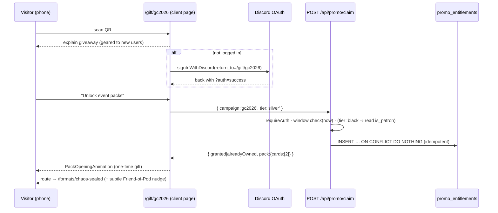

# feat: GC 2026 Promo Packs — QR gift unlock

## Overview

A physical card handed out at Galactic Championship 2026 (Las Vegas, Jul 24–26) carries a
QR code to `protectthepod.com/gift/gc2026`. Scanning it unlocks **Event Packs** on the
visitor's Protect the Pod account: a **Silver Pack** (anyone who reaches the link, logged
in, during GC weekend) and a **Black Pack** (additionally requires Friend of the Pod =
`is_patron`). Unlock is an **idempotent, persistent per-account entitlement**; the first
Silver unlock plays a one-time celebratory `PackOpeningAnimation`, and thereafter the
packs live in a new **Promo Packs** section on the Chaos Sealed and Chaos Draft pages.

No competitive purpose — it's a "met me at GC" keepsake with a gentle Friend-of-the-Pod nudge.

---

## Problem Frame

Real GC/regional events hand out physical Silver/Black Event Packs containing ~2 random
event promos. This feature recreates that as a digital gift keyed to a physical card's QR
code (see origin: `docs/brainstorms/2026-07-12-gc-promo-packs-requirements.md`). The
delight is the moment of unlocking + opening; the durable value is being able to replay the
packs in the Chaos formats where players already go.

The single biggest technical wrinkle: **promo card variants are deliberately filtered out of
the app's card data today** (`scripts/cardFixes.ts` whitelist, migration 050), because promos
share `cardId`/`number` with their Normal printing. GC event promos are a *new* class this
feature must be able to open **without breaking** that ID-collision guard — the fork is
keyed on the unique uuid `id`.

---

## Requirements Trace

- R1. Silver Pack is an idempotent, persistent **account entitlement**, not inventory (origin R1, R3).
- R2. Black Pack entitlement gated on `is_patron` **and** reaching the GC claim link (origin R2, R6).
- R3. Entitlements persist forever; only *new* claims are window-bound (origin R3, R7).
- R4. A single **shared** link unlocks Silver — no per-card codes; the URL is the token (origin R4, D3).
- R5. Silver claim requires a logged-in account (Discord auth) (origin R5).
- R6. New claims only during **GC weekend, Jul 24–26 2026 (America/Los_Angeles)** (origin R7, D10).
- R7. First Silver unlock plays a one-time `PackOpeningAnimation` gift moment (origin R8).
- R8. After the gift moment, packs appear in a **Promo Packs** section on **both**
  `/formats/chaos-sealed` and `/formats/chaos-draft` (origin R9).
- R9. Promo Packs are also **selectable pack slots** inside the Chaos formats (origin R10, D8) —
  may follow the standalone path (see Scope / Phased Delivery).
- R10. Promo Packs UI: Silver unlocked→clickable; Black **visible but locked** unless Friend;
  Black click → single entitlement-checking surface that opens it (Friend) or shows the
  "exclusive for Friends of the Pod" soft CTA (origin R11, R12, D5, D7).
- R11. Landing page is geared to not-yet-signed-up visitors; primary CTA "unlock event packs";
  post-Silver success carries a **subtle** Friend-of-the-Pod nudge for the Black Pack (origin R13, R14).
- R12. Event-pack contents are **data-driven from card variants** (strapi/swuapi), not hand-listed
  in UI code (origin R15).

**Origin actors:** A1 Scanner (new/anon), A2 Scanner (existing account), A3 Friend of the Pod, A4 Link-forwarder.
**Origin flows:** F1 Silver unlock happy path, F2 Repeat claim (idempotent), F3 Black not-a-Friend, F4 Black Friend, F5 Window closed.
**Origin acceptance examples:** AE1 (R4,R5,R7,R8), AE2 idempotent (R1), AE3 Black non-Friend (R10), AE4 Black Friend (R2,R10), AE5 patron-without-scan denied (R6/D9), AE6 window closed (R3,R6).

---

## Scope Boundaries

- No unique/trackable per-card codes or redemption analytics dashboard (D3 chose open/shareable).
- No physical card print/design production (Lee prepares the card himself).
- No trading/gifting packs between accounts; no real-money or FFG-prize tie-in.
- No non-GC events (regionals/sectors) — the campaign model should not *preclude* them
  (`campaign` column exists), but only `gc2026` ships now.
- No changes to existing pack generation, belt behavior, or past-set configs.

### Deferred to Follow-Up Work

- **R9 selectable-in-Chaos-formats (U7)** may land as a separate PR after the standalone
  gift + Promo Packs display path (U1–U6) is verified. See Phased Delivery.

---

## Context & Research

### Relevant Code and Patterns

- **Idempotent per-(user,resource) claim** → `migrations/066_create_deck_play_visits.sql` +
  `app/api/me/play-visit/route.ts:65-71` (`INSERT … ON CONFLICT (user_id, pool_id) DO UPDATE`).
  Closest template for the claim write.
- **Table-creation convention** → `migrations/071_create_casual_matches.sql` (UUID PK
  `gen_random_uuid()`, `user_id … REFERENCES users(id) ON DELETE CASCADE`, `TIMESTAMPTZ DEFAULT NOW()`,
  partial unique index).
- **Grant endpoint** → `app/api/admin/grant/route.ts` (idempotent flag grant, `ON CONFLICT DO UPDATE`).
- **Auth in API routes** → `lib/auth.ts`: `requireAuth(request)`, `getSession(request)`; JWT payload
  has NO `is_patron` — read it from DB: `queryRow('SELECT is_patron FROM users WHERE id=$1',[session.id])`;
  predicate `canSeeFullStats(row)` / guard shape `requireFullStatsAccess` (`lib/auth.ts:287-319`).
- **Login round-trip** → `src/utils/auth.ts:38-42` `signInWithDiscord()` sets
  `/api/auth/signin/discord?return_to=<path>`; live precedent `app/beta/page.tsx:26-30`
  (force `signIn()` when logged out) and `app/formats/chaos-draft/page.tsx` create handler.
- **API conventions** → `@/lib/utils`: `parseBody`, `validateRequired`, `jsonResponse(data,status)`,
  `errorResponse`, `handleApiError` (message→status mapping: `'Unauthorized'`→401, `'… required'`→403,
  `duplicate key`→409). `applyRateLimit(request)` from `@/lib/rateLimit` (used in play-visit).
- **Query helpers** → `@/lib/db`: `query`, `queryRow`, `queryRows`, `withTransaction`, `withAdvisoryLock`.
- **Chaos pages (twins)** → `app/formats/chaos-sealed/page.tsx`, `app/formats/chaos-draft/page.tsx`
  (+ plain global `page.css`). Section container class `.{prefix}-section` is a ready-made dark card.
  Both read `useAuth()` `{ user, isPatron }`. `app/formats/layout.tsx` is a pass-through.
- **Pack + animation** → a pack is `{ cards: RawCard[] }`; `src/components/PackOpeningAnimation.tsx`
  takes `packs={[fixedPack]}`, `packCount`, `onComplete`; reads only `imageUrl/backImageUrl/isLeader/isBase/isFoil/isShowcase` per card. Inline-pack precedent `app/sealed/[shareId]/page.tsx:279`.
- **Card lookup** → `src/utils/cardCache.ts` `initializeCardCache()` + `getCachedCards(setCode).find(c=>c.id===…)`;
  server `getCardsBySet`/`getAllCards` from `src/utils/cardData.ts`. `id` (uuid) is the ONLY unique key.
- **The promo filter (data fork)** → `scripts/cardFixes.ts:146-169` "Keep only draft-relevant variants"
  whitelist (`allowedVariants` Set); applied build-time (`scripts/postProcessCards.ts`) AND runtime
  (`src/utils/cardFixes.ts:86-121` via `src/utils/cardData.ts:79`). `src/data/cards.raw.json` already
  contains every promo variant (incl. `Event Exclusive`, `Weekly Play`). One edit to the allowlist/transform covers both passes.
- **Landing page precedent** → `app/beta/page.tsx` (+ `page.css`): client page, force-login, branch on
  `isPatron`, call endpoint, `router.push` on success.
- **Three-state patron gate** → `src/components/SubscribePodBanner.tsx` (render nothing while
  `isPatron===null`; anon/`false`→primary CTA; softer CTA when appropriate). `PATREON_URL`, `SubscribeModal`.

### Institutional Learnings

- **`is_patron` is re-queried from DB, never trusted from JWT** (`migrations/063`, admin-grant plan).
  Patreon webhook auto-revokes on pledge delete → the Black entitlement must be **stored** so it
  survives later patron loss (R3).
- **AuthContext `user` is snake_case**; `useAuth()` exposes a separate tri-state `isPatron`
  (`null`=loading). Never call camelCase `hasBetaAccess()`/`isAdmin()` on it — they silently return false.
  Client gating is UX only; **the real Black gate is server-side**.
- **Any `isPatron`-gated feature MUST add an entry to `PATREON_FEATURES`** (`src/utils/patreonFeatures.ts`,
  `.claude/rules/patreon-features.md`).
- **E2E tests drive every action through the real UI** — no `fetch()` to app routes, no direct DB writes
  to simulate claim state (`.claude/rules/testing.md`, strongly-held; `tests/e2e/multiplayer-draft.spec.ts`).
- **Unit tests are spec-first** (Node built-in runner, no Jest); assert hardcoded spec values.
- **Build-verify** fails on missing `JWT_SECRET` in fresh worktrees → pass a throwaway inline secret;
  ensure Node 20 (`nvm use 20.20.2`).
- **No `git push` without explicit go-ahead** — push = prod deploy; and window-only claim logic makes
  deploy *timing* matter (`.claude/rules`, memory).
- Never use "tournament" in user-facing copy (legal); "Event Packs"/"Galactic Championship" are fine.
  Do not raise FFG/licensing concerns about showing promo content (product design, not compliance).

### External References

- GC 2026 prizing (Silver in LCQ/prize-wall, Black in main event):
  `https://galacticchampionship.starwarsunlimited.com/2026/prizes`.
- Card art CDN: `https://cdn.starwarsunlimited.com/…` (promo art filenames carry an `_OP_` marker).

---

## Key Technical Decisions

- **Entitlement = dedicated table, not a user column.** Two independent grants with a timestamp
  and a `campaign` dimension → `promo_entitlements(user_id, campaign, promo_tier, granted_at)` with a
  unique index → claim is an idempotent `INSERT … ON CONFLICT DO NOTHING`. Persists independent of live
  patron status (R3).
- **Pack contents = draw 2 random cards from the campaign's tier pool** (Silver pool / Black pool),
  each time the pack is opened. Faithful to real Event Packs ("2 random promos") and makes the
  selectable-in-Chaos replay (R9) natural. *Confirmable:* the alternative is fixed 2-card contents —
  a one-line policy change in the catalog module if preferred.
- **Promo card data via allowlist edit, keyed by uuid `id`.** Add the specific GC 2026 promo card
  `id`s (from `cards.raw.json`) through a post-whitelist transform in `scripts/cardFixes.ts` so they
  survive both filter passes, *without* widening the variant-type whitelist globally (avoids
  reintroducing the `cardId` collision the filter guards against). Migration 050's ID-collision
  mapping stays intact.
- **Claim window is a server-enforced constant with an injectable clock + non-prod override.** The
  window check takes `now` (injectable) and honors `PROMO_CLAIM_WINDOW_OVERRIDE` outside production so
  e2e/local can exercise the claim before Jul 24. Production ignores the override.
- **Black gate enforced server-side at claim time** (DB `is_patron` read), stored on success; client
  `isPatron` only drives the locked-tease UX.
- **Single shared link, no per-code check** — "QR + Friend" for Black means "reach `/gift/gc2026` +
  be patron"; second-hand links are fine by design (D3, D9).
- **Black entitlement-check surface = a dedicated route** `app/gift/gc2026/black/page.tsx` (D7's
  "one page"), reused by the Promo Packs Black tile.

---

## Open Questions

### Resolved During Planning

- **Silver vs random contents** → draw 2 random from the tier pool (see Key Decisions); confirmable.
- **Claim window length** → GC weekend only, Jul 24–26 2026 America/Los_Angeles (origin, confirmed by user).
- **Claim route name** → `/gift/gc2026` (origin suggested it; matches `app/gift/gc2026/…`).
- **Entitlement storage** → dedicated `promo_entitlements` table (see Key Decisions).
- **Testing outside the window** → injectable clock + `PROMO_CLAIM_WINDOW_OVERRIDE` (non-prod).

### Deferred to Implementation

- **GC 2026 promo-variant data readiness (top risk).** Whether the actual Silver/Black GC 2026 promo
  variants exist in swuapi/strapi / `cards.raw.json` yet. Resolved *first* in U1; if absent, U1 builds a
  **stopgap catalog** (curated `id`s, or a small local records file pointing at CDN art) so the rest of
  the feature is unblocked. The Wayfinder `/live/gc2026` page hit exactly this wall (clean art only in Discord).
- Exact promo card `id`s per tier — filled in U2's catalog once U1 confirms the source.
- Whether the Silver "open" from the Promo Packs section replays the full `PackOpeningAnimation` or a
  lighter reveal — settled during U6 against real UX.

---

## High-Level Technical Design

> *This illustrates the intended approach and is directional guidance for review, not implementation
> specification. The implementing agent should treat it as context, not code to reproduce.*

Claim + gift flow (F1):

Entitlement/tier gating matrix:

| Visitor state              | Silver claim         | Black claim                          |
|----------------------------|----------------------|--------------------------------------|
| Anonymous                  | login first          | login first                          |
| Logged in, not patron      | ✅ granted (in window)| ❌ "exclusive for Friends of the Pod" |
| Logged in, patron          | ✅ granted            | ✅ granted (in window)                |
| Any, outside window        | ❌ "claim closed"     | ❌ "claim closed"                     |
| Already owns tier          | idempotent no-op ✅   | idempotent no-op ✅                   |

---

## Implementation Units

Dependency order: **U1 → U2 → {U3, U4} → U5 → U6 → U7 → U8**. U3 (migration) is independent of
U1/U2 and can be built in parallel.

- [x] U1. **Reintroduce GC 2026 promo card variants into card data** ✅ 2026-07-12

**Goal:** Make the specific GC 2026 Silver/Black promo cards resolvable from card data (by uuid `id`)
without breaking the promo-collapse filter. Resolve the data-readiness risk first.

**Outcome:** Data-readiness check confirmed the risk — `cards.raw.json` has **zero** ASH/TS26 promo
variants. Took the **stopgap** branch: added `src/data/promoPacks/gc2026-cards.json` (21 resolved +
8 pending TS26) sourced from the wayfinder `GC2026_PRIZE_CARDS` artifact (official prize list + leak +
FFG stream dump), and a post-whitelist idempotent transform in `scripts/cardFixes.ts` that clones each
promo from its Normal printing as a distinct `'GC 2026 Promo'` variant (standard art stand-in). 8 Twin
Suns 2026 Showcase Leaders are `pending` (TS26 set not in swupod data). 6 U1 tests pass; 21 promos in
`cards.json`, resolvable via `getCardsBySet`; belts unaffected (they whitelist `Normal`).

**Requirements:** R12; unblocks R7, R10.

**Dependencies:** None. **Do this first** — it gates everything that opens a pack.

**Files:**
- Modify: `scripts/cardFixes.ts` (add a post-whitelist `customTransform` re-injecting a curated
  set of GC 2026 promo `id`s from raw data; keep the existing whitelist first)
- Reference/read: `src/data/cards.raw.json` (source of promo variants), `src/utils/cardFixes.ts`
  (runtime path that consumes the same `customTransforms`)
- Create (only if raw data lacks the GC 2026 variants): `src/data/promoPacks/gc2026-cards.json`
  (stopgap catalog: `id`, `name`, `set`, `variantType`, `imageUrl`) + loader wiring in the transform
- Regenerate: `src/data/cards.json` (build artifact — commit silently)
- Test: `scripts/cardFixes.test.ts` (or `src/utils/cardFixes.test.js` if that's where the transform is unit-tested)

**Approach:**
- First **verify readiness**: grep `cards.raw.json` for the GC 2026 Silver/Black promo cards. If present,
  collect their uuid `id`s and re-inject via a transform that runs *after* the whitelist filter. If absent,
  build the stopgap catalog file and inject from it. Announce which path was taken.
- Re-inject by uuid `id` only — never widen `allowedVariants` by variant-type string (that would
  resurrect the `cardId` collision the filter exists to prevent).
- Confirm the re-injected cards do not collide in any `.find(c => c.cardId === …)` call path (they carry
  distinct `id`; migration 050's Normal-UUID mapping is unaffected).

**Patterns to follow:** `scripts/cardFixes.ts` `customTransforms` array; migration 050's name|set→uuid
lookup approach for reasoning about collisions.

**Test scenarios:**
- Happy path: after transform, each GC 2026 promo `id` is present in the processed card list with its
  promo `variantType` and a resolvable `imageUrl`.
- Edge case: a promo card that shares `cardId`/`number` with its Normal printing yields **two distinct**
  records (Normal + promo) with different `id`s; neither is dropped.
- Regression: all previously-excluded promo variants (PQ/SS/Prerelease/Weekly Play) that are **not** in
  the GC 2026 set remain filtered out — the allowlist wasn't widened globally.
- Integration: the runtime path (`src/utils/cardData.ts` load) surfaces the same GC promo `id`s the
  build path does (both consume the shared transform).

**Verification:** GC 2026 promo `id`s resolve via `getCardsBySet`/card cache; a full `npm run build`
regenerates `cards.json` containing them; no existing card test regresses.

---

- [x] U2. **Campaign catalog + claim-window + pack-draw service** ✅ 2026-07-12

**Goal:** Pure logic defining the GC 2026 campaign: which promo `id`s are in the Silver vs Black pool,
the claim window, and how a pack draws its cards.

**Outcome:** `src/services/promoPacks.catalog.ts` (campaign data: Jul 24–26 2026 LA window, packSize 2,
Silver/Black pools of the 21 U1 promo ids) + `src/services/promoPacks.ts` (pure: `getCampaign`,
`isClaimWindowOpen` (DST-correct via `Intl` LA calendar date), `isClaimAllowed` (injected override),
`drawEventPack` (sample-without-replacement, injectable rng + `resolveCard`)). 11 spec-first tests pass;
all 21 pool ids verified to resolve to injected `GC 2026 Promo` cards. ⚠️ **Silver-vs-Black pool split
is a documented placeholder to confirm** — the real per-pack contents aren't published; the split is a
defensible default and is a pure data edit to change.

**Requirements:** R4, R6, R12; supports R7, R9.

**Dependencies:** U1 (needs the promo `id`s to exist).

**Files:**
- Create: `src/services/promoPacks.ts` (pure: `getCampaign('gc2026')`, `isClaimWindowOpen(now)`,
  `drawEventPack(tier, campaign, rng?) → { cards: RawCard[] }`)
- Create: `src/services/promoPacks.catalog.ts` (data: campaign id, tier→pool of promo card `id`s,
  window constants `2026-07-24`/`2026-07-26` America/Los_Angeles, pack size = 2)
- Test: `src/services/promoPacks.test.ts`

**Approach:**
- Keep it pure and I/O-free (`.claude/rules/architecture.md`: services < 200 lines, no I/O). Card objects
  are resolved by the caller via the card cache and passed in, or the service takes a resolved-cards
  accessor injected for testability.
- `isClaimWindowOpen(now)` compares against the LA-timezone window; a separate wrapper reads
  `PROMO_CLAIM_WINDOW_OVERRIDE` (non-prod only) so callers can force-open.
- `drawEventPack` draws 2 distinct cards from the tier pool using an injectable RNG (seeded in tests).

**Patterns to follow:** `src/services/` pure-service pattern; per-set/per-campaign config style from
`src/utils/setConfigs/`.

**Test scenarios:**
- Happy path: `drawEventPack('silver','gc2026')` returns a `{cards}` object with exactly 2 cards, both
  from the Silver pool. Covers R12.
- Edge case: draw is 2 **distinct** cards; if a pool has exactly 2, both are always returned.
- Happy path: `isClaimWindowOpen` is true for a `now` inside Jul 24–26 LA, false on Jul 23 and Jul 27
  (assert against hardcoded spec dates). Covers AE6.
- Edge case: window boundaries are inclusive at the intended local start/end; a `now` in a different
  timezone maps correctly to the LA window.
- Edge case: override wrapper opens the window in non-prod when the env flag is set; returns to the real
  check when unset.

---

- [ ] U3. **Migration: `promo_entitlements` table**

**Goal:** Persistent, idempotent per-account entitlement storage.

**Requirements:** R1, R2, R3.

**Dependencies:** None (parallelizable with U1/U2).

**Files:**
- Create: `migrations/078_create_promo_entitlements.sql`

**Approach:**
- `promo_entitlements(id UUID PK DEFAULT gen_random_uuid(), user_id UUID NOT NULL REFERENCES users(id)
  ON DELETE CASCADE, campaign TEXT NOT NULL, promo_tier TEXT NOT NULL, granted_at TIMESTAMPTZ DEFAULT NOW())`.
- `CREATE UNIQUE INDEX IF NOT EXISTS … ON promo_entitlements(user_id, campaign, promo_tier)` → makes the
  claim `ON CONFLICT DO NOTHING`.
- Fully idempotent (`CREATE TABLE IF NOT EXISTS`, `CREATE UNIQUE INDEX IF NOT EXISTS`), tracked by the
  standard runner.

**Execution note:** Test the migration on local/dev before it ever runs on prod (data-migration rule).

**Patterns to follow:** `migrations/071_create_casual_matches.sql`, `migrations/066_create_deck_play_visits.sql`.

**Test scenarios:** Test expectation: none — pure schema DDL; behavior is exercised via U4's endpoint
tests (idempotent claim). Verify by running `npm run migrate:status` locally.

**Verification:** Migration applies cleanly on a fresh DB and is a no-op on re-run; the unique index exists.

---

- [ ] U4. **Claim + entitlement-read API + PATREON_FEATURES entry**

**Goal:** Server endpoints to claim a tier (idempotent, window- and patron-gated) and to read a user's
entitlements; register the Black Pack as a patron feature.

**Requirements:** R1, R2, R3, R5, R6, R10.

**Dependencies:** U2 (window + tier logic), U3 (table).

**Files:**
- Create: `app/api/promo/claim/route.ts` (`POST { campaign, tier }`)
- Create: `app/api/promo/entitlements/route.ts` (`GET` → tiers the current user owns for a campaign)
- Modify: `src/utils/patreonFeatures.ts` (add Black Pack entry to `PATREON_FEATURES`)
- Test: `app/api/promo/claim/route.test.js`, `app/api/promo/entitlements/route.test.js`

**Approach:**
- `claim`: `requireAuth(request)`; validate `campaign`/`tier`; `applyRateLimit`; reject when
  `!isClaimWindowOpen(now)` (message maps to a clear 4xx); for `tier==='black'` read
  `queryRow('SELECT is_patron FROM users WHERE id=$1')` and throw a 403-mapped message when not patron;
  `INSERT … ON CONFLICT (user_id,campaign,promo_tier) DO NOTHING`; respond `{ granted|alreadyOwned }`
  plus a freshly drawn `pack` (`drawEventPack`) for the gift moment.
- `entitlements`: `requireAuth`; `queryRows` the user's rows for the campaign → `{ silver:boolean, black:boolean }`.
- Add a `handleApiError` branch (or reuse an existing 403 message) for "Friend of the Pod required" and a
  4xx for "claim window closed".

**Patterns to follow:** `app/api/me/play-visit/route.ts` (idempotent UPSERT + rate limit),
`app/api/admin/grant/route.ts` (grant write), `lib/utils.ts` response envelope + error mapping,
`lib/auth.ts` DB `is_patron` read.

**Test scenarios:**
- Happy path: logged-in user, in window → Silver claim returns `granted` + a 2-card pack; a second call
  returns `alreadyOwned`, no duplicate row. Covers AE1, AE2.
- Error path: anonymous request → 401. Covers R5.
- Error path: `tier='black'`, non-patron, in window → 403 "exclusive for Friends of the Pod", **no row
  written**. Covers AE3, R6.
- Happy path: `tier='black'`, patron, in window → granted; row persists. Covers AE4.
- Error path: any claim outside the window → 4xx "claim closed", no row written. Covers AE6, R6.
- Integration: patron claims Black, then patron flag is later set false in DB → `entitlements` GET still
  reports `black:true` (persistence, R3).
- Edge case: unknown `campaign`/`tier` → validation 4xx.

**Verification:** All endpoint tests pass; `PATREON_FEATURES` includes the Black Pack so the Support
page/Subscribe modal render it.

---

- [ ] U5. **QR landing / claim page with gift moment**

**Goal:** The `/gift/gc2026` page: explain, force login, claim Silver, play the one-time gift animation,
route to Chaos Sealed with a subtle Friend-of-the-Pod nudge.

**Requirements:** R4, R5, R7, R11; F1.

**Dependencies:** U4 (claim API), U2 (pack shape for the gift).

**Files:**
- Create: `app/gift/gc2026/page.tsx`, `app/gift/gc2026/page.css`
- Create: `app/gift/gc2026/black/page.tsx`, `app/gift/gc2026/black/page.css` (Black entitlement-check surface, R10/D7)
- Reference: `app/beta/page.tsx` (force-login + branch pattern), `src/components/PackOpeningAnimation.tsx`

**Approach:**
- `'use client'`; read `useAuth()`. Copy is geared to new users; primary CTA "Unlock event packs."
- When `!loading && !user`, offer/trigger `signInWithDiscord()` with `return_to=/gift/gc2026`
  (round-trips back with `?auth=success`).
- On unlock: `POST /api/promo/claim {campaign:'gc2026', tier:'silver'}` → render `PackOpeningAnimation`
  `packs={[pack]}` `packCount={1}`; on `onComplete` `router.push('/formats/chaos-sealed')`.
- Show a **subtle** "Become a Friend of the Pod to unlock your Black Pack" nudge (mirror
  `SubscribePodBanner` tone; `PATREON_URL`/`SubscribeModal`) — only after Silver success, not pushy.
- `/gift/gc2026/black`: reads entitlement/patron; if patron (+ in window) offers Black claim → gift
  animation; else shows "exclusive for Friends of the Pod" soft CTA. Reused by U6's Black tile.
- Handle window-closed and already-owned states with clear, friendly copy (F5, F2).
- **Read `docs/STYLE_GUIDE.md` + `.claude/rules/ui-components.md` before writing UI**; use `Button`,
  design tokens, `gap` for icon+text.

**Patterns to follow:** `app/beta/page.tsx`, `SubscribePodBanner.tsx` three-state gate, chaos-sealed's
`PackOpeningAnimation` usage.

**Test scenarios:**
- E2E (through the UI, see U8) is the primary coverage; keep any component-level unit tests light.
- Happy path (unit/component if feasible): given a mocked "granted + pack" claim response, the animation
  renders and `onComplete` navigates to `/formats/chaos-sealed`.
- Edge case: already-owned response shows "already unlocked," no animation replay. Covers AE2/F2.
- Edge case: window-closed response shows the closed-claim state. Covers F5.

**Verification:** Manual/preview: scanning the route logged-out routes through Discord and back;
logged-in unlock plays the animation and lands on Chaos Sealed; non-patron sees the subtle nudge.

---

- [ ] U6. **Promo Packs section on Chaos Sealed + Chaos Draft**

**Goal:** A shared section on both Chaos pages showing the unlocked Silver (clickable→open) and a
locked Black tease (→ the Black surface).

**Requirements:** R8, R10, R11; F3, F4.

**Dependencies:** U4 (entitlements read), U2 (draw for the open), U5 (Black surface route).

**Files:**
- Create: `src/components/PromoPacksSection.tsx`, `src/components/PromoPacksSection.css`
- Modify: `app/formats/chaos-sealed/page.tsx`, `app/formats/chaos-draft/page.tsx` (mount the section)
- Test: `src/components/PromoPacksSection.test.tsx`

**Approach:**
- Fetch entitlements (`GET /api/promo/entitlements?campaign=gc2026`); read `useAuth()` `isPatron`
  (tri-state — render nothing/skeleton while `null`).
- Silver tile: if owned → clickable → opens a freshly drawn pack via `PackOpeningAnimation` (standalone
  "gift"-style reveal). If not owned → prompt to scan/visit `/gift/gc2026`.
- Black tile: **always visible**; locked with "Friend of the Pod unlocks this" unless owned; click routes
  to `/gift/gc2026/black` (single entitlement-check surface). Mirror `SubscribePodBanner`'s three-state UX.
- Mount as a sibling `
` in **both** twin pages (near-identical edit).
- **Read the style guide + ui-components rule first.**

**Patterns to follow:** `.{prefix}-section` container in the chaos `page.css`; `SubscribePodBanner.tsx`;
`PackSelector` for tile styling cues.

**Test scenarios:**
- Happy path: entitlements `{silver:true, black:false}`, non-patron → Silver tile clickable, Black tile
  locked with the Friend CTA. Covers AE3/F3.
- Happy path: `{silver:true, black:true}` → both tiles openable. Covers AE4/F4.
- Edge case: `isPatron===null` → section renders nothing/skeleton (no wrong-state flash).
- Edge case: no entitlements → Silver tile shows the "visit /gift/gc2026" prompt, Black still visible+locked.
- Integration: clicking Silver triggers a pack open (animation mounts with a 2-card pack).

**Verification:** Both Chaos pages show the section; states match entitlement + patron; Black click lands
on the Black surface.

---

- [ ] U7. **Selectable Event Packs inside Chaos Sealed / Chaos Draft** *(deferrable — see Phased Delivery)*

**Goal:** Let owned Event Packs be chosen as pack slots in Chaos generation, not just opened standalone.

**Requirements:** R9 (origin R10, D8).

**Dependencies:** U6, U2; touches the chaos generation endpoints.

**Files:**
- Modify: `app/api/formats/chaos-sealed/route.ts` (+ the draft creation path in
  `src/utils/draftApi` / `app/formats/chaos-draft/page.tsx`) to accept an Event-Pack slot for owned tiers
- Modify: `src/components/PackSelector.tsx` **or** `PromoPacksSection.tsx` to expose owned Event Packs as
  selectable
- Test: `app/api/formats/chaos-sealed/route.test.js` (Event-Pack slot), plus selection unit coverage

**Approach:**
- Server validates the requesting user **owns** the tier (entitlement check) before including an Event
  Pack slot; each included Event Pack is `drawEventPack(tier)`.
- Keep changes additive; **do not** alter existing chaos behavior when no Event Pack is selected
  (per-config, no past-behavior change).

**Patterns to follow:** `app/api/formats/chaos-sealed/route.ts` pack assembly; entitlement guard from U4.

**Test scenarios:**
- Happy path: owner selects 1 Silver Event Pack + N set packs → generated pool includes a 2-card promo pack.
- Error path: a request for an Event-Pack slot by a non-owner is rejected server-side (can't spoof via API).
- Edge case: no Event Pack selected → output identical to today's chaos generation (no regression).

**Verification:** Owners can add Event Packs to a Chaos Sealed/Draft; non-owners cannot; baseline chaos
output unchanged.

---

- [ ] U8. **End-to-end claim flow (through the UI)**

**Goal:** Prove the full F1 happy path and the key gates drive correctly through real UI interactions.

**Requirements:** R4, R5, R6, R7, R8, R10; AE1–AE6.

**Dependencies:** U5, U6 (and U4/U3 running).

**Files:**
- Create: `tests/e2e/gc-promo-packs.spec.ts`

**Approach:**
- Drive **everything through the UI** — navigate to `/gift/gc2026`, sign in through the app's auth UI,
  click "Unlock," watch the animation, land on Chaos Sealed, see the Promo Packs section. No `fetch()` to
  app routes, no direct DB writes to seed claim state (strongly-held rule).
- Use `PROMO_CLAIM_WINDOW_OVERRIDE` (non-prod) so the claim window is open during CI.
- Cover: Silver unlock + gift + landing (AE1); re-visit shows already-unlocked (AE2); non-patron Black
  tile locked → Black surface CTA (AE3); patron Black claim (AE4, using a patron test user);
  window-closed state with override off (AE6).

**Execution note:** Start from the failing e2e happy-path spec, then confirm U5/U6 wiring satisfies it.

**Patterns to follow:** `tests/e2e/multiplayer-draft.spec.ts`; test-user/patron setup helpers used there.

**Test scenarios:** (the spec itself — enumerated above, AE1–AE6 through the UI).

**Verification:** `npm run test:e2e -- --grep "GC Promo"` passes locally with the window override.

---

## System-Wide Impact

- **Interaction graph:** New public route `/gift/gc2026` (+ `/black`); new API namespace `/api/promo/*`;
  new mount points in both Chaos pages; new row in `PATREON_FEATURES`; Patreon webhook already keeps
  `is_patron` fresh (no change needed, but the persistence contract depends on it).
- **Error propagation:** Claim errors flow through `handleApiError` mapping (401/403/4xx/409); UI renders
  friendly states for unauthorized, not-a-Friend, window-closed, already-owned.
- **State lifecycle risks:** Idempotent `ON CONFLICT DO NOTHING` prevents duplicate grants under retries;
  entitlement intentionally **outlives** patron status (do not add cascade/cleanup on patron revoke).
- **API surface parity:** The two Chaos pages are twins — every Promo Packs edit must land in **both**.
- **Integration coverage:** The DB-`is_patron`-at-claim-time gate and the persistence-after-revoke
  behavior are not provable by mocks alone — covered by U4 integration tests + U8 e2e.
- **Unchanged invariants:** Existing pack generation, belts, per-set configs, migration 050's
  promo→Normal-UUID mapping, and baseline Chaos output are explicitly unchanged; the promo data fork is
  additive and keyed on uuid `id`.

---

## Risks & Dependencies

| Risk | Mitigation |
|------|------------|
| **GC 2026 promo variants not yet in swuapi/strapi/raw data** (top risk) | U1 verifies first and builds a stopgap catalog if absent; rest of feature is decoupled behind the catalog. |
| Reintroducing promos resurrects the `cardId` collision the filter guards against | Re-inject by uuid `id` only, never widen the variant-type whitelist; U1 regression test asserts non-GC promos stay filtered and Normal/promo stay distinct. |
| Claim window blocks all testing/demo before Jul 24 | Injectable clock + non-prod `PROMO_CLAIM_WINDOW_OVERRIDE`; production ignores it. |
| Black entitlement wrongly lost when a patron later lapses | Entitlement is a stored row, gated on patron only *at claim time*; U4 integration test asserts persistence after `is_patron=false`. |
| Deploy timing — window-only claims + push = prod deploy | Do not push without explicit go-ahead; coordinate deploy to precede GC weekend. |
| Fresh-worktree build fails on missing `JWT_SECRET` | Build-verify with a throwaway inline secret under Node 20. |

---

## Documentation / Operational Notes

- **Release notes:** add a GC 2026 Promo Packs entry to root `RELEASE_NOTES.md` at ship time.
- **QR target:** `https://protectthepod.com/gift/gc2026` — give Lee the final URL to encode on the card.
- **Deploy:** must be live *before* Jul 24; the claim window auto-closes Jul 26 (LA) with no code change.
- **Post-launch:** verify entitlement rows via the Railway prod-DB recipe (`RAILWAY_TOKEN` + node/pg on
  the Postgres service) during GC weekend.
- Capture the novel bits (QR landing, time-windowed claim, per-account gift entitlement) with
  `/ce-compound` after it lands — no prior art existed for these.

---

## Phased Delivery

### Phase 1 — Gift + display (ship for GC 2026)
- U1 (promo data) → U2 (catalog/window/draw) → U3 (migration) → U4 (claim/entitlements API) →
  U5 (landing + gift) → U6 (Promo Packs section) → U8 (e2e). This delivers the full "met me at GC"
  experience: scan → unlock → open → see packs in Chaos.

### Phase 2 — Selectable in Chaos (fast follow)
- U7 (Event Packs as selectable Chaos slots). Additive; can land after GC weekend without blocking the
  keepsake experience.

---

## Sources & References

- **Origin document:** [docs/brainstorms/2026-07-12-gc-promo-packs-requirements.md](docs/brainstorms/2026-07-12-gc-promo-packs-requirements.md)
- Related code: `app/beta/page.tsx`, `app/api/me/play-visit/route.ts`, `app/api/admin/grant/route.ts`,
  `lib/auth.ts`, `lib/db.ts`, `scripts/cardFixes.ts`, `src/components/PackOpeningAnimation.tsx`,
  `src/components/SubscribePodBanner.tsx`, `app/formats/chaos-{sealed,draft}/page.tsx`,
  `migrations/066_create_deck_play_visits.sql`, `migrations/071_create_casual_matches.sql`,
  `migrations/063_add_is_patron_to_users.sql`, `src/utils/patreonFeatures.ts`
- Rules: `.claude/rules/{database,architecture,patreon-features,testing,ui-components}.md`,
  root `CLAUDE.md`, `docs/STYLE_GUIDE.md`
- External: `https://galacticchampionship.starwarsunlimited.com/2026/prizes`
