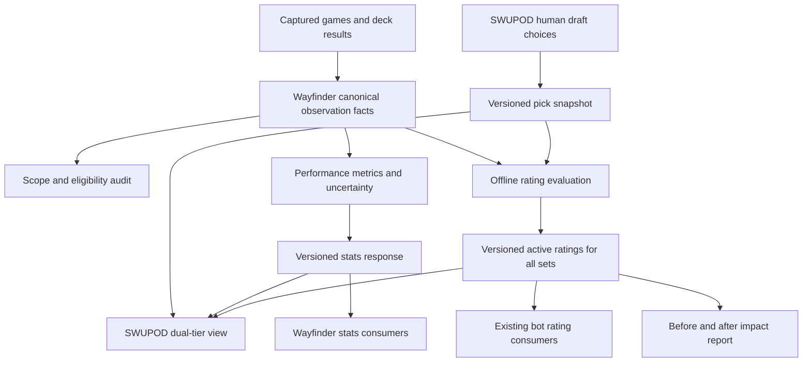

# Replay-informed Limited stats, tiers, and ratings for all sets

## Overview

Use Wayfinder's recorded Limited games to update stats, tiers, and numeric ratings across **every supported set**, including their existing rating consumers. This is an actual data refresh and rating publication project, not just a new view of unchanged ratings. Capture the baseline before any regeneration, fix coverage and scope, evaluate the new ratings, publish supported updates, and deliver tables showing what changed and what measurably improved. Preserve separate pick and performance evidence so every change can be explained.

**Target repos:** `swupod` (this plan, pick data, consumer API, stats UI) and `wayfinder` (canonical game facts, performance aggregates, shared metrics). Paths below are relative to the repo named in each section; proposed new files are marked Create. This is a cross-repo plan, not authorization to deploy or run production backfills.

**Source of requirements:** The October 2 conversation approving the initial proposal and the subsequent correction requiring a before/after data comparison and updates to tiers and ratings for all sets. This correction supersedes the original ASH-first completion boundary and exclusion of bot rating consumers. The June replay-stats brainstorm and plan are historical context, not instructions to rebuild their now-existing pipeline.

## Problem and verified starting point

| Existing behavior | Implication |
|---|---|
| ASH is the only registered pick-preference set. Its committed snapshot is dated July 30, with 250,393 card contests, 12,839 leader contests, and 6,422 human seats. | New replay results do not update ASH pick tiers; regeneration is separate. |
| Cards use within-aspect Bradley–Terry strengths; leaders use Plackett–Luce strengths, mapped from log-strength z-scores to letter bands. | These measure choices, not game performance. |
| `finalizeCardDataPayload` applies pick grades after performance grades. | ASH performance grades are overwritten in the consumer response. |
| SWUPOD maps ASH to `ASH-pre-release`; its Wayfinder request does not forward the user's explicit dates. | A view can show the wrong historical population even when the underlying game collection has grown. |
| Wayfinder already has scheduled observation-fact extraction, validated hand metrics, aggregation, and card-stat APIs. | Extend and validate these layers instead of building a second extractor. |
| Strict performance grades require denominator 50 and 25 gradeable cards; Wayfinder also has a provisional fallback starting at denominator 1 and five cards. | A displayed letter is not evidence that a card has a reliable sample. |

Prior-turn live observation on October 2: the ASH prerelease Limited endpoint returned 237 rows, 236 with available hand metrics, and 93 with GIH denominator at least 50. These are card rows/copy-weighted observations, **not** a count of unique games, and not an audit of all Limited data. Repeat through the audit before making rollout decisions.

## Requirements trace

- **R1 — Coverage:** Reconcile recorded games to eligible facts and report unique games, observed sides, players, builds, and card sample coverage by set environment, format, and date.
- **R2 — Correct scope:** Honor selected dates, sources, set environment, format, and authorized cohort consistently across extraction, serving, caching, and labels. Preserve explicit prerelease access.
- **R3 — Two signals:** Preserve pick tiers and publish an independently named performance tier, each with basis, sample status, and freshness. Missing pick data must never turn into a performance value labeled as a pick tier.
- **R4 — Honest metrics:** Retain canonical GP/OH/GD/GIH/GNS/IIH/PR/RWS/PWAR semantics and percent-with-count formatting. Do not treat copies as independent games or invent hidden-hand observations.
- **R5 — Context and uncertainty:** Support draft/sealed where reliably identified; retain unknown Limited as its own scope. Offer leader/aspect context only when supported. Show uncertainty and withhold unsupported performance tiers.
- **R6 — Useful comparison:** Let users inspect where pick preference and observed performance disagree, preserving filters and cost/curve lenses.
- **R7 — Reliable operation:** Reprocessing is idempotent; late dependencies and visibility/result changes invalidate affected results. Expose freshness and errors instead of silently changing populations.
- **R8 — Evaluate and publish ratings:** Evaluate refreshed pick-only, performance-only, and combined approaches on later unseen games, then publish the best supported candidate per set and migrate existing rating consumers. Do not defer the entire update to an optional research task.
- **R9 — Every set accounted for:** Discover supported sets from the canonical registry and reconcile with stats tabs and observed environments. Audit and refresh each set; publish supported card and leader ratings and applicable base tiers. Record explicit insufficient-data, unchanged, or failed status for every non-updated set/card. An ASH-only result is incomplete.
- **R10 — Demonstrate impact:** Deliver machine-readable before/after snapshots, an all-set summary, per-card and leader movement tables, attribution of changes, and held-out quality comparisons. Report measured improvement, regression, or inconclusive evidence, not an assumed win from a larger dataset.

## Scope and delivery

**Delivery: Units 1–7.** Inventory and baseline every supported set, repair coverage/filtering, compute both signals and uncertainty, evaluate candidate ratings, publish eligible updates to existing consumers, and produce the before/after impact report. ASH may be a technical canary but is not the scope boundary or completion criterion. Sets with no pick observations receive no invented pick tiers; sets with insufficient outcome evidence retain an explicitly labeled prior/fallback rating while their available metrics and status are refreshed.

**Sequence:** Unit 1 freezes the baseline first; Units 2–3 establish trustworthy candidates; Unit 4 exposes the evidence; Unit 6 evaluates candidates before Unit 5 publishes changed default/consumer ratings; Unit 7 reconciles the delivered result. Corrected descriptive metrics can ship earlier, but do not constitute completion of this plan.

Updating existing bot card/leader rating inputs and their lookup precedence is in scope; redesigning drafting strategies, curve/aspect commitment heuristics, or adding an autopicker is not. No new telemetry collection, hidden-hand inference, general player-rating rewrite, or automatic deployment. Constructed records do not feed Limited performance. Native-play ingestion remains a later source integration.

## Research and decisions

- SWUPOD patterns: `app/api/stats/card-data/route.ts`, `src/services/cardDataMetrics.ts`, `src/services/pickPreferenceGrades.ts`, `src/data/pickPreferences/index.ts`, `scripts/analyze-pick-preferences.ts`, `src/components/CardDataTierList.tsx`.
- Wayfinder patterns: `apps/web/src/server/karabast-card-observation-facts.ts`, `apps/web/src/server/card-data-stats.ts`, `apps/web/src/lib/card-data-metrics.ts`, `apps/web/src/server/import-tasks.ts`, `apps/web/src/server/capture-visibility.ts`.
- SWUPOD `plans/ASH_ANALYTICS_GAP_ANALYSIS.md` explains why global ranks can undervalue early curve cards. Preserve existing cost/curve comparisons; its descriptions of older implementation gaps are historical, not current truth.
- Wayfinder `docs/solutions/architecture-patterns/derived-cache-answer-divergence.md`: resolve a scope once, use that actual scope in both queries and cache keys, and prove prerelease/date parity with fixtures. Do not add rollups solely because the dataset is large; measure the real serving path first.
- Wayfinder `docs/solutions/architecture-patterns/archetype-skill-decomposition.md`: pilot skill can confound raw results. The documented constructed result is motivation for Limited evaluation, not proof that its model or thresholds transfer.
- No SWUPOD `docs/solutions/` directory was available. Wayfinder's critical-patterns guidance also applies to work there.
- External grounding: [17Lands metric definitions](https://www.17lands.com/metrics_definitions) and [Using Win Rate Data](https://blog.17lands.com/posts/using-win-rate-data/). Use as conceptual references; SWUPOD/Wayfinder's canonical metric contract remains authoritative.

| Decision | Rationale |
|---|---|
| Wayfinder owns performance facts and grading; SWUPOD owns pick preferences. | Prevent divergent performance formulas between products. |
| Add independent grade objects; keep legacy fields during migration. | Existing consumers remain compatible while the new UI stops relying on overwritten grades. |
| Use GIH as performance basis where validated; use explicitly labeled GP for deck/result-only scopes. | Never combine unlike denominators in one ranked population. Rows without the chosen basis stay unavailable. |
| Compare ordinary cards separately from leaders and bases. | Leaders/bases are selected every game and need game-side deck outcomes, not ordinary-card draw metrics. |
| Publish a versioned active rating per set after evaluation, retaining pick/performance evidence. | Existing tiers and rating consumers must benefit from the data rather than leaving new stats in a side view. Unsupported candidates keep a documented fallback. |
| Compute uncertainty from canonical game-side facts, preserving player/build/game dependence. | Copy-weighted denominators are descriptive exposure counts, not independent sample sizes. |
| Fit and evaluate a blended candidate within this project; do not require it to win. | Updating ratings is required; choosing a more complex model without evidence is not. |

## Intended data flow

> Directional design for review; the implementation may adjust structure while preserving these ownership boundaries.

## Implementation units

Execution on 2026-10-02 is in `docs/research/limited-rating-refresh/impact-report.md`. A box stays open until that unit's verification is met. No active rating was published: held-out results were inconclusive or insufficient.

- [ ] **Unit 1 — Audit and reconcile usable Limited data**

**Goal / requirements:** Freeze the baseline, establish the actual sample for every set, and close factual coverage gaps (R1, R4, R7, R9, R10). **Dependencies:** None.

**Files — Wayfinder:** Create `apps/web/scripts/audit-limited-card-data.ts` and `apps/web/tests/unit/limited-card-data-audit.test.ts`; inspect/modify as findings require `apps/web/src/server/karabast-card-observation-facts.ts` and `apps/web/tests/unit/karabast-card-observation-facts.test.ts`. Create aggregate-only audit report `docs/research/2026-10-02-limited-card-data-audit.md`.

**Approach:** Produce a read-only funnel: recorded → canonical completed games → identified Limited → eligible result/deck sides → validated card facts → validated hand facts. Group by environment, draft/sealed/unknown Limited, source, week, and extractor version. Report unique games/sides/players/builds separately from copy counts, missing player/build identity, duplicate captures, result/deck/format gaps, freshness, exclusions, and coverage distribution across cards. Do not infer a Limited environment from one card's printing set, or infer draft versus sealed solely from deck size.

Before extraction repairs, snapshot regeneration, or rating publication, capture the actual currently served grades, numeric ratings, bot lookup results, metric counts/rates, resolved scope, source versions, and cutoffs. Preserve both committed artifacts and live override behavior. Enumerate every supported set from SWUPOD `src/utils/setConfigs/index.ts`, reconciling `src/utils/statsSetTabs.ts` and Wayfinder's observed environments; record prerelease/preview sets and special products explicitly rather than silently omitting them. Keep mixed-set environments separate from single-set training populations. Store aggregate baseline artifacts under `docs/research/limited-rating-refresh/before/` in SWUPOD with a manifest tying them to repo revisions and extraction timestamps.

At planning time the registry contains **SOR, SHD, TWI, JTL, LOF, SEC, LAW, ASH, and HMW**. HMW is absent from the current stats-tab list: include it in the audit and rating manifest, retain its existing preview/access rules, and report insufficient observations explicitly if applicable. Discover the registry again at execution so newly added sets cannot be missed.

Inspect canonical game reconciliation and current public/team eligibility before admitting observations. Resolve dual captures to one game-side observation while retaining legitimately observed opposing sides. Admit hand metrics only on validated recorded sides; result/deck-only sides remain GP-only. Any repair extends the existing extractor, with bounded resume/retry and source/version provenance. Document production backfill scope before execution; no destructive cleanup.

**Tests:** Duplicate captures produce unchanged game and side counts; three copies increase exposures but not unique-game counts; both recorded sides share a game identity; unknown format remains excluded or separately labeled; incomplete/late captures become eligible after dependency resolution; reruns are idempotent; result or visibility changes invalidate derived eligibility. Include all-zero dev fixtures and nonempty canonical fixtures so an empty audit is not mistaken for proof of health.

**Verification:** Every funnel loss has a count and reason; representative fact counts reconcile with canonical games; audit contains no raw handles or private decks. Every supported set has a baseline/coverage/status entry before mutation. Missing historical facts are explicitly unavailable, never reconstructed and passed off as an observed old baseline.

- [ ] **Unit 2 — Make filter scope explicit and preserve both grade signals**

**Goal / requirements:** Correct the API boundary and remove grade overwriting from the new contract (R2–R4, R7). **Dependencies:** Unit 1 eligibility and format findings.

**Files — SWUPOD:** Modify `app/api/stats/card-data/route.ts` and `app/api/stats/card-data/route.test.ts`; create `src/services/cardDataContract.ts` and `src/services/cardDataContract.test.ts`.

**Files — Wayfinder:** Modify `apps/web/src/server/card-data-stats.ts`, `apps/web/src/lib/page-rows/card-stats.ts`, `apps/web/app/api/cards/stats/route.ts`, `apps/web/tests/unit/card-data-stats-slice.test.ts`, and `apps/web/tests/unit/card-stats-rows-cache.test.ts`.

**Approach:** Resolve environment/date boundaries explicitly, using existing era and prerelease helpers. Replace unconditional ASH prerelease routing with the selected environment and dates. Distinguish environment from printing-set filtering so reprints remain valid. Echo resolved scope, source, methodology version, fact freshness, and metric grain in the response. Verify mirror-policy behavior through the full query; do not assume an accepted query parameter is implemented.

Add independent `pickGrade` and `performanceGrade` payloads, each carrying basis, status, sample/provenance, and relevant cost/curve grades. Keep legacy grade fields with their current semantics until consumers migrate. Deliver exact numerators/denominators instead of reconstructing wins from rounded rates. GP from manual match records must retain match grain and must not be silently pooled with per-game GP.

Add a versioned `activeRating` carrying numeric score, grade, model/basis, scope, support status, and effective cutoff. Keep old response shapes compatible; migrate their displayed/default rating values deliberately to the published active version in Unit 5. Expose refreshed pick ratings separately. A 0–100 within-set percentile is a relative rank, not a win probability or a cross-set power scale.

Cache on resolved scope including authorization/cohort and grading version. Unsupported scopes return an explicit unavailable state; Wayfinder failure must not substitute a broader population. Same-scope local GP fallback may render with its source and grain clearly labeled. Preserve public/private and paid-cohort authorization on every path. Pick snapshots are set-wide unless actually regenerated for a cohort: echo their own scope rather than claiming that the performance filters apply to picks.

Keep confidence artifacts in Wayfinder's authorized server-side storage; only aggregate values and support statuses cross the public API. Validate filter values using existing parsers and bound expensive custom-scope work through existing query controls. Never expose player/build identifiers or resampling membership in public responses or committed reports.

**Tests:** Explicit current dates include post-prerelease games; explicit prerelease stays available; draft, sealed, unknown Limited and constructed never leak across scopes; start/end boundaries follow existing date semantics; printing reprints resolve correctly; private/cohort scopes cannot share cached responses; mirror toggles affect the canonical population; ASH has both signals; a set without pick data has only performance; an upstream timeout cannot return broader data; old response consumers still work; null rates remain null.

**Verification:** Direct Wayfinder and SWUPOD requests for the same resolved performance scope agree on counts and rates. Shared cross-repo contract fixtures detect drift without creating a new shared package solely for this feature.

- [ ] **Unit 3 — Add uncertainty and support-gated performance tiers**

**Goal / requirements:** Publish interpretable performance tiers with meaningful evidence (R4, R5). **Dependencies:** Units 1–2.

**Files — Wayfinder:** Modify `apps/web/src/lib/card-data-metrics.ts`, `apps/web/src/server/card-data-stats.ts`, and `apps/web/src/lib/page-rows/card-stats.ts`; create `apps/web/src/server/card-performance-confidence.ts`, `apps/web/tests/unit/card-performance-confidence.test.ts`, and `apps/web/tests/unit/card-performance-grades.test.ts`.

**Approach:** Retain copy-weighted descriptive rates and the existing mean-shrinkage/z-score letter mapping as a versioned baseline. Grade ordinary cards separately from leaders/bases, selecting one basis per comparison population. Do not present IIH or played WAR as causal effects. Leave legacy grading available for old consumers; the new performance object uses stricter support states.

For the initial new contract require the existing strict floor (50 exposures and 25 gradeable ordinary cards) plus at least 30 unique games, 10 identified players, and 10 builds for an ordinary-card tier. These are conservative launch rules, not claims of statistical sufficiency; validate them in the audit and offline stability report before shipping. Metrics can remain visible under existing authorized disclosure rules even when the letter is withheld. Missing identities cannot count toward distinct-player/build gates.

Estimate 95% uncertainty offline from game-side facts with a deterministic clustered-resampling method; benchmark a conservative player/build grouping that keeps both sides of a physical game together. Unit 1 must report whether connected groups collapse into too few independent clusters; if they do, mark uncertainty unavailable and withhold the tier rather than reverting to a copies-as-trials binomial interval. Resample the complete grading procedure to assess grade stability. Mark a tier provisional unless at least 80% of replicates stay within one letter step of its point grade. Document grouping, seed, replicate count, and version. Do not run resampling on interactive requests.

For leaders/bases use one resolved deck-selection outcome per side/game, independent support gates, and a distinct labeled comparison population. If the eligible leader/base population is too small to support relative letters, show WR and uncertainty without forcing the 25-card rule or inventing tiers. Context slices use the same gates and shrinkage policy; do not add a universal leader-by-card matrix upfront.

**Tests:** One player with many copies cannot satisfy independence gates; exact gate boundaries behave predictably; GIH-unavailable rows never receive a GIH tier; deterministic resampling reproduces results; small or single-cluster data withholds confidence; duplicate/reordered input does not change results; correlated opposing sides stay together; zero variance and sparse leader populations are explicit states; sparse context slices do not inherit global confidence; IIH component coverage is consistent.

**Verification:** A reproducible stability report distinguishes exposures from games and clusters, identifies unstable tiers, and confirms that small samples cannot produce an unqualified A. If usable clusters are insufficient, ship rates and unavailable performance tiers rather than delaying coverage and scope fixes.

- [ ] **Unit 4 — Expose pick and performance tiers with comparison context**

**Goal / requirements:** Make the new information useful in the existing stats flow (R3, R5, R6). **Dependencies:** Units 2–3.

**Files — SWUPOD:** Modify `src/components/CardDataTierList.tsx`, `src/components/CardDataTierList.test.ts`, `app/stats/page.tsx`, `app/stats/stats.css`, and `tests/e2e/stats-page.spec.ts`.

**Approach:** Show the published active tier/rating in the existing default tier view, with Pick, Performance, and Compare available as explanatory modes. Before publication, show the current active baseline; after publication, use the new per-set version without a separate optional user migration. Label the basis explicitly and retain mode/filters in URL state. On sets without picks, explain unavailable pick data. Keep global/cost/curve lenses; the two signals use matching comparison lenses but display their separate population scopes.

Compare shows the two tiers and evidence together. Surface potential sleepers/overvalued cards only when both signals have support; call these disagreements, not proven drafting mistakes. Do not subtract raw letters or combine percentile and percentage units. Initial comparison sorting can use rank-percentile disagreement within the same eligible card intersection, labeled as descriptive and omitted when populations are too small.

Show set environment, draft/sealed/unknown, date window, fresh/stale state, source, basis, counts, and uncertainty without requiring hover. Keep canonical counts inside rate cells. Add leader/aspect filters only where the backend can honor them and audit supports them; distinguish deck-aspect context from filtering cards by printed aspect. Preserve card previews, keyboard navigation, mobile detail access, and filter state when entering/exiting details.

On mobile, Compare uses a per-card stacked pair rather than forcing both dense tables onscreen. Keep card name, two labeled grades, and support status visible; expand for metric definitions and confidence. Loading preserves the selected mode, an empty slice offers filter reset, an upstream failure offers retry, and stale valid data shows its timestamp. If no pick snapshot exists, leave Pick explicitly unavailable; the default remains the active rating with its stated basis/fallback, and a low-sample performance scope shows eligible metrics with ungraded rows. Distinguish Pick-versus-Performance comparison from the historical Before-versus-After report in Unit 7.

**Tests:** Switching modes changes the displayed grade and sort basis, not the selected game population; browser back restores filters; sparse cards show unavailable/provisional state rather than an authoritative letter; unsupported context is explained; global pick scope remains visible under filtered performance; empty/loading/error/stale states are distinct; mobile and keyboard users can access confidence and definitions; the existing tier/table views retain card identity and previews.

**Verification:** A user can explain why a card is highly picked, how it performed in the selected games, and whether evidence supports its tier without consulting raw replays.

- [ ] **Unit 5 — Refresh, backfill, and roll out reproducibly**

**Goal / requirements:** Refresh and publish tiers/ratings for all sets and keep them current and recoverable (R1, R2, R7–R10). **Dependencies:** Units 1–4 and Unit 6 candidate decisions before active-rating publication. Extraction repair and shadow refresh can precede Unit 6.

**Files — Wayfinder:** Modify `apps/web/src/server/import-tasks.ts`; create `apps/web/tests/unit/card-performance-refresh.test.ts` and `docs/runbooks/limited-card-performance.md`. Add a versioned snapshot migration under `apps/web/db/migrations/` only if needed to persist confidence outputs; choose the next migration number at implementation time.

**Files — SWUPOD:** Modify `scripts/analyze-pick-preferences.ts`, `src/data/pickPreferences/index.ts`, `src/bots/data/cardRankings.ts`, `src/bots/data/leaderRankings.ts`, and `src/bots/behaviors/DataDrivenBehavior.ts`; regenerate/create eligible per-set JSON under `src/data/pickPreferences/`. Create `scripts/refresh-limited-ratings.ts`, `scripts/refresh-limited-ratings.test.ts`, `scripts/analyze-pick-preferences.test.ts`, and `docs/stats/limited-tiers-methodology.md`. Modify `src/bots/behaviors/DataDrivenBehavior.test.ts`, `src/bots/behaviors/behaviors.test.ts`, and `src/bots/data/draftStats.test.ts`; inspect the leader consumers `PopularLeaderBehavior.ts`, `BaseStrategy.ts`, and `RotisserieBehavior.ts` under `src/bots/behaviors/`, updating lookup adapters only where necessary. Add regression cases to `src/bots/behaviors/botEval.test.ts` for actual changed rating consumers.

**Approach:** Reuse the existing scheduled extraction task; add a dependent offline confidence refresh only after measuring its actual scope and cost. Persist aggregate confidence results with resolved-scope signature, input watermark, algorithm version, and build status. Publish atomically only after validation. Reuse on-demand fact aggregates for long-tail contexts; unavailable confidence is acceptable there until measured demand justifies caching.

Backfill one bounded environment first, reconcile with Unit 1, then widen. Late results, canonical-game merges, identity fixes, deck edits, and visibility changes trigger affected-scope invalidation. Authorization/visibility invalidation must suppress affected cached output immediately; ordinary ingestion can follow the normal refresh cadence. Failed refreshes preserve a labeled last-known-good snapshot only while its scope and eligibility remain valid. Empty legitimate slices are valid; a formerly populated scope becoming empty unexpectedly blocks publication pending diagnosis.

Regenerate human-only pick snapshots for every eligible set and record extraction cutoff, source scope, model version, and generated time. Publish the selected active card/leader ratings from Unit 6 to existing UI and bot consumers, using the same versioned source with consumer-specific documented scale adapters. Retain card identities including subtitle/printing normalization: the current name-only bot map must not conflate distinct same-name cards. Keep curves, aspect commitment, and strategic bonuses intact; change the rating input rather than rewriting draft strategy.

The current rankings emitter writes a single-set object to the complete output file. Replace this with atomic all-set assembly or a safe per-set merge: processing the second set must not erase the first. Preserve prior fallback entries when a new set/card has insufficient support, but label their old source/cutoff in the manifest. `DataDrivenBehavior` currently prioritizes live average-pick-position stats over committed ratings; route supported active ratings ahead of that legacy fallback, otherwise the refresh would not affect actual picks. Apply equivalent explicit precedence to leader consumers.

Establish an initial daily performance-confidence refresh and weekly all-set pick/rating evaluation refresh, with visible timestamps; tune cadence from measured cost. Reevaluate before promoting new versions, and retain the previous version on failed quality checks. Alert on failed jobs, missing progress, or unexplained coverage drops. Completion requires each registered set to be processed with an explicit published, unchanged-with-reason, insufficient-data, or failed status; failed sets block completion until fixed or reported as an external blocker.

**Tests:** Interrupted backfill resumes without inflation; corrected result changes affected metrics; stale visibility never remains publicly cached; partial snapshots cannot publish; out-of-order jobs cannot replace newer data; all filter dimensions affect snapshot identity; failed refresh displays correct stale/error state; pick regeneration remains human-only; multi-set emission never erases another set; duplicate names with distinct subtitles do not share ratings; active ratings beat stale live-stat overrides; supported changed ratings affect actual card/leader choices; unavailable active ratings fall back deterministically; draft legality and strategy constraints remain intact. Run seeded bot comparisons on the same packs/seats before and after, reporting changed decisions and deck-quality/legality checks without claiming simulated wins prove real-world superiority.

**Verification:** Shadow responses reconcile across repos, job duration and API latency are measured through actual consumer paths, rollout can disable new performance tiers without discarding source facts, and freshness is visible. Run relevant unit/contract/integration suites and stats browser tests before enabling the UI. No extension changes are required for the initial release; if implementation touches Companion/plugin or tracked extension code, follow the required lockstep patch bump and artifact rebuild before committing.

- [ ] **Unit 6 — Select and validate refreshed ratings for every set**

**Goal / requirements:** Select the strongest supported rating candidate per set and quantify the effect of the added data (R8–R10). **Dependencies:** Units 1–3 and frozen baseline. Gates Unit 5 active-rating publication, but not earlier corrected metric availability. Insufficient evaluation data is a recorded per-set decision, not a reason to skip the set.

**Files — Wayfinder:** Create `apps/web/scripts/evaluate-limited-card-ratings.ts`, `apps/web/tests/unit/limited-card-rating-evaluation.test.ts`, and `docs/research/limited-card-rating-evaluation.md`. Consume versioned SWUPOD pick exports rather than a production database cross-join.

**Approach:** Define the prediction target as game-side outcome using pregame deck composition. Compare a shared context baseline plus pick strengths, plus training-only performance estimates, and plus a fitted regularized combination. Keep player/opponent skill and leader/aspect context consistent between models so an apparent improvement is not merely an extra covariate. Unknown skill needs an explicit missing-data strategy. Do not use final game length, played/resourced events, future player ratings, or the target game's own GIH observations as pregame features.

Include the frozen currently active ratings as a candidate. Run per set and per reliable draft/sealed scope; do not substitute a pooled all-set score for individual set results. Emit numeric ratings and grade mappings for the chosen candidate, with declared within-set scales and cost/curve lenses. A combined model is one candidate, not a required winner. For sets with enough metric support but too few held-out outcomes, update the descriptive performance/pick values, label the candidate provisional, and retain the prior active consumer rating with an explicit inconclusive reason. Promote supported improvements as part of this plan under the user's all-set update request.

Use chronological train/validation/test splits, purge spanning draft/build groups, keep a physical game and its two sides together, and report a separate unseen-player/build sensitivity check. Recompute pick and performance inputs at each training cutoff; the July snapshot cannot evaluate earlier games without temporal leakage. Register a primary score (log loss), calibration checks, and population coverage before inspecting the test set. Compare paired differences with clustered uncertainty. Tune on validation only, evaluate the final candidate once, and reserve another later window for confirmation.

**Tests:** No game/build crosses splits; every input predates its target; both sides are grouped; unseen cards/players have defined fallback; determinism under a fixed seed; deliberately leaked fixtures fail validation; insufficient support returns inconclusive rather than a winning model.

**Verification:** Report baseline/candidate scores, uncertainty, calibration, per-set/per-format coverage, and limitations. Publish a selected improvement when the confidence interval supports lower log loss, calibration does not materially worsen under a preregistered tolerance, and a later held-out confirmation window agrees. Where historical data permits, reserve two later windows now rather than waiting for future collection. If no candidate clears the rule, retain the active baseline and explain the outcome; refreshed descriptive stats still publish. A predictive gain is not proof of causal card strength or an optimal pick order. A changed tier or narrower interval alone must not be described as proven predictive improvement.

- [ ] **Unit 7 — Deliver before/after tables and attribution of improvements**

**Goal / requirements:** Show exactly what the recorded data did to our stats, tiers, and ratings across every set (R9–R10). **Dependencies:** Unit 1 baseline, Unit 6 evaluation, Unit 5 published artifacts. Capture draft report values earlier, finalize against actual delivered consumers.

**Files — SWUPOD:** Create `scripts/compare-limited-rating-refresh.ts`, `scripts/compare-limited-rating-refresh.test.ts`, `docs/research/limited-rating-refresh/README.md`, aggregate `before/` and `after/` manifests/JSON/CSV under that directory, and `docs/research/limited-rating-refresh/impact-report.md`. Use consumer API fixtures from `app/api/stats/card-data/route.test.ts` to reconcile reported values with the product.

**Approach:** Freeze a single refresh cutoff for the comparison and preserve metric units, source grain, format, and scope in both snapshots. Produce the following tables with actual computed values; placeholders below specify the report contract and are not fabricated results. Include all cards/leaders in downloadable CSV/JSON and summarize the largest supported movers in Markdown. Surface missing/incomparable baselines explicitly. Grade changes may legitimately be zero.

**All-set summary — one row per registered set/environment:**

| Set / format | Eligible unique games before → after | Validated hand sides before → after | Cards with supported tiers before → after | Pick snapshot before → after | Card / leader ratings changed | Narrower / wider intervals | Held-out log loss before → after | Publication status |
|---|---|---|---|---|---|---|---|---|
| Every registered set, including zero-data sets | Measured counts + delta | Measured counts + delta | Counts and % of eligible catalog | Cutoffs and human contest counts | Changed / unchanged / newly rated / withheld | Matched-card counts and median width | Paired scores, uncertainty, or inconclusive | Published / retained / insufficient / failed + reason |

**Per-card and leader movement — include bases where graded:**

| Set / format | Card identity | Old → new active rating (basis / version) | Old → new tier and rank | GP WR before → after | GIH WR before → after | IIH before → after | Unique games / players / builds before → after | Confidence before → after | Reason |
|---|---|---|---|---|---|---|---|---|
| Matching environment | Name + subtitle + stable ID | Numeric scores on declared scales | Both values, new/ungraded explicit | % (wins/count) | % (wins/count) | pp | Distinct support counts | Interval and support status | Added games / scope repair / dedup / pick refresh / model change / fallback |

**Attribution — separate data growth from scope and model changes:**

| Stage | Population / cutoff | Method | What this comparison establishes |
|---|---|---|---|
| A. Frozen product baseline | Actual old scope and cutoff | Old production method | What users really saw before |
| B. Corrected old population | Corrected intended scope, old cutoff | Same old method | Effect of date/format fixes, extraction repair and dedup; report individual corrections where separable |
| C. Added recordings | Same intended scope, new cutoff | Same old method | Incremental effect of newly available games |
| D. Refreshed pick evidence | Same outcome population as C | Old method with refreshed pick inputs | Effect of new human choices, separate from gameplay |
| E. Published candidate | Same new population as D | Selected evaluated method | Additional effect of rating-method changes |

Run A–E wherever historical facts permit; label unavailable counterfactual stages honestly. D applies only where the old method consumes pick inputs. Report changes in grade populations/rank denominators as part of the attribution, since relative ratings can move even when a card's own rate is unchanged. Evaluate old/new rating quality on the **same untouched held-out games**, with both models' features frozen before that window. Refresh-cutoff descriptive snapshots and training-cutoff evaluation snapshots are separate artifacts.

**Tests:** Every registry set appears once per declared environment; before files cannot be overwritten during refresh; unchanged values produce zero deltas; missing baseline is not converted to zero; percent and percentage-point differences are distinguished; differing rating scales are marked incomparable rather than subtracted; reprints/same-name cards reconcile by identity; added games and method changes remain separate; held-out populations are identical; totals and values match published API and actual bot lookups; private identities never enter exports.

**Verification:** The user receives an all-set summary and concrete card/leader examples in the completion response, linked to the full report and CSV/JSON. For each claimed improvement, show the supporting coverage, precision, or held-out prediction result. Explicitly report regressions and inconclusive sets. A methodology-only table or two signals shown side by side does not satisfy this deliverable.

## System-wide impact and rollout gates

1. **Audit gate:** Known canonical population and accounted-for exclusions. Do not promise a new tier for every card.
2. **Contract gate:** Identical resolved scope and exact counts across Wayfinder and SWUPOD; authorization and source grain preserved.
3. **Evidence gate:** Confidence method and support policy documented; sparse cards remain clearly provisional or ungraded.
4. **Rating gate:** Unit 6 evaluates every set, selecting supported candidates or documented fallback outcomes before Unit 5 active-rating publication.
5. **Release gate:** All registered sets have refreshed metrics, rating decisions, migrated consumers, and verified freshness/recovery. ASH canary success alone is insufficient.
6. **Impact gate:** Unit 7 supplies real before/after tables reconciled to published values, separating additional-game effects from scope/pick/model changes and reporting measured quality honestly.

Shared Wayfinder consumers include its card table, tier dashboard, card-detail/plugin stats APIs, and SWUPOD; SWUPOD also has card/leader bot rating consumers. Inventory and migrate every existing Limited tier/rating consumer to the appropriate versioned signal or explicitly documented fallback. A full visual redesign is unnecessary, but leaving an affected consumer on stale ratings is not completion. Additive fields and contract fixtures protect response compatibility. Failures propagate as explicit unavailable/stale states. Source facts remain the recovery point; derived outputs are versioned and replaceable.

## Risks and deferred implementation questions

| Risk or unknown | Resolution / required evidence |
|---|---|
| Large total recording count but thin usable Limited coverage | Unit 1 measures the full funnel and per-card support before claims or rollout. |
| Format/subformat labels or build/player identity are incomplete | Preserve unknown categories; report coverage and withhold unsupported inference. |
| Existing capture visibility does not fully flow into facts | Audit and enforce existing authorization semantics before public aggregation; do not invent new consent from capture presence. |
| Correlated data makes confidence expensive or unidentifiable | Benchmark grouping in Unit 3; ship descriptive metrics with confidence unavailable if necessary. |
| GP match facts and game facts look interchangeable | Preserve grain metadata and separate populations; never silently pool. |
| A new cache reproduces the historical prerelease-scope bug | One resolved scope, echoed provenance, and consumer-path parity fixtures. |
| Confidence storage/job cost is not yet measured | Unit 5 chooses persistence shape and scheduling from actual workload; no blanket rollup project. |
| Current-set rankings appear to contradict pick tiers | Explain the two questions and show context/support; disagreement is the intended discovery surface. |

No unresolved product question blocks starting Unit 1. Production sample size, backfill volume, support-policy calibration, exact migration number, and resampling runtime are execution findings, not facts established by this plan.

## Completion criteria

- A reproducible audit explains how many usable Limited games we have and why other recordings were excluded.
- New valid recordings reach correctly scoped performance metrics with observable freshness.
- Every supported set has refreshed pick/performance stats as available, a published active-tier/rating decision, and an explicit reason for each retained or unavailable value. Separate pick/performance evidence remains inspectable.
- Every performance tier has an explicit basis, comparison population, support status, and version; uncertainty never assumes copies are independent games.
- Users can compare supported disagreements and inspect leader/aspect or cost context without losing filters.
- Existing UI and bot rating consumers use the published per-set versions; refreshed files alone do not count as delivery.
- All-set and per-card/leader before/after tables show actual rating/tier/rate changes and explain what came from added recordings versus corrected scope, refreshed picks, or a new method.
- Evaluation reports improvement, regression, or inconclusive evidence per set on matching held-out games. A blended model need not win, but evaluation, supported rating updates, and the measured impact report are required deliverables.
