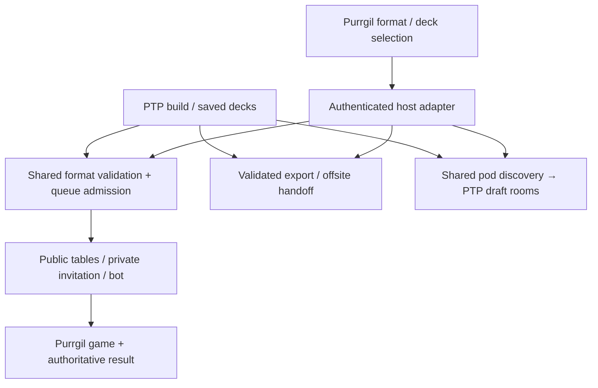

# Shared play formats, queues, and deck validation

> Note (2026-10-10): imported from the Codex checkout snapshot. On codex/alpha, `/play` now enters through `app/play/PlayEntry.tsx` and `src/components/EntryFlow/EntryPlay.tsx`; the earlier `app/play/SharedPlayEntry.tsx` was superseded and is not carried.

**Updated scope:** Start on PTP, draft/open sealed, build, then choose **Public queue · Private link · Play a bot · Play offsite**. Start on Purrgil, choose a format and deck, then use the same choices—or join/create a PTP draft pod. Both sites expose the same queues and requirements before entry.

**Targets:** `swupod` (PTP) and `purrgil`; paths are relative to the named repository. This follows `plans/2026-09-30-native-limited-play-plan.md`. This revision supersedes the previous exclusions of bot play, Chaos matching, constructed-format validation, and preview pools. Existing unrelated work is untouched.

**Mocks:** [Clickable study](../design/limited-matchmaking-2026-10-07/index.html), including queue browser, format controls, Chaos, Eternal, future preview season, invitations, bots/offsite, and pods. All activity is fictional.

## Product decisions

| Question | Approach |
|---|---|
| What can I play? | **Format: Premier / Eternal / Limited.** Limited reveals **Limited format: Draft / Sealed 6-pack / Sealed 8-pack / Chaos**. A saved limited deck preselects its actual format; choosing another does not relabel its provenance. |
| Which cards are available? | **Card Pool: Current / Next Set** is independent of format. Current uses released cards permitted by the chosen format. Next Set adds known preview cards under an explicitly labeled practice policy. |
| Queue or open lobbies? | One availability pool per exact queue contract, with automatic pairing and manually joinable tables. Both sites show the same counts and listings. |
| What does Chaos mean? | **Any legal limited deck versus any legal limited deck**: different sets, draft/sealed, and pack counts can meet. Both players explicitly choose Chaos. It is a casual matchmaking option, not permission to add arbitrary cards to a deck. |
| What does a private link allow? | The link fixes the chosen format, pool, and strict/Chaos rules. Invitees see them before deck selection. Replace the new flow's vague mismatch checkbox with named Chaos limited. |
| How does bot play work? | Validate with the same rules, then start a separate AI session. Initial default: a clearly labeled mirror opponent using the selected legal deck. Never silently substitute a bot into a human queue. |
| What is offsite play? | An explicit secondary action opens the existing export/handoff choices. Show validation for the selected format and destination support; do not reserve a native seat. PTP cannot enforce the external opponent's legality. |
| How do people draft together? | Shared forming-pod listings; Join/Create continues into PTP's existing rooms and generation. After build, return to these play choices. Organized Swiss still follows assigned pairings. |

No-preview state follows the user's stated product condition: show **Current** only. The mock's “Preview season” control is a future-state fixture, not a claim that previews are available now.

## Visible queues and matching

The queue directory is visible before choosing a deck. Each row shows **format, limited subtype, set/recipe if strict, card pool, waiting players, match length, and Join/Choose deck**. Show zero-player queues too; opening one starts waiting. Counts combine both sites, count each reservation once, exclude bots/private games, and show unknown/stale rather than fake zero on failure. Default casual matches are one game; do not imply these are tournament BO3 queues.

| Queue | Who can meet |
|---|---|
| Premier · Current | Two decks legal in the current Premier policy |
| Eternal · Current | Two decks legal in the current Eternal policy; never automatically paired with Premier |
| Limited · SOR Draft · Current | Matching draft variant, pack recipe/count, and pool policy |
| Limited · SOR Sealed 6-pack · Current | Same sealed recipe and six-pack allocation; never eight-pack or draft |
| Limited · SOR Sealed 8-pack · Current | Same sealed recipe and eight-pack allocation |
| Limited · Chaos · Current | Any supported, verified limited origins, including mixed-set pools |
| Any format · Next Set: [name] | Only opponents who explicitly selected that same preview environment |

Queue membership depends on **chosen format + card-pool policy revision + strict limited descriptor (or Chaos) + match length + compatible rules/support contract**. A deck legal in multiple formats joins only the one the player selected. “Like decks” means format-compatible, not identical leader, base, or archetype. Chaos drops origin equality, but retains legality, limited provenance, selected Current/Next Set environment, and engine support. A released-only deck can enter Next Set deliberately and face preview cards.

Keep **Chaos matchmaking** distinct from **chaos draft/sealed generation**. A mixed-set pool is validated against its own recorded recipe, then can enter Chaos; it does not need to match another pool's recipe there. Existing alternative limited generators must have explicit validation adapters; never coerce Pack Wars or an unknown small-deck variant into standard 30-card limited. Ordinary draft/sealed origins and known mixed-set variants belong in the initial capability inventory; unsupported variants show a reason.

A selected queue remains prominent beside the deck picker, waiting state, invitation, and game summary. Incompatible decks are disabled with precise reasons. No timeout-based widening; switching to Chaos is a deliberate action that atomically replaces the reservation. Freeze the contract on invitation creation. Preserve it through sign-in, cross-site navigation, retries, and resume.

## Official rules grounding

Checked October 7, 2026 against the official site, including the dynamically linked **Comprehensive Rules 9.0** and **Comprehensive Event Guide**. The linked v9.0 is dated October 9, 2026, two days after this review: record it as a published upcoming revision and verify its effective date before activation. The baseline rules below are research input, not authorization to switch the live policy early. These rules govern deck legality; Chaos, preview practice, queue segmentation, and casual one-game matches are our product policies.

| Format | Baseline validation |
|---|---|
| Premier / Eternal | Exactly one leader and one base; at least 50 main-deck unit/event/upgrade cards; up to three copies; optional sideboard up to ten. |
| Draft / sealed | Exactly one leader and one base; at least 30 main-deck cards; copies limited by the acquired pool, not a constructed three-copy cap. Leader must come from that pool; an acquired base or common base from the appropriate set is allowed. |

Card text can modify deckbuilding requirements. Off-aspect cards are legal; aspect penalties apply during play. Official rules impose no maximum deck size; the existing engine's 100-card limit must be reported as a runtime limitation. [Comprehensive Rules 9.0, §§1, 9–10](https://cdn.starwarsunlimited.com//SWH_Comp_Rules_v9_0_c4aa591948.pdf).

Count constructed copies across **main deck plus sideboard**, combining identical name/subtitle across printings. No leaders/bases in that sideboard. Limited's unused pool is its sideboard; prerelease promo leaders require explicit event entitlement. Sealed uses six packs at Casual/Relaxed and eight at Competitive/Master; standard draft uses three. Preserve organized-event deck-lock/sideboarding rules. [Comprehensive Event Guide, §§6.4, 9.1–9.2](https://cdn.starwarsunlimited.com//Comprehensive_Event_Guide_6_26_26_0110535972.pdf).

Premier rotation and Eternal legality differ. An older printing can remain Premier-legal through a legal reprint. Eternal has its own suspension list; do not reuse Premier's list. [Eternally Unlimited](https://starwarsunlimited.com/articles/eternally-unlimited). Suspension changes need effective dates and, where announced, release-triggered reinstatement. [Eternal Format Update](https://starwarsunlimited.com/articles/eternal-format-update-april-2026).

**Source precedence:** the event PDF's embedded suspension lists can lag later announcements. Maintain a reviewed, sourced, effective-dated legality manifest, not copied static lists from this plan. Check the official format pages and subsequent announcements before publishing each policy. Do not claim the event PDF's “no suspensions” snapshot is today's complete policy.

## Validation and preview lifecycle

One authoritative validation contract must serve **saved decks, imports, human queues, direct table joins, private host/join, bot decks, rematches, and pre-export feedback**. PTP owns the admission decision for shared queues; Purrgil calls it through an authenticated server adapter. A client-side green check alone never authorizes play.

Return three separate results: **deck legality**, **queue compatibility**, and **runtime support**, with card-level errors and a policy version. This distinguishes “four copies across deck/sideboard,” “eight-pack deck in a six-pack queue,” and “legal preview card not implemented yet.” Saving an unfinished deck is allowed; starting a native game with it is not. Raw export remains available with warnings, without labeling invalid decks valid or launching an unsupported integration.

- Normalize printings to canonical gameplay identities; validate schema, finite positive integer quantities, known IDs, slot types, size, sideboard, format legality, and printed deckbuilding exceptions. Existing JTL base-specific minimum overrides need fixtures against current card text and a data-driven replacement, rather than more hardcoded IDs.
- For limited, additionally validate ownership, server generation/draft evidence, leader/base entitlement, actual acquired quantities, and generation recipe. A pasted decklist alone cannot prove a limited pool. No provenance backfill invented from a deck name.
- Catalog profiles store source URLs, effective timestamps, rotation/product legality, reprint identity, suspensions, card-text exceptions, and pool policy versions. Reuse the release calendar, but audit non-core products and legal reprints; a set-number window alone is insufficient.
- Extend the limited-only snapshot schema with explicit constructed/limited variants and backward-compatible readers; never fabricate limited evidence for imports. Snapshot the validated deck, sideboard/pool reference, format, queue contract, provenance, and policies immutably. Validate at save/import for feedback and again atomically before admission; verify runtime support before launch. Changes to a waiting deck require leaving/re-entering. Active games retain their pinned snapshot.
- **Next Set** appears only after real preview cards exist for a configured unreleased set, a reviewed preview policy is published, and the relevant capability is enabled. Keep existing access entitlements. Unimplemented cards remain visible with blockers. Placeholder cards are never legal play objects.
- Recommended preview meaning: **current eligible pool plus announced next-set cards**, not speculative post-release rotation or early unbans. Label it “Preview practice · partial set”; for limited, generation uses a versioned known-card recipe, not claims of retail pack fidelity. Current excludes unreleased cards even when downloaded in the catalog.
- On spoiler updates, validate new entrants against the published revision. Do not match incompatible revisions; revalidate waiting seats visibly. At release, close new Next Set admissions, apply the dated released/rotation policy, and ask waiting players to re-enter Current. Preserve live games and historical records; expired preview invitations offer a newly validated replacement, never silent retagging.

## Existing code and architectural approach

PTP already provides immutable limited validation (`src/services/play/deckVersions.ts`, `native/savedDeck.ts`), atomic native public matching (`native/publicMatches.ts`), and private links (`native/privateMatches.ts`). The public predicate already checks set, pool type, pack count, and validation version. Extend this into explicit queue contracts rather than adding another limited queue.

Purrgil's `server/lobby.mjs` currently stamps imports as Constructed; `server/lobby-decks.mjs` checks main-deck counts but does not fully validate sideboards, rotation, or format suspensions. Its queue in `server/lobby-store.mjs` is separate. Replace the generic Constructed path with Premier/Eternal contract-backed admission; preserve existing games and import UX. The untracked PTP `app/api/play/native/lobby-handoff/route.ts` is ongoing identity-bridge work to reconcile, not overwrite.

`src/utils/setConfigs/latest.ts` and `src/utils/setAvailability.ts` already model release windows and spoiler availability. `app/api/pods/public/route.ts` and `src/components/Lobby/PodsFormingColumn.tsx` provide pod discovery. `src/services/play/native/localPractice.ts` is development-only and bypasses normal provenance for testing: do not expose it as the production bot endpoint. Reuse the existing runtime bot capability behind normal validation/admission.

Use browser-bound login, scoped service authentication and short-lived replay-protected subject authorization. Never trust browser-provided identity, limited provenance, or “legal” flags. Preserve existing seat-bound launch grants; no shared parent-domain cookie or direct cross-service DB access. Public rows reveal format/player availability, not decklists.

One per-user admission lock spans all native queue/private/bot modes on both sites. Where Purrgil keeps local reservations, acquire an idempotent host claim before durable local creation; confirm the stable ID and reconcile uncertain responses with fencing. Active claims do not expire merely on network loss. Explicit cancellation/authoritative completion releases them. Proposed public presence: 90-second lease, renewed every 25 seconds; private invitation TTL: one hour. Never expire a matched game as an abandoned queue seat. Offsite export alone takes no native reservation and makes no cross-site enforcement claim.

## Implementation sequence

Requirements: **R1** both entry journeys/four play paths; **R2** visible shared queues; **R3** strict/Chaos compatibility; **R4** all-path validation; **R5** Premier/Eternal/current/preview policies; **R6** pods/continuity.

- [ ] **1. Define format policies and authoritative validation** — R3–R5; first.
  - PTP: add `src/services/play/formats.ts`, `deckValidation.ts`, and a versioned policy manifest under `src/data/play/`; extend `deckVersions.ts`, `native/savedDeck.ts`, `src/utils/setConfigs/latest.ts`, and `src/utils/setAvailability.ts`. Support known mixed-set provenance explicitly.
  - Purrgil: adapt `server/lobby-decks.mjs` to canonical normalized imports and host validation. Preserve imported sideboards instead of dropping them.
  - Tests (new): PTP `src/services/play/deckValidation.test.ts`, `formats.test.ts`; Purrgil `server/lobby-decks.test.mjs`. Cover 29/30 and 49/50 boundaries; printed exceptions; four limited copies acquired versus missing copies; constructed duplicate printings and main+sideboard totals; eleven-card/leader sideboards; wrong pool/leader/base; off-aspect legal cards; rotated-but-reprinted cards; separate Premier/Eternal suspensions; unknown IDs; preview placeholders; non-core products; release/rotation/unsuspension boundaries; engine cap versus legality.

- [ ] **2. Expose shared queue contracts and admission** — R2–R5; depends on 1.
  - PTP: extend `native/publicMatches.ts`, `privateMatches.ts`, `admission.ts`; add `queueContracts.ts`, `hostAdmission.ts`, and routes under `app/api/play/native/internal/queues/`. Add next-numbered migrations for contract IDs/leases; retain immutable history.
  - Purrgil: add `server/play-host.mjs`; update `server/lobby.mjs`, `server/lobby-store.mjs`, `src/transport/lobby.ts`; reconcile identity handoff. Scope public availability/read APIs separately from owner-only mutations and private invitation lookup.
  - Tests (new/extended): PTP `native/queueContracts.test.ts`, `publicMatches.db.test.ts`, `hostAdmission.db.test.ts`, existing `privateMatches.db.test.ts`; Purrgil `server/play-host.test.mjs`, existing `server/lobby.test.mjs`. Test strict versus Chaos matrix, Premier/Eternal segregation, Current/Next/revision segregation, malformed contracts, mismatched private joins, atomic switching, same-user cross-site races, two players claiming one seat, lost-response retries, expiry, wrong subject/origin, logout and restart recovery. Waiting counts must match unique eligible reservations.

- [ ] **3. Build shared entry and queue browsing UI** — R1–R5; depends on 2.
  - PTP: update `src/components/DeckBuilder.tsx`, `app/play/native/NativePlay.tsx`, `NativePublicLobby.tsx`, `src/components/Lobby/NativePlayEntry.tsx`. Keep save-before-play and Swiss routing.
  - Purrgil: update `src/components/Lobby.tsx`, `src/transport/lobby.ts`, `src/lobby.css`; add saved limited picker, format controls and queue directory. Choosing a queue preselects its contract; incompatible decks remain explained, not silently reclassified. Imported constructed decks can be validated for Premier or Eternal.
  - Tests: new PTP `tests/e2e/format-queues.spec.ts`; extend `tests/e2e/native-private-play.spec.ts`; new Purrgil `tests/format-queues.spec.ts`. Cover both starting sites, no saved deck, each format, strict/Chaos, private links both directions through login, visible zero queues, failed/stale reads, changing selection, preview controls absent/present, save failure, keyboard navigation and 390px phone. Verify no opponent deck disclosure.

- [ ] **4. Add production bot and offsite branches** — R1, R4–R5; depends on 1–3.
  - PTP: add `src/services/play/native/botMatches.ts` and `app/api/play/native/bot/route.ts`; reuse `runtimeClient.ts`, immutable snapshots and results contracts. Preserve existing exports in `src/components/PlayInstructions.tsx`, `src/hooks/useDeckExport.ts`, and `src/utils/karabastLobby.ts`; expose them from the shared action panel.
  - Purrgil: route bot requests through `server/play-host.mjs` and existing runtime bot support. Mirror bot is explicit, uses the validated selected deck, and is recorded separately from human matches. No public waiting entry, no hidden AI fallback.
  - Tests: new PTP `native/botMatches.test.ts`, `tests/e2e/play-destinations.spec.ts`; extend Purrgil `server/lobby.test.mjs`. Validate both decks in all formats; unsupported AI/runtime fails clearly; no double reservation; identical requests create one session; bot results excluded from human counts; offsite retains main/sideboard and intended format/pool metadata, creates no native match, and explains destination mismatches. Any necessary Companion-code work requires the repository version bump/build protocol before commit.

- [ ] **5. Share forming pods and complete continuity** — R6; depends on 2; can run alongside 3–4.
  - PTP: extend `app/api/pods/public/route.ts`, `src/components/Lobby/PodsFormingColumn.tsx`; reuse `DraftLobby.tsx` and existing draft join/ready routes. Show recipe, seats, bot-fill policy, casual/Swiss and preview status. Purrgil adds the same feed through `server/play-host.mjs` with PTP Join/Create continuations.
  - Tests: new PTP `app/api/pods/public/route.test.ts`, `tests/e2e/limited-pod-entry.spec.ts`; extend Purrgil's proposed `tests/format-queues.spec.ts`. Cover shared rows, private exclusion, sign-in continuation, last-seat race, full/started pods, draft→build→each play path, and preserving organized-pairing routing.

## Rollout and acceptance

Publish reviewed format/card legality data first, then contract/admission support, UI, bot/offsite, and pod continuity. Enable entry points together only after cross-site pairing works. Preserve active games and historical snapshots. Old generic Constructed waiting entries must be reselected/revalidated as Premier or Eternal; do not guess. Translate old relaxed limited invitations to an explicit reviewed Chaos contract or require recreation. A rollback disables new admission while keeping resume, cancel, status, and results available.

Verify real two-account public/private games in both site directions; complete draft and sealed→build→public/private/bot/offsite journeys; prove strict mismatch rejection and deliberate Chaos acceptance; test Premier/Eternal legality differences and a simulated spoiler/release transition. Mocks demonstrate UX only. Gameplay and production integration tests belong to implementation.

Loading blocks admission; failed refresh keeps selections and labels data stale; zero activity is distinct from unavailable service. Provide keyboard focus, screen-reader status, 44px touch targets, and visible mobile mismatch reasons. Measure wait/abandonment by explicit queue contract, validation failures, bot starts, offsite handoffs, and pod→game conversion.

No new ladder, automatic Discord messaging, multiplayer Twin Suns/Trilogy launch, or rewrite of draft/game engines. Format choices are Premier, Eternal, and the described Limited modes; other format inputs must be rejected explicitly. Preview generation and native Swiss launch reuse their existing projects, with support gaps surfaced rather than represented as complete.

Review: checked the expanded requirements against the original entry/pod flows, source rules, current validators, and all five implementation units. Corrected the export hook path and distinguished the future-dated rulebook from active policy. Desktop/390px mocks were inspected; simulated Chaos selection, human/private/bot transitions, and the no-preview selector passed without browser errors. The initial revision changed only planning artifacts; the critique revision also fixes shared select geometry.

## Revised interaction decisions — October 7 critique

Use button groups for Format, Card Pool, and Limited format; Chaos is one limited-format choice. Keep Current visible and add Next Set only during preview availability. The saved-deck button opens the existing PTP-style rich modal with search, set/type filters, incomplete-deck visibility, pagination, and explicit compatibility feedback. Every limited selector includes Draft a new deck, Create new sealed deck, or Create a limited deck according to context.

Show forming draft pods beside public queues, with Join and Create actions. Draft creation offers solo drafting and shared pods in the same flow, without a separate draft tab. Play vs AI (Experimental) is a proper action button. Play Offsite opens a contextual Copy/Save menu using PTP/Wayfinder export conventions, including JSON, CSV, Melee text, and image download.

Native dropdown indicator geometry is shared in `src/styles/select.css`; StyledSelect consumes the same 16px inset and spacing variables. Do not patch arrow position separately per page. The revised clickable study exercises these interactions with sample data; authoritative validation and matchmaking remain implementation work.

## Implementation record — October 8

Implemented a shared React workspace in `src/components/SharedPlay`, synchronized to Purrgil by `scripts/sync-shared-play.mjs`. PTP `/play` and Purrgil `/lobby` use authenticated adapters to the same service. PTP verifies limited pool provenance and constructed legality; Purrgil persists queue/private/AI reservations and immutable verified deck metadata. The existing legacy native tables retain their original resume routes. The common PTP admission lock checks shared reservations when `PTP_SHARED_PLAY_ENABLED=true`.

The implementation reuses Purrgil's existing persistent lobby instead of creating a second new PTP queue table. Exact queue keys include format, card pool, limited descriptor, policy revision, and engine revision. Private joins compare the same keys. Chaos retains provenance and allows mixed-set completed drafts. Current release boundaries change the policy key automatically; stale waiting seats must cancel and re-enter. Preview practice remains unavailable until a reviewed preview policy/capability is configured; no speculative Next Set option is exposed.

Constructed imports validate roles, counts, minimums, combined main/sideboard copy limits and reprints, sideboard maximum, released-card pool, rotation, and independent suspensions. Sources rechecked: official Cad Banned, Eternal Format Update April 2026, Throwing the Meta for a Loop, and Meta Update from the Team. Runtime support remains distinct. Limited exports retain unused acquired cards.

Verification: pure validation tests, disposable PostgreSQL native eligibility/reservation regressions, isolated Purrgil backend suite, both app typechecks/builds, desktop/phone browser strict-versus-Chaos selection and idempotent retry/cancel flows. A real local engine run passed public matching, private play, seat actions, AI decision, spectator redaction, authoritative results, archive/replay, and restart recovery (PTP identity simulated in that integration fixture).

Deployment uses isolated release directories based on the current commits plus this feature and its existing lobby prerequisites. Unrelated uncommitted event-cosmetics/account-linking work is excluded. The production-reviewed all-set support manifest is preserved in `data/native-support/all.json`; its engine revision matches the running service.
