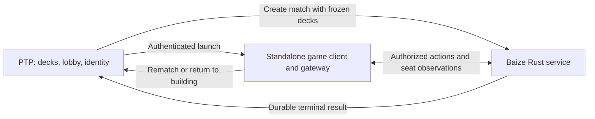
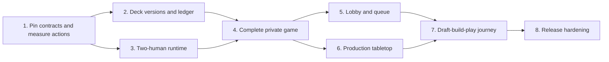

# Native limited play implementation plan

PTP becomes the complete place to draft or open packs, build a limited deck, and play another person. Build the first complete private game before public discovery and visual polish; then carry the approved tabletop treatment through gameplay, drafting, and deckbuilding. This is a phased implementation plan, not a claim that the prototypes or current engine gateway already support production PvP.

**Non-negotiable:** each equivalent gameplay action must take no more clicks/taps and no more confirmations than Karabast in the same state. Assess each offered interaction mode independently. Better materials and optional dragging must not slow down play.

## Sources and scope

The [requirements](../docs/brainstorms/2026-09-30-native-limited-play-requirements.md) are the source of truth, including R1–R30. The [UX decision pack](../docs/design/native-play-2026-09-30/ux/README.md), [board study](../docs/design/native-play-2026-09-30/real-board.html), [interaction lab](../docs/design/native-play-2026-09-30/interaction-lab.html), and [control-preservation matrix](../docs/design/native-play-2026-09-30/control-preservation.md) supply visual and interaction references. Port the design into production components; do not ship the standalone fixtures as a game client.

Included: human limited PvP, private links, public lobby and queue, single casual games and mutual rematches, exact deck history, reconnect, responsive web, seven table environments, two card presentations, two leader/base placements, and draft/build continuity. Karabast remains a quiet export utility. Excluded: AI release dependency, ranked/constructed matchmaking, spectators, public replay browsing, friend graph, Discord message delivery, and full 3D rendering.

Stats as a fourth homepage entry remains optional. Existing pod series are not redefined as single casual games. Existing external matches must remain accessible through the transition.

## What the repositories already provide

| Area | Evidence | Consequence |
|---|---|---|
| PTP play orchestration | `src/services/play/playLedger.ts`, `playState.ts`, `runtimeLaunch.ts`, `runtimeAvailability.ts`; `migrations/074_create_ptp_play_runtime.sql` | Extend the existing match/seat/event/queue ledger and runtime adapter boundary. Do not build a competing matchmaking subsystem. |
| Existing play routes | `app/play/PlayLobby.tsx`, `app/play/runtime/[matchId]/RuntimeStub.tsx`, `app/api/play/` | Reuse entry points, explicitly distinguish native Baize from `local_stub` and `forceteki`. A client-reported stub outcome must never complete a native match. |
| Existing limitations | Queue compatibility records set and pool type; current readiness checks are shallow; match reads reference mutable `deck_builder_state` | Add pack provenance, real eligibility validation, immutable deck versions, and serializer review before native launch. |
| Application transport | `server.ts`, `src/lib/socketServer.ts`, `src/lib/socketBroadcast.ts`, `lib/auth.ts` | Retain PTP lobby/draft infrastructure and auth for host integration. The standalone game client and Baize own the new live-game transport. |
| Existing product surfaces | `src/components/LandingPage.tsx`, `src/components/DeckBuilder.tsx`, `src/components/DeckBuilder/`, `src/components/PackDraftPhase.tsx`, `src/components/Lobby/` | Adapt existing screens and preserve their functionality rather than replacing them with reduced mockups. |
| Baize sibling repository | `caldred/baize`: `crates/baize-serve/src/protocol.rs`, `session.rs`, `crates/games/swu/` | Inspected session hosting assumes one human and bots. Two-human orchestration is a deliverable, not an existing capability established by the rules engine alone. |
| Wayfinder sibling repository | `ledwards/wayfinder`: `apps/replay-client/src/app/_engines/baize/`, `server/baize-gateway.mjs`, `tests/baize/` | Reuse reviewed adapters, prompt fixtures, and interaction patterns. Current gateway is a one-human/AI development host with in-memory sessions and AI inspection enabled; it is not the PvP trust boundary. |

Paths qualified by sibling repository above and below are relative to that repository. New paths in implementation units are proposed, not existing files. Pin the actual upstream-bound Baize revision in Unit 1; the currently inspected checkout is not proof of the forthcoming PR's behavior.

## Architectural decisions

**Three repositories and independently deployable applications.** PTP owns product identity, deck versions, invitations, matching, seat assignment, and the product result ledger. A new game-client repository owns the playable React application and its thin server gateway. `caldred/baize` owns the Rust authoritative game service, runtime sessions, action persistence/recovery, and terminal outcomes. The game client and Baize each build, test, configure, deploy, and roll back without requiring a PTP checkout. The standalone repository is `ledwards/purrgil`; `game-client` below refers to Purrgil. Current implementation progress is tracked in [execution status](2026-09-30-purrgil-execution-status.md).

| Repository / deployment | Responsibilities | Does not own |
|---|---|---|
| PTP / `protectthepod.com` | Draft, sealed, builder, saved decks, public lobby/queue, private invitations, login, launch authorization, product results | Board rendering or the live action loop |
| New game client / `play.protectthepod.com` initially | Board, prompts, inspection, input, presentation preferences, reconnect UI; same-origin gateway for launch redemption and authenticated game transport | Rules, matchmaking policy, canonical deck storage, or authoritative results |
| Baize / independently deployed Rust service | Validate trusted match creation, bind issuer/match/seat identities, execute rules, project seat views, persist and recover sessions, emit durable outcomes | PTP UI, login pages, or direct access to PTP's database |

The same game-client artifact must be configurable for a future `play.wayfinder.news` deployment: branding, trusted host integration, return destinations, asset sources, and Baize endpoint are deployment configuration. No PTP imports, database access, hardcoded domain, shared parent-domain cookie, or Wayfinder checkout is required. This release delivers the PTP integration and proves the alternate-host boundary with a test host adapter; it does not deploy Wayfinder or implement its product flows.

**Keep the gameplay path independent of the host application.** PTP creates a runtime match through authenticated server-to-server calls using frozen decks and assigned seats. The client gateway connects to Baize for game observations/actions; PTP is not on every gameplay action. Baize owns the single writer, fencing, private journal/checkpoints, and durable terminal event. PTP consumes terminal outcomes idempotently into its product ledger. The implementation uses separate native match tables to isolate authoritative results from legacy client-reported outcomes, and shares per-user admission locks across both paths. Use retriable delivery plus reconciliation so a PTP outage cannot lose a completed result. The client gateway forwards authorized requests and maintains browser sessions; it must not become a second authoritative coordinator.

**Use React and a DOM/CSS board in the new repository.** Adapt relevant Wayfinder board behavior and pure Baize mapping code after checking provenance and dependencies. Do not iframe the whole Wayfinder app or couple the client to its AI panel. Keep the browser application under game-client `src/`, the thin gateway under `server/`, and deployment documentation/artifacts in that repository. Use a versioned HTTP/WebSocket contract to Baize; reusing PTP's Socket.IO server is no longer an architectural requirement. Pin protocol compatibility independently of deployment versions.

### Launch, authentication, and return contract

1. PTP validates the saved deck versions, reserves both seats, and idempotently creates the Baize match. The trusted host sends deck contents server-to-server, never as browser authority. Namespace host subjects and match IDs by issuer so a future Wayfinder deployment cannot collide with or access PTP sessions.
2. PTP requests a short-lived, single-use opaque launch code from Purrgil, bound to the authenticated user, assigned seat, match, configured audience, and allowlisted return destination. Opening it creates a browser nonce and redirects to the configured host for fresh authorization of that same browser identity. PTP approves the handoff server-to-server; Purrgil consumes the approved handoff only with the matching browser nonce, establishes the seat session and clears the address before rendering. This prevents a forwarded launch URL from silently assigning another user’s seat and adds no confirmation click. Do not put durable bearer credentials in URLs or share PTP cookies across sites.
3. The game-client gateway establishes a host-only Secure/HttpOnly browser session and keeps backend credentials server-side. Browser traffic uses same-origin game endpoints. Baize revalidates the trusted issuer and seat authorization; raw engine control endpoints are private. Invitation links remain PTP product links, not game-session credentials.
4. Refresh/reconnect uses the existing client session and authoritative Baize observation. If authorization expires, preserve the match destination through host reauthentication and return to the same seat. Host logout/revocation has an explicit invalidation path; existing short-lived session expiry provides a bound if the host is unavailable.
5. Results are rendered from authoritative state and delivered durably to PTP. Rematch and Adjust deck call or return to host-owned preparation flows. Allowed destinations and endpoints come from trusted deployment configuration, never arbitrary browser query parameters. Normal launch adds no manual copy/paste, login if already authenticated, or extra confirmation.

Gateway sessions must survive instance replacement through a shared session store or equivalent restart-safe mechanism; no authoritative game state resides there. Document that dependency in its deployment contract. Scope gateway credentials to their trusted host integration rather than giving every deployment access to every host's matches.

**Server observations are seat-specific.** Every subscription, command, resync, history response, and completion path revalidates authenticated seat ownership. Invitations are opaque discovery capabilities, not seat-control credentials. Disable AI inspection and whitelist public/seat-visible output before serialization; frontend hiding cannot protect hidden information.

Use separate host and game-client sessions with explicit HTTP mutation and WebSocket origin checks. Apply bounded payload sizes and per-user limits to invitation creation, joins, actions, and reconnects. Keep service credentials server-side, use authenticated encrypted transport across hosts, and redact invitation/seat credentials from logs. Recovery journals/checkpoints are private engine data with restricted access and a documented retention/deletion policy; they must never be served through existing replay/event endpoints.

**Actions have an identity and expected game revision.** Route each match through one active writer with a fenced ownership epoch. Validate actor, revision, and legality before committing an action. Persist the accepted command, resulting revision, and recovery information before acknowledging/broadcasting it. Retries return the original outcome rather than applying twice. A crash after engine execution but before persistence must recover from the last committed state, not continue the uncommitted worker. Baize owns this persistence; PTP stores only its product ledger and runtime references. Unit 3 must prove deterministic replay or checkpoint support against the pinned engine before choosing the recovery representation.

**Reconnect restores authoritative state.** Do not replay optimistic client guesses. A refreshed client authenticates, reclaims its existing seat, and receives its current observation and prompt. A transport reconnect does not establish durable delivery or recovery. Define command IDs, acknowledgments, revisions, and full resync in the versioned application protocol regardless of the transport library.

**Freeze a validated deck version before entering availability.** Store canonical card IDs/counts, leader, base, source pool/provenance, format/set/pack metadata, and validation/support version. Revalidate ownership and eligibility when reserving seats. Queue/invitation/game reference that snapshot; later edits do not mutate it. A save failure blocks launch with recovery, never silently substitutes an older deck.

**Results come from the authoritative terminal state.** Bind completion to runtime identity, match ID, engine version, and terminal revision; accept it idempotently. Preserve legacy/stub handling behind mode checks. An arbitrary client or a legacy callback cannot complete a Baize game. Store winner by absolute seat and immutable deck versions, not the reporting client's perspective.

## Interaction and presentation contract

- Default to familiar Karabast click/tap behavior, center leaders/bases, space left and ground right. Keep board orientation stable for each seat. Actual paired traces establish parity; lab fixture counts are not measured Karabast benchmarks.
- No persistent Inspect buttons, drag handles on each card, generic action confirmations, or slower cautious mode. Desktop hover/right-click and touch hold expose inspection; keyboard users receive an equivalent route. Inspection must not accidentally play a card, and its gesture must not delay normal taps.
- Click/tap alone completes every legal action. Optional mouse/pen dragging is a shortcut using the same legal action/prompt model. Invalid drops cancel locally; they cannot submit a guessed target. Add touch dragging only if gesture tests demonstrate no scrolling or inspection conflict.
- Required rules choices remain explicit: modal abilities, target selection, ordering, allocations, optional decisions, and genuine completion steps. Do not remove semantic choices merely to lower a counter. Do not auto-pass or auto-select ambiguous choices to claim efficiency.
- Animations never gate the next legal decision. Feedback begins immediately, while authoritative acceptance controls actual game progression. Stale/rejected actions restore the latest prompt clearly.
- Seven environments: command table plus Dejarik, Imperial, dirty cantina, Cloud City sabacc, Rebel hideout, and Hoth. Full printed cards versus cinematic units and center versus player-area leader/base placement are independent preferences, with no rules impact.
- Use actual card faces, authentic backs, canonical rules data, and live damage/exhaustion/upgrades/resource state. Full inspection remains available in both presentations. Discard sits beside draw deck in each player's area; inspecting discard never reveals hidden draw order.
- Phone composition is adaptive, not a shrunken desktop. Both arenas remain discoverable; hand/history/inspection can expand. Validate crowded boards, many upgrades, long prompts, and the on-screen browser chrome. Portrait play must work without rotation.
- Persist presentation choices across draft/build/play. Use a small versioned presentation-preference schema shared with PTP. Local storage is origin-specific: include non-sensitive preferences in the trusted launch exchange and return updated preferences through the host integration when returning to draft/build. Persist each application’s local copy; do not assume subdomains share browser storage or add an account synchronization system solely for themes. Respect reduced motion, focus, contrast, text/shape cues, and screen-reader action naming.

## Delivery sequence

### Unit 1 — Pin the engine contract and measure reference interactions

**Requirements:** R11, R14, R17, R21, R27–R30. **Dependencies:** none.

Identify the user's upstream PR/branch, record the exact tested engine and adapter revisions, and enumerate supported launch sets/cards and arbitrary limited deck ingestion. Check reuse permissions and frontend dependencies. Define the standalone client/Baize API, host launch/result integration, compatibility negotiation, and clean-checkout build/deployment contracts. Purrgil is the accepted repository name; setup and deployment are now authorized. Build a prompt inventory from real engine fixtures, including both seats, mulligan, resource selection, attacks, deployment, upgrades, multi-target allocation, optional effects, trigger ordering, initiative, pass, and concession. Explicitly distinguish unsupported engine behavior from absent UI mapping.

Record paired Karabast reference traces and native expected paths for the same state and device/input mode. Count clicks/taps and confirmations separately; include dismissals or extra panels required to perform the action. Record input-to-feedback and whether animation blocks subsequent input. Unknown parity stays unverified and blocks claims of completion.

**Files:** new `docs/design/native-play-2026-09-30/ux/06-action-parity.md`; proposed Baize protocol schema under `crates/baize-serve/` and game-client compatibility manifest under `src/protocol/`; Wayfinder `apps/replay-client/src/app/_engines/baize/reviewed-prompts.json` and `tests/baize/` as evidence.

**Validation deliverables:** fixture manifest plus proposed game-client `src/protocol/protocol.test.ts` and `tests/e2e/native-play-action-parity.spec.ts`. Cover seat reversal, masked information, all prompt families, stale prompt IDs, missing mappings, and each proposed shortcut. No full support claim based on a handful of SOR sample cards.

**Exit:** pinned compatible revisions, documented launch support, complete prompt inventory, and a reproducible per-action reference baseline. Engine feature gaps become explicit upstream work before dependent integration.

### Unit 2 — Extend the ledger with immutable decks and native ownership

**Requirements:** R3, R7–R12, R20–R21. **Dependencies:** Unit 1 contract/support definitions.

Add the native runtime mode, immutable deck versions, source provenance and compatibility keys, invitation records, and runtime references using additive PTP migrations; keep private recovery persistence in the Baize service. Extend existing services rather than duplicating queue logic. Determine pack count from trustworthy pool metadata, not the browser; ambiguous historical pools remain ineligible until resolved. Validate actual limited legality, pool membership, leader/base, supported cards, and ownership.

Audit cascading deletion: current pool references can erase historical matches. Preserve exact deck/result history when a pool is edited or deleted, with a separate documented account-deletion policy. Do not backfill invented historical deck versions from today's mutable deck state. Audit lobby/match serializers so pre-game discovery exposes no opponent deck list.

Inventory live legacy rows before adding constraints. Apply native-only eligibility and availability rules without invalidating in-progress external games. Where new uniqueness rules require cleanup, explicitly expire or reconcile conflicting waiting entries before enabling the constraint; do not mutate active match participants. Migration rollback must retain native historical snapshots even when new native launches are disabled.

**Files:** new next-numbered migration after the current migration head; `src/services/play/{playLedger,playState,runtimeLaunch,runtimeAvailability}.ts`; proposed `src/services/play/deckVersions.ts` and `native/contracts.ts`; affected `app/api/play/` handlers.

**Tests:** extend `src/services/play/playState.test.ts`, `runtimeLaunch.test.ts`, `runtimeAvailability.test.ts`; add `deckVersions.test.ts` and `playLedger.test.ts` with database-backed concurrency cases. Cover edits during launch, failed save, forged ownership/pack count, unsupported cards, duplicate requests, pool deletion, legacy mode compatibility, and native completion rejected through client/stub/legacy endpoints.

**Exit:** every new native seat references a validated immutable deck version, and legacy play remains isolated and functional.

### Unit 3 — Host two humans with durable authoritative recovery

**Requirements:** R11–R13, R21, R30. **Dependencies:** Unit 1; integrate with Unit 2 persistence.

Extend Baize sessions to accept two human seats without inserting bots or running the AI turn loop. Preserve existing one-human consumers. Add seat-specific observation/action envelopes, versioned protocol, terminal results, and the recovery capability selected from checkpoint or deterministic replay evidence. Randomness needed for recovery is private server state.

Implement the independently deployable Baize session service: authenticated service boundary, single-writer fencing, duplicate/stale command handling, durable commit ordering, bounded process resources, health checks, and restart/resync. Separate seat observation projection from private recovery data. Disable AI/debug inspection; exclude hidden state from errors, analytics, and ordinary logs.

**Files:** Baize `crates/baize-serve/src/{protocol,session}.rs`, proposed persistence/authorization/delivery modules in that crate, `Dockerfile`, and `docs/deployment.md`; proposed PTP `src/services/play/native/{runtimeClient,resultDelivery}.ts` for host integration only. Consult Wayfinder gateway behavior, but do not copy its client-supplied resume authority or AI setup.

**Tests:** new Baize integration test `crates/baize-serve/tests/two_human_session.rs`; Baize proposed `crates/baize-serve/tests/{authorization,recovery,result_delivery}.rs`; PTP `src/services/play/native/resultDelivery.test.ts`. Cover both-seat turns, wrong actor, modified action, duplicate command, dropped ack, stale revision, simultaneous commands, expired auth, seat theft, worker crash before/after commit, process restart, writer fencing, and no hidden data in either seat's network payloads. Prove recovered state and terminal result equal uninterrupted execution.

**Exit:** two authenticated humans can drive the engine and recover committed progress without exposing hidden information or applying an action twice. If recovery cannot be proven, pause this unit rather than treating socket reconnection as durability.

Measure worker memory per active game, command latency, and recovery duration before selecting initial concurrency limits. Reserve capacity before binding a new match to a worker; capacity exhaustion returns a recoverable launch state without creating a second game or charging ahead with an unhosted session.

### Unit 4 — Deliver the first complete private game

**Requirements:** R3, R8–R14, R16–R21, R27–R30. **Dependencies:** Units 2–3.

Create and claim an unlisted invitation, preserve it through authentication/deck choice, reserve two seats atomically, and launch a functional production React board. Implement every supported prompt family from Unit 1 before polishing materials. Include full card inspection, history with correct visibility, concession, authoritative result, mutual rematch, and refresh/background reconnect. Invitation mismatch rules are visible before joining and never relax legality/support checks.

Use existing PTP login and preparation routes, then launch the independently deployed game client through the exchange contract above. Implement its thin gateway, deployment configuration, and standalone build in this unit. A link can reserve the invitee seat only through authenticated server validation. Full/cancelled/expired links offer recovery without displacing an existing player. Multiple tabs must not create extra seats or duplicate actions; choose and document a controlling-tab policy without blocking legitimate reconnection.

**Files:** PTP `app/play/`, `app/api/play/`, proposed `app/api/play/invitations/`, launch/redemption handlers and `src/services/play/invitations.ts`; new game-client `src/`, `server/{launch,session,transport}`, `Dockerfile`, and `docs/deployment.md`. The actual game route is owned by the game client, not a new PTP board route. Adapt Wayfinder prompt presentation, legal interactions, and board mapping rather than its whole application shell.

**Tests:** proposed PTP `src/services/play/invitations.test.ts` and `tests/e2e/native-play-launch.spec.ts`; game-client `server/launch.test.ts`, `tests/e2e/native-play-private.spec.ts`, `native-play-reconnect.spec.ts`, and Unit 1 parity tests. Include expired/reused launch codes, wrong audience/issuer, unsafe return URLs, session revocation, direct game bookmarks, cross-origin preference transfer, and an alternate test host without PTP cookies. Cover two independent browser accounts completing a real game, unauthenticated invitation entry, third-person join, double join, private mismatches, unavailable runtime, failed launch, both rematch decisions, deck edits after result, and refreshing in a multi-step prompt. Exercise touch and keyboard paths as well as pointer clicks.

**Exit:** two friends finish and rematch a real native game with frozen decks, correct results, and verified action parity. This is the first product milestone; scripted fixtures do not satisfy it.

### Unit 5 — Add public lobby and compatible matchmaking

**Requirements:** R6–R10, R20–R21. **Dependencies:** Unit 4; settle D2 before implementing public matching behavior.

Extend the existing ledger and lobby with native availability. Proposed D2 unifies the queue and public listing: join the oldest compatible available entry or wait publicly, with one availability/active game per player. Keep this recommendation explicit until approved; private invitations remain unlisted either way. Enforce compatibility by set, draft/sealed type, and applicable sealed pack count. Public rows expose player and format metadata, not opponent deck identity.

Use database transactions/constraints to arbitrate queue-versus-direct-join-versus-cancel races across different decks and processes. Remove consumed/expired entries, recover failed launches without orphan seats, and show actual empty/waiting/error states. Do not fabricate queue times or opponents.

**Files:** `src/services/play/playLedger.ts`, `app/play/PlayLobby.tsx`, `app/api/play/{lobby,queue,matches}/`; reuse relevant `src/components/Lobby/` components.

**Tests:** extend `playLedger.test.ts`, `tests/e2e/lobby-open-games.spec.ts`, `play-page-login.spec.ts`; add `native-play-matchmaking.spec.ts`. Cover six/eight-pack incompatibility, different sets/formats, same-user different-deck races, self-match prevention, cancel/join race, duplicate tabs, stale listings, expiration, launch failure, and private-entry exclusion.

**Exit:** public lobby, queue, and private links all reach the same tested native session without mixing native and external launch actions.

### Unit 6 — Build the production tabletop and device layouts

**Requirements:** R14–R19, R22–R25, R27–R28. **Dependencies:** Unit 4; parity baseline remains a release gate.

Extract production table layers, card treatments, player areas, prompt surface, and presentation preferences. Keep real cards/controls in the DOM; use optimized selected-theme assets for materials, CSS perspective/shadows for depth, and restrained motion. Load only the selected environment at an appropriate resolution and preserve a usable plain surface during loading/failure.

Implement all environment/card/layout options and responsive compositions. Test changes during an active prompt: selection and targeting must survive preference changes. Do not move legal targets unpredictably while the player is choosing. Make dense boards usable through predictable spacing and inspection, not reduced hit areas or compulsory dragging.

**Files:** game-client proposed `src/components/{GameBoard,TableSurface}/`, `src/preferences/`, and optimized production assets. Publish a small versioned presentation package from the game-client repository for PTP to consume in Unit 7; it contains table styles/assets/tokens and the preference schema, with no gameplay or host-auth dependency. Source references: `docs/design/native-play-2026-09-30/{real-board.css,table-materials.css,table-preferences.js}`.

**Tests:** proposed game-client `tests/e2e/native-play-presentation.spec.ts` plus parity tests. Cover seven themes, both card styles and placements, both seats, long text, stacked upgrades, crowded arenas, image failure, reduced motion, keyboard focus, touch hold versus tap, interrupted drag, discard visibility, preference changes, and all core actions in phone portrait. Automate representative combinations and smoke-check all themes; do not duplicate the entire gameplay suite for every decorative combination.

**Exit:** visual approval of actual playable crowded states on desktop, physical iPhone/Safari and iPad/Safari, plus Chromium/Firefox regression checks. Establish measured frame/input/memory budgets on named devices during this unit; animation must not add action latency or prevent decisions. Emulation alone does not establish mobile performance.

### Unit 7 — Make the whole product lead into play

**Requirements:** R1–R5, R14, R20, R22–R23, R26. **Dependencies:** Units 5–6.

Give the homepage Draft, Sealed, and Play entries. Surface resumable work where appropriate (D1), with Stats secondary unless the fourth entry is selected. Play opens saved eligible limited decks; empty and unsupported states explain how to proceed. A legal saved deck gets a prominent native Play action that carries its exact version into opponent selection.

Consume the versioned presentation package in PTP and apply shared environments/presentation to real draft and builder components while preserving the complete control matrix: filters, grouping/sort, view modes, density, leader/base choices, aspect costs, movement/shortcuts, bulk operations, swap/undo semantics, statistics, validation, share/clone/export, draft timers/review/fullscreen, and live synchronization. Cinematic presentation must not hide information necessary to draft or build. Preserve other pool-generation routes without promising unverified native support.

Move Karabast export into secondary utilities; remove promotion and extension gating from the native journey. Existing external sessions remain accessible through explicit legacy resume destinations. Do not uninstall or change the unrelated Companion product. If implementation later touches tracked extension code/artifacts, follow the repository's coordinated version-bump/build protocol.

**Files:** `src/components/LandingPage.tsx`, `DeckBuilder.tsx`, `DeckBuilder/DeckBuilderHeader.tsx`, `PackDraftPhase.tsx`, associated styles; `src/hooks/{useDeckExport,useDraftSync,useDraftSocket,usePoolBuildsSocket}.ts`; play entry/deck-picker components.

**Tests:** proposed `tests/e2e/native-play-journey.spec.ts`, `deckbuilder-control-preservation.spec.ts`; extend `two-player-draft.spec.ts` and `multiplayer-draft.spec.ts` where applicable. Cover both entry journeys, interrupted saves, resume, back navigation, login/invitation context, unsupported deck, theme continuity, every preservation-matrix control, draft reconnect/timers, and absence of export/plugin steps in native launch.

**Exit:** draft/open → build → play and Play → saved deck → play both work on desktop, iPad, and iPhone with preserved editing controls.

### Unit 8 — Harden lifecycle and release without stranding games

**Requirements:** R9, R12–R14, R19–R21, R29–R30; D7–D8 transition decisions. **Dependencies:** Units 1–7 and policy gates below.

Implement the agreed abandonment/inactivity policy, runtime capacity limits, operational dashboards, and migration/rollback procedures. Separate allowing new native games from servicing existing games: disabling discovery must not kill active sessions. Drain or maintain compatible workers through deployment, preserving each game's engine/protocol version. Keep additive schema compatibility until legacy callers and active games have drained.

Record deck completion → launch, queue abandonment, launch failures, game completion, reconnect outcomes, rematch acceptance, stale-action rejection, and recovery failures without hidden card data or tokens. Use real baselines before assigning conversion targets. Exercise service restart and database/worker outages, not just network disconnection.

Document migration of already-open external listings and pod pairings. If native pod launches are included, route the existing paired identities/decks into native sessions and feed results through existing series/standings rules, with dedicated regression coverage. Otherwise retain the existing pod launch/resume path; do not silently claim pod migration complete.

**Files:** PTP runtime availability/launch/result integration and proposed `docs/operations/native-play.md`; game-client and Baize deployment manifests, CI workflows, version compatibility checks and runbooks in their respective repositories; existing pod adapters only after D8 is resolved.

**Tests:** proposed `tests/integration/native-play-lifecycle.test.ts`, `tests/e2e/native-play-release-transition.spec.ts`; existing `live-swiss-manual-lobby-recovery.spec.ts` plus native pod tests if included. Cover restart at every commit boundary, duplicate terminal reports, runtime saturation, logout/session expiry, network loss, rolling deployment, feature disable with active games, legacy listing resume, and preservation of organized standings.

**Exit:** independent clean-checkout builds and deployment smoke tests pass for game-client and Baize. Each has documented environment/secret configuration, health/readiness checks, persistent-storage requirements where applicable, graceful shutdown, and independent rollback. Deploy/restart the client without losing live Baize games; roll backend versions while retaining compatible active sessions. Verify startup rejects incompatible contracts clearly, results survive host outages, and an alternate-host client configuration works without rebuilding domain-specific code. Operational recovery drill, device/interaction/hidden-information checks, and both end-to-end journeys pass. Release proceeds from internal private games to invited users to public discovery; broad homepage promotion follows availability. Deployment is authorized by the September 30 execution request; release gates still apply.

## Decisions still required, with bounded gates

These do not prevent starting contract research. They are not silently approved by this plan.

| Decision | Recommendation or unresolved detail | Resolve before |
|---|---|---|
| Upstream engine | User's PR branch, exact revision, launch set/card coverage and recovery capability | Unit 1 exit; engine-dependent implementation |
| D2 public availability | Prefer one shared public queue/listing with one waiting entry or active game per player | Unit 5 matching implementation |
| D7 lifecycle policy | Define disconnect grace, inactivity, abandonment outcome, invite expiry, rematch expiry, and unrecoverable server failure. Do not infer a win merely from socket loss. | Timeout/outcome implementation in Units 4/8; public release |
| D8 pod integration | Preserve pod series; decide whether native pod launch is included in initial release or retained on legacy flow | Unit 7 entry/transition changes and Unit 8 release |
| Stats | Three primary entries are accepted; fourth remains optional | Final homepage design in Unit 7 |
| D1/D3–D6/D9 | Resume, minimal public listing metadata, invitation continuity, same-version mutual rematch, existing auth, and quieter other formats are proposed defaults | Relevant unit review; remain labeled recommendations where behavior exceeds accepted requirements |

Invitation expiry and disconnect grace are distinct clocks. During internal development, unresolved timeout policies must not manufacture competitive results. Required rules decisions and existing draft confirmations are not automatically removed by the gameplay interaction ceiling.

## Requirement coverage

| Requirement group | Owning units |
|---|---|
| R1–R5 entry, continuity, export margins | 2, 4, 7 |
| R6–R10 discovery, compatibility, casual games, invitations | 2, 4, 5 |
| R11–R13 authority, immutable results, reconnect | 1–4, 8 |
| R14–R19 devices, board clarity, inspection, motion | 1, 4, 6, 7 |
| R20–R21 recovery, ownership, hidden information | 2–5, 7–8 |
| R22–R26 environments, cards, piles, placement, shared styling | 6–7 |
| R27–R28 Karabast defaults and action ceiling | 1, 4, 6; rechecked at 8 |
| R29–R30 separate client repository and independently deployable client/backend | 1, 3–4, 6–8 |

## Risks and completion evidence

The highest risks are engine-version/support uncertainty, hidden-state leakage from AI-oriented code, recovery consistency, queue races, historical deck drift, and gameplay slowdown disguised as polish. The units put a specific test boundary in front of each. Asset fidelity and mobile density are validated on live game states, not just attractive empty tables.

Completion requires paired Karabast/native action traces, two-account real-engine games, seat-isolation payload checks, concurrency/restart tests, exact historical deck verification, physical-device validation, and the full draft/builder preservation checklist. Existing mockup test results establish only prototype behavior. No implementation tests were run as part of creating this plan.

### Planning review

Reviewed sequentially for coherence, feasibility, product scope, interaction design, security, and adversarial failure cases. The standalone-client revision also checks cross-origin launch/auth, issuer isolation, preference transfer, runtime persistence ownership, reliable host result delivery, and independent deployments. The earlier review added explicit protection for private recovery data and replay routes, origin/rate-limit controls, migration handling for live legacy rows, and worker capacity measurement. Product-policy decisions remain visible in the gate table rather than being treated as approved. This review establishes plan readiness for Unit 1, not production or engine readiness.

Start implementation with Unit 1 and the smallest reproducible two-seat engine contract. Keep public discovery and homepage promotion behind the successful private-game milestone.
