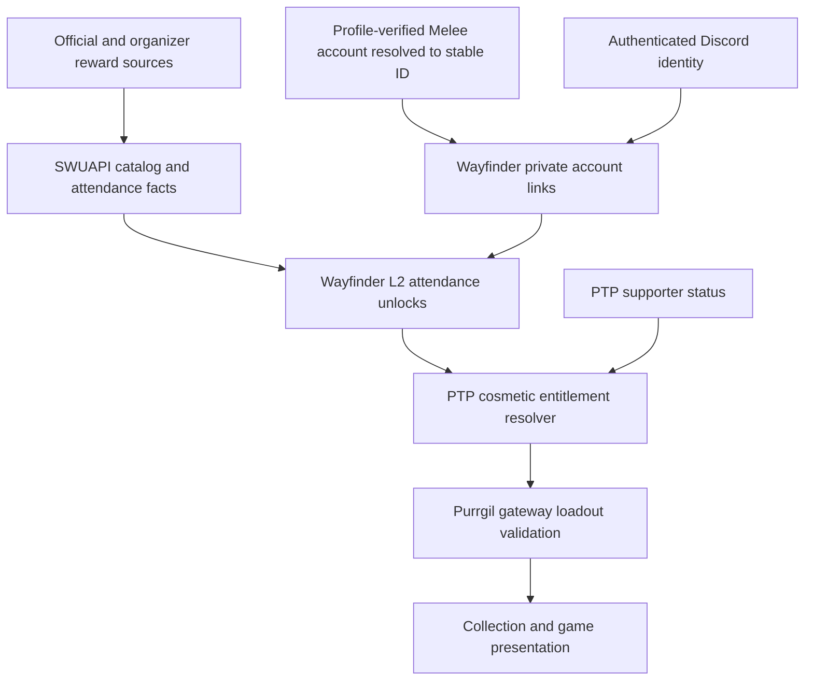

# Tournament cosmetics: supporter gating, then attendance unlocks

**Target repositories:** `swupod` (PTP), `purrgil`, `wayfinder`, `swuapi`. File paths below are relative to the repository named in each section. This plan lives in PTP's `plans/` per its local convention.

## Overview

**Phase one:** every tournament-related cosmetic is visible but locked for players who are not Friends of the Pod. Show a lock icon and disabled styling. Clicking or tapping the item opens the Friend of the Pod modal; it must not equip the item. Friends of the Pod can use it normally. This applies to any cosmetic category associated with any tournament/event, including prereleases, participation items, winner prizes, and prize-wall items.

**Phase two:** add the profile-verified Melee connection and API attendance lookup as another way to unlock these items. Attendance will be sufficient even for winner/prize-wall cosmetics. One active Melee account per Discord account, duplicate errors, and DM-Lee support remain the accepted later-phase direction.

Phase one ships independently in Purrgil/PTP using current supporter entitlements and a local classification of tournament-related assets. It does not depend on SWUAPI reward schemas, Wayfinder changes, Melee linking, attendance records, or the new account-link privacy notice. The detailed cross-repo attendance design below is retained for phase two. Execution resumed on 2026-10-07. The verification amendment below supersedes the former trust-based account claim; incomplete units remain unchecked.

## 2026-10-08 executed release scope (supersedes earlier phase sequencing)

The authorized live test disproved public Discord username visibility. **Bio is public**. Implemented instructions link to <https://melee.gg/Profile/Settings>, ask the owner to preserve existing Bio and add a one-time `PTP-…` code, then remove it after verification. The code expires after 15 minutes. Discord Channel remains a guild invite, never ownership evidence. Empty Bio saves may require a single space; the user-facing cleanup instructions cover that verified Melee behavior.

This release combines supporter access and attendance access. The collection offers both membership and Melee connection actions. Earlier phase-one-only copy below is historical rollout design, superseded by this release scope.

- [x] Private Wayfinder authority: stable Discord subject supplied by authenticated PTP, scoped consent, SHA-256-only challenge storage, live Bio plus stable-ID/handle corroboration, single use, transactional one-to-one links, duplicate DM-Lee errors, status/export, disconnect and owner erasure.
- [x] SWUAPI signed-out source collector using existing Browserbase infrastructure; missing/blocked/changed source fails closed. No Melee OAuth partnership or access to authenticated settings is required.
- [x] Reviewed source catalog and fresh attendance query; played non-bye/non-forfeit results or explicit source evidence qualify. Registration/aggregate standings alone do not. Corrections, organizer denial, withdrawal and account/event merges are handled.
- [x] Wayfinder version-bound L2 reward snapshots; late responses cannot restore disconnected links. No private link silently merges public player identities.
- [x] PTP authoritative saved item loadouts, fresh beta/supporter/attendance authorization, optimistic concurrency and default fallback.
- [x] Purrgil event collection with preview, filters, unlock dialog, refresh and equip; seat-owned mats, sleeves, promo and initiative rendering; frozen live-match appearances survive reconnect. Spectators see art, never reward reasons or private account links.
- [x] Focused service, real local PostgreSQL, gateway and desktop/phone browser tests; Purrgil production build and both web TypeScript checks.
- [x] Separate Wayfinder passive identity-resolution plan updated with the negative Discord-field finding and opt-in Bio alternative.

**Catalog coverage is partial:** six sourced GC2026 prize-wall mats/sleeves for LCQ `403891` and main event `403893`. Attendance is sufficient for these digital appearances regardless of physical prize redemption. Reviewed sources are the official GC prize page and existing Wayfinder GC asset inventory. There are no fabricated prerelease entitlements. Promo/initiative slots work, but this release seeds no promo or initiative art. Further prerelease/event history, multi-promo loadouts, historical replay cosmetic persistence, and passive identity ingestion remain the broader roadmap below, not completed features.

**Rollout:** see `contract/event-cosmetics-v1.md` for migrations, keys, seed import, smoke checks and rollback. Production has not been migrated or deployed. Existing unrelated work in these four repositories was preserved.

## Phase one: locked tournament cosmetics

### Behavior and scope

- Mark tournament association on each cosmetic using a stable item ID and explicit metadata. The gate applies across **all** cosmetic categories, including mats, scenic themes with tournament branding, promo card appearances, sleeves, initiative pieces, other token pieces/sets, and any future category. Do not use a four-category whitelist or infer association from names at runtime.
- Inventory every currently exposed cosmetic and classify tournament/event association before rollout. A tournament-branded bundle cannot bypass gating through its child pieces or another selector. Newly added tournament assets must carry the same classification. Generic non-event items retain their existing policy.
- For non-supporters, keep the item visible with its artwork, disabled visual treatment, a lock icon, and an accessible “Locked — Friend of the Pod” label. Every locked item activation opens the Friend of the Pod modal immediately, including clicking its artwork, tile or equip control and keyboard Enter/Space. No Link Melee action or attendance exemption appears in phase one.
- “Disabled” describes equipment availability, not an inert HTML control. Use an enabled, focusable button whose action is to open the modal and whose accessible name describes that action and the locked item. Do not use the native disabled attribute on the clickable tile or advertise that modal-opening button as disabled to assistive technology.
- Opening/closing the modal never equips a locked item or writes a preference. Preserve the previous valid selection and return focus to the clicked item when the modal closes. Use the existing modal's dismissal, focus management and membership CTA behavior.
- Supporters equip normally without a lock or upsell. Refresh the authoritative entitlement after returning from membership flow; do not assume clicking the membership CTA grants access. Existing administrative override and gameplay beta access remain separate from the public supporter rule.
- Existing saved restricted choices must fall back to an allowed/default appearance for non-supporters. Apply the same check at selection and rendering/launch so cookies, stale settings or an alternate picker cannot bypass the gate. Preserve active game mechanics and non-event preferences.
- No new cosmetic types or full historical reward catalog are prerequisites for this first release. Gate every tournament-related asset currently offered, and apply the same rule to newly added event initiative/prerelease tokens or other cosmetics as they become available.

### Implementation units for phase one

- [ ] **P1-A. Classify tournament assets and centralize supporter access**

  **Files:** Purrgil modify `src/preferences/access.ts`, `src/preferences/theme-catalog.ts`, `src/preferences/token-sets.ts`; create `src/preferences/cosmetic-access.ts` and `tests/preferences/cosmetic-access.test.ts`. Use PTP `app/api/play/native/internal/entitlements/route.ts` and Purrgil `server/index.mjs` as existing authority/transport anchors; extend only if the current contract cannot express the needed classification. Add classification to other actual cosmetic catalogs found in the inventory.

  **Approach:** Reuse fresh PTP supporter/admin status and existing beta separation. Centralize a category-independent tournament-item check instead of adding isolated checks in each picker. Keep stable metadata portable to the later SWUAPI catalog. Inventory tests cover every exposed event asset and nested pieces.

  **Tests/exit:** A non-supporter is denied every tournament-classified cosmetic; a supporter can equip it; an event child piece cannot bypass its parent classification; generic item policy is preserved; missing/loading/failed entitlements never grant restricted access; persisted unauthorized choices render an allowed fallback. No Melee/Wayfinder request is required.

- [ ] **P1-B. Show locks and open the Friend of the Pod modal** — depends on P1-A.

  **Files:** Purrgil modify `src/components/Dlc.tsx`, `src/components/InitiativeToken.tsx`, `src/styles.css` and each inventory-identified cosmetic picker; add `src/components/FriendOfThePodModal.tsx` and `tests/browser/tournament-cosmetic-locks.spec.ts`; extend `tests/browser/customization-access.spec.ts`. PTP reference/reuse `src/components/SubscribeModal.tsx`, `src/components/SubscribeModal.css`, and `src/utils/patreonFeatures.ts`.

  **Approach:** Use PTP's existing SubscribeModal directly on PTP surfaces. Purrgil builds independently, so provide its local equivalent of the same Friend of the Pod modal using the established dialog behavior, approved copy and configured membership URL; do not import files from a sibling checkout or replace the requested modal with an immediate outbound redirect. Add the tournament-cosmetic benefit to the supporter perk source of truth. Suggested headline: “Unlock tournament cosmetics”; CTA: “Become a Friend of the Pod”. Do not advertise attendance unlocking until phase two launches.

  **Tests/exit:** Every locked category shows a lock and opens exactly one modal on mouse/touch/keyboard activation; artwork activation also opens it; no preference changes on open or close; Escape/dismissal restores focus; supporter selection equips without an upsell; member refresh updates locks; small-screen layout and accessible labels remain usable.

- [ ] **P1-C. Enforce consistent rollout across exposed surfaces** — depends on P1-A and P1-B.

  **Files:** Purrgil extend `server/gateway.test.mjs` and `tests/preferences/cosmetic-access.test.ts`; PTP add `tests/e2e/tournament-cosmetic-locks.spec.ts`, update `src/utils/patreonFeatures.ts` and review `scripts/presentation/import-purrgil.mjs` / `src/presentation/purrgil/README.md` wherever the same tournament assets appear in draft/build. Record the asset inventory in `docs/tournament-cosmetics.md`.

  **Approach:** Check all exposed selectors and persisted appearance paths. Carry classification into imported snapshots where necessary. Ship the supporter gate independently of the phase-two units below; no account-link schema, privacy claims or identity-data collection is introduced by phase one.

  **Tests/exit:** Non-supporter, supporter, signed-out and loading/error sessions; saved forbidden asset; alternate picker; direct loadout submission where an endpoint exists; subscription lapse; all inventoried categories. Gates cannot be bypassed through PTP draft/build surfaces exposing the same assets. No change to card legality, pools, initiative ownership or ongoing game rules.

## Requirements trace

### Collection and access

- **R1:** Phase one gates every tournament-related cosmetic behind Friend of the Pod, regardless of category or event type. Phase two also allows attendance at at least one qualifying event to unlock it.
- **R2:** Phase one keeps locked items visible with disabled styling and a lock icon; clicking opens the Friend of the Pod modal. Phase two adds event provenance and Link Melee actions.
- **R3:** Include event and prerelease initiative tokens as individually selectable pieces.
- **R4:** Friends of the Pod unlock everything in the supported cosmetic catalog without attendance or account linking.
- **R5:** Cosmetics cannot change card availability, deck legality, hidden information, initiative ownership, or game rules.

### Data and identity — phase two

- **R6:** Give SWUAPI a maintained, sourced event-prize catalog, including historical data, variants, prereleases, and corrections.
- **R7:** Linking explicitly connects the authenticated Discord account to one profile-verified Melee account for both PTP and Wayfinder. Resolve that username through the API, only after checking profile evidence against the authenticated Discord account. Enforce one active Melee account per Discord account and one active Discord claimant per Melee account. Return an error for duplicate claims and instruct the user to DM Lee on Discord for help.
- **R8:** Incomplete attendance or catalog data must be distinguishable from a confirmed absence of qualifying evidence, with a correction path.

### Privacy and delivery

- **R9:** In phase two, explain the connection and information sharing before linking, update both products' policies, and support disconnect, correction, export, and deletion.
- **R10:** Ship phase one independently in PTP/Purrgil; in phase two deliver compatible schema/API changes across all four repos, enforce permissions on the server, and preserve ongoing games and existing non-event customization.

## Phase-two product rules and proposed defaults

**Confirmed by the user:** attendance is sufficient, including winner and prize-wall cosmetics. Catalog the actual physical distribution conditions accurately, but do not require a placement, prize receipt, or prize-wall purchase for digital access, and do not label a digital unlock as proof that someone won or physically received an item.

**Updated by the user on 2026-10-07:** instruct players to save their Discord username in Melee Profile Settings, link directly to that page, and check the profile before activating their connection. Keep one-to-one active connections, API-backed event history and DM-Lee conflict recovery. A static matching handle establishes a public association; it is not a fresh control challenge, and handles can be reassigned.

The following lifecycle details are proposed defaults, not previously accepted requirements:

- Supporter access lasts while PTP's authoritative supporter entitlement is active. Attendance access remains independently available; canceling support must not erase it.
- Disconnect stops refresh and removes attendance-derived access, with an explicit warning before the user disconnects. Supporter access is unaffected. Previously published game cosmetics may remain visible in historical replays without retaining their private unlock reason.
- Non-event items retain their current policy. An attendee can use an earned event item without passing the current blanket supporter customization gate. Existing admin override remains explicit and auditable.
- Event mats are a separate item type from Purrgil's existing scenic table environments. Inventory which existing assets actually originate from events before applying restrictions.
- No forced migration of old promotional pack claims or alteration of generated pools. Existing GC pack redemption remains a separate feature; this plan controls in-game appearance.

Scope excludes physical inventory ownership, prize fulfillment, trading, new payment infrastructure, public attendance badges, and changes to game rules. It includes all four requested cosmetic categories; phased catalog coverage is an operational delivery sequence, not a removal of prereleases from scope. A generic identity-provider platform or a new admin application is unnecessary: extend existing authentication, pipeline and admin patterns.

## Context and existing patterns

| Repository | Verified starting points | Consequence |
|---|---|---|
| PTP | `app/api/play/native/internal/entitlements/route.ts` returns `beta` and one `canCustomize` flag from fresh user flags; `src/services/voicePacks.ts` separates supporter access from durable claims | Extend item-level access without turning one attendance unlock into permission for all cosmetics. Keep gameplay beta eligibility separate. |
| PTP | `src/presentation/purrgil/README.md`, `scripts/presentation/import-purrgil.mjs` describe a versioned snapshot, origin-local preferences, and independent builds | Do not assume shared cookies or settings synchronization with Purrgil. Keep draft/build continuity for any event assets exposed there. |
| Purrgil | `src/components/Dlc.tsx`, `src/preferences/access.ts`, `server/index.mjs`, `server/gateway.test.mjs` | Existing collection supports preview and blanket locking; gateway fetches host entitlements. Add item-level policy and server-validated loadouts. |
| Purrgil | `src/preferences/token-sets.ts`, `src/components/InitiativeToken.tsx` | Initiative currently comes from the chosen full token set. Add an independent initiative preference with a set-default fallback. |
| SWUAPI | `src/db/migrations/030_l2_schema.sql`, `src/api/routes/accounts.js`, `src/api/routes/tournaments.js`, `src/api/routes/standings.js` | Accounts and tournaments have canonical UUIDs; Melee account IDs differ from mutable handles. Add facts beside these entities rather than a second event directory. |
| Wayfinder | `apps/web/src/server/external-accounts.ts`, `player-melee-accounts.ts`, `identity/user-player-bridge.ts`, `player-linking.ts` | Keep the explicit private reward link independent of fuzzy merges and ownership-verification fields. |
| Wayfinder | `apps/web/src/server/gc2026-prize-art.ts` | Existing event art handling distinguishes exact promo variants and documents missing upstream art. Do not resolve a printing by card name alone. |
| Wayfinder | `apps/web/src/server/companion-melee.ts` | Existing Companion event lookup uses typed handles and public data without Melee login, an adjacent account-lookup pattern; it does not provide profile verification. |

Related requirements: PTP `docs/brainstorms/2026-09-30-native-limited-play-requirements.md`, especially R23 (printed-card inspection), R26 (presentation continuity), and R29–R30 (independent clients and authenticated contracts). This feature extends those constraints; the user's current request is its requirements source.

Institutional learning: Wayfinder `docs/solutions/architecture-patterns/extension-privacy-precedence.md` shows how privacy intent can disappear across a transport boundary. Linking scopes, unlink state, and consent versions must travel through the actual contracts and have end-to-end coverage. SWUAPI's `CLAUDE.md` documents announcement/Melee event convergence, merge redirects, and deletion tombstones: reward relations and consumer mirrors must participate in those mechanisms.

## Phase-two technical design

This illustrates the intended approach and is directional guidance for review, not implementation specification.

### SWUAPI catalog and evidence

Use additive, UUID-keyed entities with natural-key uniqueness and timestamps suitable for the existing incremental-sync contract:

| Entity | Essential information |
|---|---|
| Cosmetic item | Stable UUID/key; type: mat, sleeve, promo printing, initiative; name; exact printing/card identity where relevant; asset faces, crop/shape metadata, source/license status; publication state; catalog revision |
| Reward program | Set, season, region, event tier, effective dates, distribution description, source and review status; useful for prerelease kits shared by many events |
| Event reward | Tournament UUID + cosmetic UUID + source/program; explicit event override/exclusion; offered/withdrawn/unknown; distribution category such as participation, placement, prize wall; evidence URL and reviewed date |
| Attendance evidence | Tournament UUID + account UUID + evidence kind, source reference, observed time, eligible/unknown/rejected status, rejection reason, supersession metadata |
| Coverage | Event reward coverage and attendance coverage separately: unknown, partial, reviewed complete; last successful collection and failure state |

One item can belong to many events, and one event can offer many items. Shared programs reduce repetition, but never infer that every event of a tier/year offered every item. Materialize or resolve explicit program applicability with overrides and preserve provenance. Keep collectible printing identity separate from gameplay card identity, including double-sided leader faces.

Seed a reviewed manifest, then maintain it through validated imports and authenticated administrative corrections. Official OP/prerelease announcements and organizer prize pages establish offerings; Melee provides attendance evidence where available. Do not assume its API is a complete prize catalog. AI-assisted extraction may propose records but cannot publish unreviewed eligibility mappings.

Inventory every currently shipped event-derived asset and map it or mark it unknown before enabling the gate. Build a coverage backlog for historical events and each prerelease set, including events with no Melee record. Start with a reviewed launch cohort spanning all four item types and at least one prerelease; do not claim that every historical event is covered. New evidence must backfill prior linked attendees automatically.

A Melee account's registration alone does not establish attendance. Prefer actual check-in evidence where reliable or participation in a played match; exclude canceled registrations, documented no-shows, administrative losses, and bye-only records without corroboration. Inconclusive historical standings remain unknown. Organizer-supported manual verification can cover unrecorded prereleases, with reviewer, reason, scope, and revocation recorded. The exact accepted evidence must be established from fixtures in Unit 1, not guessed from W/L totals.

Expose versioned catalog/event-reward/evidence resources with cursor pagination, incremental updates, merge redirects and tombstones. Public catalog responses never include Discord IDs, private account links, or user unlock lists. Keep the reward-specific attendance feed service-authenticated. Consumer jobs checkpoint only after a complete batch; retries are idempotent.

### Private linking and authorization

Wayfinder is the sole writer of the cross-product link. Store an explicit link between the authenticated Discord user ID and a stable Melee account ID, plus submitted/canonical username, claim method `profile_discord` (or `profile_challenge` when fresh control proof is required), claimed time, consent/notice version, permitted products/purpose, status, and revocation version. Reuse existing account entities with UUID foreign keys. Do not set ownership-verified flags or promote this claim into a verified identity elsewhere. Discord handles are display labels; uniqueness uses stable Discord IDs so renaming either account cannot evade the rule.

The player enters a Melee username in the authenticated connection form and submits it with the linking disclosure visible. PTP sends the claim server-to-server to Wayfinder with the authenticated Discord subject; never trust a client-supplied Discord ID. Wayfinder resolves the exact username through SWUAPI, using existing handle normalization and canonical account IDs, atomically saves the claim if available, and queues attendance lookup. Before activation, the user saves their authenticated Discord username in Melee Profile Settings, then the verifier reads the exact public username field. Melee login happens only on melee.gg. Never treat a guild invite or an arbitrary occurrence of a username in page text as proof. A fresh challenge is required when proving current control rather than checking an existing asserted association. If the lookup is missing or ambiguous, do not guess from a real name: return a useful error and the Discord support instruction. If the API is down, retain the previous link and offer retry. A known account with no attendance may still be linked and display an empty collection. Authenticated requests require existing CSRF/origin controls; queries must not expose reusable credentials or raw identity mappings.

**One-to-one claims:** enforce database uniqueness for each active Discord user ID and each active canonical Melee account ID, with the claim written transactionally. The same user resubmitting the same account is an idempotent success. A different account submitted while one is linked, or an account already claimed by another Discord user, returns a conflict without changing either link. Case/whitespace variants and known aliases resolve before uniqueness checks. A later canonical-account merge that collides with another claim must enter support review rather than silently combining or transferring unlocks.

**Support recovery:** duplicate error copy is “This Melee account is already linked to a Discord account. If this is a mistake, DM Lee on Discord.” A user attempting a second account sees “Your Discord account already has a Melee account linked. If this is a mistake, DM Lee on Discord.” Other lookup errors include “Need help? DM Lee on Discord.” Use a configured support handle/profile link when available; do not invent Lee's Discord ID or expose the other claimant. Lee resolves mistaken or disputed claims through the existing authenticated admin tooling, with an audit entry, revocation of the old claim, and recomputation of affected unlocks. Preserve self-service disconnect; it frees the active slot and removes old attendance-derived access before another claim can activate. Re-linking does not accumulate rewards from previous accounts.

A typed Melee username alone must never activate a reward link. Duplicate detection and Lee's support process handle conflicting verified connections. This cosmetic claim must not authorize account recovery, access to private Melee data, a public profile merge, team visibility changes, or unrelated analytics joins. Existing fuzzy player reconciliation must not expand the set of accounts authorized for rewards.

PTP retrieves the scoped link/unlock state using service authentication and its authenticated Discord subject. It persists a minimal versioned projection, not a second editable identity authority. Wayfinder reads synced L2 facts, following its existing architecture. Purrgil receives allowed item IDs and minimal user-facing status, never the Discord–Melee identity graph or raw attendance history. Owner-only connection settings may show the linked handle and qualifying event details.

### Entitlement and loadout contract

Version the existing host entitlement response additively. Preserve `beta` and legacy `canCustomize` semantics for older clients; add supported catalog revision, per-item allowed IDs, link/sync status, expiry and entitlement version. Use a batch response rather than one remote check per item. Supporter status comes from PTP's database, not browser state or a stale launch claim.

Eligibility is: an available item is equipable if its existing free policy allows it, PTP grants supporter/admin access, or an active profile-verified link has API-backed qualifying attendance at any reviewed event offering it. Supporters do not need Melee, including during Wayfinder outages. Publication/asset availability still applies to everyone.

Add an authenticated loadout endpoint in the Purrgil gateway backed by a host-owned persisted loadout. Validate item type/slot, promo-to-card compatibility, catalog revision, and current entitlement at save and match launch. Reject unauthorized selections without overwriting the previous valid loadout. Sanitize preferences from local storage/cookies; these are input, not permission. Opponents and spectators receive only the validated appearance, with no unlock reason. Anonymous spectators must not inherit the inviter's private entitlement response.

The existing gateway normalizes entitlements down to two booleans and caches them for 30 seconds. Explicitly extend that normalization; changing the PTP response alone will silently discard new fields. Separate optional cosmetic refresh failures from gameplay access checks so an unavailable Wayfinder service cannot make the existing game routes fail. Restricted equip/save performs a fresh authority check; the five-minute snapshot below is a browsing cache, not permission to ignore revocations. Serialize link revocation and grant decisions at the authority, and use loadout/entitlement versions to prevent a stale save from overwriting a newer selection.

The supported application and shared game state enforce equipment rights. Public preview images cannot be made inaccessible to a user modifying their own browser; this is not a DRM project. Do not claim otherwise or hide previews to simulate enforcement.

No new synchronous Melee calls in the game loop. Proposed operational defaults: refresh attendance daily and after linking or a catalog correction; deduplicate user refreshes; use five-minute entitlement snapshots for collection browsing. A refresh failure is an unavailable state, never an empty replacement set. Expired snapshots block new restricted equips but leave current games visually stable. Explicit unlink/revocation invalidates new equip authorization immediately through the identity authority; when that authority cannot confirm current status, deny a new attendance-based equip. Continue already-started games without rules interruption; use defaults for invalid selections at the next launch.

### Purrgil collection experience

| State | Presentation and action |
|---|---|
| Signed out | Full art preview, lock badge, event name; Sign in with Discord |
| Signed in, unlinked | “Were you there? Link Melee to unlock your event collection.” Link Melee; secondary Friend of the Pod action |
| Username lookup/attendance refresh pending | “Checking your event history…” with progress/retry status; no false rejection |
| Eligible attendee | “Unlocked through your event history.” Use this item |
| Active supporter | “Included with Friend of the Pod.” Use this item; no linking requirement |
| No qualifying evidence | “We haven't found attendance at a qualifying event for your linked Melee account.” View events, report missing attendance, or supporter option |
| Missing catalog/evidence or outage | Explain “Event details still being added” or “Couldn't refresh”; keep preview and correction/retry action |
| Unavailable art | Clear unavailable state; never a broken image presented as an unlockable product |

Keep illustrations colorful, use a restrained lock overlay, and let users preview their table without persisting or publishing a restricted selection. Lock the Equip action, not the entire detail panel. Event links open the actual Melee/organizer page. Offer All, Unlocked, and Event filters and tabs for mats, sleeves, promo art, and initiative tokens alongside existing themes/token sets. No fake scarcity, attendance shaming, or promise that linking guarantees rewards.

Initiative is a separate override on the selected token set; removing it restores that set's default. Both physical faces can be displayed as art, while the game engine alone decides who has initiative. Sleeve rendering is consistent across hidden cards and must never mark individual cards. Promo appearances preserve canonical identity, accessible rules inspection, full/cinematic modes, and both leader faces. Scope selections per player; do not let one player's preference overwrite the opponent's.

Keyboard and touch users can reach every preview, explanation and link. Keep focus indicators and readable contrast; use an announced lock/status instead of grayscale alone. Preserve focus and scroll position when returning from linking. No modal interrupts an active turn merely because eligibility refreshed.

## Phase-two privacy messaging and lifecycle

Proposed just-in-time copy, shown before confirming the link:

> **Connect Melee for event rewards**
> Enter your Melee username. Open Melee Profile Settings, save the Discord username shown here in Discord User Name, then return to check your profile. Sign in to Melee only on melee.gg; we never ask for your Melee password. Protect the Pod and Wayfinder will connect your Discord account with the Melee account you enter and look up its event participation through our API to unlock playmats, sleeves, promo card art, and initiative tokens. This can connect your Discord identity to the real name and event history shown on Melee. The connection is private by default and won't change your replay or team-sharing settings. You can disconnect in account settings; attendance-based unlocks will then stop being available. Friends of the Pod can use all available cosmetics without linking.

Buttons: **Connect Melee** and **Not now**. Link both privacy policies and explain that one Melee account can be linked per Discord account. Show the duplicate/support error inline without adding another confirmation step. After success, show the actual linked account, products authorized, last checked time, and Disconnect. Handle a Discord mismatch without exposing either account's private details.

Proposed policy paragraph:

> If you choose to connect Melee for event rewards, Protect the Pod and Wayfinder associate your Discord account with the Melee username you supply and its API-resolved account identifier. We check the profile evidence described in the connection flow before activating the link. We use event participation records and a catalog of event rewards to decide which cosmetic items you can use. We share the account connection and reward eligibility between these services for that purpose. We do not publish the account connection or change your existing sharing settings when you link. Your chosen cosmetics can be visible to opponents and viewers; their appearance does not prove attendance because supporters can also use them. You can review, correct, export, or disconnect the connection in account settings.

Before publication, identify the legal operator(s), applicable lawful basis, service providers and transfers, contact route, and actual retention schedule. Describe SWUAPI as the event/catalog source accurately; it should not receive Discord mappings. Avoid claiming that optional UX agreement alone settles legal compliance. ICO guidance is a transparency reference, not an assertion about which jurisdiction applies to these products.

Proposed retention defaults for implementation review: failed username lookups are not retained as identity links; active mappings exist until disconnected; unlink clears active product projections immediately and queues downstream personal-data removal within 30 days; minimal security audit records expire after 90 days, without unnecessary raw lookup responses. Confirm actual backup expiry before promising deletion timing. A privacy erasure request also removes private reward evidence and queues cache/export cleanup. Independent public tournament records may remain at their source; explain this distinction rather than promising to erase Melee.

Do not backfill private links from public/fuzzy matches. Existing users must enter the new scoped linking flow. Analytics use aggregate collection/link outcomes, not raw Discord/Melee IDs, real names, event travel histories, or raw lookup responses. Do not include private link status or entitlement reasons in public replays, spectator routes, logs, or share URLs.

Use existing managed secrets and TLS for service calls, separate environment credentials, rotate service keys, and restrict private-link table access to authorized server roles. Rate-limit username claims and refresh requests. Source/API fetchers must allowlist hosts, reject private-network destinations and unsafe redirects, and sanitize imported labels/URLs; do not turn organizer URLs into an arbitrary fetch proxy. Administrative evidence corrections require authenticated staff authorization and an audit trail. Add corresponding SSRF, cross-user access, log-redaction and rate-limit cases to Units 2, 4 and 5.

PTP's current privacy component calculates “Last Updated” from today's date: replace this with an explicit policy version/effective date. Wayfinder's legal policy currently says optional profile information is visible to teammates; distinguish the new private reward link from that existing voluntary profile field. Update legal, news/plugin privacy surfaces that reference it, and the actual settings/export/deletion implementation together.

## Phase-two implementation units

These units follow the phase-one supporter-gating release and are not prerequisites for it. Unit numbers below refer only to phase two.

All new file names below are proposed; numbered migration filenames are allocated at implementation time. Existing paths are anchors, not a claim that a new module already exists. Feature work should begin with characterization coverage of current blanket customization and identity-link semantics.

- [ ] **1. Establish username lookup, attendance, and cross-repo contracts** — R6–R10. No dependencies.

  **Files:** PTP create `contract/event-cosmetics-v1.md`; SWUAPI create `contract/event-cosmetics-v1.json`, `tests/api/event-cosmetics-contract.test.js`; Wayfinder create `apps/web/tests/unit/melee-username-resolution.test.ts`; inspect `apps/web/src/server/external-accounts.ts` and `identity/user-player-bridge.ts`.

  **Approach:** Document exact username resolution through SWUAPI, stable IDs, profile-verification semantics, one-to-one uniqueness, support errors, privacy scopes, attendance evidence, pagination/deletion semantics, and schema compatibility. Extend the existing accounts API if exact handle resolution is absent. Capture fixtures for renamed/case-varied usernames, missing/ambiguous accounts, registration-only, no-show, bye, played match, check-in and prerelease cases. Profile proof is required; never fall back to a self-reported claim when the source is unavailable.

  **Tests/exit:** A supplied username resolves to exactly one canonical account; normalization and known aliases resolve consistently; missing/ambiguous results and outages produce distinct errors; known accounts with zero attendance are valid; no Melee OAuth partnership is needed; readable profile evidence is required. Documented attendance evidence distinguishes participation from registration. The live public-field test is a verification launch gate; source failure must not produce a successful link.

- [ ] **2. Build SWUAPI reward catalog and initial data** — R1, R3, R6, R8. Depends on Unit 1's data contract.

  **Files:** SWUAPI create additive migrations in `src/db/migrations/`, `src/api/routes/cosmetics.js`, `src/api/routes/event-rewards.js`, `src/pipeline/event-rewards.js`, `seeds/event-rewards.json`, `scripts/import-event-rewards.js`; tests `tests/api/event-rewards-api.test.js`, `tests/pipeline/event-rewards.test.js`, `tests/migrations/event-rewards.test.js`.

  **Approach:** Add the item/program/event relationship model, provenance and coverage; reuse canonical tournaments/cards and existing route/pipeline registration. Audit shipped event assets and seed reviewed offerings, including prerelease initiative art. Review source usage and asset rights before publication.

  **Tests/exit:** One item across multiple events; shared prerelease kit with a store exception; exact promo variant versus same-name wrong art; duplicate imports; corrected/withdrawn offering; missing image; merged event; tombstone and incremental replay. All launch assets have a reviewed classification, and unknown historical coverage is visible.

- [ ] **3. Produce and sync attendance evidence** — R1, R6, R8. Depends on Unit 1; joins catalog from Unit 2.

  **Files:** SWUAPI modify `src/scraper/melee/index.js`, add `src/pipeline/attendance-evidence.js`, `src/api/routes/attendance-evidence.js`, additive migrations and `tests/pipeline/attendance-evidence.test.js`; Wayfinder modify `apps/web/src/server/sync.ts`, `import-tasks.ts`, add L1/L2 migrations in `apps/web/db/migrations/` and `apps/web/tests/unit/event-attendance-sync.test.ts`.

  **Approach:** Derive evidence only from supported source fields, preserve uncertainty, ingest scoped organizer corrections, and mirror through Wayfinder's L1→L2 pipeline. Do not join L1 in user-facing reward queries. Track independent catalog/evidence coverage and process merge/delete updates.

  **Tests/exit:** Played match/check-in qualifies under agreed evidence policy; registration/no-show/uncorroborated bye does not; early drop after participation qualifies; missing prerelease record remains unknown; rename preserves account identity; fuzzy player merge grants nothing extra; partial page failure does not advance checkpoint; correction revokes or restores access idempotently.

- [ ] **4. Add private linking and connection management** — R7, R9. Depends on Unit 1's username-resolution contract.

  **Files:** Wayfinder create `apps/web/src/server/melee-reward-links.ts`, `apps/web/app/api/reward-links/melee/route.ts`, additive migrations, `apps/web/tests/unit/melee-reward-links.test.ts`; extend `apps/web/app/(platform)/my-data/MyDataPrivacyPage.tsx`. PTP create `app/api/connections/melee/route.ts`, `lib/meleeRewardLink.ts`, `lib/meleeRewardLink.test.ts` and `src/components/MeleeConnection.tsx`.

  **Approach:** Implement the username form, authenticated server-to-server claim, transactional one-to-one uniqueness, profile-verification state machine, duplicate errors with DM-Lee support copy, admin correction and owner-only connection UI. Add export/correction/disconnect/deletion operations and retryable revocation delivery. Keep account-link authorization separate from public player reconciliation.

  **Tests/exit:** Cancel, CSRF, forged Discord subject, unauthorized status query, exact retry, a second Melee account for one Discord user, one Melee account claimed by two users, simultaneous conflicting claims, case/alias duplicates, handle change, canonical-account merge conflict, missing account and API outage. Conflicts show DM-Lee copy without leaking another claimant and leave existing links unchanged. Test admin correction, disconnect during sync, deletion with a consumer offline and re-linking without retaining old account unlocks. Late refresh jobs cannot resurrect a revoked link.

- [ ] **5. Resolve and enforce item entitlements/loadouts** — R1, R4, R5, R8, R10. Depends on Units 2–4.

  **Files:** Wayfinder create `apps/web/src/server/event-cosmetic-unlocks.ts`, service-authenticated reward endpoint and `apps/web/tests/unit/event-cosmetic-unlocks.test.ts`; PTP create `src/services/cosmeticEntitlements.ts`, `src/services/cosmeticEntitlements.test.ts`, `app/api/play/native/internal/cosmetics/route.ts`, its `route.test.ts`, additive loadout/projection migrations; modify `app/api/play/native/internal/entitlements/route.ts`; Purrgil modify `server/index.mjs`, `server/gateway.test.mjs`.

  **Approach:** Compose PTP supporter access with scoped attendance unlocks; add authoritative per-player loadouts; preserve legacy entitlement fields; validate at save and launch. Bound staleness and serve status distinctly from denial. No game-engine mechanics changes.

  **Tests/exit:** Attendee without supporter status equips exactly eligible items; supporter with no Melee gets all available items; lapsed supporter retains attendance items; direct API/cookie tampering fails; invalid promo/card combination rejected; one qualifying event suffices, including winner/prize-wall items without placement or purchase evidence; Wayfinder outage does not erase grants or deny supporters; revoked links reject new equips; spectator responses contain no owner-private data; legacy client contract remains compatible.

- [ ] **6. Deliver Purrgil collection and four cosmetic renderers** — R1–R5, R8. Depends on Units 2 and 5; visual work can use contract fixtures earlier.

  **Files:** Purrgil modify `src/components/Dlc.tsx`, `InitiativeToken.tsx`, `src/preferences/access.ts`, `token-sets.ts`, `table.ts`, `src/styles.css`; add `src/preferences/cosmetics.ts`, `src/components/CosmeticPreview.tsx`, `tests/preferences/cosmetics.test.ts`, `tests/browser/event-cosmetics.spec.ts`; extend `tests/browser/customization-access.spec.ts`. Inventory mat/sleeve/card rendering call sites before implementation and use canonical engine/card adapters for appearance resolution.

  **Approach:** Add collection filters, item details, linked event provenance, scoped preview and stateful actions. Implement mats, uniform sleeve backs, exact promo overrides and independent initiative art. Migrate valid old preferences without granting permissions. Retain existing generic themes/token sets and rules accessibility.

  **Tests/exit:** Keyboard/touch preview works while Equip is locked; linking returns to the same item; canceled link preserves choices; each lock/error state has actionable copy; switching initiative leaves damage tokens alone; both leader faces and cinematic inspection remain correct; sleeves expose no hidden identity; two players keep separate loadouts; denied stale preferences fall back safely; missing art and narrow/mobile layouts remain usable.

- [ ] **7. Publish truthful policy, supporter copy and lifecycle controls** — R4, R7, R9. Depends on Unit 4; required before any public linking.

  **Files:** PTP modify `src/components/PrivacyPolicy.tsx`, `src/utils/patreonFeatures.ts`; add `src/components/PrivacyPolicy.test.tsx`. Wayfinder modify `apps/web/app/(legal)/privacy/page.tsx` and linked news/plugin policy entrypoints; extend `apps/web/tests/unit/plugin-privacy-copy.test.ts`, `my-data-privacy-page.test.tsx`; add `apps/web/tests/unit/reward-link-lifecycle.test.ts`.

  **Approach:** Finalize the concrete notice above with actual operators and retention, replace dynamic dates, reconcile existing teammate-visible profile wording, and update the supporter perk single source of truth. Ensure controls implement each promise. If extension/plugin code or tracked artifacts change, include the required version-script patch bump and rebuilt Chrome/Firefox/Safari artifacts in lockstep; web-only work does not require inventing extension changes.

  **Tests/exit:** No private linking on decline; both products named before acceptance; stored notice version matches displayed notice; export contains private linkage only for its owner; disconnect invalidates new equips and queues cleanup; retention jobs are retryable; existing replay/team privacy remains unchanged.

- [ ] **8. Roll out and reconcile across products** — R6, R8–R10. Depends on Units 2–7.

  **Files:** PTP create `tests/e2e/event-cosmetics.spec.ts`, `docs/event-cosmetics-operations.md`; PTP review `scripts/presentation/import-purrgil.mjs` and `src/presentation/purrgil/README.md` for event assets exposed in draft/build. SWUAPI add `scripts/audit-event-reward-coverage.js`; Wayfinder add `apps/web/tests/unit/event-reward-reconciliation.test.ts`.

  **Approach:** Additive schema → catalog/evidence → identity and privacy → host contract → gateway/client → shadow evaluation → reviewed cohort → general rollout. Keep self-service linking and enforcement separately flagged. Apply equivalent checks to any PTP draft/build selector exposing the same restricted event items. Do not require cross-domain local-storage synchronization.

  **Tests/exit:** End-to-end link, sync, preview, equip, play, supporter bypass, catalog correction, account merge, disconnect, and re-link across independent origins. Verify mixed client/server versions, source outages, ongoing games, correction support workflow and rollback. Expand coverage only after the cohort's evidence and asset audit passes.

## Phase-two risks, rollout and unresolved decisions

| Risk or gate | Required handling |
|---|---|
| Someone claims another person's username | Require readable, correctly typed profile evidence; never accept a typed username alone. Preserve one-to-one active uniqueness and DM-Lee dispute recovery. Static handle matches must not be represented as fresh control proof. |
| Prerelease/event history is incomplete | Coverage states, scoped manual verification and a correction queue; no blanket inference by date or set. |
| Prize origin differs from prize receipt | Keep physical distribution facts; label digital access as attendance/supporter access. Attendance alone is confirmed sufficient, including winner and prize-wall items. |
| Private identity becomes real-name linkage | Explicit scoped flow, private storage, no automatic public merge, no attendance reasons in shared game state. |
| Existing users lose access unexpectedly | Inventory and classify assets before enforcement; announce event gating; preserve valid generic preferences and existing pack claims. |
| Revocations race refresh jobs | Monotonic link versions and tombstones; reject old writes; validate new equips against current authority. |
| Separate deployments disagree | Versioned additive contracts and fixtures; feature flags stay off for incompatible clients; default cosmetics remain usable. |
| Catalog or identity rollback | Disable new linking/equip operations, retain additive data for recovery, keep active games stable. Never roll back by publishing private mappings or bypassing event gates globally. |

Measure aggregate linking completion/failure, time to first API-backed unlock, catalog coverage, correction backlog, sync lag, and rejected invalid loadouts. Monitor known legitimate cohort accounts as acceptance fixtures, without logging their identity graph. Do not report “all events supported” until the coverage audit justifies it.

Resolved by the user: attendance unlocks winner/prize-wall items; check Melee profile evidence before linking; enforce one-to-one active Discord/Melee claims; duplicate errors direct users to DM Lee. Remaining setup/decisions: configure Lee's actual Discord contact; confirm supporter lapse behavior and retention/backup timelines; choose launch cohort and assets; identify legal operators. Disconnect frees the active claim as specified above. These do not prevent beginning the contract and catalog work, but they gate the corresponding production behavior.

Deferred implementation details: exact migration numbers, route registration mechanics, final CSS/component decomposition, and asset hosting transformations. Those should follow each repo's existing conventions.

## External references

- [Melee API access guidance](https://help.melee.gg/docs/api-use/): access is controlled through organizations and staff permissions; it does not document a general player OAuth contract. Background only: this plan does not require player OAuth or new Melee credential access; username and attendance lookups use SWUAPI.
- [ICO: Right to be informed](https://ico.org.uk/for-organisations/uk-gdpr-guidance-and-resources/individual-rights/individual-rights/right-to-be-informed/): a reference for clear notice of purposes, recipients and retention, and communicating a new use before processing begins. Final policy depends on actual operations and applicable law.

## Review status

Planning research covered all four local repositories, current Melee API guidance, and privacy transparency guidance. No app code, schemas, production records, or existing in-progress plans were changed. No tests were run for this planning-only change.

Completed a sequential review using coherence, feasibility, security/privacy, product, design, scope and adversarial criteria, following the workspace instruction to keep agent work in the main thread. The pass clarified the gateway's two-boolean normalization, separated cosmetic outages from game access, made revocation checks independent of browsing caches, added source-fetch security requirements, and bounded enforcement to supported equipment flows. That earlier review used self-reported claims. The 2026-10-07 amendment supersedes that decision with checked profile evidence. API attendance lookup, one-to-one active connections and DM-Lee conflict recovery remain; live field qualification and integrated verification are still pending. Attendance-only access for winner/prize-wall cosmetics remains confirmed. Remaining setup covers source coverage, the actual support contact, and lifecycle/privacy details.

Latest scope update: phase one is supporter-only for every tournament-related cosmetic category, with visible lock treatment and item activation opening the Friend of the Pod modal. Its P1-A–P1-C units ship without the phase-two identity/catalog pipeline. Reviewed phase labels and requirements to preserve the accepted later attendance/linking behavior without making it a first-release dependency.
